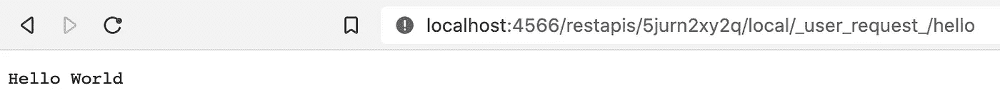

# 使用 LocalStack 和无服务器框架在本地运行 Go AWS Lambda

> 原文：<https://levelup.gitconnected.com/run-go-aws-lambda-locally-with-localstack-and-serverless-framework-5c80894f389c>

## 痛苦和收获


Photo by [傅甬 华](https://unsplash.com/@hhh13?utm_source=medium&utm_medium=referral) on [Unsplash](https://unsplash.com?utm_source=medium&utm_medium=referral)

我之前写过如何设置你的 [Go Lambda 并使用 Terraform](/setup-your-go-lambda-and-deploy-with-terraform-9105bda2bd18) 进行部署。现在我们需要谈谈如何在本地运行 Go Lambda。为什么？以避免每次都部署到 AWS 来测试您的代码更改。

# 无服务器离线 FTW？

我的第一反应是尝试[无服务器离线](https://github.com/dherault/serverless-offline)，但是通读他们的代码，我发现他们“不支持”Go。

你可以试着用特征标志`--useDocker`来运行它，我这么做了，哦，天哪，它慢得令人痛苦。比如 30 秒启动缓慢，每一次代码更改都需要 30 秒。不要误会，如果你正在运行 JS 项目，那么[无服务器离线](https://github.com/dherault/serverless-offline)是很棒的，只是不要去。

# LocalStack FTW？

在 Google 上浏览了更多之后，第二个选择也是最后一个选择是将 [LocalStack](https://localstack.cloud/) 与[无服务器框架](https://www.serverless.com/)结合使用。他们的[文档](https://localstack.cloud/docs/getting-started/overview/)或多或少是全面的，并且不难发现是否有什么东西不工作。在继续阅读之前，请遵循他们的[安装](https://localstack.cloud/docs/getting-started/installation/)步骤。

LocalStack 允许你用两个选项来运行你的 Lambda:本地“部署”或者把你的 Go Lambda 代码直接装载到 LocalStack 中。本地“部署”是现成的，使用无服务器框架，但是在测试代码之前，您需要等待伪“部署”到 LocalStack 中。那开发的时候还是又慢又烦。幸运的是，第二个选项非常快，只需稍作调整，您就有一个观察者来查看代码变化、编译代码、更新 LocalStack 中的本地 Lambda 并准备好测试。

# 给我看看魔法！

完整的设置和代码可以在[这里](https://github.com/jagonzalr/go-lambda-localstack)找到。

## **步骤 1 —安装依赖关系**

1.  `npm init -y`
2.  `npm install --save-dev concurrently nodemon serverless serverless-localstack`

## 步骤 2-设置无服务器框架

重要的部分是在`serverless.yml`文件内部配置 LocalStack 时设置`mountCode: true`。

```
service: helloprovider:
  name: aws
  runtime: go1.x
  region: us-east-1
  stage: localplugins:
  - serverless-localstackpackage:
  individually: true
  custom:
    localstack:
      debug: true
      edgePort: 4566
      autostart: false
      stages: [local]
      lambda:
        mountCode: truefunctions:
  hello:
    handler: bin/hello
    events:
      - http:
          path: hello
          method: get
          cors: trueresources:
  Resources:
```

## 步骤 3 —定义构建脚本

你需要建立你的 Go Lambda 函数。为此，添加一个小的 bash 脚本`build.sh`。记得运行`chmod +x build.sh`，这样你就有权限运行这个脚本。

该脚本将类似于以下内容:

```
cd src/hello
env GOOS=linux GOARCH=amd64 go build -o ../../bin/hello
cd ../..
```

## 步骤 4 —定义 NPM 脚本以在 LocalStack 中运行您的代码

```
"scripts": {
  "build": "sh build.sh",
  "deploy:local": "serverless deploy --stage local",
  "start": "npm run build && npm run deploy:local && npm run watch",
  "watch": "nodemon --watch src -e go --exec npm run build"
}
```

## 第五步—定义`docker-compose.yml`文件

这是为了在本地运行带有必要 AWS 服务的 LocalStack，并指定 Go Lambda 代码在机器中的位置。

```
version: '3.8'
services:
  localstack:
    image: localstack/localstack:latest
    environment:
      - EDGE_PORT=4566
      - LAMBDA_EXECUTOR=local
      - LAMBDA_REMOTE_DOCKER=0
      - SERVICES=lambda,dynamodb,cloudformation,s3,sts,iam,apigateway,ecr
      - HOST_TMP_FOLDER="${TMPDIR:-/tmp}/localstack"
      - DEFAULT_REGION=us-east-1
      - DEBUG=1
    ports:
      - '4566-4583:4566-4583'
    volumes:
      - '${TMPDIR:-/tmp/localstack}:/tmp/localstack'
      - '/var/run/docker.sock:/var/run/docker.sock'
      - '/path/to/code/bin/hello/hello:/path/to/code/bin/hello/hello'
```

## 第六步——编写你的 Go 代码

我个人创建了一个`src`文件夹，并在里面为每个功能创建了一个文件夹。

## 步骤 7 —启动本地堆栈

要运行 LocalStack，请记住 Docker 已经在运行了。要旋转您的 LocalStack 实例，请在您的`docker-compose.yml`所在的位置运行命令`docker-compose up`。

## 步骤 8-在本地运行您的 Go 代码

只需运行`npm start`。这将首次构建您的代码，将其挂载到 LocalStack，并使用 [nodemon](https://github.com/remy/nodemon) 监听代码更改。LocalStack 将生成一个 url，您可以在那里访问它并运行您的代码。它将类似于:`http://localhost/4566/restapis/[random_id]/local/_user_request_`

添加您在`serverless.yml`文件中定义的路线，例如`hello`，您应该会看到您的端点的输出



现在尝试更改您的代码，看看一切是如何自动刷新的。

你现在可以在本地开发类似于 JS 的 Go Lambda，而不需要每次都部署你的修改🎉

## 笔记

*   Go 运行起来不像 JS，你总是需要把二进制文件交给 Lambda。这就是为什么我们总是在将代码挂载到 LocalStack 之前构建它。
*   当我们在`docker-compose.yml`中定义代码路径时，它是编译后的二进制文件的路径，而不是 Go 代码的路径。
*   当您重新启动无服务器随机 id 将发生变化。

[](https://blog.jagonzalr.com/membership) [## 加入我的介绍链接媒体-何塞安东尼奥冈萨雷斯罗德里格斯

### 作为一个媒体会员，你的会员费的一部分会给你阅读的作家，你可以完全接触到每一个故事…

blog.jagonzalr.com](https://blog.jagonzalr.com/membership)