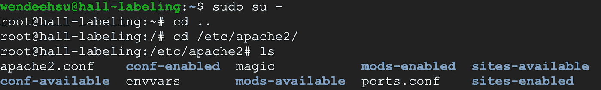
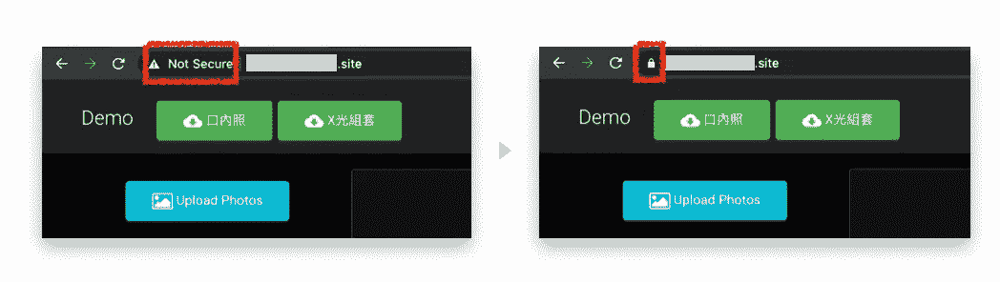
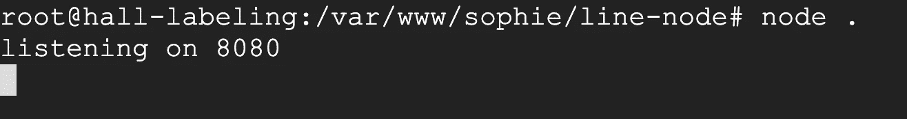
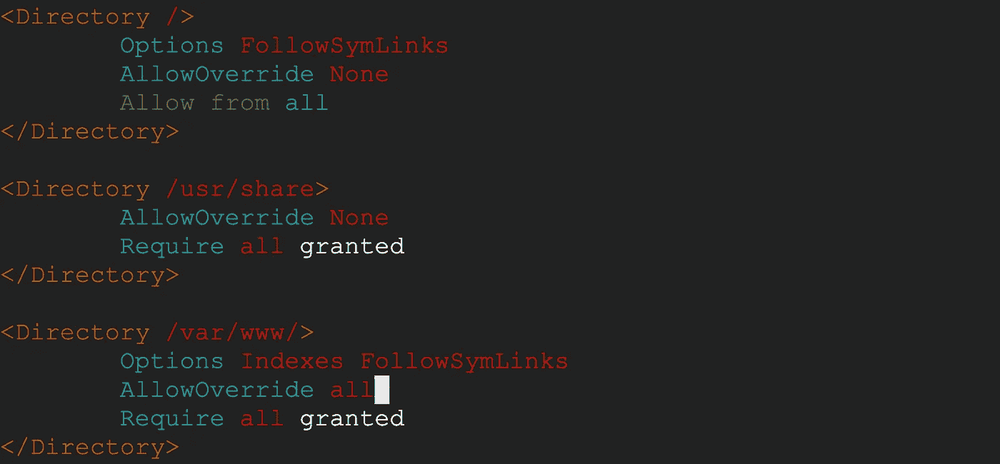
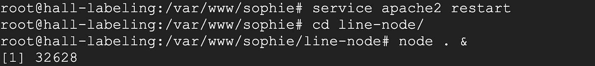
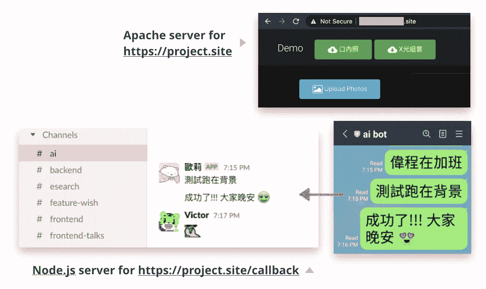

# 在 Apache 服务器上运行 Node.js 应用程序

> 原文：<https://levelup.gitconnected.com/run-node-js-application-on-apache-server-c79985014869>


因为我们有一个运行在 GCP 机器上的 Apache 服务器，所以我们现在想在其上运行一个额外的 Node.js 应用程序。(因为我打算利用它的公共 url 来👉[从 LINE chat 到 Slack 的回显消息](https://wendeehsu.medium.com/echo-messages-from-line-chat-to-slack-e12f5d929b81))我的项目结构如下:

```
- Project       # <--- DocumentRoot for the apache server  
|- index.html   # <--- This is the website now hosted by apache
|- folder
|  |- index.php
|  |_ some-other-php-files.php
|
|_ line-node    # <--- we want to run this node.js server
   |- index.js
   |- package.json
   |_ package-lock.json
```

🚩我们的最终目标是:

*   apache 托管`https://project.site`，这是现有的网站
*   node.js 托管`https://project.site/callback`，处理对 Line messaging api 的 **POST** 请求

在我们开始之前，我真诚地建议您使用 [Firebase 函数](https://firebase.google.com/docs/functions),如果您只需要一个运行在公共 url 上的小 node.js 应用程序(在我的例子中，因为我只是想提供一个`/callback` api 帖子，所以它适合使用 Firebase，但是我选择了一个困难的路径😂😂

如果你准备好了，那么深呼吸，让我们一起渡过难关🤝

# 结构概述

我的项目(名为`sophie`)包含网站和 node.js 应用程序，放在根目录`/var/www`下。apache 主机设置在根目录`/etc/apache2`下:



ssh 到 GCP 机器

我们要修改的文件有:

*   `apache2.conf`Apache 服务器的主配置文件。
*   `sites-available/000-default.conf`我们需要在这里指定 **ProxyPass** 规则(我稍后会解释。我保证😉)
*   我们还将在`/var/www/sophie`中创建一个名为`.htaccess`的文件，以根据 url 目录进行配置更改。(所以在我们的例子中，如果 url 以`/callback`结尾，我们将把它路由到 node.js 服务器，而其他的将由 apache 服务器处理。)

# 将 HTTP 更改为 HTTPS(可选)

我的最终目标是在 GCP 上添加一个处理`https://project.site/callback`的 node.js 服务器。然而，GCP 机器的当前地址是`**http**://project.site`而不是`**https**://project.site`。在这里，我们可以按照 [Cerbot 文档](https://certbot.eff.org/lets-encrypt/ubuntubionic-apache)中的步骤将我们的站点放在 https 上:

[](https://certbot.eff.org/lets-encrypt/ubuntubionic-apache) [## cert bot-ubuntubonic Apache

### 和一个带有开口...它托管在一个可选的上，如果您需要，可以通过通配符证书访问它…

certbot.eff.org](https://certbot.eff.org/lets-encrypt/ubuntubionic-apache) 

现在我们的网站由 apache 提供服务，显示在 https 🥳



# 添加代理通道

可以想象，当我们运行 node.js 应用程序时，它将监听一个端口(我在`line-node/.env`中将端口指定为 8080)



在 GCP 上运行 node.js 应用程序

计划是这样的:

> 当 GCP 收到发布到`https://project.site/callback`的请求时🔜将请求发送到`localhost:8080/callback`，由 node.js 应用程序处理。

该规则应在`etc/apache2/sites-available/000-default.conf`中设置:

通过将 **ProxyRequests** 和**proxyreservehost**设置为`on`，以`/callback`(写在`<Location>`标签中)结束的请求现在将被传递到`http://localhost:8080/callback`🙌

# 启用重写规则

为了覆盖基于目录的 Apache 配置，我们必须将`AllowOverride`设置为`all`，这样我们就可以使用`.htaccess`:



vim etc/apache2/apache2.conf

最后，转到我们的项目并添加一个`.htaccess`文件:

```
- Project 
|- .htaccess    # <--- here
|- index.html 
|- folder
|  |- index.php
|  |_ some-other-php-files.php
|
|_ line-node    
   |- index.js
   |- package.json
   |_ package-lock.json
```

*   第一个重写规则是将`/callback`请求代理给 node.js 应用程序。
*   第二个重写规则是可选的。它是用来存放我原来的网站的，因为我在每个子文件夹中都有不同的`index.php`。该规则使我能够在`https://project.site`和`https://project.site/subfolder-name`上显示不同的页面。

/*你可以在这里找到[更多重写规则](https://support.acquia.com/hc/en-us/articles/360005257234-Introduction-to-htaccess-rewrite-rules)。*/

最后，我们可以在终端中启用重写模式:

```
$ sudo a2enmod rewrite
```

# 奔跑👩‍💻

用命令`service apache restart`重启 apache 服务器。现在，我们可以在同一台机器上运行 node.js 应用程序:



`&`用于在后台执行命令。(所以即使终端被关闭，⛹️‍♀️的进程也会继续运行)



## 杂音…

启用重写规则的步骤非常重要。如果没有在`apache2.conf`中设置`AllowOverride all`，POST 可能在 http(端口 80)上工作，但在 https(端口 443)上失败

[](https://stackoverflow.com/questions/53040363/apache-2-4-29-ubuntu-server-at-port-443-for-wordpress/53040859) [## 用于 wordpress 的 Apache/2.4.29 (Ubuntu)服务器，端口 443

### 感谢贡献一个堆栈溢出的答案！请务必回答问题。提供详细信息并分享…

stackoverflow.com](https://stackoverflow.com/questions/53040363/apache-2-4-29-ubuntu-server-at-port-443-for-wordpress/53040859) 

此外，如果我们没有在`.htaccess`中指定代理的重写规则，服务器可能会将每个 POST 视为 GET:

[](https://stackoverflow.com/questions/10586779/redirectmatch-changes-post-to-get/10655325#10655325) [## redirectmatch 将 post 更改为 get

### 感谢贡献一个堆栈溢出的答案！请务必回答问题。提供详细信息并分享…

stackoverflow.com](https://stackoverflow.com/questions/10586779/redirectmatch-changes-post-to-get/10655325#10655325) 

真是一场噩梦👻 😂