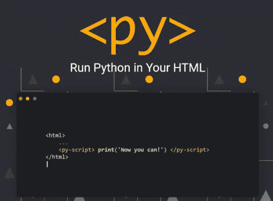
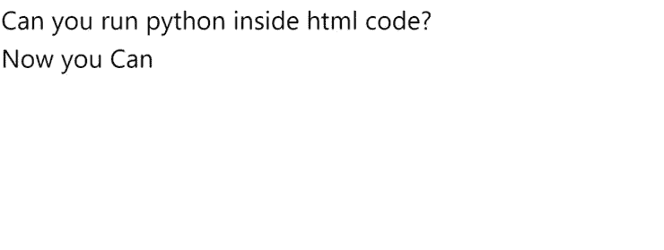
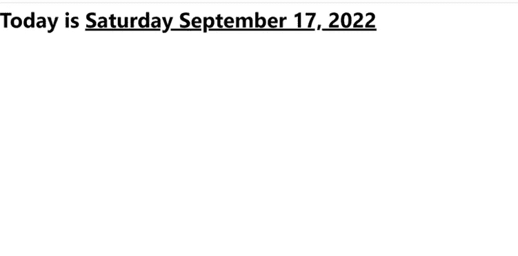
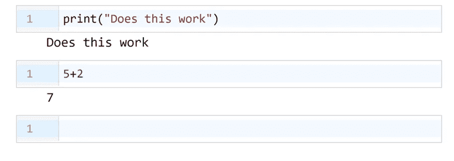
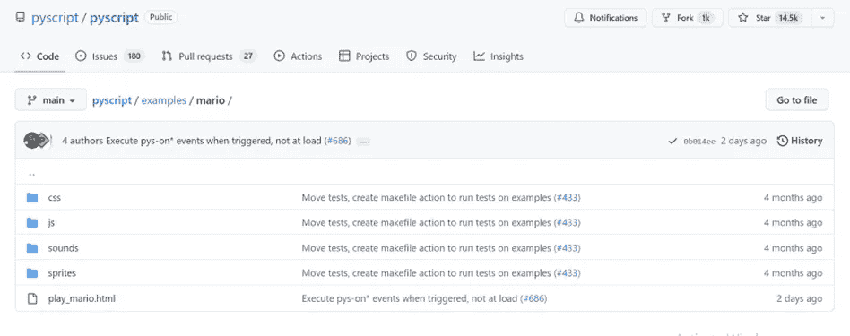

# 通过 Anaconda 在 HTML: Pyscript 中运行 Python

> 原文：<https://levelup.gitconnected.com/run-python-in-html-pyscript-by-anaconda-cb9fb370a6b9>



Pyscript 主页

Pyscript 是 anaconda 开发的一个新框架，它允许您在 HTML 代码中运行 python。

这意味着您可以使用<py-script>标签在浏览器中执行 python 代码。这是超级简单的设置，你不需要安装任何东西。</py-script>

让我们试一试。

使用以下代码创建一个简单的 HTML 文档:

```
<!DOCTYPE html><html lang="en"><head><meta charset="UTF-8"><meta name="viewport"content="width=device-width, user-scalable=no, initial-scale=1.0, maximum-scale=1.0, minimum-scale=1.0"><meta http-equiv="X-UA-Compatible" content="ie=edge"><title>Title: PyScript</title></head><body></body></html>
```

现在，在 head 标记中添加以下几行

```
<link rel="stylesheet" href="https://pyscript.net/alpha/pyscript.css" /><script defer src="https://pyscript.net/alpha/pyscript.js"></script>
```

最终的代码应该如下所示:

如上面的代码所示，python 代码包含在<py-script>标签中。</py-script>

运行 HTML 文件会得到这样的输出。



示例 1 的输出

在使用 PyScript 时，您可能希望将变量从 Python 代码发送到 HTML。这可以通过在 pyscript >元素中使用 pyscript 模块的 write 方法来实现。您可以使用 id 属性传递显示为普通文本的字符串。

write 方法接受两个变量:`id`值和将要提供的变量。

示例 2:

让我们使用 pyscript 中的 datetime 模块以 HTML 格式打印日期。在下面的例子中，我们使用标签方法。

上面代码的输出:-



示例 2 的输出

您还可以在 HTML 中运行 python IDE，以便在浏览器中运行、修改和删除 python 代码。

下面是代码:

标签为网页添加了一个代码编辑器组件。



示例 3 的输出

可以在 pyscript 中使用的外部库和 Python 包。

该项目仍处于开始阶段，但确实允许我们使用几个库，下面是其中的几个。

NumPy

熊猫

pytest

Jinja2

beautifulsoup4

matplotlib

PIL

sci kit-学习

受支持的第三方软件包的完整列表可在 [Pyodide 文档](https://pyodide.org/en/stable/usage/packages-in-pyodide.html)中找到。

pyscript 还允许你在网络浏览器中玩马里奥。有关更多信息，请访问 pyscript GitHub 资源库中的示例。



Pyscript 示例

还有，看 [**根据 AI 最后的人类会是什么样子？**](https://medium.com/@arjungullbadhar/what-will-the-last-human-look-like-according-to-ai-e40bc80052e9)

*嘿伙计们，*

我对在媒体上写作很陌生，希望听到你的反馈。如果你喜欢我写的东西，不要犹豫，竖起大拇指。如果您有任何问题或建议，请随时发表评论。我阅读每一条信息，并尽可能快地回复。

阿尔琼·古尔巴哈