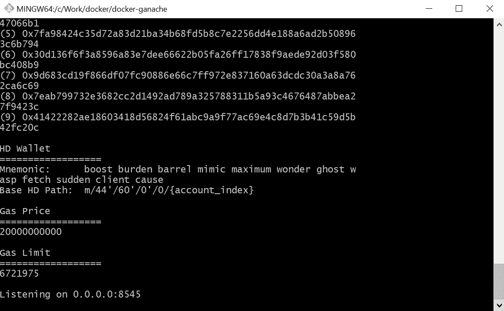

# 在 Docker 容器中运行 ganache-cli

> 原文：<https://levelup.gitconnected.com/run-the-ganache-cli-inside-the-docker-container-5e70bc962bfe>

## 将元掩码连接到 docker 容器中运行的 ganache-cli


Ganache-Docker-Metamask 来源谷歌图片

在本文中，我们将在 docker 容器中运行`ganache-cli`，然后将它连接到[元掩码](https://metamask.io/)，并将一些 Ether 从一个帐户转移到另一个帐户。

**先决条件:**

1.  Docker 安装在您的机器上。请检查这个[链接](https://www.docker.com/get-started)并安装适合你的操作系统。
2.  安装到您的浏览器的元掩码插件。请检查此[连杆](https://metamask.io/)并按照说明进行安装。

让我们首先通过名称`docker-ganache`创建项目目录。

在`docker-ganache`里面，创建一个名为`Dockerfile`的文件。

`Dockerfile`不需要文件扩展名，并且“D”必须是大写的。

我们的文件结构将如下所示

```
- docker-ganache
  - Dockerfile
```

`Dockerfile`是一个文件，我们将在其中定义创建`ganache-cli` docker 图像所需的所有命令。

> Docker 可以通过读取来自`[Dockerfile](https://docs.docker.com/engine/reference/builder/)`的指令来自动构建图像。

在任何编辑器中打开 docker 文件，然后粘贴以下代码

```
# node:alpine will be our base image to create this image
FROM node:alpine# Set the /app directory as working directory
WORKDIR /app# Install ganache-cli globally
RUN npm install -g ganache-cli# Set the default command for the image
CMD ["ganache-cli", "-h", "0.0.0.0"]
```

让我们深入了解一下代码，探索它实际上在做什么。

Docker 容器需要在其中安装 Node.js 来安装`ganache-cli`。

`node:alpine`是预装了最新 Node.js 的基础映像。

> *阿尔卑斯是什么意思？*

这是 Node.js 所需的最低要求，它包括所需的库。欲了解更多信息，请访问此[链接](https://derickbailey.com/2017/03/09/selecting-a-node-js-image-for-docker/)。

基本映像已经有一个用于`node:alpine`的文件系统

```
app    dev    home   media  opt    root   sbin   sys    usr
bin    etc    lib    mnt    proc   run    srv    tmp    var
```

第二步`WORKDIR /app`我们指示 Dockerfile 使用`/app`文件夹作为这个图像的工作目录

第三步`RUN npm install -g ganache-cli`全局安装`ganache-cli`。

最后一步`CMD ["ganache-cli","-h","0.0.0.0"]`

当这个映像运行时，必须有一个默认命令，否则您必须手动告诉它应该做什么。

`ganache-cli -h 0.0.0.0`是该图像的默认命令。当这个映像运行时，它将运行这个默认命令。

> Ganache-cli 的默认主机是 127.0.0.1，但对于 docker 实例，它是 0.0.0.0

请参考此[链接](https://hub.docker.com/r/trufflesuite/ganache-cli/)了解更多关于`ganache-cli`标志的信息，如`-h`

现在让我们建立图像。打开终端或 CLI，确保您位于 docker-ganache 目录中

运行下面的命令来构建 Dockerfile 文件

```
docker build .
```

感谢 [KC Tam](https://medium.com/u/32dec75e8ca9?source=post_page-----5e70bc962bfe--------------------------------) 建议在 docker 构建命令中使用标签。

```
docker build -t ganache .
```

您可以使用图像的标签作为图像名称，而不是使用像`7726b19a7bff`这样的图像 ID。

要了解更多关于图像标签的信息，请访问此[链接](https://docs.docker.com/engine/reference/commandline/build/)。

第一次运行时，可能需要一些时间。完成后，您可能会看到类似下图的输出。


码头工人建造

您的输出可能与此略有不同。在我的例子中，我已经测试过几次了，所以所有的东西都保存在缓存中。

仔细检查输出。

```
Successfully built 7726b19a7bff
```

这是我们刚刚构建的 Dockerfile 的图像 ID。太好了，所有的设置都完成了，现在让我们测试一下。

运行 docker 映像并启动一个容器

```
docker run -p 8545:8545 7726b19a7bff
```

或者

```
docker run -p 8545:8545 ganache
```

在我的例子中,`7726b19a7bff`是图像 ID。您应该运行您的匹配 ID 或图像标签`ganache`。

> -p 8545:8545 在这里做什么？

当 ganache-cli 在 8545 端口上运行时，该端口不会暴露在容器之外。要访问这个`-p 8545:8545`标志，在 8545 端口上暴露 8545 端口。

为了进一步解释，举个例子:

```
-p 3000:8545
```

每当任何请求指向端口 3000 时，它都会将请求重定向到容器的 8545 端口。另一个端口号不一定必须与容器相同。

> `*--publish , -p*` 向主机发布容器的端口

有关更多信息，请参考此[链接](https://docs.docker.com/engine/reference/commandline/run/)。

运行该命令后，您将看到如下输出



加纳切-cli

如果您看到这样的输出，那么您就在正确的道路上。

让我们将我们的`ganache-cli`连接到 Metamask。打开浏览器和元掩码，选择“Localhost 8545”网络。


本地主机 8545

Metamask 它现在连接到`docker-ganache`。

让我们将一个帐户导入元掩码。从正在运行的 ganache 实例中复制帐户的私钥。


私人密钥

从元掩码菜单中点击“导入帐户”。


进口账户

粘贴私钥并导入。导入后，您将在帐户中看到 100 ETH。


导入的帐户

让我们送一些乙醚到另一个账户

*   点击“发送”
*   在“至”字段中选择“账户 1”
*   在“金额”字段中输入 10
*   选择“下一步”和“确认”

交易确认后，检查账户 1 和账户 2。

账号 2 是 89.9998 什么的。额外缺失的 ETH 是为交易支付的费用。

# 结论

我们连接到 Docker 容器中运行的`ganache-cli`,并在 Metamask 上执行一个事务。

> *希望你喜欢这个教程。请分享它，如果你从中学到了什么，别忘了给它鼓掌。*
> 
> *谢谢，敬请期待更多精彩。*

[](https://gitconnected.com/learn/solidity) [## 学习坚固性-最佳坚固性教程(2019) | gitconnected

### 14 大坚实教程-免费学习坚实。课程由开发人员提交和投票，使您能够…

gitconnected.com](https://gitconnected.com/learn/solidity)