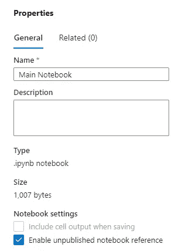
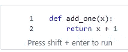
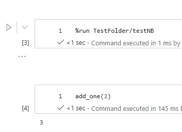

# 在 Azure Synapse 中运行未发布的 Spark 笔记本

> 原文：<https://levelup.gitconnected.com/run-unpublished-spark-notebooks-in-azure-synapse-2a5f2e9935f3>

您现在可以在 Azure Synapse Analytics 中引用未发布的 Spark 笔记本！

封面图片([来源](https://www.pexels.com/photo/woman-programming-on-a-notebook-1181359/))

以前，您只能引用已经发布到 Synapse 工作区的笔记本。换句话说，如果笔记本只存在于 Git 存储库中，那么您就没有机会从另一个笔记本中调用该笔记本——您必须简单地将所有代码放入一个笔记本中。

现在，您可以通过切换“父”笔记本中的选项来引用只存在于 Git 存储库中的笔记本。这位于笔记本设置中，如下图所示。

启用未发布的笔记本参考

激活此选项后，屏幕截图中的“主笔记本”现在可以引用仅存在于 Git 存储库中的其他笔记本。

“我如何实际引用另一个笔记本”？很高兴你问了。让我们假设我们有一个笔记本，它有一个单元格来定义下面的 add_one 函数。这个笔记本将被称为“testNB”并存储在“TestFolder”文件夹中。

笔记本样本

向函数传递一个数字，它返回加 1 的数字。现在如果我们想在可以引用未发布笔记本的“主笔记本”内部调用 add_one 怎么办？也很简单。

查阅笔记本

%run magic 命令是引用/运行内部笔记本所需的命令。Spark 甚至会提供 intellisense 来帮助您正确引用笔记本名称。

不能和%run 在同一个单元格中运行更多的代码，所以对 add_one 的调用是在第二个单元格中完成的。二加一等于三，电池的输出也是如此。在**运行**后，宁的“testNB”add _ one 在“主笔记本”的 Spark 会话中变得可用。这是一个基本的例子，但是您可以想象将代码分割到多个笔记本中是多么强大，而不需要事先将它发布到工作区:)

如果您想知道 Synapse 如何选择运行笔记本版本，文档是这样解释的:

*   如果禁用了未发布的笔记本引用，则始终运行已发布的版本
*   如果启用，优先级为:编辑/新建>提交>发布

关于这个功能的所有细节，请参考官方文档[https://docs . Microsoft . com/en-us/azure/synapse-analytics/spark/Apache-spark-development-using-notebooks # reference-unpublished-notebook](https://docs.microsoft.com/en-us/azure/synapse-analytics/spark/apache-spark-development-using-notebooks#reference-unpublished-notebook)