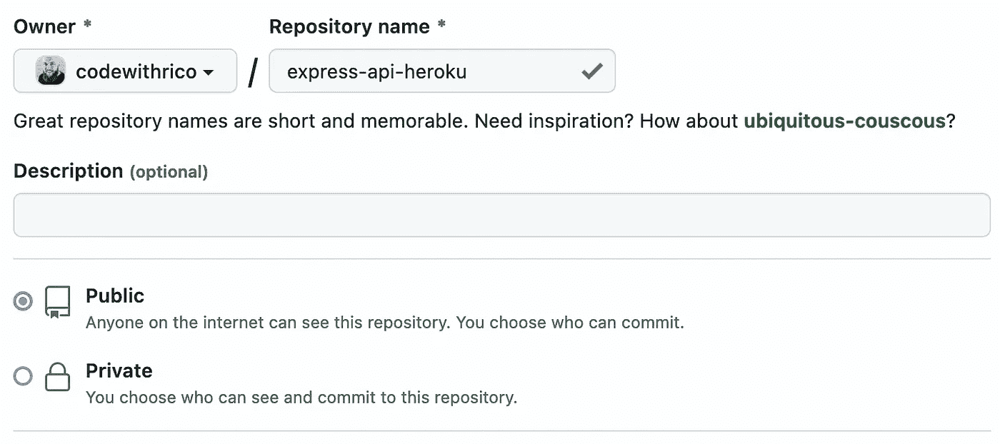
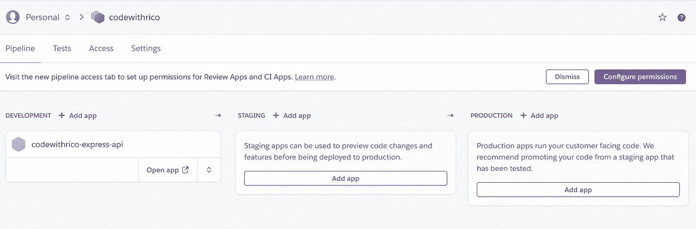
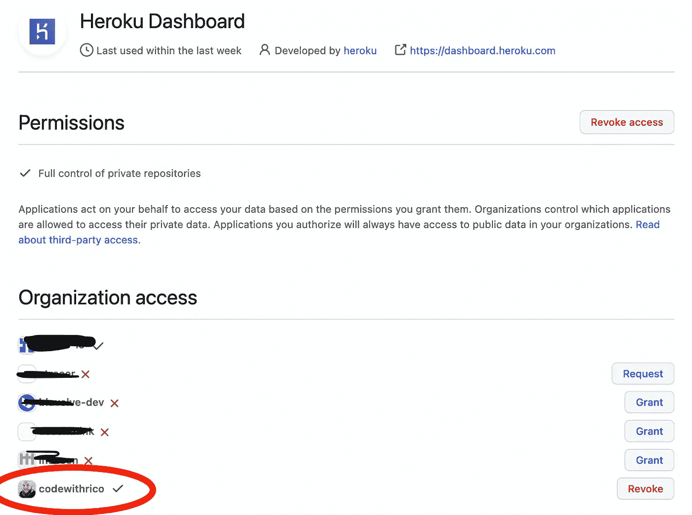
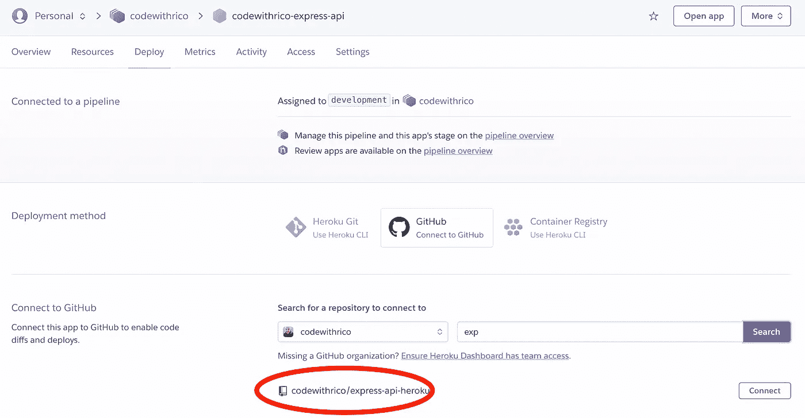
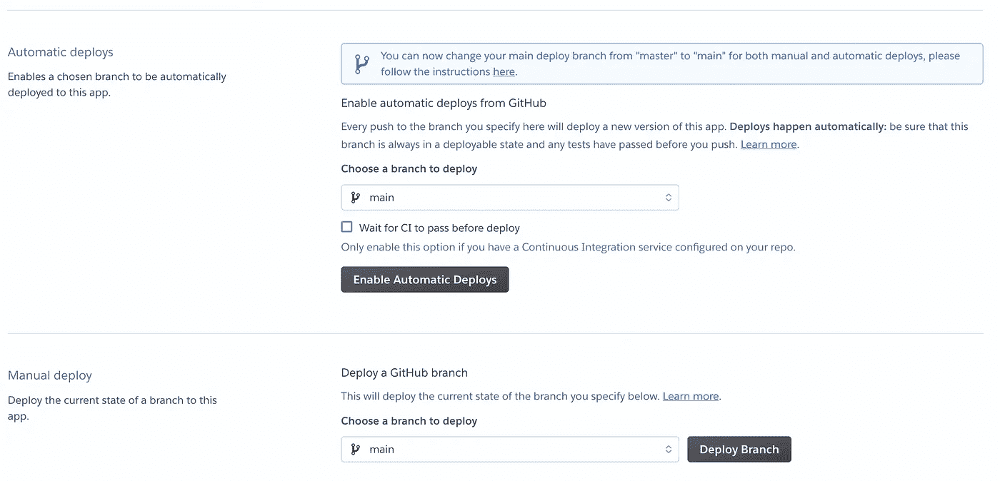
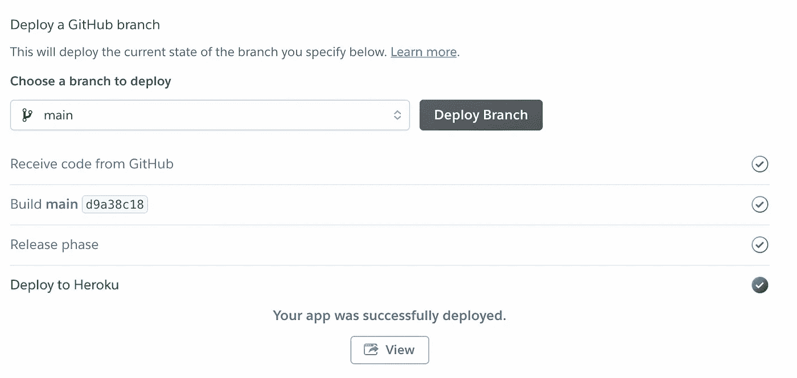

# 在 Heroku 上用 Express/ TypeScript 运行节点 API

> 原文：<https://levelup.gitconnected.com/run-your-node-api-with-express-typescript-on-heroku-1a3bd3c9c487>


图片来源:stock.adobe.com

当我在客户项目中工作时，云提供商通常在企业范围内被授权。几乎没有任何回旋的余地。基本上有两个大玩家被使用:微软 Azure 或 AWS。两种云环境都非常优秀、稳定，并提供足够的选项或服务来实现任何规模的项目。

对于这两个玩家来说，提供的服务种类和由此产生的可能性似乎是无穷无尽的。经常有人问我觉得 Azure 好还是 AWS 好。我无法回答这个问题。两者都非常好，我喜欢用 Azure 和 AWS 来实现项目。

尽管欢欣鼓舞，但即使是简单服务的推出也需要一定的专业知识和相应的时间。您很快就会面临这样的问题:使用托管 Kubernetes 集群还是弹性容器服务更好，等等。

然而，在很多情况下，我们只是想推出一个 REST API 或 app，而不是在 CI/CD 管道上花费大量的时间和精力。整件事应该还是符合专业标准的。

在我看来，像 Vercel 或 Heroku 这样的公司为这些用例提供了非常好的替代方案。定价期权尤其有趣。您一定要仔细看看这些，因为 Kubernetes 集群或其他指向互联网的容器服务(NAT 网关)的操作在任何情况下都会产生运行成本，即使没有或几乎没有流量。尤其是在 MVP/原型阶段，或者在最初几个月你可能只期待零星流量的想法实现阶段，你应该寻找可靠的替代方案。其中一个对我来说是赫罗库。


图片来源:stock.adobe.com

在本文中，我想展示在 Heroku 上推出一个简单的 NodeJs/ Express REST API 是多么容易。

# 概观

首先，简要概述一下我们将在本文中学习的内容:
1)使用 TypeScript 创建 Express Server
2)将代码发布到 GitHub
3)在 Heroku 上推出 API

# 先决条件

为了能够对我的示例进行编程，您的机器至少需要满足以下要求。

*   您的计算机上安装的 NodeJS/ npm
*   [Heroku](https://heroku.com) 记述
*   [GitHub](https://github.com) 账户
*   Git CLI
*   Heroku CLI

检查节点是否正在您的计算机上运行。

```
$ node --version
v18.3.0
```

要检查 git 是否正在运行，请使用下面显示的命令。

```
$ git --version
git version 2.32.0
```

如果您尚未安装 Heroku CLI，可以在 Mac 上使用 brew 进行安装。

```
$ brew tap heroku/brew && brew install heroku
```

# 第一步

首先，我们想在本地机器上运行一个简单的 Express 服务器。我们用以下命令创建一个新目录并初始化一个 NPM 项目。

```
$ mkdir express-api-heroku 
$ cd express-api-heroku
$ npm init -y
```

下一步，我们安装运行 TypeScript 所需的依赖项。

```
$ yarn add -D typescript
$ yarn add -D tslint
```

…最后表达。

```
$ yarn add express
$ yarn add -D @types/express
```

我们仍然需要初始化或配置 TypeScript。为此，我们可以手动创建一个 tsconfig.json，或者只运行下面的命令。对于我们的例子，默认设置就足够了。

```
$ tsc --init
```

tsconfig.json 文件应该如下所示。当然，您也可以创建一个名为 tsconfig.json 的文件，并粘贴以下代码片段。

```
{
  "compilerOptions": {
    "module": "commonjs",
    "esModuleInterop": true,
    "target": "es6",
    "moduleResolution": "node",
    "sourceMap": true,
    "outDir": "dist"
  },
  "lib": ["es2015"]
}
```

在 package.json 中，脚本部分必须修改如下。

```
"main": "dist/index.js",
"scripts": {
  "dev": "tsc && node dist/index.js"
},
```

要运行一个简单的 Express 服务器，我们仍然需要添加一个 index.ts 文件，代码如下。这只是一个非常简单的例子，根路由是“/”。

```
import express, { Express, Request, Response } from 'express';

const app: Express = *express*();
const port = 3000;

app.get('/', (req: Request, res: Response) => {
    res.send('Code with Rico. Ready to run on Heroku.');
});

app.listen(port, () => {
    return console.log(`[server]: Server is running on ${port}`);
});
```

让我们看看服务器是否准备好运行。使用以下命令。输出应该如下所示。

```
$ yarn dev
yarn run v1.22.17
$ tsc && node dist/index.js
[server]: Server is running on 3000
```

当服务器运行时，我们可以检查输出。

```
$ curl localhost:3000
Code with Rico. Ready to run on Heroku.
```

这样，我们使用 Express framework 建立了一个节点项目，它使用 TypeScript 进行编译和运行。

# 添加 Heroku 特定的东西

接下来，我们需要添加一个负责端口的配置。为此，我们仍然需要包 *dotnev* 作为依赖项。

```
$ yarn add dotenv
```

然后我们创建 config.ts 文件，其内容如下所示。

```
import dotenv from 'dotenv';

dotenv.*config*();

const PORT = process.env.PORT || 3000;

export const config = {
    server: {
        port: PORT
    }
};
```

**重要！！！**

我们需要在这里使用 *process.env* 声明端口的原因是 Heroku 将尝试注入它自己的端口。如果我们不这样声明它，它将导致应用程序在 Heroku 上一次又一次地崩溃。

我们现在需要修改 index.ts 来从这个配置中获取端口。下面的代码显示了更新后的 index.ts。

```
import express, { Express, Request, Response } from 'express';
import {config} from "./config";

const app: Express = *express*();

app.get('/', (req: Request, res: Response) => {
    res.send('Code with Rico. Ready to run on Heroku.');
});

app.listen(config.server.port, () => {
    return console.log(`[server]: Server is running on ${config.server.port}`);
});
```

接下来，让我们扩展 package.json 以在 Heroku 上运行我们的 API。Heroku 想运行 JavaScript，而不是 TypeScript。这就是为什么必须将“postinstall”命令添加到 out package.json 的脚本部分的原因。该命令将确保我们不必在 build 或 dist 文件夹中上传编译后的代码。Heroku 将调用管道中命令来在线编译类型脚本代码。

现在，更新的脚本部分应该如下所示:

```
"scripts": {
  "dev": "tsc && node dist/index.js",
  "start": "node dist/index.js",
  "postinstall": "tsc"
},
```

此外，我们现在需要在我们的应用程序的根目录中有 Heroku 特有的 *Procfile* 。

```
$ touch Procfile
```

我们唯一要声明的是。我们必须给 Heroku 我们的开始命令。

```
worker: npm start
```

*好了*，现在我们已经基本准备好了运行 Heroku 的 Express API。

现在有两种方法可以让我们的 Express API 在 Heroku 上工作。由于使用代码库是有意义的，我将通过 GitHub repo 展示这种方式。当然，也可以使用 Heroku CLI 将 app 从您的本地机器部署到 Heroku。

然而，在本文中，我们当然会使用 Heroku CLI 在 Heroku 上设置管道和应用程序。

# 把代码推给 GitHub

在这个例子中，我在我的 GitHub 帐户上创建了一个新的存储库。我将它设为“公共的”,这样文章的读者就可以访问代码。当然，你也可以为你的代码创建一个私有的回购协议。



在 GitHub 上创建代码报告。

下一步，我们返回到项目目录(使用终端或 bash)并为存储库初始化 git。

```
$ git init
```

然后我们再加一个。gitignore file，因为我们不想提交所有文件。

```
$ touch .gitignore
```

的内容。gitignore 文件应该是这样的。

```
*# IDE* .idea/
*zip

*# IDE - VSCode* .vscode/*
!.vscode/settings.json
!.vscode/tasks.json
!.vscode/launch.json
!.vscode/extensions.json

*# BUILD* dist/
node_modules/
```

之后，我们可以在 GitHub 上添加远程存储库。

```
$ git remote add origin [git@github.com](mailto:git@github.com):codewithrico/express-api-heroku.git
```

现在，我们添加如下未跟踪的文件，并提交更改。

```
$ git add .
$ git commit -m "init"
```

之后，我们将这个提交推送到 GitHub。

```
$ git push -u origin main
```

酷，我们的代码现在可以在 GitHub 上找到了。现在是时候在 Heroku 上安装 API 了。

# 在 Heroku 上部署 Express API

本文的一个目标是展示免费或低价提供一个 API 是完全可能的，例如用于测试目的。这个想法是，我们不需要在部署和创建 CI/CD 管道上花费任何额外的精力，或者需要相应的专业知识。我认为 GitHub 的集成在 Heroku 做得非常好，使用起来非常简单直观。最终的结果是，我们有了一个在专业和稳定的环境中运行的 API 实例。

我假设你已经创建了一个 Heroku 帐号。

我们将在终点站下车。当浏览器关闭时，凭据将被删除。

```
$ heroku login
heroku: Press any key to open up the browser to login or q to exit: 
Opening browser to https://cli-auth.heroku.com/auth/cli/browser/...
Logging in... done
Logged in as codewithrico
```

这将允许我们向 Heroku 帐户添加新的应用程序。使用下面的命令，我在欧洲地区添加了一个名为“codewithrico-express-api”的新应用程序。如果没有指定地区，缺省值是 US。

```
$ heroku apps:create codewithrico-express-api --region eu
```

然后，我们用下面显示的命令创建一个管道。我选择“发展”作为舞台。

```
$ heroku pipelines:create codewithrico
? Stage of codewithrico-express-api 
❯ development 
  staging 
  production
Creating codewithrico pipeline... done
Adding ⬢ codewithrico-express-api to codewithrico pipeline as development... done
```

在 Heroku 仪表板中，我们创建的资源现在应该是这样的。



GitHub 将 Heroku Dashboard 访问权授予相应的 GitHub 组织是很重要的。在我的例子中，我允许 Heroku 访问组织“codewithrico”。见下图。



在 Heroku 仪表板中，我们现在转到我们的应用程序，然后转到 Deploy 选项卡。我们选择 GitHub 作为部署方法。在“连接到 GitHub”下，我们可以搜索存储库。在选择列表中，您应该会看到相应的 GitHub 组织。
如果在那里发现了存储库，那么回购就可以被连接。为此，我们只需点击“连接”按钮。



在成功地将存储库链接到 Heroku 应用程序或部署它之后，将出现以下部分。



通过启用“启用自动部署”按钮，每次按下主分支都会更新 Heroku 上的 API。
要展示我们 Express API 的当前状态，我们只需点击“Deploy Branch”。

之后，您可以看到以下输出。



通过单击“View”按钮，我们可以在浏览器中查看 Express API 的测试输出。

我希望通过这篇文章展示在 Heroku 上运行 TypeScript/ NodeJS 应用程序是多么容易。

干杯！

一如既往，你可以在 GitHub 上找到我的代码:https://github.com/codewithrico/express-api-heroku