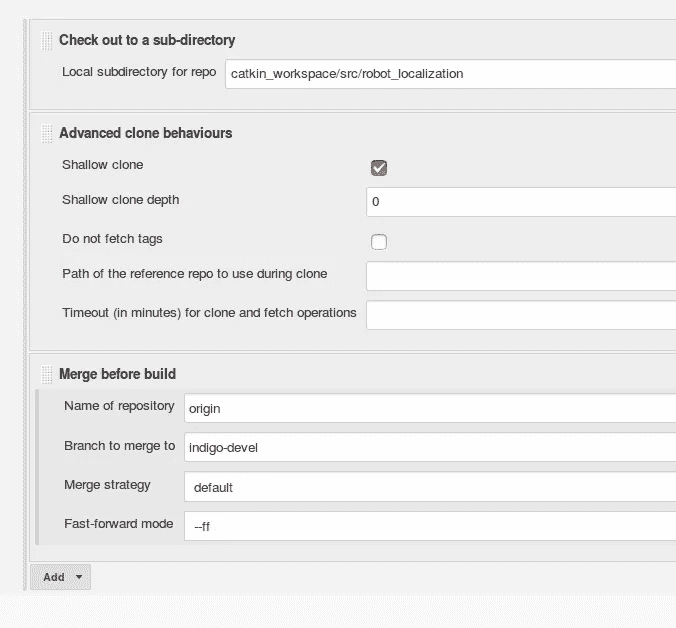
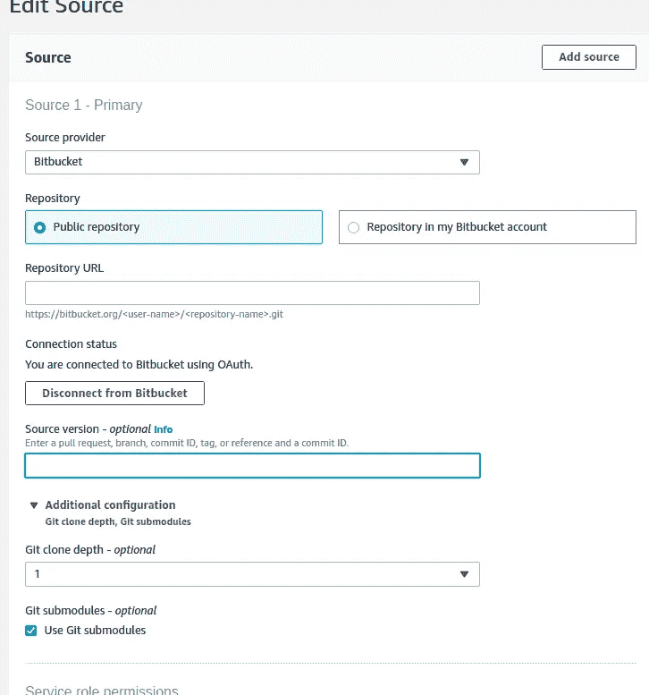

# 优化 CI/CD 渠道的操作手册

> 原文：<https://levelup.gitconnected.com/runbook-to-optimise-your-ci-cd-pipelines-7e0f4fc47e9a>


近年来，许多组织已经转向 DevOps 文化。持续集成和持续交付是 CI/CD 最重要的方面。今天，许多工程团队的目标是最快地部署缺陷修复和特性。为了实现这一目标，必须拥有强大的 CI/CD 渠道。然而，我们还需要考虑实施这些解决方案的成本。

我认为将您的流程容器化是走向有效管道的第一步。如果您正在处理 CI/CD 管道，并且已经将它们容器化，那么下面是我学到的一些东西，您可以实现它们来减少您的架构的时间和成本。

1.  使用浅克隆。
2.  不同的*。dockerignore* 文件。
3.  使用 DOCKER_BUILDKIT。
4.  对 docker 构建使用远程缓存。
5.  尽可能并行运行命令。
6.  禁用 npm 进程并使用并行工作进程。

# 使用浅层克隆:

标准克隆命令通常会取出所有文件以及所有文件的全部修订历史。这需要很多时间(取决于存储库的大小和历史)。相反，使用浅层克隆可以为您节省大量时间，因为它只会根据给定的深度提取最新版本。

## **怎么用？**

**Jenkins:** 您可以在 Jenkins 高级配置中设置浅克隆和深度克隆。



**AWS CodeBuild:** 您可以在 AWS CodeBuild 项目配置中设置克隆深度，如下所示。(参见:[https://aws.amazon.com/codebuild/](https://aws.amazon.com/codebuild/))



**Shell** :使用*深度*和你的 git 克隆命令。

```
git clone --depth
```

**CircleCi** :你可以使用下面的 CircleCi orbs 来设置一个浅层克隆体。(参见:[https://circleci.com/docs/2.0/orb-intro/](https://circleci.com/docs/2.0/orb-intro/))

```
 git-shallow-clone/checkout
```

# 不一样。dockerignore 文件:

如果您对管道使用 docker，那么这是节省映像构建时间的另一种方式。Docker build 将忽略 *dockerignore* 中列出的所有文件和文件夹，因此您可以将所有不需要的文件作为您的 CI 或 CD 的一部分放在*中。T21 号。也可以不止一个*。如果您想为 CI 和 CD 共享相同的 docker 映像，请使用 dockerignore* 文件。这样，您可以将测试中需要但开发中不需要的文件和文件夹列表放入 *.dockerignore.prod* 中，从而加快部署。*

## **怎么用？**

对于 ci，创建一个名为 *.dockerignore.ci* 的文件，并将运行 CI 不需要的文件和文件夹放入其中。对于部署，创建一个名为 *.dockerignore.prod* 的文件，并将不需要的文件和文件夹放入其中。在 CI 管道中，在 docker 构建步骤之前运行下面的命令。

```
ln -fs .dockerignore.ci .dockerignore
```

类似地，对于部署，在构建步骤之前运行下面的命令。

```
ln -fs .dockerignore.prod .dockerignore
```

# 使用 DOCKER_BUILDKIT:

Docker buildkit 是最新 Docker 版本 19.03 中新增的功能之一。Buildkit 通过缓存和并行运行可能的层来提供快速的 docker 构建。启用 buildkit 后，您的 docker 映像构建时间将会比其他方式减少。

## **怎么用？**

在开始 docker 构建之前，运行以下命令:

```
export DOCKER_BUILDKIT=1
```

它有各种选项可以添加到 docker 文件中。我展示了一个如何为 pip 安装启用缓存的例子。

```
COPY requirements.txt $PROJECT_DIR/RUN — mount=type=cache,target=/root/.cache/pip pip install -r $PROJECT_DIR/requirements.txt
```

参考:[https://docs . docker . com/develop/develop-images/build _ enhancements/](https://docs.docker.com/develop/develop-images/build_enhancements/)

# docker 版本的远程缓存:

如果您正在使用不提供 docker 层缓存的 CI 工具或服务，那么使用远程缓存可能是一个非常有用的选择，可以节省大量的构建时间。如果没有 docker 层缓存，每个 docker 层每次都将从头开始构建。这将在所有构建上花费更多的时间。相反，如果您管理管道的方式是在 docker hub 或 AWS ECR 上推送标准基础映像，并且 docker build 使用该映像的缓存，那么您将节省大量构建时间。

## **怎么用？**

1.  从 Dockerfile 创建 docker 映像
2.  将图像推送到 AWS ECR ( <base_image_uri>)</base_image_uri>
3.  构建管道中 docker builds 命令中的 include-cache-from 参数。

例如:

```
Docker build -f Dockerfile — cache-from <base_image_uri> -t <image_name>
```

# 尽可能并行运行命令:

如果在管道的一个作业或阶段中要执行多个任务，如果它们是独立的，可以考虑并行运行它们。

## 怎么用？

```
Command 1 &
Command 2 &
Command 3 &
wait
```

如果您还想收集所有进程的退出代码，并基于此继续或终止管道，可以参考这里提供的一些建议:[https://stack overflow . com/questions/1570262/get-exit-code-of-a-background-process](https://stackoverflow.com/questions/1570262/get-exit-code-of-a-background-process)

# 将 npm 进度设置为 false 或使用 yarn:

如果您正在构建 npm 模块作为管道的一部分，您可以使用 yarn install/build 或者禁用 npm 进度条。这两者都将在构建 web 包时节省大量时间。

## **怎么用？**

```
npm set progress false
npm install
npm build
```

您还可以考虑并行运行 web 包。选择与构建 web 包的系统中可用内核数量相同的工作线程数量。

(详情在此:[https://www.npmjs.com/package/parallel-worker)](https://www.npmjs.com/package/parallel-worker))

使用上述解决方案，我们已经成功实现了自动化、更快的 CI 和部署流程。我们已经成功减少了超过 50%的执行时间和 99%的人工干预。此外，我们已经能够降低整个基础架构的成本，因为我们的大多数工具/服务都是按使用量付费的模式。如果你有兴趣了解更多，可以看看我在 AWS 博客上写的这篇文章。

[](https://aws.amazon.com/blogs/startups/hackerearth-scales-up-continuous-integration-for-future-needs-with-aws-codebuild-and-amazon-s3/) [## HackerEarth 通过 AWS | Amazon Web Services 扩展持续集成以满足未来需求

### 每个快节奏组织的目标之一是拥有一个持续集成(CI)管道，以确保每个…

aws.amazon.com](https://aws.amazon.com/blogs/startups/hackerearth-scales-up-continuous-integration-for-future-needs-with-aws-codebuild-and-amazon-s3/)