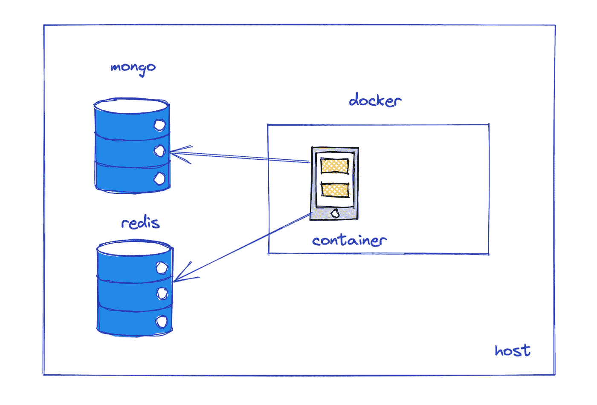

# 在 Docker 中运行 Python Web 应用程序

> 原文：<https://levelup.gitconnected.com/running-a-python-web-application-in-docker-791b1a0dbd5b>

docker + python

这篇文章演示了一个由 docker 部署的简单 python web 应用程序。它的目的是向您展示如何 dockerize 一个连接到本地服务的 python 应用程序，例如 **MongoDB** 和 **Redis** 。

完整的代码是[这里是](https://github.com/jerryan999/python-application-docker)。

# **先决条件**

*   安装了 MongoDB 和 Redis 的主机
*   码头工人
*   Python 3.9 或更高版本

# Web 应用程序

这里，我们使用流行的 python **Flask** 框架来构建一个 web 应用程序。它是一个 web 框架，可以帮助您快速创建简单和复杂的 web 应用程序。

有四条主要路线，其目的如下。

*   `/`:索引路线，显示欢迎信息。
*   `/mongo_health`:检查 MongoDB 的健康状况。
*   `/redis_health`:检查雷迪斯的健康状况。
*   `/send_mail`:发送异步作业。

# 异步任务

有时，我们使用异步工作者来处理繁重的任务，例如发送电子邮件。

这些工人只是 python 脚本，它们不断地监视 Redis 队列，并在消息可用时发送电子邮件。

这里有一个简单的例子:我们可以使用这个框架创建更复杂的任务。

# 启动脚本

在这一部分，我们首先创建必要的文件夹和文件。然后我们通过使用`supervisord`来启动这个工人。最后，我们使用`gunicorn`服务器网关启动服务器。

# Dockerfile 文件

最后但同样重要的是，`dockerfile`如此重要，我们需要更多的解释。

*   第 1 行:提取官方的 python 基础映像
*   第 3–10 行:安装必要的编译器和开发需求
*   第 13–23 行:我们使用[多阶段构建](https://docs.docker.com/develop/develop-images/multistage-build/)策略来减小图像尺寸。所以这里我们再次使用`python:3.9.13-slim`作为应用程序代码的基础映像。然后，我们设置用户帐户和环境变量。
*   第 25 行:复制启动 worker 时使用的`supervisors`配置文件
*   第 27–28 行:将 python 包从第一个映像复制到这个应用程序映像中。
*   第 33 行:设置当前用户
*   第 35 行:定义容器启动时运行的脚本。

我希望你喜欢读这篇文章。如果你愿意支持我成为一名作家，可以考虑注册[成为一名媒体成员](https://jerryan.medium.com/membership)。你还可以无限制地访问媒体上的每个故事。

# 分级编码

感谢您成为我们社区的一员！在你离开之前:

*   👏为故事鼓掌，跟着作者走👉
*   📰查看[级编码出版物](https://levelup.gitconnected.com/)中的更多内容
*   🔔关注我们:[推特](https://twitter.com/gitconnected) | [LinkedIn](https://www.linkedin.com/company/gitconnected) | [时事通讯](https://newsletter.levelup.dev)
*   🚀👉 [**软件工程师的顶级工作**](https://jobs.levelup.dev/)