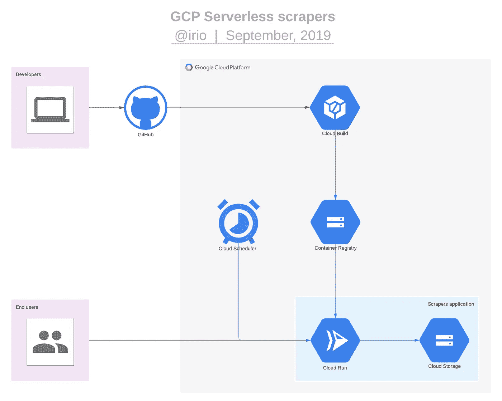
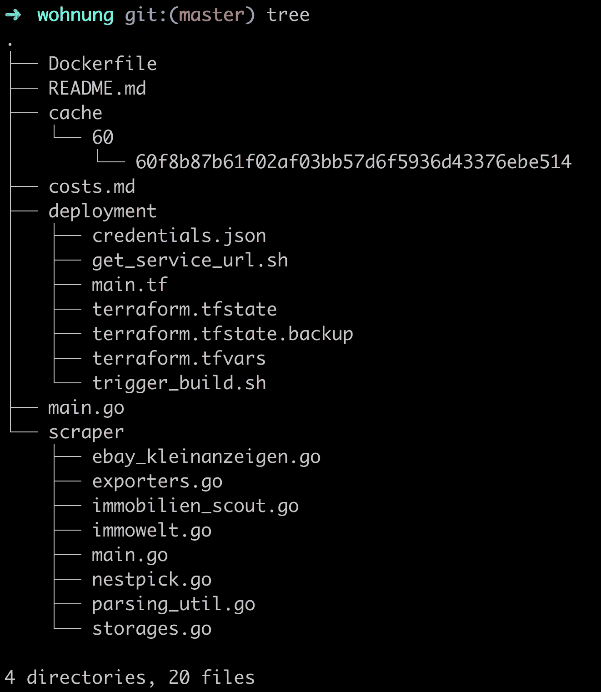
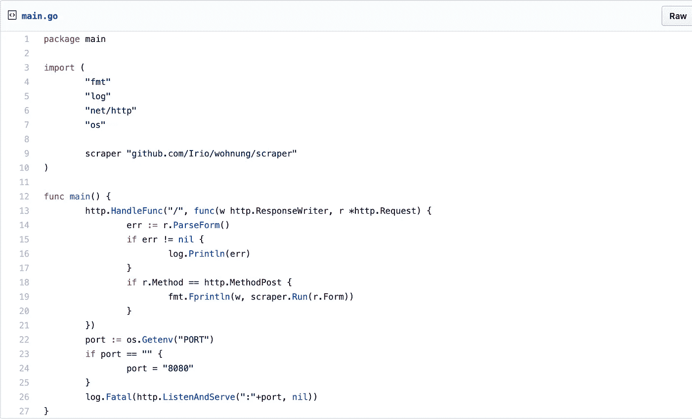
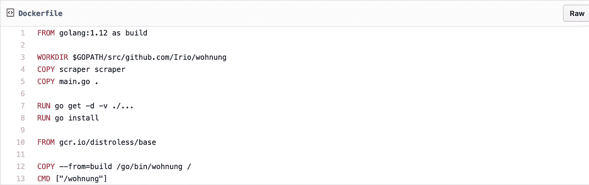
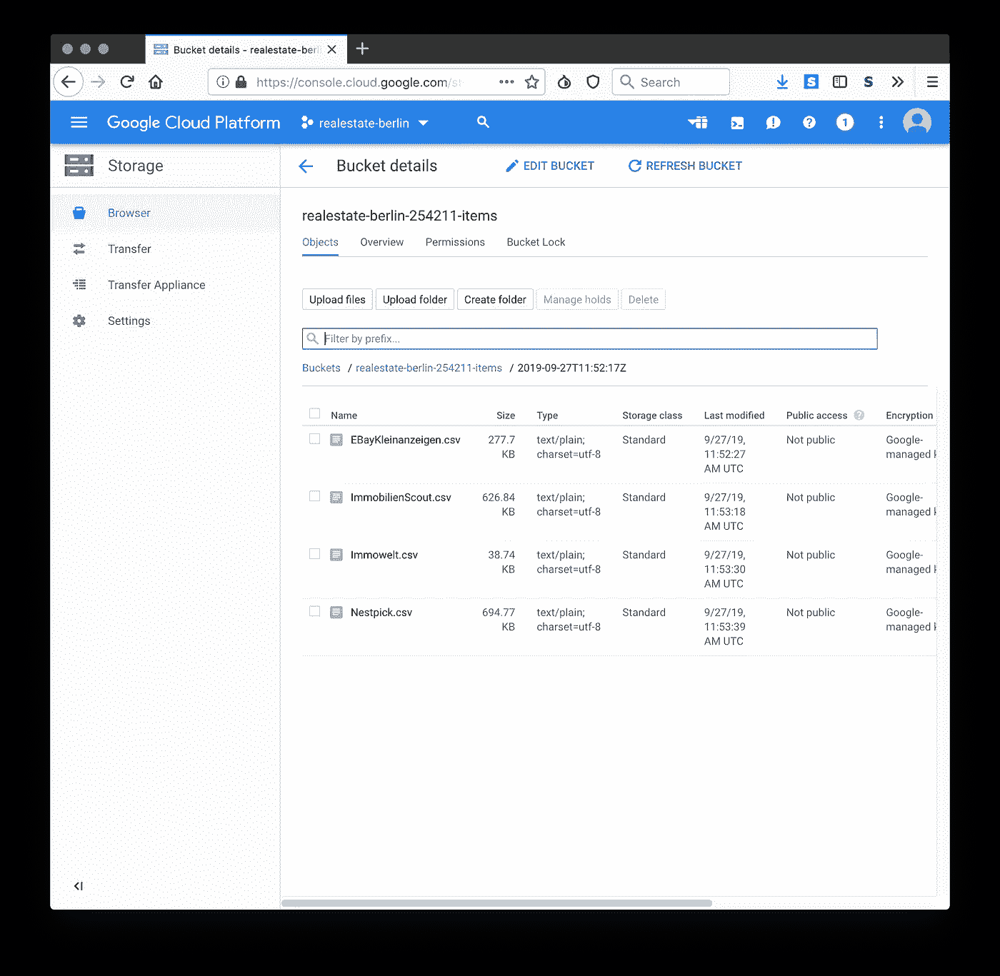

# 在谷歌云上运行一个抓取平台，每月只需 0.05 美元

> 原文：<https://levelup.gitconnected.com/running-a-scraping-platform-at-google-cloud-for-as-little-as-us-0-05-month-6d9658982f04>

我最近面临着在柏林找公寓的问题。根据我以前在这方面的经验，我决定自动完成这项任务，并编写一个软件向我发送最佳交易的提醒。在本文中，我将解释我是如何构建这个平台的基础的。

由 [dronepicr](https://www.flickr.com/photos/132646954@N02/40858786523) 拍摄的照片

**我写的平台是一个使用 Terraform 部署到 Google Cloud 的 Go 应用程序。此外，它还可以从一个私有的 GitHub 库进行持续部署。**

经过快速研究，我得出了以下需要监控的平台列表:

*   易贝·克莱纳泽根
*   ImmobilienScout24
*   Immowelt
*   巢匹克

几个小时后，我有了一个 Go 二进制文件，它完成了在本地运行应用程序所需的一切。它使用一个名为 [Colly](https://github.com/gocolly/colly) 的网络抓取框架来浏览所有平台列表，提取基本属性，并导出到本地文件系统中的 CSV 文件。

因为我不想让应用程序在本地运行，所以我的第一选择是在 [Google Cloud](https://cloud.google.com/) 获得一个便宜的实例。一旦我有了这个租来的虚拟机，我就可以编写一个启动脚本来编译来自 GitHub 的应用程序，并设置一个 crontab 来每天抓取平台。

对于这个特定的项目来说，这可能是最好的决定，但是我可以把这个个人问题作为探索 Google 云服务集成的机会吗？

因为，在过去，我参与了多个涉及某种刮擦应用程序的项目，我相信这是值得努力的。我可以很容易地在将来重用这个设置。

我的建筑始于几个前提:

*   它应该使用谷歌云服务。
*   它应该支持每隔几分钟收集一次数据，即使我开始一天只收集一次。
*   它应该像数字海洋(5 美元)的廉价液滴一样划算。
*   应该很容易部署。理想情况下，它应该实现连续部署。
*   它应该支持按需触发数据收集过程—例如，在 HTTP POST 请求之后。

我的假设是，我不需要一个全天候运行的虚拟机；因此，它的价格不应该和一个月的价格一样。事实上，我的应用程序能够在 3 分钟内下载我感兴趣的所有属性，所以我期望的要低得多。

# 建筑

我对最新的谷歌云服务进行了探索，结果发现了 [Cloud Run](https://cloud.google.com/run/) ，这是一种“在完全托管的环境中或在你自己的 GKE 集群中运行无状态容器”的服务它仍被谷歌云归类为测试产品，基于 [Knative](https://knative.dev/) 和 [Kubernetes](https://kubernetes.io/) 构建。关键的提议是它的定价模式:它是以毫秒为单位收费，而不是以小时为单位。

经过一些调整，我的 Go 应用程序被封装在一个 Docker 容器中，可以由 Cloud Run 运行。一旦收到 HTTP POST 请求，它就从所有广告的属性中收集属性，并以 CSV 文件的形式发布到 Google 存储桶。对于我的用例，我创建了两种可能的方法来访问这个端点:一种是可访问互联网的地址，这样我就可以随时触发它；另一种是通过 Cloud Scheduler，它被配置为每天访问一次。

# 应用程序

这个应用程序相当简单:它由一个具有单一端点的 HTTP 服务器组成。在每次点击时，它会抓取所有平台，并将结果保存在存储桶内的 CSV 中。

## 。/main.go

## 。/Dockerfile

其他应用文件可以在[本要诀](https://gist.github.com/Irio/3da6ee4dea8cad6613c1337a15044f09)中找到。感谢所有的反馈，因为这是我的第一个 Go 项目之一。

# 部署

1.  [安装地形](https://www.terraform.io/)。
2.  [安装 Google Cloud CLI](https://cloud.google.com/sdk/docs/quickstarts) 并使用
    ***$ g Cloud auth log in***登录您的账户
3.  *[创建一个 Google Cloud 项目](https://console.cloud.google.com/projectcreate)并将 CLI 配置为使用
    **$ g Cloud config set PROJECT PROJECT _ NAME***
4.  *[创建一个 Google 云服务账户](https://console.cloud.google.com/iam-admin/serviceaccounts)用于 Terraform，赋予其“所有者”角色。*
5.  *为这个新的服务帐户创建并下载一个 JSON 密钥。将其放在**deployment/credentials . JSON**中*
6.  *[启用以下云 API](https://console.developers.google.com/apis/library):
    *应用引擎管理 API
    *云构建 API
    *云运行 API
    *云调度器 API*
7.  *[给以**@ Cloud build . gserviceaccount . com**:
    *云运行管理员
    *云运行服务代理结尾的 API 服务账号赋予适当的角色](https://console.cloud.google.com/iam-admin/iam)*
8.  *基于您的 GitHub 资源库创建一个[云资源库](https://source.cloud.google.com/repo/new)。*
9.  *在 **terraform.tfvars** 中设置合适的变量值。*

*现在有了许可，使用 Terraform 来设置基础设施的其余部分。*

***$ cd 部署
$ terraform 初始化
$ terraform 应用***

*初始部署可能需要大约五分钟，因为 Terraform 会在配置云调度程序之前等待云运行构建和启动。*

*由于 Cloud Run 仍处于测试阶段 API 端点处于 alpha 阶段——我无法在 Terraform 文件中声明所有的基础设施。作为一个临时的解决办法，我编写了几个辅助的 bash 脚本，通过它的 CLI 命令触发云 API。幸运的是，当开发人员触发 **terraform apply** 时，所有这些都在后台发生。*

# *结果呢*

*每天，在没有任何人工交互的情况下，Cloud Scheduler 会创建一个新文件夹，其中包含许多 CSV 文件，包含我所在城市中最近可用的公寓。*

**

# *成本*

*并非所有正在使用的服务都可以在[官方计算器](https://cloud.google.com/products/calculator/#id=2e6bb472-7ce9-4dd2-a2b9-15502f810fb9)中获得。无论哪种方式，我对我个人的使用做了一个粗略的估计，考虑到每天一次部署的不切实际的数量。*

## *云存储—每月 0.02 美元*

*   *地点:美国*
*   *A 类操作:4*30 = 120*
*   *第一个月
    -存储:2MB*30 = 60MB*
*   *第 12 个月
    -存储:2MB*365 = 730MB*

## *云运行—每月 0.00 美元*

*   *位置:美国东部 1*
*   *分配的 Cpu*
*   *分配的内存:1GB*
*   *每个容器实例的并发请求:1*
*   *每个请求的执行时间(毫秒):5000*
*   *每次请求执行的出站网络带宽(KB): 1000*
*   *每月请求数:30*

## *云构建—每月 0.00 美元*

*   *120 分钟/天的免费配额*
*   *4 构建分钟/天*

## *集装箱注册——每月 0.02-0.19 美元*

*   *0.026 美元/GB*
*   *第一个月
    -20MB * 30 = 600 MB
    -600/1024 * 0.026 = 0.02*
*   *第 12 个月
    -存储:20MB * 365 = 7300 MB
    -7300/1024 * 0.026 = 0.19*

## *云资源存储库—每月 0.00 美元*

*   *5 个项目用户的免费配额*
*   *1 个项目*

## *云调度程序—每月 0.00 美元*

*   *3 个免费工作/月的免费配额*
*   *1 份工作*

*相比之下，一个 f1-micro 实例——具有 0.6GB 的 RAM——在 Google Cloud 上运行了整整一个月，包含在免费层中；一个 1.7GB 的 g1 小型实例每月花费 13.80 美元。此外，根据我最初的假设和进一步的优化的准确性，考虑成本可能会降低或增加也是合理的。*