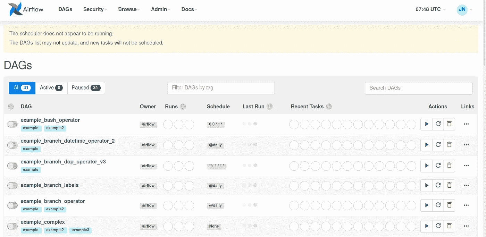

# Docker 中的运行气流

> 原文：<https://levelup.gitconnected.com/running-airflow-in-docker-759068fb43b2>

## 对接你的气流的数据管道，以简化和加快部署，并允许兼容性

想象一下这样一个场景，您必须运行多个日常作业来从数据湖/数据库中提取数据，对它们进行预处理，并将清理后的数据集存储到专用存储中。如果我们必须每天运行管道，不断检查可能的错误，这将是一项极其乏味的工作。这就是 Airflow 派上用场的地方:它为您提供了自动构建和监控多个数据管道的所有工具。然而，气流设置对新来者来说可能具有挑战性，因为它需要多层依赖关系。这就是码头工人 T2 出现的原因。


[纪尧姆·博尔达克](https://unsplash.com/@guibolduc?utm_source=medium&utm_medium=referral)在 [Unsplash](https://unsplash.com?utm_source=medium&utm_medium=referral) 拍摄的照片

这篇文章是我最近开始的与气流相关的系列文章的一部分:

```
1\. [Airflow for Data Pipeline 101](/airflow-for-data-pipeline-101-7a42cc28cf3a)
2\. [Airflow: Decorators for a Clean Data Pipeline](/airflow-decorators-for-a-clean-data-pipeline-48ebdf12e9b0)
3\. Airflow: Unit Tests for Bug-Free Pipeline
4\. Running Airflow in Docker (*THIS*)
5\. *TBD...*
```

在这里，我将带您了解如何在 Docker 中部署您的气流任务。Docker 是一个容器化工具，允许您部署和维护您的数据管道，而不管底层操作系统或软件。它节省了安装必要的依赖项以启动和运行数据管道所需的时间。

```
**Table of Content:** 1\. Airflow recap
2\. Setting up Docker
3\. Setting up a simple task
4\. Running Airflow within Docker 
```

事不宜迟，让我们直接进入主题吧！

# 气流概述

在我们开始之前，请确保您的机器中的气流设置正确，并且您对气流的工作原理有一个基本的了解。本系列的第一篇文章[将指导您完成安装和设置过程。](/airflow-for-data-pipeline-101-7a42cc28cf3a)

正确设置后，您将能够查看 Airflow web GUI，如下图所示。该页面将突出显示您的所有管道、它们的所有者、时间表以及用于监控系统健康状况的相关诊断。



气流网络用户界面(图片由作者提供)

# 设置 Docker

这篇文章假设读者对 Docker 有一定程度的了解。如果你需要介绍，请关注这篇[帖子](http://www.marknagelberg.com/digging-into-data-science-tools-docker/)。

我们必须做的第一件事是通过在终端中键入以下命令来获取气流的 Docker 图像。

```
docker pull puckel/docker-airflow
```

过一会儿你会看到下面的回应。


Docker 拉取结果(图片由作者提供)

您可以在终端中输入`docker images`来查看 docker 图片列表。将显示包括气流在内的 docker 图像列表。


Docker 气流图像(作者提供)

现在，我们可以使用下面的命令运行我们的 dockerized Airflow。

```
docker run -d -p 8080:8080 puckel/docker-airflow webserver
```

如果你访问`http://localhost:8080/admin`，你会看到一个气流图形用户界面。干得好！


Dockerized Airflow GUI(图片由作者提供)

# 设置一个简单的任务

回想一下在我们之前的帖子中，我们一直使用一个简单的 DAG 任务来打印出一串`hello world`如果你想逐行理解整个代码，请参考[我之前的帖子](/airflow-for-data-pipeline-101-7a42cc28cf3a)。为了简洁起见，下面提供了位于`~/airflow/dags`的整个 Python 脚本(通常)。

```
import datetime as dt
from airflow import DAG
from airflow.operators.bash_operator import BashOperatordefault_args = {
    'owner': 'me',
    'start_date': dt.datetime(2021, 9, 4)
}# Define DAG
with DAG('airflow_tutorial_v01', default_args) as dag:
    print_hello = BashOperator(task_id='print_hello',
        bash_command='echo hello') print_world = BashOperator(task_id='print_world',
        bash_command='echo world')# Construct DAG
print_hello >> print_world
```

现在要做的最后一件事是允许我们的容器访问 DAG 任务列表。我们可以通过使用`-v`参数指出容器可以访问的目录路径来做到这一点。

```
docker run -d -p 8080:8080 -v /path/to/dags/on/your/local/machine/:/usr/local/airflow/dags puckel/docker-airflow webserver
```

因此，在我们的(默认)案例中，我们有:

```
docker run -d -p 8080:8080 -v /home/user/airflow/dags:/usr/local/airflow/dags  puckel/docker-airflow webserver
```

**注意:**确保您已经终止了早期的容器实例，以防止端口号重叠。

*   `docker ps`获取集装箱 id(例如 **61c4** 9cd161f8)
*   `docker kill <container_id>`为简单起见，您可以使用前 4 位数字

几分钟后，你可以刷新页面看到我们的`hello world`任务！


将本地 DAG 安装到 Docker(图片由作者提供)

# Docker 内的运行气流

我们想做的最后一件事是在 Docker 容器内部运行气流。

我们可以这样做，首先通过终端输出中的`docker ps`标识我们的容器的名称，我的容器名为`gifted_newton`


查找我们的容器的名称(图片由作者提供)

接下来，我们将在容器内部初始化一个 bash 终端。

```
docker exec -ti <container name> bash
```

因此，在我们的案例中，它将是:

```
docker exec -ti gifted_newton bash
```

现在你在你的集装箱的终端！您可以在终端中运行一个简单的测试命令，例如:

```
airflow test airflow_tutorial_v01 print_hello 2021-09-04
```


我们气流测试的输出(图片由作者提供)

# 结论

就是这样！使用 Docker 运行气流给我们带来了几个好处，包括易于设置。它还为我们构建、编辑和部署我们的气流任务提供了一个清晰的界面。我正在下气流的兔子洞，敬请关注未来更多学习分享！

*如果你喜欢这篇文章，请考虑订阅我的* [***电子邮件简讯***](https://tinyurl.com/2npw2fnz) *在那里，我定期用简单的英语和漂亮的可视化语言总结编程技巧和人工智能研究论文。*