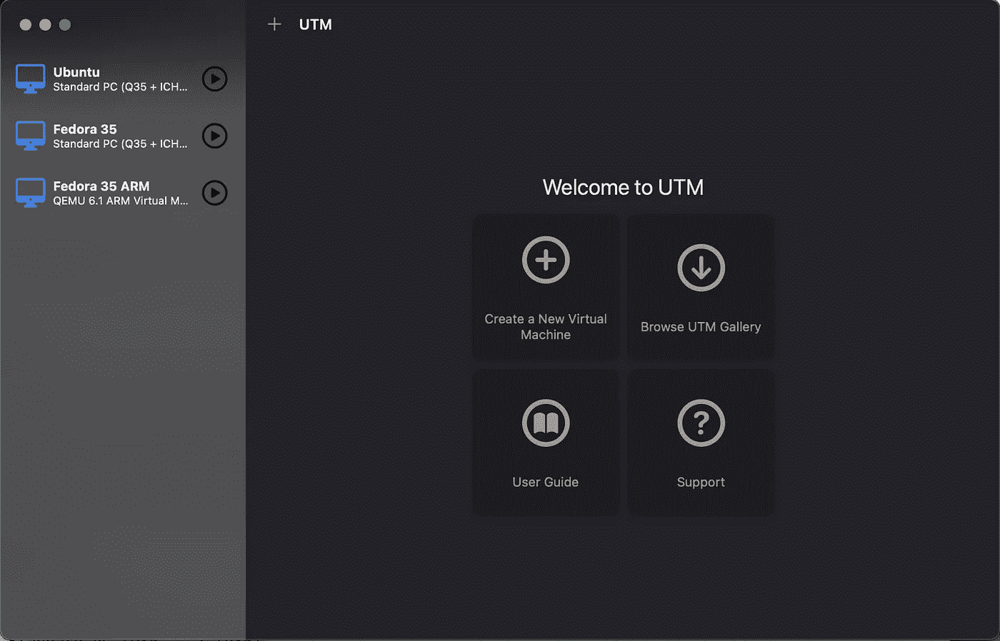

# 使用 qemu/utm 在苹果 M1 上运行 amd64 Linux

> 原文：<https://levelup.gitconnected.com/running-amd64-linux-on-apple-m1-with-qemu-utm-64d67cccd6f8>

## M1 |苹果芯片| MAC OS | x86 _ 64 | amd64 | QEMU | UTM | Linux VM

## 哪种 qemu CPU 设置提供最佳性能。



# 总结(TL；博士)

这不是最好的体验——如果你只需要 Linux，用 arm64 版本会好得多——但它工作得很好。但是，它比本机或 arm64 仿真慢得多。

## 更新(MacBook Pro 16“M1”)

没有显著差异。我的规格:10 个 CPU 核心，32GB 内存。但是`sysbench`配置为使用 2 核，所以没有区别。

# 先决条件

开始前安装`qemu`和`utm`。后者不是必需的，但会使生活变得容易得多。这假设你已经安装了自制软件。

```
brew install qemu utm
```

# 设置虚拟机

启动`utm`并“创建一个新的虚拟机”，给它你想要的名字。

转到驱动器，创建一个至少 10GB 大小的驱动器，越大越好。然后`import disk`从你选择的发行版中添加一个可引导的 ISO。

## 系统设置

*   建筑:`x86_64`
*   系统:`Standard PC (Q35....) (q35)`
*   内存:`2048MB`以上(我用的是 2048MB)
*   **高级设置**:
*   CPU: `qemu64`对`Skylake-Client`对……
*   CPU 内核:`4`或更多(我用了 8 个)
*   强制多核:✅(这显著提高了性能)

**更新**:使用新的`utm`用户界面，遵循以下步骤:

*   创建虚拟机→模拟
*   选择“Linux”
*   浏览 Linux 安装 ISO
*   …然后同上:架构、系统…
*   完成后，再次进入虚拟机的设置:转到`System`并检查强制多核:✅

## 安装操作系统

从 ISO 映像启动后，在磁盘上安装操作系统。完成后，停止机器并从驱动器中删除 ISO，然后启动新的虚拟机。你已经准备好玩它了。(提示:安装会比你预期的慢得多，所以请耐心等待。最好选择`qemu64`作为安装的 CPU 类型)。

# 基准

*   MacBook Air M1，16GB 内存
*   qemu + utm
*   来宾系统:Ubuntu 20.04 桌面(最小安装)
*   `sysbench cpu --threads=2 run`

## CPU sky lake-客户端(默认)

```
# cpu = Skylake-Client
~$ sysbench 1.0.18 (using system LuaJIT 2.1.0-beta3)
[...]CPU speed:
    events per second:   507.37General statistics:
    total time:                          10.0039s
    total number of events:              5080Latency (ms):
         min:                                    3.76
         avg:                                    3.93
         max:                                    5.82
         95th percentile:                        4.18
         sum:                                19962.08Threads fairness:
    events (avg/stddev):           2540.0000/5.00
    execution time (avg/stddev):   9.9810/0.00
```

## CPU Penryn

```
# cpu = Penryn
~$ sysbench cpu --threads=2 run
sysbench 1.0.18 (using system LuaJIT 2.1.0-beta3)
[...]CPU speed:
    events per second:  1455.74General statistics:
    total time:                          10.0032s
    total number of events:              14571Latency (ms):
         min:                                    1.25
         avg:                                    1.37
         max:                                   52.02
         95th percentile:                        1.52
         sum:                                19948.56Threads fairness:
    events (avg/stddev):           7285.5000/2.50
    execution time (avg/stddev):   9.9743/0.00
```

## CPU qemu64

```
# cpu = qemu64
~$ sysbench cpu --threads=2 run
sysbench 1.0.18 (using system LuaJIT 2.1.0-beta3)
[...]CPU speed:
    events per second:  1505.28General statistics:
    total time:                          10.0012s
    total number of events:              15059Latency (ms):
         min:                                    1.24
         avg:                                    1.32
         max:                                    3.37
         95th percentile:                        1.47
         sum:                                19938.66Threads fairness:
    events (avg/stddev):           7529.5000/2.50
    execution time (avg/stddev):   9.9693/0.00
```

## 更新:M1 16 英寸 CPU qemu64

```
# cpu = qemu64
~$ sysbench cpu --threads=2 run
sysbench 1.0.18 (using system LuaJIT 2.1.0-beta3)
[...]CPU speed:
    events per second:  1605.28General statistics:
    total time:                          10.0019s
    total number of events:              16048Latency (ms):
         min:                                    1.18
         avg:                                    1.24
         max:                                    3.83
         95th percentile:                        1.32
         sum:                                19931.65Threads fairness:
    events (avg/stddev):           8024.0000/10.00
    execution time (avg/stddev):   9.9658/0.00
```

## CPU qemu64-v1

```
# cpu = qemu64-v1
~$ sysbench cpu --threads=2 run
sysbench 1.0.18 (using system LuaJIT 2.1.0-beta3)
[...]CPU speed:
    events per second:  1474.44General statistics:
    total time:                          10.0016s
    total number of events:              14751Latency (ms):
         min:                                    1.27
         avg:                                    1.35
         max:                                   21.82
         95th percentile:                        1.55
         sum:                                19923.12Threads fairness:
    events (avg/stddev):           7375.5000/30.50
    execution time (avg/stddev):   9.9616/0.00
```

## CPU EPYC

```
# cpu = EPYC
~$ sysbench cpu --threads=2 run
sysbench 1.0.18 (using system LuaJIT 2.1.0-beta3)
[...]CPU speed:
    events per second:  1403.61General statistics:
    total time:                          10.0024s
    total number of events:              14045Latency (ms):
         min:                                    1.36
         avg:                                    1.42
         max:                                    3.68
         95th percentile:                        1.52
         sum:                                19938.08Threads fairness:
    events (avg/stddev):           7022.5000/1.50
    execution time (avg/stddev):   9.9690/0.00
```

## CPU Haswell

```
# cpu = Haswell
~$ sysbench cpu --threads=2 run
sysbench 1.0.18 (using system LuaJIT 2.1.0-beta3)
[...]CPU speed:
    events per second:   491.29General statistics:
    total time:                          10.0044s
    total number of events:              4919Latency (ms):
         min:                                    3.74
         avg:                                    4.06
         max:                                   53.05
         95th percentile:                        4.33
         sum:                                19955.25Threads fairness:
    events (avg/stddev):           2459.5000/3.50
    execution time (avg/stddev):   9.9776/0.00
```

## 中央处理器 kvm64

```
# cpu = kvm64
~$ sysbench cpu --threads=2 run
sysbench 1.0.18 (using system LuaJIT 2.1.0-beta3)
[...]CPU speed:
    events per second:  1506.38General statistics:
    total time:                          10.0021s
    total number of events:              15076Latency (ms):
         min:                                    1.24
         avg:                                    1.32
         max:                                    2.83
         95th percentile:                        1.44
         sum:                                19951.28Threads fairness:
    events (avg/stddev):           7538.0000/6.00
    execution time (avg/stddev):   9.9756/0.00
```

# 当地的

本机运行基准测试会产生以下结果:

`brew install sysbench`

```
~$ sysbench cpu --threads=2 run
sysbench 1.0.20 (using system LuaJIT 2.1.0-beta3)
[...]CPU speed:
    events per second: 21974674.98General statistics:
    total time:                          10.0001s
    total number of events:              219755276Latency (ms):
         min:                                    0.00
         avg:                                    0.00
         max:                                    5.28
         95th percentile:                        0.00
         sum:                                 6512.92Threads fairness:
    events (avg/stddev):           109877638.0000/249382.00
    execution time (avg/stddev):   3.2565/0.00
```

## M1 的 ARM64:

```
# cpu = cortex-a72
~$ sysbench cpu --threads=2 run
sysbench 1.0.20 (using system LuaJIT 2.1.0-beta3)Running the test with following options:
Number of threads: 2
Initializing random number generator from current timePrime numbers limit: 10000Initializing worker threads...Threads started!CPU speed:
    events per second: 16194.69General statistics:
    total time:                          10.0001s
    total number of events:              161958Latency (ms):
         min:                                    0.12
         avg:                                    0.12
         max:                                    1.46
         95th percentile:                        0.13
         sum:                                19968.36Threads fairness:
    events (avg/stddev):           80979.0000/11.00
    execution time (avg/stddev):   9.9842/0.00
```

# 摘要

所有基准测试都从`sysbench cpu --threads=2 run`开始

*   本机(macOS): **~每秒 2400 万**个事件
*   Skylake-Client(默认):每秒约 500 个事件👎
*   qemu64-v1:每秒约 1500 个事件
*   **qemu64** : **~每秒 1500** 个事件👍
*   qemu64 + ssse3，sse4.1，sse4.2:每秒约 1450 个事件
*   每秒大约 1500 个事件
*   Penryn + ssse3，sse4.1，sse4.2:每秒约 1400 个事件
*   Haswell:每秒约 500 个事件👎
*   EPYC:每秒大约 1400 个事件
*   kvm64:每秒约 1500 个事件
*   现象:每秒约 1400 个事件
*   Nehalem:每秒约 1400 个事件
*   禅那:每秒约 500 个事件👎
*   Opteron_G5: —不工作
*   马克斯:—不起作用
*   qemu64: ~1500(无变化)

# 为了比较

容器和 arm64 的一些基准测试。

## 系统设置

*   架构:`ARM64 (aarch64)`
*   系统:`QEMU 6.1 ARM ... (virt)`
*   操作系统:Fedora 35

## 结果

*   cortex-a72(默认): **~每秒 16200** 个事件
*   默认值:每秒约 16000 个事件
*   cortex-a8/a9/a15: —不工作
*   马克斯:—不起作用

## 或者和 Docker 或 Lima 一起

[](https://github.com/lima-vm/lima) [## GitHub - lima-vm/lima: Linux 虚拟机，在 macOS 上(又名“Linux-on-Mac”，“macOS 子系统用于…

### Lima 推出了具有自动文件共享、端口转发和容器的 Linux 虚拟机。利马可以是…

github.com](https://github.com/lima-vm/lima) 

*   `docker run -it --rm --platform=linux/amd64 ubuntu`:每秒约 550 个事件
*   `docker run -it --rm ubuntu` : (arm64) ~每秒 550 个事件‼️
*   `lima` (arm64): **~20200** 每秒事件数🤘
*   `lima` (x86_64):每秒约 260 个事件
*   `lima container`(arm64 VM 中的 arm 64 容器): **~每秒 21000** 个事件🤘
*   `lima container`([arm 64 VM](https://github.com/lima-vm/lima/blob/master/docs/multi-arch.md)中的 x86_64 容器):每秒约 570 个事件
*   `multipass` (arm64):每秒大约 11000 个事件(我没有找到一个选项来安装带有 multipass 的 x86_64 VM)

# 结论

你可以在 M1 Mac 上运行 x86_64 Linux 虚拟机。但是，如果你依赖它的可用性类似于本地体验，那么苹果硅机不是你的正确选择。我仍然需要在一个新的 M1 Max 上测试这个，但是我怀疑在不久的将来这将会是一个有趣的经历。

然而，当你可以在一个 Linux 虚拟机上运行你所需要的一切时，你应该会很好。它离原生体验还很远，但比 x86_64 流畅得多(快 10 倍)。

我不是铁杆开发者，但我用 MacBook Air 做了很多事情。到目前为止，我还没有遇到大的障碍，因为我使用远程“真正的”Linux 机器来处理工作负载，所以我不需要 Linux VM。此外，到目前为止，我在 docker 中运行的一切都像预期的那样工作(除了这样一个事实，即当您需要 x86_64 或 arm64 还没有映像时，您必须提供`--platform=linux/amd64`)。

Lima 是新的，似乎是 Mac Docker 的一个很好的替代品。没有跨平台，它比 Docker for Mac 更容易。

[](https://medium.com/nttlabs/containerd-and-lima-39e0b64d2a59) [## container d & Lima:Mac 版 Docker 的开源替代方案

### 今天，社区被一个突然的消息震惊了，Mac/Win 版 Docker 桌面不再免费提供给…

medium.com](https://medium.com/nttlabs/containerd-and-lima-39e0b64d2a59) 

# 谢谢你

因为看了我的文章！支持或关注我在 [GitHub](http://github.com/drpsychick) 、 [Medium](https://drpsychick.org) 或[别处](https://drpsychick.org/drpsychick-on-the-web-a9ccfb0df17e)。

我的相关文章

[](/im-not-an-apple-fan-but-there-is-no-better-alternative-d1d5250de3d4) [## 我不是苹果粉丝，但没有更好的选择。

### 为什么 Linux 和 Windows 无法抗衡苹果生态系统。

levelup.gitconnected.com](/im-not-an-apple-fan-but-there-is-no-better-alternative-d1d5250de3d4) 

# 分级编码

感谢您成为我们社区的一员！升级正在改变技术招聘。 [**在最好的公司找到你的完美工作**](https://jobs.levelup.dev/talent)**。**

**[](https://jobs.levelup.dev/talent) [## 提升——改变招聘流程

### 🔥让软件工程师找到他们热爱的完美角色🧠寻找人才是最痛苦的部分…

作业. levelup.dev](https://jobs.levelup.dev/talent)**