# 用雪花后端在 Azure 函数中运行 DBT

> 原文：<https://levelup.gitconnected.com/running-dbt-in-azure-functions-with-a-snowflake-backend-99d01dff399e>

## 如何在接近实时的场景下运行 Azure 函数中的 DBT

泰勒·维克在 [Unsplash](https://unsplash.com?utm_source=medium&utm_medium=referral) 上的照片

D **ataOps** 实践正在被专注于数据的公司迅速采用，尤其是那些正在迁移到**云数据仓库**的公司。近年来出现了一些支持数据操作的工具，比如[数据构建工具](https://www.getdbt.com/)或 dbt。dbt 由 [Fishtown Analytics](https://www.fishtownanalytics.com/) 构思和开发，是一个命令行工具，它在 **E** xtract、 **L** oad、**T**transform(**ELT)**管道中运行数据转换。它从 **DevOps** 和**软件工程**的世界中借用了一些核心原则，并采用了与大多数数据工程师所习惯的不同的 SQL 开发方法。

DBT 拥有 Apache 许可证，通常在持续集成和部署( **CI** / **CD)** 管道中运行，或者从 [dbt 云](https://cloud.getdbt.com/)运行。后者是该软件的托管版本，由 Fishtown Analytics 提供，有三个不同的[定价计划](https://www.getdbt.com/pricing/)。批处理工作负载，尤其是 dbt 中常见的分析工作负载，只需要一个 CI/CD 执行模型。

在我最近参与的一个项目中，我们需要在接近实时的场景中使用 dbt。该解决方案有一个事件驱动的架构，具有雪花后端和 Azure 功能来响应事件。挑战在于近乎实时地触发 dbt，由另一个函数将消息发送到 Azure 存储队列。每条消息都包含有关数据转换的信息，这些信息必须在数据加载后立即执行。CI/CD 管道在这里是不可能的，因为它更适合批处理。所以我们必须开发一个运行 dbt 的 Azure 触发器函数。在接下来的几个段落中，我将通过一步一步的指导告诉你如何去做。

所以让我们直入主题吧！

# 让我们从 DBT 基础开始

我不是数据工程师，但我第一次使用 dbt 是在一年前，纯粹出于好奇。当时，只有几家公司在使用它，还有来自 [Monzo Bank](https://youtu.be/2xVjlOMMZFY) 和 [Gitlab](https://youtu.be/bqIBNvA9xjo) 的几个演示视频。据我所知，Fishtown Analytics 在他们的首页上发布了一份公告，宣布了 1290 万美元的 A 轮投资，以及一个更大的、令人印象深刻的公司列表，这些公司目前正在使用他们的产品。这表明像这样的 DataOps 工具被业界采用并成为标准实践的速度有多快。但是它到底是做什么的？

DBT 是一个用 Python 编写的命令行工具，使用 SQL、Jinja 脚本和宏来表达数据转换。它带有内置的连接器，可以连接到流行的云数据仓库，如雪花、[红移](https://aws.amazon.com/redshift/)或[谷歌大查询](https://cloud.google.com/bigquery)。数据工程师在由 [dbt CLI 命令](https://docs.getdbt.com/tutorial/create-a-project-dbt-cli)初始化的结构化项目中开发他们的代码，每个项目由包含所有模型、宏、特别查询、测试等的文件夹组成。乍一看，dbt 项目与任何软件项目都很相似。

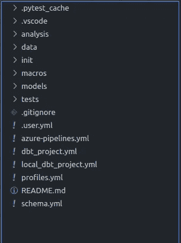

图 1:VS 代码中典型的 DBT 项目结构。

可以将项目设置为针对不同的数据库和模式运行，并使用不同的角色和用户。所有这些都在一个`**profiles.yml**`文件中进行配置，该文件类似于 Node.js 开发中的`**package.json**`。

dbt 的一个常见执行模型是运行一个 [**Azure DevOps**](https://medium.com/hashmapinc/doing-devops-for-snowflake-with-dbt-in-azure-db5c6249e721) 或 [**Gitlab**](https://www.youtube.com/watch?v=bqIBNvA9xjo) 管道，首先安装 dbt，运行一些测试，然后触发数据转换。dbt 命令行提供了一些选项，比如执行特定的模型或者使用标记系统对模型进行分组。这允许我们在特定的表和视图上运行转换，而不影响数据库的其余部分。模型选择是有用的功能，可以在许多用例中使用，比如事件驱动的架构。

## 模型选择和标记

在深入研究模型选择之前，首先理解什么是模型是很重要的。dbt 项目中的模型文件是基本组件，工程师在其中开发他们所有的数据转换。它们混合了`**SELECT**`语句、Jinja 宏和配置参数。当 dbt 运行模型时，数据库表和视图被刷新或增量更新。配置参数定义了所用模型的类型、数据库模式、标签等等。标签是将一组模型组合在一起的有用机制。例如，您可能有 3 个与客户订单相关的模型文件。通过一个`tag="CUSTOMER"`，您可以运行所有 3 个模型的转换，并更新 3 个不同的表，而不必运行单独的脚本或 SQL 语句。

下面是一个模型文件的示例，该文件从原始源中选择客户信息，并将其放入概要文件中定义的目标模式和表中。

示例 dbt 模型源代码。

默认情况下，dbt CLI 运行 models 文件夹中的所有模型，但是也可以使用标记选择一个特定的模型或一组模型。

从命令行运行 dbt。

# 用消息触发 DBT

微软 Azure 基础设施支持具有不同类型 Azure 功能的无服务器计算，这些功能可以由平台上引发的事件或消息以及 HTTP 请求触发。完全自动化的数据管道可以从这些功能中受益，并使用事件驱动的方法来实现。在这里区分事件和消息是很重要的。事件是条件或状态变化的轻量级通知，其中消息是由诸如 Azure 函数之类的服务产生的数据。

通过事件驱动的架构，当数据到达云存储(如 Azure Blob 容器)时，事件被引发，并通过事件订阅将它们发送到 [Azure 存储队列](https://docs.microsoft.com/en-us/azure/storage/queues/storage-queues-introduction)。Azure 函数一直在监听这个队列，一旦它检索到一个事件，就会根据收到的信息触发一个新的工作负载。

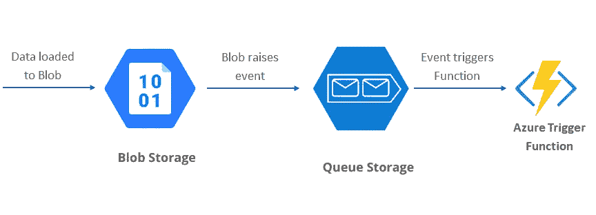

图 2:当数据进入 Blob 存储时的操作链。

Azure 存储队列是一种可靠的机制，用于累积事件和消息，并将它们分派给 Azure 函数。在某些用例中，可以有多个队列，这允许函数之间相互通信。

在我们的示例中，执行 ELT 管道加载部分的 Azure 函数向 dbt 队列发送一条消息，该队列随后触发特定模型或标签的数据转换。要创建存储队列，我们只需使用 Azure 门户，如下所示。

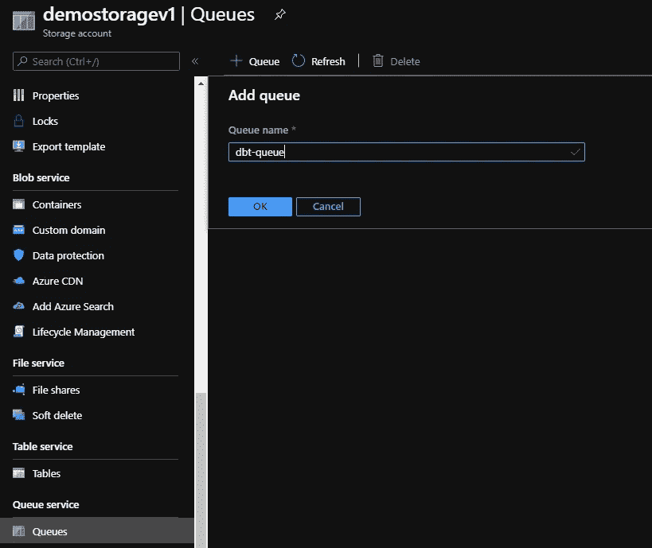

图 3:向存储帐户添加新队列。

# 创建 Azure 触发器功能

一旦队列就位，我们继续使用 Visual Studio 代码和 Microsoft Azure Functions 扩展创建 Azure 队列存储触发器函数。

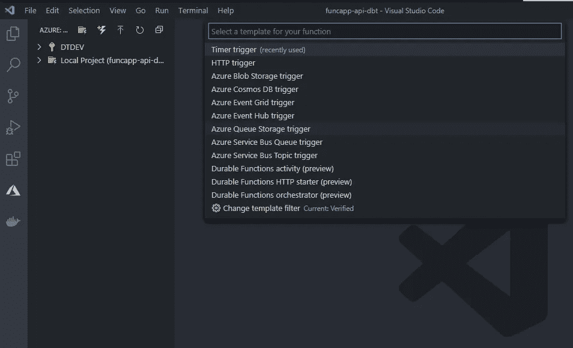

图 4:创建 Azure 队列存储触发器函数。

一旦创建了 Azure 函数，我们就连接到我们的函数将监听新消息的队列中。此时，项目应该有一个处理传入事件的`**main**`函数和一个具有触发器绑定的`**function.json**`，如下所示。

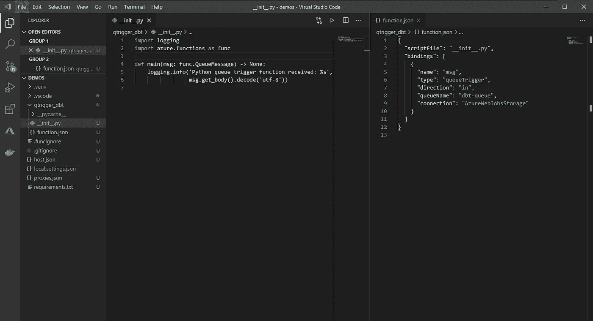

图 5:监听特定存储队列的功能设置。

# 在 Azure 函数中添加 DBT 项目

通常，团队为他们的 dbt 项目拥有单独的存储库。我们在这里想要实现的是允许 dbt 模型在我们创建的 Azure 函数中运行。一种方法是将 dbt 项目作为`**git submodule**`添加到 Azure Function 项目中。这样，数据工程团队对 dbt 项目所做的任何更改都会保持同步，并且函数中运行的所有模型都是最新的。这里我使用的是由 Fishtown Analytics 创建的演示库 [jaffle_shop](https://github.com/fishtown-analytics/jaffle_shop/tree/38707ee7273c1d6d5a0cd5ec487a6c632ec6a83b) 项目。

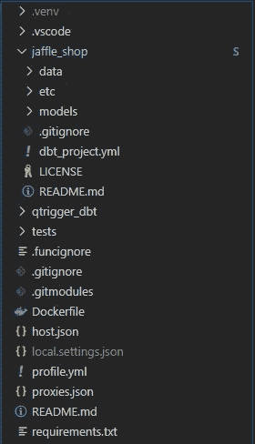

图 6:添加 jaffle_shop 作为 git 子模块

目前，还没有针对 dbt 的 Python API，所以运行它最健壮的方法是创建一个`**subprocess Popen**`包装器。只需要一个简单的 runner 类，以及一个接受要使用的模型和标签作为参数的方法。下面是`**DBTRunner**`类和`**exec_dbt**`方法的一个片段，该方法使用位于我们项目根的`**profiles.yml**`作为执行配置文件。您可以在这里找到函数[的其余源代码。](https://github.com/dtraskas/funcapp-dbt)

dbt Runner 类的部分实现。

概要文件包含运行 dbt 时要使用的数据库和模式的连接信息。所有这些参数都可以作为环境变量传递，并以这种方式定义，这样它们就不会暴露出来。

带有目标数据库参数的 profiles.yml 文件。

每个 Azure 函数都包含应用程序设置，这些设置作为环境变量传递给我们的代码，并最终替换上面看到的变量。触发器函数现在已经准备好处理传入的消息并运行 dbt 模型。

# 设置 Azure 功能部署

当 dbt 运行时，它生成日志信息并将代码编译成目标 SQL，这将在雪花或我们选择的任何其他数据库中执行。当在容器环境(比如 Azure 函数)中运行 dbt 时，这是一个挑战，因为您会遇到权限问题，这会阻止模型的执行并在日志中生成错误。

DBT 项目包含一个`**dbt_project.yml**`文件，其中有所有必要路径的定义。在设置任何部署之前，使用我们的主机 Linux 服务器上的临时文件夹来设置这些路径是至关重要的。项目文件应该类似于下面的`**YAML**`,所有路径都指向 Linux 临时文件夹。

带有临时文件夹的 DBT 项目文件。

现在所有的组件都就位了，我们准备创建一个 Azure DevOps 构建管道。管道将安装在`**requirements.txt**`文件中定义的 dbt 和其他库，构建 Docker 映像，并通过 Azure DevOps 连接将其推送到我们的注册表`**svc-demo-docker-reg**`。

Azure DevOps 为 dbt Azure 触发器函数构建管道。

# 最后一步

在部署 Azure 功能之前，我们需要创建一个功能应用程序，作为多个 Azure 功能的主机，并位于指定的资源组和地理区域内。我们只需选择订阅、资源组、名称和区域，并将部署类型指定为 **Docker 容器**。我们在这里选择 Docker 容器，因为我们发现它是在函数中安装和运行 dbt 的最可靠的方法。

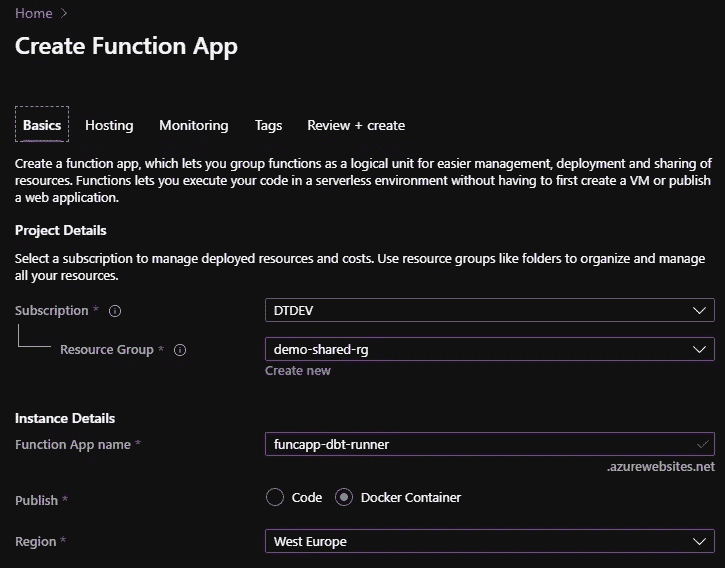

图 7:用 Docker 容器部署创建 Azure Function App。

一旦提供了功能应用程序，我们就建立一个 Azure DevOps 发布管道来部署我们之前构建的 Docker 映像。下面，我将向您展示发布管道的概述以及插入了**应用服务部署任务**的主要工作。

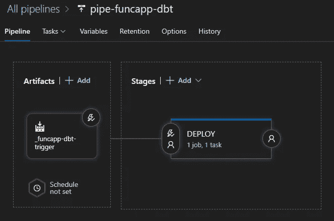

图 8: Azure DevOps 发布管道

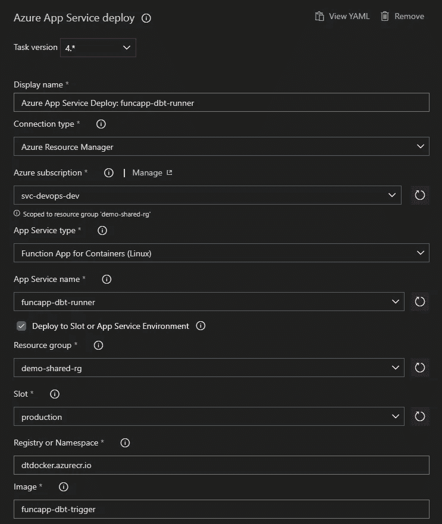

图 9:使用 Azure 应用服务部署任务

现在我们已经部署并运行了 Azure 函数，是时候运行一些测试了。jaffle shop 项目包含一些虚拟数据和模型，它们代表一个虚构的在线商店中的客户和订单。让我们假设另一个 Azure 函数已经完成了所有的数据加载，现在正在发送一条消息，要求用一些转换来更新客户订单。我们将通过向`**dbt-queue**`添加一条消息来模拟这种情况。

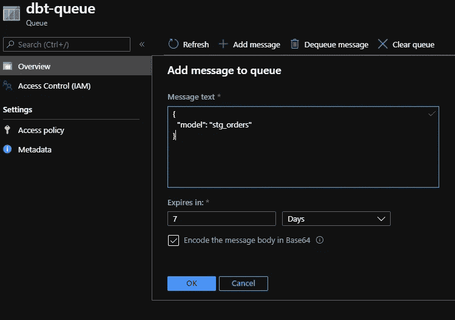

图 10:向 dbt 发送一个事件来执行 stg_orders 模型。

一旦添加了消息，我们的函数就会被触发，dbt 开始运行。它选择了`**stg_orders**` 模型并成功运行了所有的转换。诚然，这是一个非常简单的例子，但设置工作非常大的项目，可以很容易地扩展。

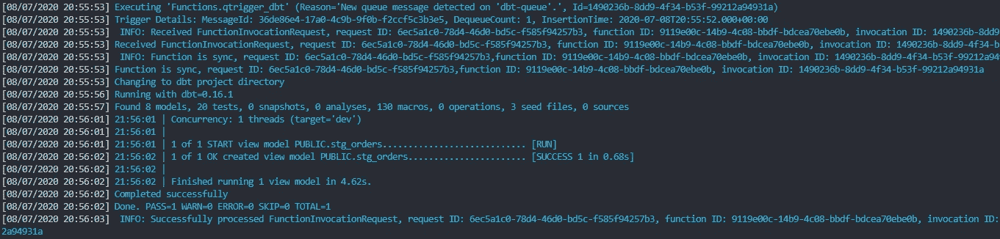

图 11: Azure 函数日志 dbt 输出。

# 结论

DBT 是一个强大的数据转换工具，它将——“没有双关语”——改变你的数据工程团队的工作方式。它有一个陡峭的学习曲线，需要耐心，特别是对于不习惯数据操作实践的团队。在 Azure 函数中连接 dbt 并基于传入事件执行模型是一种强大的机制，可以在很多有趣的场景中使用。如果您想了解更多关于 Azure 设置的信息或有任何问题，请随时联系我们。