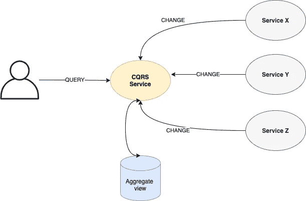
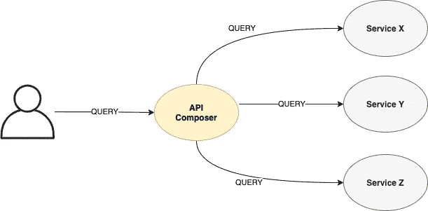

# 在微服务中运行分布式查询

> 原文：<https://levelup.gitconnected.com/running-distributed-queries-in-micro-services-157b12b93154>

## CQRS 和 API 组合方法

丹尼斯·库默在 [Unsplash](https://unsplash.com/s/photos/distributed-data?utm_source=unsplash&utm_medium=referral&utm_content=creditCopyText) 上拍摄的照片

当我们有一个使用微服务架构的应用时，有几种数据策略可以使用。推荐的方法之一是让每个微服务拥有自己的数据存储。这意味着系统的整体状态将分布在多个数据存储中，只能从它们自己的微服务中访问。

大多数复杂的查询将涉及多个数据库中的可用数据。每个消费者都可以访问所有这些微服务，并聚合所有数据来满足他们的查询。但是，由于以下几个原因，它并不理想:

*   消费者非常了解系统如何管理数据。
*   消费者需要访问存储与查询相关的数据的每个服务。
*   改变架构可能需要改变许多消费者。

解决这个问题有两种方法:CQRS 和 API 结合。有趣的是，支持这两种解决方案的服务具有相同的 API，因此您可以从一种解决方案切换到另一种解决方案，甚至可以混合使用而不会影响用户。这意味着一些查询将由 CQRS 服务，而其他查询将由 API 组成，并且所有查询将由相同的服务实现。

## 命令查询责任分离(CQRS)

使用命令查询责任分离(CQRS)，来自各种微服务的数据将被聚集到一个新的只读数据存储区域，该区域旨在回答特定的查询。名字的意思是你把更新数据(命令)的责任和读取数据(查询)的责任分开(分开)。这些活动由不同的服务处理。这通常通过监控所有数据存储变化来实现，并且需要适当的变化通知系统。您也可以使用轮询，但这通常是不可取的。当存在经常使用的已知查询时，该解决方案将大放异彩。

这是 CQRS 在实践中的描述。CQRS 服务(负责查询)从三个微服务(负责更新)接收更改通知，并将它们聚合到自己的数据存储中。当查询到来时，CQRS 服务通过访问自己的聚合视图做出响应，而不需要访问微服务:

优点如下:

*   查询不会干扰主数据存储的更新。
*   聚合器服务公开了一个为特定查询定制的 API。
*   在不影响消费者的情况下，更容易在幕后改变数据管理方式。
*   快速响应时间。

缺点如下:

*   这增加了系统的复杂性。
*   它复制了数据。
*   局部视图需要显式处理。

## API 成分

API 组合方法更加轻量级。从表面上看，这似乎是一个 CQRS 解决方案。它公开了一个 API，可以回答多个微服务中众所周知的查询。不同之处在于，它不保留自己的数据存储。每当有请求进来，它就访问每一个包含数据的微服务，组合结果，然后返回它们。

当系统不支持数据更改的事件通知时，该解决方案将大放异彩，并可以接受主数据存储的运行查询负载。

下面是一个实际的 API 组合示例，其中对 API Composer 服务的查询被转换为对后台三个微服务的查询:

优点是:

*   轻量级解决方案。
*   聚合器服务公开了一个为特定查询定制的 API。
*   结果总是最新的。
*   没有架构需求，比如事件通知。

缺点是:

*   任何服务的失败都将导致查询失败。
*   这需要关于重试和超时的策略决策。
*   大量的查询可能会影响主数据存储。

## 结论

在本文中，我们简要介绍了在微服务架构上处理分布式查询的两种方法。API 组合是一种更容易上手的解决方案。

一般来说，由于复杂程度要高得多，建议只有在适当的条件存在且具有明显的吸引力时，才应开始从 API 成分向 CQRS 的过渡。