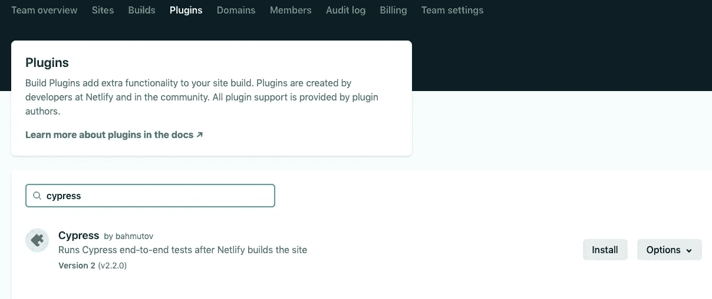

# 在 Netlify 上运行端到端测试

> 原文：<https://levelup.gitconnected.com/running-end-to-end-tests-on-netlify-d43ffa34c5bd>

决定如何以及在哪里在您的部署管道中运行您的端到端(E2E)测试有时会有点令人头疼。我遇到的一个简单免费的解决方案是使用 [Cypress](https://www.cypress.io/) 在你的 [Netlify](https://www.netlify.com/) 构建和部署过程中运行你的 E2E 测试。


运行一套完整的 E2E 测试会花费很多时间，这意味着你可能不希望它们在每次 PR 更新或提交时运行。在管道中不必要地重复运行它们也会消耗大量的计算能力，您可能需要为此付费。使用带有 Cypress 插件的 Netlify 构建可以减少运行测试的频率，并且可以在免费层中获得。

Cypress 是一个很好的测试工具，因为它很容易安装和运行，它有清晰的文档和一个可以链接到你的回购协议的仪表板。它还有一个很好的本地测试运行器，可以选择在浏览器中实时显示您的测试，这对于调试问题来说是一个真正的奖励。

# 入门指南

1.  如果你还没有设置好通过 Netlify 部署你的 repo，你可以遵循他们的文档或者我在这里[创建的快速指南](https://liz-hard.medium.com/deploying-a-website-made-simple-66e45a95122d)。
2.  您还需要一套 Cypress 测试来运行部署过程。如果您没有将 Cypress 添加到您的 repo 中，他们的[安装指南](https://docs.cypress.io/guides/getting-started/installing-cypress#npm-install)会添加第一个测试来让您启动并运行。

# 运行测试

Netlify 有一个 [Cypress 插件](https://github.com/cypress-io/netlify-plugin-cypress),您需要将它添加到您选择的回购中，或者在您的 Netlify 帐户中:



或者通过您的`netlify.toml`:

```
[[plugins]]
  # runs Cypress tests against the deployed URL
  package = "netlify-plugin-cypress"
```

我更喜欢使用`netlify.toml`文件，因为这将所有配置保存为代码，如果有人派生或克隆您的 repo，他们将默认获得此配置。要让插件运行测试，只需添加几行代码即可:

```
[plugins.inputs.postBuild]
 enable = true
```

通过指定`postBuild`,您将指示 Netlify 构建您的站点，然后针对该实例运行您的 E2E 测试，该实例将是正在发布的站点，如果测试失败，则该站点不会被部署。

## **精简上下文**

如果您已启用 Netlify 为您的 PR 生成部署预览，那么您可能希望利用上下文，以便这些测试仅在生产部署上运行，而不是在每个 PR 更新上运行。

仅在生产部署上运行测试的`netlify.toml`示例:

```
[build]
command = "npm run build"
publish = "build" [build.environment]
  # cache Cypress binary in local "node_modules" folder
  # so Netlify caches it
  CYPRESS_CACHE_FOLDER = "./node_modules/CypressBinary"
  # set TERM variable for terminal output
  TERM = "xterm"

[[context.production.plugins]]
# runs Cypress tests against the deployed URL
package = "netlify-plugin-cypress" [context.production.plugins.inputs.postBuild]
   enable = true
```

## **使用后期构建的好处**

默认的`input.plugins`在你已经部署的站点上运行你的测试，所以即使测试失败，你也已经把你的网站上线了，这并不理想，你将不得不手动撤销部署。

`preBuild`是另一个很好的选择，可以在本地构建和运行测试，但是使用`postBuild`的好处是它与部署的生产站点完全相同，应该可以防止不同环境之间出现不同的测试结果，这可能很难调试。