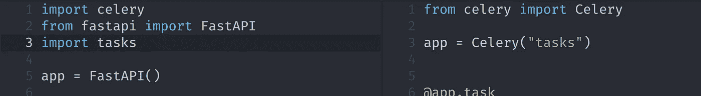

# 在一个命令中同时运行 FastAPI 和 celery

> 原文：<https://levelup.gitconnected.com/running-fastapi-and-celery-together-in-a-single-command-66afd9b15561>



FastAPI 和芹菜

# FastAPI 和芹菜

FastAPI 是一个新的非常流行的开发 python web APIs 的框架。Celery 可能是在 web 应用程序中运行长时间任务最常用的 python 库。FastAPI 和 Celery 经常一起使用( [FastAPI 文档](https://fastapi.tiangolo.com/tutorial/background-tasks/#caveat)甚至推荐这样做),在数据科学和机器学习等领域，需要异步完成长时间运行的 CPU 任务的应用程序是库组合的理想选择。

# 发展中的

为了演示一个简单的应用程序，我们将从一个全新的 python 虚拟环境开始，并安装我们的库(我们假设 Redis 安装在这里的 *localhost* 上，并且您已经用 python 3.9 或类似版本创建了一个虚拟环境):

```
pip install fastapi celery[redis] uvicorn
```

现在让我们创建几个文件。第一个文件( *tasks.py* )定义了我们的芹菜任务，而第二个文件 *main.py* 定义了一个非常简单的 FastAPI 应用程序，它使用了我们刚刚创建的芹菜任务。

开发此类应用程序时，开发人员通常会在不同的终端中启动两个进程:

1.  API 服务器(运行 FastAPI 应用程序)和
2.  芹菜工人(运行芹菜任务)

虽然将这些过程分开在生产中很重要，但是在开发过程中，让这些过程在同一个过程中运行通常不是问题。在同一个过程中运行这两者可以简化开发流程，因为我们只需要一个命令和一个终端就可以开始开发。

# 解决办法

我们可以不使用这两个终端和命令，而是使用 Celerys 测试实用程序在后台线程中启动 celery worker(注意，由于 python 线程的工作方式，CPU 绑定的任务将阻塞 API 服务器，这显然不利于生产部署，但在开发期间应该不是问题，并且仍然比使用 Celerys*task _ always _ eager*设置更接近“真实”设置)。

为此，我们将包装 web 服务器(我们在这里使用的是 Uvicorn)命令:

这看起来可能很奇怪，因为我们在这里使用了一些代码，但重要的部分是*celery . contrib . testing . worker . start _ worker*，它在后台启动 celery worker。剩下的代码包装了 Uvicorn cli 命令，这样我们就可以像使用 uvicon 一样使用我们的新脚本。 *run.py* 脚本将接受与*uvicon*命令相同的命令:

```
python run.py --help
```

现在，我们可以像以前一样启动 web 服务器了:

```
python run.py main:app --reload
```

但是它不只是启动 web 服务器，还会在后台启动一个芹菜工作器。

访问 [http://127.0.0.1:8000](http://127.0.0.1:8000`) 将显示:

```
{"2+2":4}
```

结果在 celery worker 中计算，该 worker 运行在同一个进程的一个线程上！

# 结论

虽然完成这项工作以节省终端窗口似乎有些过分，但我确实认为尽可能简化新同事或贡献者的开发设置(尤其是如果他们经验不足的话)会带来巨大的不同。在许多情况下，使用一个命令来运行您的开发环境可能是值得的。