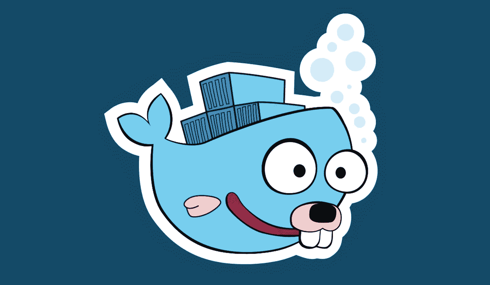
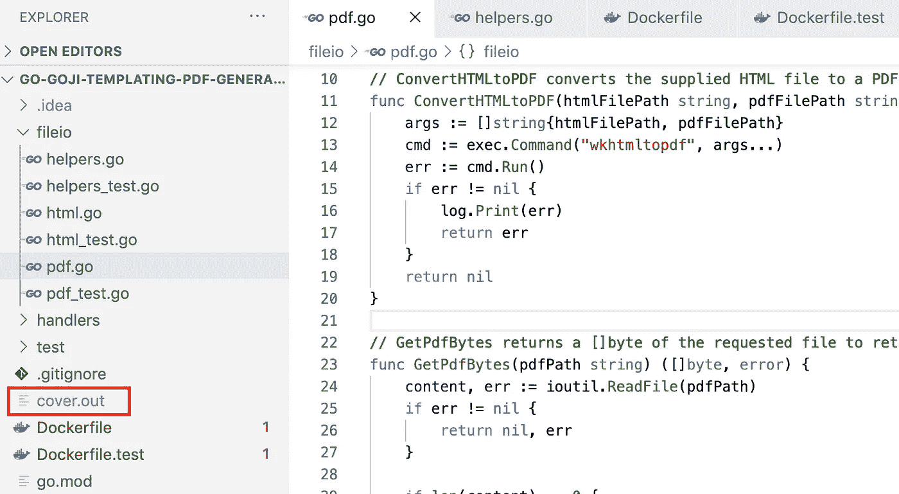

# 在 Docker 容器中运行 Go 单元测试

> 原文：<https://levelup.gitconnected.com/running-go-unit-tests-inside-a-docker-container-a41ebfcfd854>



99%的时候，我可以简单地在本地对我的项目进行单元测试，没有任何问题。然而，偶尔我会遇到这样的情况，我需要安装一些第三方软件来使应用程序正常工作，但我不想在我的笔记本电脑上安装这些软件。由于贵组织的安全规则，您也可能无法在您的笔记本电脑/PC 上安装软件。这通常会导致不完整的单元测试，因为我不能完全测试依赖于第三方软件的代码的功能。幸运的是，我们可以在这个场景中使用 Docker，并获得完整的单元测试覆盖率。

在我们开始之前，这篇文章绝对适用于任何需要在 Docker 容器中运行测试的语言。然而，在这篇文章中，我们将关注一个[围棋项目](https://github.com/atkinsonbg/go-goji-templating-pdf-generation)，我发现自己非常需要这个东西。

# 设置

对于这个项目，我通过`http/template`包使用 Go 的模板引擎。我将模板的输出保存为 HTML 文件，然后将其转换为 PDF。为了处理 PDF 转换，我使用了一个名为 [wkhtmltopdf](https://wkhtmltopdf.org/) 的开源命令行工具。这是一个非常简单的工具，可以无头运行，这正是我所需要的。这是一个 REST API，使用了 [Goji](https://github.com/goji/goji) 框架，它应该在 Docker 容器中运行。安装 wkhtmltopdf 没有问题，你可以在我的 Dockerfile 文件中看到。

```
FROM golang:latest as BUILDWORKDIR builddirCOPY . .RUN CGO_ENABLED=0 GOOS=linux GOARCH=amd64 go build -ldflags="-s -w" -o go-goji-templating-pdf-generation-apiFROM alpine:3.12.0RUN apk update && \ apk add xvfb ttf-freefont fontconfig wkhtmltopdf ghostscriptCOPY --from=BUILD ./go/builddir/go-goji-templating-pdf-generation-api .ENTRYPOINT ["./go-goji-templating-pdf-generation-api"]
```

这很简单，但是让我们打开它。首先，我们执行多阶段构建，使用 Golang Docker 映像来执行实际构建。接下来，我们使用 Alpine 容器来保持尽可能小的大小，并安装一些依赖项，其中之一是 wkhtmltopdf。CSS 渲染和压缩需要其他的包。最后，我们复制上一步的构建，我们就完成了。

使用`os/exec`包调用 wkhtmltopdf 非常简单。在这个函数中，我们接受一个指向 HTML 文件所在位置的路径，以及我们希望 PDF 输出到的位置。

```
func ConvertHTMLtoPDF(htmlFilePath string, pdfFilePath string) error { args := []string{htmlFilePath, pdfFilePath} cmd := exec.Command("wkhtmltopdf", args...) err := cmd.Run() if err != nil { log.Print(err) return err } return nil}
```

这是一个非常简单的函数，非常容易测试。除非运行测试的机器上没有安装 wkhtmltopdf！此时，我只有一个选择，通过调用函数并检查错误来运行负测试。您将返回错误“exec: "wkhtmltopdf ":在$PATH 中找不到可执行文件”。虽然这提高了您的覆盖率，但它并没有真正测试您的代码。

# 码头工人来救援了

为了在 Docker 中运行我们的单元测试，我们需要创建一个新的容器，其中安装了 wkhtmltopdf 以及我们未编译的代码。这个 docker 文件如下所示。

```
FROM golang:latest as BUILDRUN apt-get update && \ apt-get install -y xvfb wkhtmltopdf ghostscriptWORKDIR testdirCOPY . .ENTRYPOINT ["go", "test", "-v", "./...", "-coverprofile", "cover.out"]
```

这个 docker 文件比以前精简多了。我们可以使用 Golang 基本图像，因为我们不太关心运行测试的大小。此外，我们可以安装更少的包，至于单元测试，我不关心 CSS 渲染，只关心 PDF 转换。最后，我们将 entrypoint 作为我们的 go test 命令，并提供了一个覆盖报告作为衡量标准。我们需要这个文件`Dockerfile.test`,因为我们只使用这个文件来运行测试。

我们现在可以用下面的命令构建这个容器:

```
docker build -t github.com/atkinsonbg/go-goji-templating-pdf-generation/api/tests:latest -f Dockerfile.test .
```

我们可以使用以下命令运行容器:

```
docker run github.com/atkinsonbg/go-goji-templating-pdf-generation/api/tests:latest
```

运行这个命令会在终端中生成所有测试的输出，我们可以成功地测试 wkhtmltopdf，而无需在本地安装它！这在很多层面上都很棒。如果你在一个开发团队中工作，你不必担心本地设置。如果您的组织不允许在本地安装第三方软件，不用担心。如果你像我一样，只是喜欢一台原始的笔记本电脑，那么你就是黄金。如果您的 CI/CD 管道支持 Docker 容器，您现在甚至可以通过您的管道进行测试！生活是美好的。

但是等等，我们的报道怎么办！我们正在成功地运行我们的测试，但是我们的覆盖报告在容器里！我们需要把它收回来，这样我们就可以有一个测试覆盖的记录。没问题，我们需要做的就是装载一个卷来获得覆盖报告。我们可以通过使用卷装载更新我们的 run 命令来做到这一点:

```
docker run -v ${PWD}:/go/testdir github.com/atkinsonbg/go-goji-templating-pdf-generation/api/tests:latest
```

使用这个新命令，我们只需将当前工作目录挂载到我们在 Dockerfile.test 文件中创建的工作目录。万一你错过了，我们在一个 Golang 容器中操作并使用 go mods，所以我们必须在一个非根目录的工作目录中。因此，我们的挂载需要引用根“go”文件夹才能正常工作。

运行这个新命令将会把覆盖率报告放到我们的 repo 中。



# 包扎

Docker 仍然是我日常发展的重要部分。即使在这个非常简单的例子中，您也可以看到它提供的功能和灵活性。如前所述，这与围棋没有直接联系。如果你在任何开发项目中有这样的需求，Docker 都可以为你解决。

[](https://ko-fi.com/O5O63ENS7)