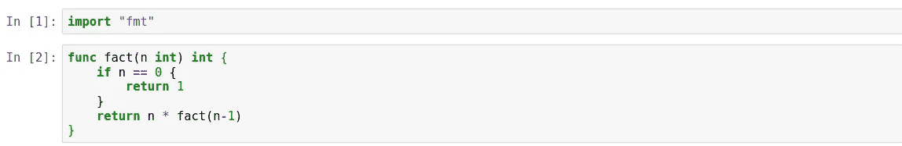

# 在 Jupyter 笔记本上运行 Golang

> 原文：<https://levelup.gitconnected.com/running-golang-on-jupyter-notebook-f7f9fba37812>

## 如何使用 Jupyter 笔记本快速记录您的围棋项目

如果你熟悉 Python，那么你应该已经遇到或使用过至少一次 Jupyter Notebook。Jupyter Notebook 是一个方便的工具，它允许你写迷你代码并跟踪它们是如何被执行的。它还可以帮助你记录、记录和与你的同事分享你的作品。难怪许多个人和大组织，比如网飞，优先考虑使用 Jupyter 笔记本来实现他们的发展目标。在这篇文章中，我想强调你如何在 Jupyter 笔记本中记录你的 Golang 项目。


由[凯利·西克玛](https://unsplash.com/@kellysikkema?utm_source=medium&utm_medium=referral)在 [Unsplash](https://unsplash.com?utm_source=medium&utm_medium=referral) 上拍摄的照片

**注意:**如果你使用的是 **Windows** 机器，你需要安装 Docker。请遵循此处的说明[。否则，如果您使用 Mac 或 Linux 机器，您可以使用上面的 docker 方法，或者按照我下面要写的本地安装过程。](https://docs.docker.com/get-docker/)

**目录:**

1.  装置
2.  跑步 Jupyter 笔记本
3.  编写一个简单的围棋程序

# 装置

安装过程可能看起来令人生畏，但我会尽量让它简单。如果您在设置时遇到任何困难，请在此处查阅 gophernote 故障排除常见问题[。](https://github.com/gopherdata/gophernotes#troubleshooting)

我将提供三种主要的安装方法，尽管我会推荐 ***方法，因为它是与操作系统无关的，这意味着这种方法可以在任何地方运行，不管你的操作系统是什么。***

## 1.(推荐)

一般的命令是:

```
$ docker run -it -p 8888:8888 -v /path/to/local/notebooks:/path/to/notebooks/in/docker gopherdata/gophernotes:latest-ds
```

*latest-ds* 标签告诉 docker 获取已经安装了流行数据科学库的 gophernotes 包的一个版本，比如 GoNum、GoLearn 和 GoDa。

您的机器中的一个示例可能是这样的:

```
$ docker run -it -p 8888:8888 -v /home/user/Documents/**notebook**:/**notebook** gopherdata/gophernotes:latest-ds
```

然后，您将获得一个本地主机 url，指向已装载的笔记本及其相应的令牌。将此复制并粘贴到您的浏览器中(例如 *localhost:8888/？token =<your _ given _ token>*


在 Docker 中成功安装笔记本后(图片来自作者)

此外，当在浏览器中初始化 docker 容器时，您将能够看到您指定的“**笔记本**”文件夹。


初始化 Docker 时指定的笔记本文件夹(图片来自作者)

> 如果您喜欢本地设置，请遵循以下说明。然而，这些只适用于 Linux 和 Mac。 Windows 机器目前不支持，必须使用上面的 Docker 方法。

## 2.Linux 操作系统

Linux 的本地安装可以通过在您的终端中编写以下命令来完成。

```
$ env GO111MODULE=on go get github.com/gopherdata/gophernotes$ mkdir -p ~/.local/share/jupyter/kernels/gophernotes$ cd ~/.local/share/jupyter/kernels/gophernotes$ cp "$(go env GOPATH)"/pkg/mod/github.com/gopherdata/gophernotes@v0.7.2/kernel/*  "."$ chmod +w ./kernel.json # in case copied kernel.json has no write permission$ sed "s|gophernotes|$(go env GOPATH)/bin/gophernotes|" < kernel.json.in > kernel.json
```

您可以通过运行以下命令来确认安装。成功的安装不会打印出任何错误信息。

```
$ "$(go env GOPATH)"/bin/gophernotes
```

您可以通过运行以下命令打开笔记本:

```
$ jupyter --data-dir
```

## 3.苹果个人计算机

类似地，Mac 的本地安装可以通过在您的终端中编写以下命令来完成。

```
$ env GO111MODULE=on go get github.com/gopherdata/gophernotes$ mkdir -p ~/Library/Jupyter/kernels/gophernotes$ cd ~/Library/Jupyter/kernels/gophernotes$ cp "$(go env GOPATH)"/pkg/mod/github.com/gopherdata/gophernotes@v0.7.2/kernel/*  "."$ chmod +w ./kernel.json # in case copied kernel.json has no write permission$ sed "s|gophernotes|$(go env GOPATH)/bin/gophernotes|" < kernel.json.in > kernel.json
```

同样，您可以通过运行以下命令来确认本地安装是否成功，而不会看到任何错误消息。

```
$ "$(go env GOPATH)"/bin/gophernotes
```

您可以通过运行以下命令打开笔记本:

```
$ jupyter --data-dir
```

唷，那真是太多了。现在开始更有趣的部分！

# 跑步 Jupyter 笔记本

现在您已经设置了 Gophernotes，导航到您想要存储 Golang 笔记本的文件夹。让我们创建我们的第一个笔记本！

在右上角，您将能够看到新按钮。单击它并选择“Go”作为您的内核选择。


在 Jupyter 中创建您的第一个 Go 笔记本(图片来自作者)

一旦完成，你会看到一个熟悉的空白 Jupyter 笔记本。现在第一件事是把标题改成“我的第一个 Golang 笔记本”(或者你选择的任何标题，如下所示。


更改笔记本标题(图片来自作者)

不错！让我们给新创建的 Golang 笔记本写一些简单的程序吧！

# 写一个简单的程序:递归阶乘

大多数人在初始化 Golang 程序时做的第一件事就是导入必要的包！既然程序很简单，那就让**导入**fmt 包。


在 Go 的笔记本中导入包(图片来自作者)

现在，让我们创建递归阶乘函数。一个数的阶乘 *n* ，是所有小于等于 n 的正整数的乘积，例如，值 3！(即。3 阶乘)是 3 x 2 x 1 = 6。

您可以在 Jupyter 笔记本的一个单元格中编写一个函数，如下所示。



Go 中的递归阶乘函数(图片来自作者)

不错！现在唯一剩下的就是运行程序了。您可以简单地打印出如下值。


调用递归阶乘函数并打印出来(图片来自作者)

# 奖金

Jupyter notebook 的强大之处在于它能够在不弄乱代码库的情况下进行注释或评论。您可以通过将单元格类型更改为 markdown(即选择一个单元格并按 ctrl-M 键，然后相应地键入注释。


评论和注释您的代码库(图片来自作者)

# 结论

就是这样！现在，您可以构建 Golang 应用程序的原型，并使用 Jupyter Notebook 跟踪它。您可以将此笔记本与您的朋友或同行共享，用于文档目的(或者，如果您想指导新开发人员按照您自己编写代码时所采取的逻辑步骤)。

***做订阅我的邮件简讯:***[*【https://tinyurl.com/2npw2fnz】*](https://tinyurl.com/2npw2fnz)****在这里我定期用通俗易懂的语言和漂亮的可视化总结 AI 研究论文。****

# *参考*

*[1][https://github.com/gopherdata/gophernotes](https://github.com/gopherdata/gophernotes)*