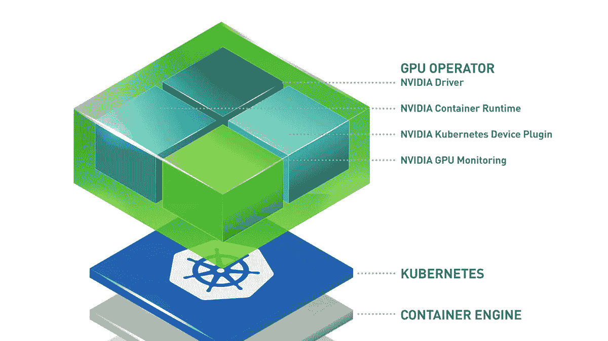
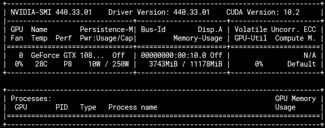
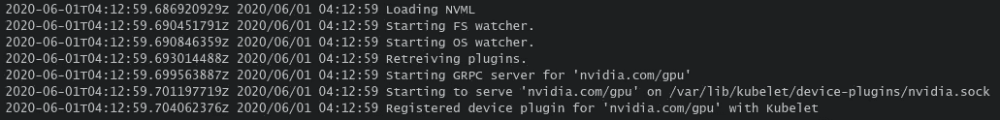

# 在 Kubernetes 集群中运行支持 GPU 的容器

> 原文：<https://levelup.gitconnected.com/running-gpu-enabled-containers-in-kubernetes-cluster-f0a3d87a450c>

> 使用 NVIDIA 设备插件访问 GPU 资源。



资料来源:nvidia.com

在本例中，我们基于以下环境设置 GPU 集群:

*   库伯内特 1.17，码头 19.03
*   CUDA 10.2
*   NVIDIA 驱动 440，GPU GTX 1080Ti
*   CentOS 7

## 先决条件

在你开始之前，确保 NVIDIA 驱动程序已经安装在你的机器上。请按照我以前的博客安装 NVIDIA CUDA 驱动程序和工具包。

[](https://medium.com/@poom.wettayakorn/setting-up-nvidia-container-for-using-cuda-on-centos-7-db9d53c823e8) [## 设置 NVIDIA 容器以便在 CentOS 7 上使用 CUDA 10

### 用于启用 nvidia docker 选项的安装脚本

medium.com](https://medium.com/@poom.wettayakorn/setting-up-nvidia-container-for-using-cuda-on-centos-7-db9d53c823e8) 

验证您是否启用了 nvidia 的[**-docker**](https://github.com/NVIDIA/nvidia-docker)。

```
# run docker with gpu options
docker run --gpus all nvidia/cuda:10.0-base nvidia-smi
```



**NVIDIA 容器运行时**

通过在`/etc/docker/daemon.json`编辑文件，将 nvidia 设置为 docker 默认运行时

## Kubernetes 的 NVIDIA 设备插件

[NVIDIA 设备插件](https://github.com/NVIDIA/k8s-device-plugin)允许 Pods 访问你机器中的 GPU。

```
kubectl create -f [https://raw.githubusercontent.com/NVIDIA/k8s-device-plugin/1.0.0-beta6/nvidia-device-plugin.yml](https://raw.githubusercontent.com/NVIDIA/k8s-device-plugin/1.0.0-beta6/nvidia-device-plugin.yml)
```

来自**NVIDIA-device-plugin-daemon set pod**的以下日志显示成功注册的 gpu 设备插件。Kubernetes 将把 nvidia.com/gpu 作为一个可调度的资源公开。



现在你可以运行资源名为 nvidia.com/gpu:的 gpu 容器

*注意，GPU 只应在 resources.limits* 中指定。

## 参考

*   [https://github.com/NVIDIA/nvidia-docker](https://github.com/NVIDIA/nvidia-docker)
*   [https://github.com/NVIDIA/k8s-device-plugin](https://github.com/NVIDIA/k8s-device-plugin)
*   【https://github.com/NVIDIA/nvidia-container-runtime】
*   [https://kubernetes . io/docs/tasks/manage-GPU/scheduling-GPU/](https://kubernetes.io/docs/tasks/manage-gpus/scheduling-gpus/)

[](https://skilled.dev) [## 编写面试问题

### 一个完整的平台，在这里我会教你找到下一份工作所需的一切，以及…

技术开发](https://skilled.dev)