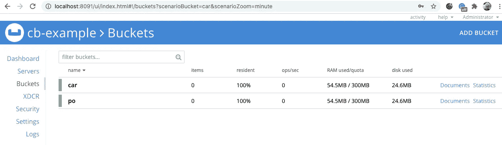
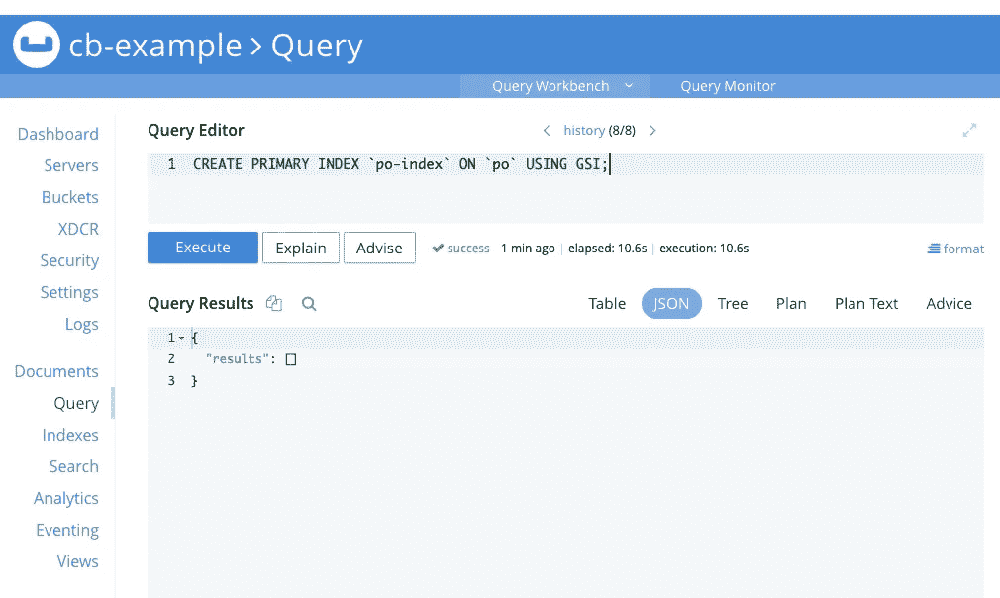
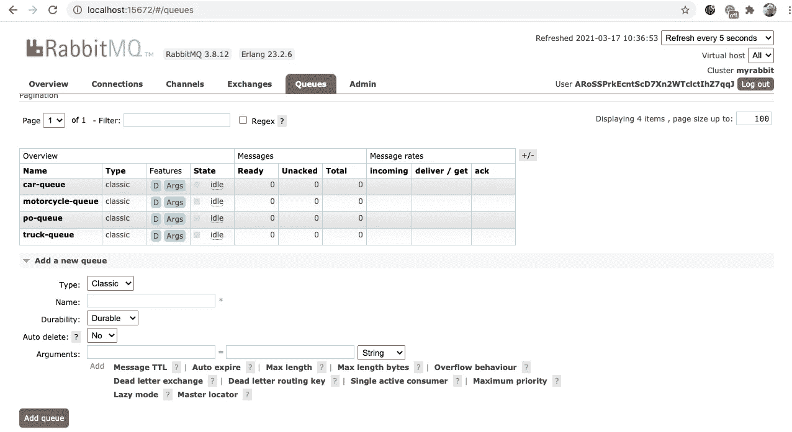
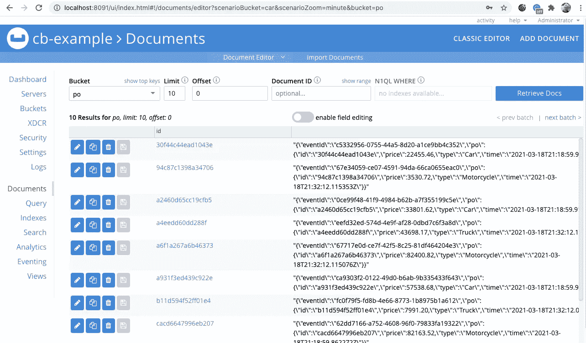
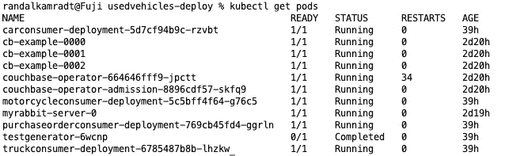

# 在 Kubernetes 中运行 Java 微服务

> 原文：<https://levelup.gitconnected.com/running-java-microservices-in-kubernetes-57a7a05e85ac>

## 微服务与 RabbitMQ 和 Couchbase 捆绑在一起


来自 [Pixabay](https://pixabay.com/?utm_source=link-attribution&utm_medium=referral&utm_campaign=image&utm_content=5307880) 的[泰瑞·扎克雷塞克](https://pixabay.com/users/tazbird3-7035302/?utm_source=link-attribution&utm_medium=referral&utm_campaign=image&utm_content=5307880)的图片

在我的上一篇文章[Docker](/java-configuration-for-docker-779392774caa)的 Java 配置中，我采用了一组微服务，从中制作了 Docker 映像，并使用 Docker Compose 对其进行了测试。现在，我将通过将所有这些迁移到 Kubernetes，使其更接近生产就绪状态。Kubernetes 将为我提供编排方面的功能，以便根据需要扩展和缩小我的系统，还可能提供工业级监控。

但首先我应该做些决定。这些服务依赖于 RabbitMQ 和 Couchbase。这些组件应该运行在 Kubernetes 内部还是外部？每种方式都有利弊，我可以写一整篇文章，但是我决定在 Kubernetes 中运行它们，这篇文章更多的是关于在 Kubernetes 中运行，而不是独立运行它们的复杂性和无限可能性。如果我在生产环境中实现它，我会强烈考虑独立运行它们。

## 在 Kubernetes 安装沙发底座

为了在 Kubernetes 环境中安装 Couchbase，我使用了这些[指令](https://docs.couchbase.com/operator/current/install-kubernetes.html)，但是我将在这里对它们进行总结。首先，下载说明中的 zip 文件，解压它们，然后`cd`到解压后的目录。在我的例子中，我使用 Docker Desktop 附带的 Kubernetes，所以我在 Mac 上解包它们，在那里我将运行其余的命令。

为了简洁起见，我将所有内容都放在默认的名称空间中。在更大的环境中，您可能希望为不同的应用程序集或不同的测试/生产环境创建名称空间。使用默认名称空间，下面是获取基本集群定义的命令:

```
kubectl create -f crd.yaml
bin/cbopcfg generate admission | kubectl create -f -
bin/cbopcfg generate operator | kubectl create -f -
```

为了创建集群，目录中有一个名为`couchbase-cluster.yaml`的文件，其中包含创建集群的定义。它创建了一个名为 default 的桶，但是我们需要两个桶`po`和`car`。您还应该更改 base64 编码的用户名和密码。一旦您编辑了它以生成两个桶并更改了用户名/密码的值，您可以像这样运行它:

```
kubectl create -f couchbase-cluster.yaml
```

要检查您的服务是否启动并运行，您可以通过端口转发管理控制台端口来使用管理控制台:

```
kubectl port-forward cb-example-0000 8091
```

使用您选择的用户名/密码(或管理员/密码，如果您没有在`couchbase-cluster.yaml`中更改它们)登录到 [http://localhost:8091](http://localhost:8091) ，您应该会看到熟悉的管理员屏幕。



集群名称现在是`cb-example`，但是这不应该影响我们的程序。

为了能够查询一个表上的所有内容，您需要设置一个主索引。转到查询选项卡，您可以输入以下命令:

```
CREATE PRIMARY INDEX `po-index` ON `po` USING GSI;
```



## 将 RabbitMQ 部署到 Kubernetes

RabbitMQ 在他们的 GitHub 站点上有一个操作符定义，在我们的本地集群中创建很简单:

```
kubectl apply -f \
      "https://github.com/rabbitmq/cluster-operator/releases/latest/download/cluster-operator.yml"
```

这创建了一个新的名称空间`rabbitmq-system`，您可以看到它是这样运行的:

```
kubectl get all -n rabbitmq-system
```

现在我们可以启动一个集群:

```
kubectl create -f - <<EOF
apiVersion: rabbitmq.com/v1beta1
kind: RabbitmqCluster
metadata:
    name: myrabbit
EOF
```

这将创建一个名为`myrabbit`的集群。创建集群的一部分是随机创建用户名和密码。您可以使用以下命令找到它们:

```
kubectl get secret myrabbit-default-user \
           -o jsonpath='{.data.username}' | base64 --decode
kubectl get secret myrabbit-default-user \
           -o jsonpath='{.data.password}' | base64 --decode
```

现在您可以启动控制台了:

```
kubectl port-forward "service/myrabbit" 15672
```

然后，您可以使用上面发现的用户名/密码浏览到 [http://localhost:15672](http://localhost:15672) ，并看到熟悉的管理屏幕:



我已经添加了我上一篇文章中描述的`po-queue`、`car-queue`、`truck-queue`和`motorcycle-queue`。现在 Couchbase 和 RabbitMQ 已经准备好处理来自我们服务的请求了。作为额外的奖励，我们需要的 Kubernetes 秘密已经被定义为`cb-example-auth`和`myrabbit-default-user`

## 部署服务

我不会用大量的定义文件将我的源存储库弄得乱七八糟，我会为此创建一个新的存储库。我的新存储库只能访问容器存储库(DockerHub)中构建和存储的图像。但是我必须做一个小小的改变，模块`TestGenerator`没有创建图像，但是我希望能够运行它作为一项工作来测试整个事情。所以我要把`testgenerator`目录下`pom.xml`的`<build>`段拿出来。`<build>`部分唯一做的事情是指示`jib`插件不要创建图像。现在，在转移到新的存储库之前，最后一次运行`mvn clean package jib:build`。

在旧目录之外创建一个名为`usedvehicles-deploy`的新目录，并对其进行`cd`操作。运行`git init`在上面创建一个 Git 存储库。复制一个`License`，创建一个`README.md`，以及您添加到存储库中的所有常用管理文件。

首先，让我们为采购订单消费者创建一个描述符，因为它是系统的入口点。它还需要 Couchbase 和 RabbitMQ 的凭证和参数。创建一个文件调用`purchaseorderconsumer.yaml`，并添加以下内容:

```
apiVersion: apps/v1
kind: Deployment
metadata:
  name: purchaseorderconsumer-deployment
  labels:
    app: purchaseorderconsumer
spec:
  selector:
    matchLabels:
      app: purchaseorderconsumer
  template:
    metadata:
      labels:
        app: purchaseorderconsumer
    spec:
      containers:
      - name: purchaseorderconsumer
        image: rlkamradt/purchaseorderconsumer:1.0-SNAPSHOT
        env:
          - name: DATABASE_USER_NAME
            valueFrom:
              secretKeyRef:
                name: cb-example-auth
                key: username
          - name: DATABASE_PASSWORD
            valueFrom:
              secretKeyRef:
                name: cb-example-auth
                key: password
          - name: QUEUE_USER_NAME
            valueFrom:
              secretKeyRef:
                name: myrabbit-default-user
                key: username
          - name: QUEUE_PASSWORD
            valueFrom:
              secretKeyRef:
                name: myrabbit-default-user
                key: password
          - name: DATABASE_HOST_NAME
            value: cb-example-srv
          - name: QUEUE_HOST_NAME
            value: myrabbit
```

请注意，这只是一个部署，而不是服务，因为它没有端点。它直接从 RabbitMQ 获取输入。我还对主机名环境变量进行了硬编码。如果有很多配置，我会制作一个 ConfigMap 并在定义中使用它们。您可以使用命令`kubectl create -f purchaseorderconsumer`启动它，然后您应该能够使用`kubectl get pods`找到 pod。一旦您有了 pod 名称(应该是`purchaseorderconsumer-xxxx-xxxxxxx`，这里的‘x’是随机字符)，您就可以看到带有`kubectl logs <pod-name>`的日志。它应该只显示日志系统正在启动，因为我们不应该有任何输入。

接下来，我们开始测试。我喜欢尽早经常测试。因此，我将为测试生成器服务创建一个描述文件。它只是一个“作业”类型，因为它打算运行一次，然后离开。到目前为止，我还没有成功地让它消失，我总是不得不在跑步后删除它。但是那是另一天的问题。创建一个名为`testgenerator.yaml` 的文件，并添加以下内容:

```
apiVersion: batch/v1
kind: Job
metadata:
  name: testgenerator
spec:
  ttlSecondsAfterFinished: 100
  template:
    spec:
      containers:
      - name: testgenerator
        image: rlkamradt/testgenerator:1.0-SNAPSHOT
        env:
          - name: QUEUE_USER_NAME
            valueFrom:
              secretKeyRef:
                name: myrabbit-default-user
                key: username
          - name: QUEUE_PASSWORD
            valueFrom:
              secretKeyRef:
                name: myrabbit-default-user
                key: password
          - name: QUEUE_HOST_NAME
            value: myrabbit
      restartPolicy: Never
```

它只需要访问 RabbitMQ。这不是一个真正的测试，因为它没有做出任何事情进展顺利的断言，它只是一种将数据输入系统的方法。可以从`kubectl create -f testgenerator.yaml`开始。这应该会导致它在队列中放入大约 12 个项目，并且采购订单消费者应该已经拾取了它，在`po`数据库中创建了采购订单，并将其发送到其他队列之一。您可以使用`kubectl log <purchaseorderconsumerpodname>`和您从上面记住的 pod 名称来检查这一点。您应该会看到一堆采购订单日志语句。您也可以像上面一样通过暴露端口在数据库中看到它们

```
kubectl port-forward cb-example-0000 8091
```

现在可以浏览到 [http://localhost:8091/](http://localhost:8091/) 。选择 Documents 选项卡，选择`po`存储区，您应该会看到如下内容:



如果你看到了所有的数据，喝杯咖啡，庆祝你的成功吧！如果没有，就该开始故障排除了，不过那是另一篇文章了。

现在我们可以部署另外三个消费者了，`car`、`truck`和`motorcycle`。它们只是`purchaseorderconsumer.yaml`的复制品，但是叫做`carconsumer.yaml`、`truckconsumer.yaml`和`motorcycleconsumer.yaml`。您可以编辑每一项，只需将“采购订单”分别替换为“汽车”、“卡车”和“摩托车”。然后用通常的`kubectl create -f <individual yaml files>`启动它们。运行`kubectl get pods`，您应该会看到:



检查每个 pod 的日志，以确保一切都在顺利进行。对我来说，第一次似乎一切都很顺利，希望你也能获得同样的成功。我有点担心`couchbase-operator`似乎已经重启了 34 次，但现在还不足以调查。小心选择你的战斗！

下一步是创建一个 REST 服务，将新的采购订单放入系统，并公开数据库中的数据。我希望你和我一样喜欢让这些服务一起运行和运行。我想我在这方面有点奇怪，我喜欢看到我的小玩具工作时，日志在屏幕上滚动。

本文的 GitHub 资源库:

[](https://github.com/rkamradt/usedvehicles-deploy/tree/v0.1) [## rkamradt/used vehicles-部署

### 二手车服务的部署脚本。为 rkamradt/used vehicles-部署开发做出贡献，方法是创建…

github.com](https://github.com/rkamradt/usedvehicles-deploy/tree/v0.1) [](https://github.com/rkamradt/usedvehicles/tree/v0.8) [## rkamradt/二手车辆

### Permalink 无法加载最新的提交信息。整个第一阶段使用电抗组件的微服务系统示例…

github.com](https://github.com/rkamradt/usedvehicles/tree/v0.8) 

提到的其他文章:

[](/how-to-move-from-monolith-to-microservices-74f2f996964b) [## 如何从整体服务转向微服务

### 分解岩石。

levelup.gitconnected.com](/how-to-move-from-monolith-to-microservices-74f2f996964b) [](/java-configuration-for-docker-779392774caa) [## Docker 的 Java 配置

### 环境变量是如何胜出的

levelup.gitconnected.com](/java-configuration-for-docker-779392774caa)