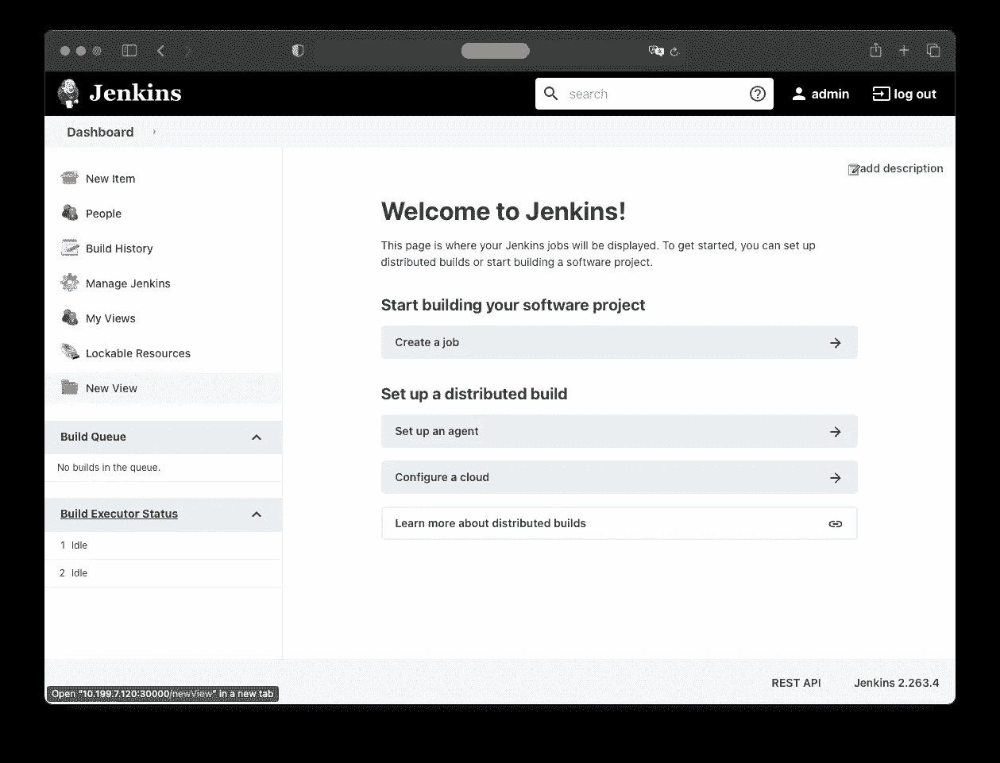
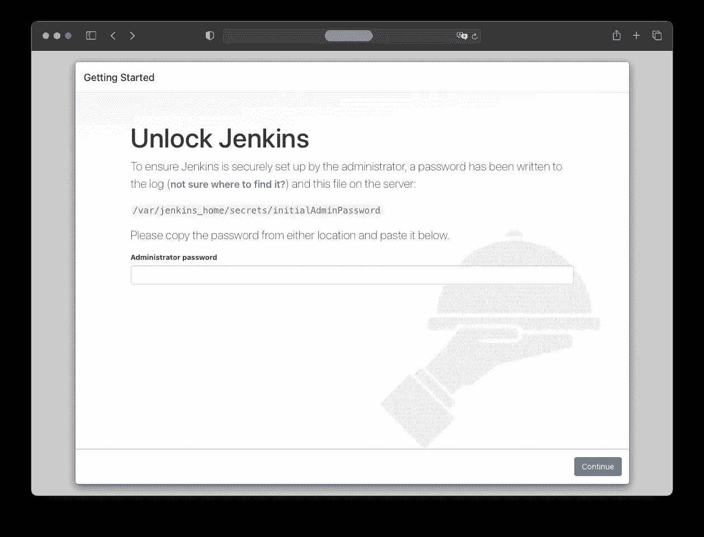
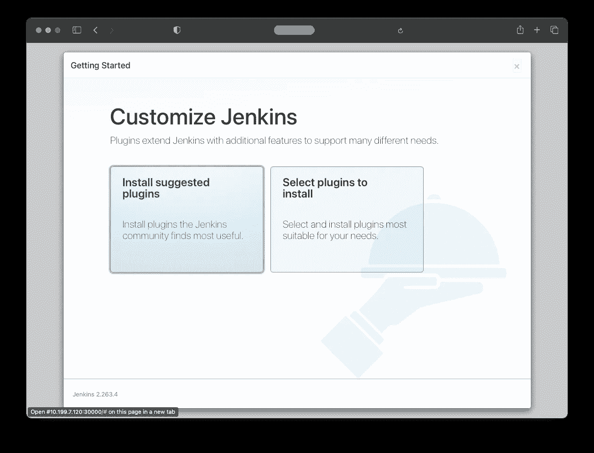
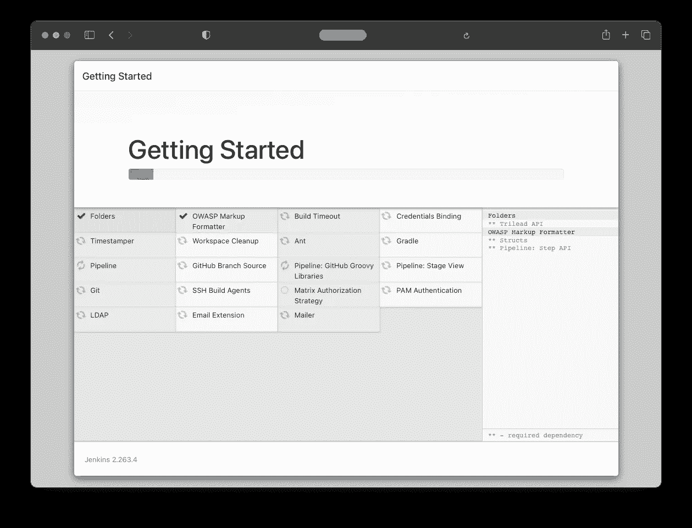
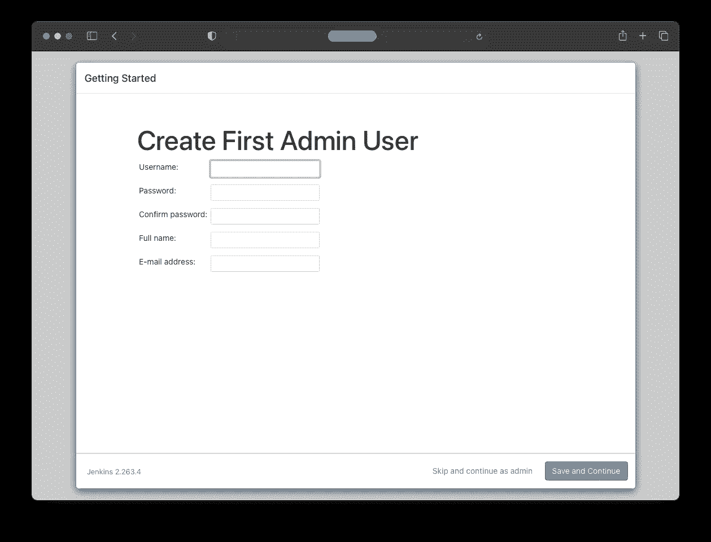
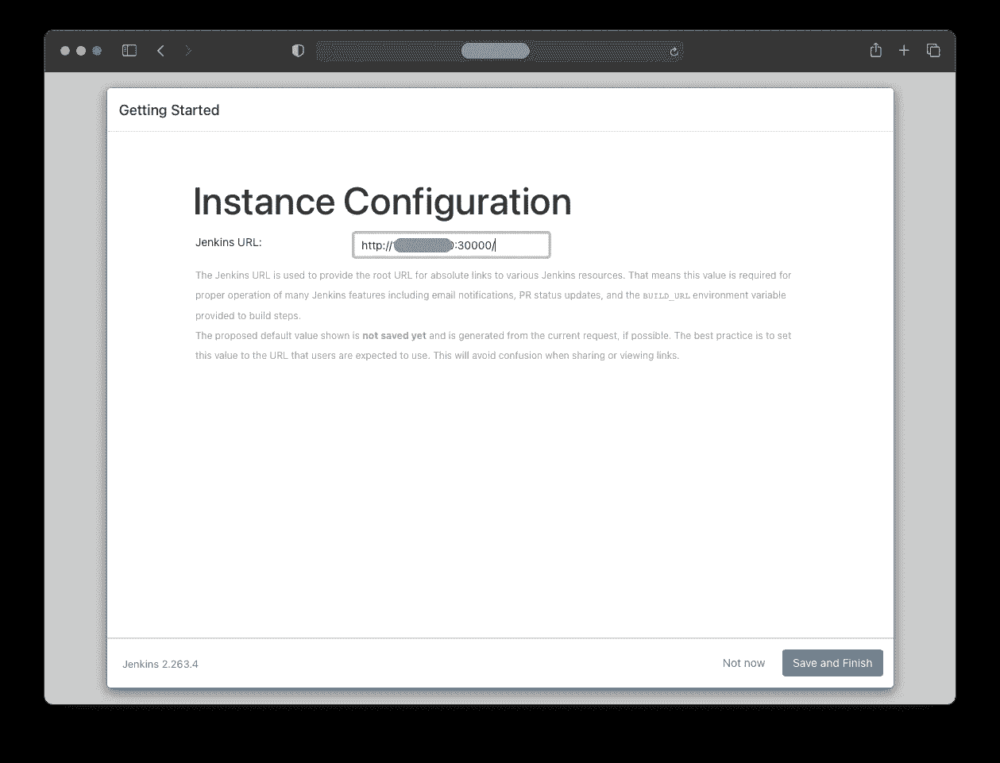
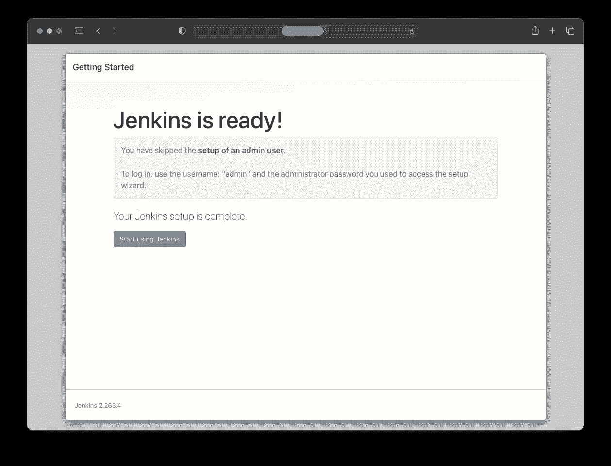

# 在 Kubernetes 集群中运行 Jenkins

> 原文：<https://levelup.gitconnected.com/running-jenkins-inside-a-kubernetes-cluster-bd86822d487>



这篇文章是关于如何在 Kubernetes 上设置一个 Jenkins 实例的教程。

还有一个以前的教程是关于[如何用 K3s](https://twissmueller.medium.com/setup-your-own-kubernetes-cluster-with-k3s-take-2-k3sup-a5d9453f709f) 设置 Kubernetes 集群。

## 詹金斯装置

作为第一步，创建一个名称空间。所有与 Jenkins 相关的资源都将应用于此:

```
kubectl create namespace jenkins
```

在名为`jenkins-pvc.yaml`的文件中还需要一个持久卷声明:

```
kind: PersistentVolumeClaim
apiVersion: v1
metadata:
  name: jenkins-claim
  namespace: jenkins
spec:
  storageClassName: local-path
  accessModes:
    - ReadWriteOnce
  resources:
    requests:
      storage: 1Gi
```

这适用于:

```
kubectl create -f jenkins-pvc.yaml -n jenkins
```

必须将部署添加到文件`jenkins-deployment.yaml`中:

```
apiVersion: apps/v1
kind: Deployment
metadata:
  name: jenkins-deployment
spec:
  replicas: 1
  selector:
    matchLabels:
      app: jenkins
  template:
    metadata:
      labels:
        app: jenkins
    spec:
      containers:
      - name: jenkins
        image: jenkins/jenkins:lts
        ports:
          - name: http-port
            containerPort: 8080
          - name: jnlp-port
            containerPort: 50000
        volumeMounts:
          - name: jenkins-vol
            mountPath: /var/jenkins_vol
      volumes:
        - name: jenkins-vol
          persistentVolumeClaim:
            claimName: jenkins-claim
```

部署应用于:

```
kubectl create -f jenkins-deployment.yaml -n jenkins
```

现在，应该有一个 pod 运行 Jenkins 实例。这可以通过以下方式进行检查:

```
kubectl get pods -n jenkins
```

在文件`jenkins-service.yaml`中，将添加两个服务，一个用于詹金斯实例本身，另一个用于代理节点所需的 JNLP:

```
apiVersion: v1
kind: Service
metadata:
  name: jenkins
spec:
  type: NodePort
  ports:
    - port: 8080
      targetPort: 8080
      nodePort: 30000
  selector:
    app: jenkins

---

apiVersion: v1
kind: Service
metadata:
  name: jenkins-jnlp
spec:
  type: ClusterIP
  ports:
    - port: 50000
      targetPort: 50000
  selector:
    app: jenkins
```

这两种服务都适用于:

```
kubectl create -f jenkins-service.yaml --namespace jenkins
```

这是为了检查是否一切正常:

```
kubectl get services --namespace jenkins
```

要访问 Jenkins 实例，需要节点的 IP 和节点端口服务的端口号。节点的 IP 地址是:

```
kubectl get nodes -o wide
```

然后，要获得节点端口服务的端口:

```
kubectl get svc -n jenkins
```

最后，运行 Jenkins 实例:



## 詹金斯构型

现在，实例已经启动并运行，它需要运行一些配置步骤。

为了开始，需要检索初始密码。可以在 pod 的日志中找到。

pod 的名称可以通过以下方式确定:

```
kubectl get pods -n jenkins
```

然后，要访问日志，需要执行以下命令:

```
kubectl logs -n jenkins <jenkins-pod-name>
```

需要将日志中显示的密码复制到浏览器中，以便继续点击“继续”按钮。



在下一步中，需要通过点击“安装建议的插件”来安装一些插件。



所有建议的插件都会自动安装。



要继续使用初始密码作为管理员，需要按下“跳过并继续作为管理员”按钮。



詹金斯提供了完整的詹金斯网址。出于隐私的原因，我已经删除了 IP 地址。

请注意，这不是一条安全的路线，但对本教程来说已经足够了。如果这应该是一个永久的 Jenkins 实例，当然管理员密码必须尽快更改。



按下“开始使用 Jenkins”后，初始配置完成。


## 最后一个音符

如果要重新开始，可以通过删除名称空间来删除所有内容:

```
kubectl delete all --all -n jenkins
```

下一篇文章将介绍利用 Kubernetes 通过在集群中运行构建任务来扩展构建任务所需的所有步骤。

[](https://itnext.io/scaling-jenkins-build-agents-with-kubernetes-pods-8c89f87ba0d3) [## 用 Kubernetes Pods 扩展 Jenkins 构建代理

### 关于跨 Kubernetes 集群扩展 Jenkins 构建作业的教程。

itnext.io](https://itnext.io/scaling-jenkins-build-agents-with-kubernetes-pods-8c89f87ba0d3) 

感谢阅读！喜欢吗？ [**给我买杯咖啡！**](https://www.buymeacoffee.com/twissmueller)

## 资源

*   [如何在 Kubernetes 上安装 Jenkins](https://www.digitalocean.com/community/tutorials/how-to-install-jenkins-on-kubernetes)