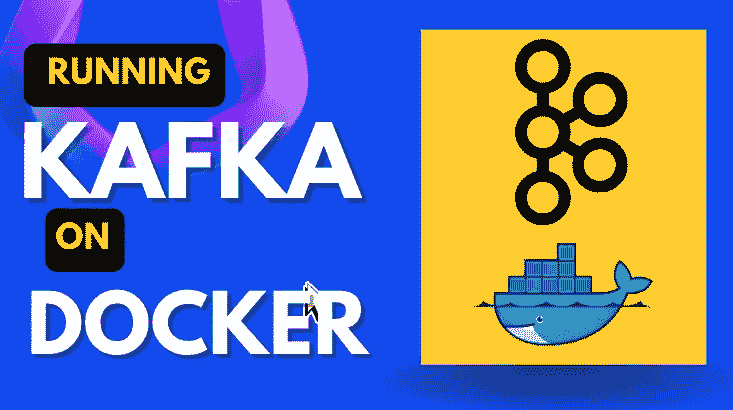
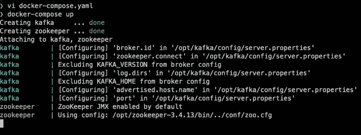
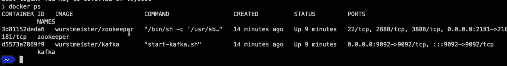
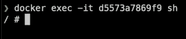
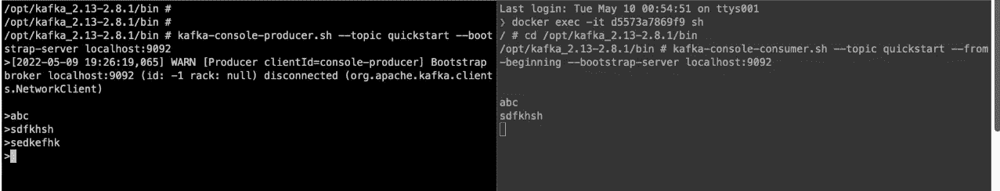

# 在 Docker 容器上运行 Kafka

> 原文：<https://levelup.gitconnected.com/running-kafka-on-docker-container-1a15b8d0b77c>



Kafka 是一个分布式提交日志。*我在之前的文章中已经讨论过卡夫卡:*[*https://level up . git connected . com/Apache-Kafka-architecture-and-how-it-work-54 e 99 f 72 B9 be*](/apache-kafka-architecture-and-how-does-it-work-54e99f72b9be)

在本文中，我们将**在 docker 容器**上部署 Kafka。这将是一个快速入门卡夫卡的方法。

*如果你更喜欢视频而不是文字，你可以在 Youtube 上找到相同的视频:*[***https://www.youtube.com/watch?v=Xo21T7fdykg***](https://www.youtube.com/watch?v=Xo21T7fdykg)

所以为了在 Docker 容器上安装 Kafka，我们需要两样东西:我们需要一个 zookeeper 的实例和一个 Kafka 的实例。因此，我们将创建一个 *docker-compose.yaml* 文件，我们将有两个服务，一个是 zookeeper 服务，另一个是 Kafka 服务。卡夫卡使用 zookeeper 来恢复关于各个分区和每个分区的领导者的信息。所以让我们来看看 docker-compose 文件:

```
version: '3'

services:
  zookeeper:
    image: wurstmeister/zookeeper
    container_name: zookeeper
    ports:
      - "2181:2181"
  kafka:
    image: wurstmeister/kafka
    container_name: kafka
    ports:
      - "9092:9092"
    environment:
      KAFKA_ADVERTISED_HOST_NAME: localhost
      KAFKA_ZOOKEEPER_CONNECT: zookeeper:2181
```

一旦我们创建了 docker-compose 文件，我们就可以使用以下命令来执行它:

```
docker-compose up
```



一旦我们的 docker-compose 成功执行，我们将打开一个新的终端并查看 docker 容器的状态。我们将执行 *docker ps* 命令，这将给出我们机器上运行的所有 doctor 容器的列表。如果我们看一下 docker ps 的内容，我们会看到我们有两个服务:zookeeper 服务和 Kafka 服务。



现在让我们继续前进，在我们的 Kafka 容器中执行一些命令。为此，我们将获取 Kafka 容器的容器 ID，并运行以下命令:

```
docker exec -it <kafka_conatiner_id> sh
```



现在我们在 Docker 容器中。我们将移动到所有主管所在的文件夹。

```
cd /opt/kafka_<version>/bin
```

首先，我们将使用以下命令创建一个 Kafka 主题:

```
kafka-topics.sh --create --zookeeper zookeeper:2181 --replication-factor 1 --partitions 1 --topic quickstart
```

一旦我们创建了 Kafka 主题，我们将获得特定主题的发布者和订阅者。为了创建 Kafka 的生产者，我们将使用 Kaka 控制台生产者。因此，我们将运行以下命令来创建一个 Kafka 生成器。

```
kafka-console-producer.sh --topic quickstart --bootstrap-server localhost:9092
```

一旦我们创造了一个卡夫卡生产者，现在是时候转向创造一个卡夫卡消费者了。我们将运行 Kafka 控制台消费程序来消费消息。为了运行 Kafka consumer 的实例，我们将运行以下命令。 ***我们将运行 Kafka 控制台，在 docker 容器内消费一个，因此我们将再次在 docker 容器内移动*** 并执行以下命令:

```
kafka-console-consumer.sh --topic quickstart --from-beginning --bootstrap-server localhost:9092
```

一旦完成这些，我们的设置就完全准备好了。现在，如果我们在运行 Kafka producer 实例的终端上编写一些消息，这些消息将被运行在另一个终端上的 Kafka 控制台消费者实例使用。所以信息流是这样的，生产者将他的信息推送到一个卡夫卡主题，消费者从终端消费这些信息。

