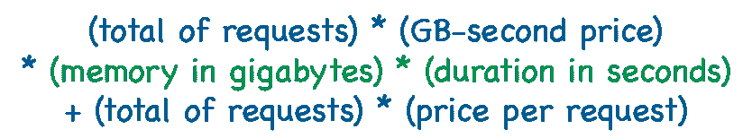
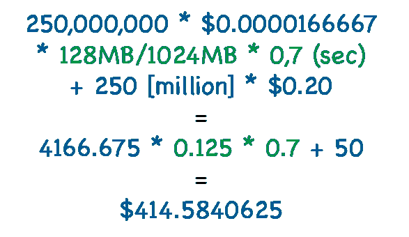
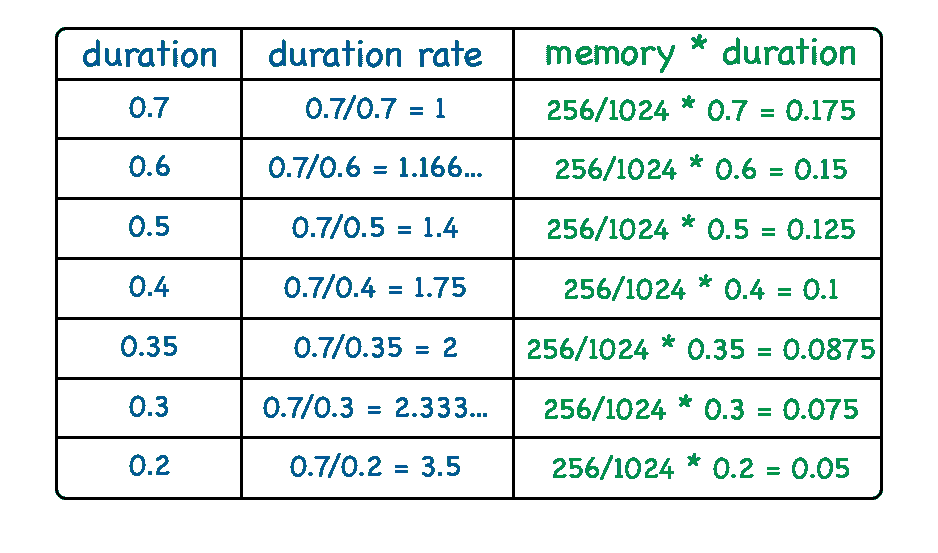
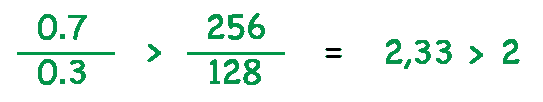
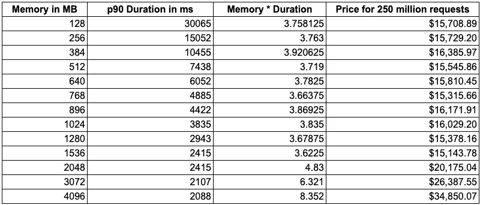

# 运行 Lambda 函数更快更便宜

> 原文：<https://levelup.gitconnected.com/running-lambda-functions-faster-and-cheaper-416260fbc375>

简单的配置如何让您的功能更快、更便宜


> *免责声明:我不代表亚马逊发言。观点是我自己的。*

那么，你是在告诉我，我可以更快地运行 lambda 中的代码，并且这样做花费更少吗？**是的，我是！**

你能告诉我怎么做吗？**是的，我会的！**

首先，让我们从两个要点背后的基本原理开始:

**1-Lambda 函数如何分配 CPU**

虽然 CPU 在 Lambda 上并不是显式配置，但它是基于另一个重要配置来确定的:**内存**。

根据 AWS 文件[*【ref】*](https://aws.amazon.com/lambda/faqs):

> 问:如何将计算资源分配给 AWS Lambda 功能？
> 
> 在 AWS Lambda 资源模型中，您为自己的函数选择所需的内存量，并按比例分配 CPU 能力和其他资源。例如，选择 256MB 内存分配给 Lambda 函数的 CPU 能力大约是请求 128MB 内存的两倍，是选择 512MB 内存的一半。要了解更多信息，请参见我们的[功能配置文档](https://docs.aws.amazon.com/lambda/latest/dg/resource-model.html)。

**2-Lambda 函数如何计费**

在这篇文章发表时，不考虑免费层，lambda 是通过计算收费的



我们可以注意到，*每个请求的价格*是一个不依赖于内存和持续时间的变量，因此，不能通过微调 lambda 配置来降低。

另一方面，第一个参数基于内存和持续时间。由于 *GB 秒价格*是由 AWS 定义的常数，而*请求总数*取决于服务的架构和负载，我们有一个定价公式，可以用来降低最终价格，即:


最后，我们想要最小化*(以千兆字节为单位的内存)*(以秒为单位的持续时间)*的结果，以便通过执行 lambda 函数来支付更便宜的费用。

但是，在一个场景中，我们已经有一个运行中的 lambda 函数，代码已经过优化，持续时间减少并不简单，我们如何才能将它最小化呢？让我们检查一下！

# 王牌:通过增加内存和 CPU 来最小化 lambda 的持续时间和价格

因此，为了更好地解释逻辑，让我们设置几个参数。

x86 架构的当前千兆位秒价格为每千兆位秒 0.0000166667 美元，请求价格为每 1M 请求 0.20 美元[*【ref】*](https://aws.amazon.com/lambda/pricing)。

在我们假设的场景中，我们有一个在 128MB 的 lambda 中运行的代码，平均持续时间为 700 毫秒。此外，这段代码每月运行 2.5 亿次请求。

因此，在这种情况下，定价将是:



如前所述，王牌是最小化


在这种情况下是 0.125 * 0.7 = 0.0875。

例如，如果我们将 0.0875 的 10%最小化为 0.07875，那么最终价格将从 414.58 美元降低到 378.12 美元。

考虑到代码持续时间的一个方面是内存和 CPU 的可用容量，因此，增加 Lambda 中的内存可以大大减少执行持续时间。

要点是:增加内存也会增加该等式中两个乘数之一，因此，第二个等式，即持续时间，必须以比内存增加更高的速率减少，以便进行有价值的权衡。

在上面的例子中，如果我们将内存增加到 256MB (2x 128MB ),那么如果持续时间减少到一半以下，这是值得的。



在表中，我们可以注意到内存翻倍(从 128MB 到 256MB)将持续时间减少了一半(从 0.7 到 0.35)，因此最终结果是相同的。

我们的主要目标是以高于记忆增长的速度减少我们的持续时间


下面我们可以看到这个公式是如何应用的，并显示当持续时间从 700 毫秒减少到 300 毫秒时，将内存从 128MB 增加到 256MB 是值得的



# 在实践中为我的应用找到正确的内存配置

找到正确配置的主要目标是检测内存增加不适用于上述公式的阈值。

在某个时刻，增加记忆并不会减少持续时间，这时你应该停下来。

下图显示了常见的模式。该曲线可能因应用程序、语言、I/O 限制或 CPU 限制以及其他因素而异。


我对不同的内存配置(128MB、256MB、384MB、512MB、640MB、768MB、896MB、1024MB、1280MB、1536MB、2048MB、3072MB、4096MB)执行了 100 倍以下的代码，并计算了*内存*持续时间*值和 2.5 亿个请求的最终价格。

```
def lambda_handler(event, context):
    for i in range(0, 300):
        for j in range(0, 300):
            for k in range(0, 300):
                sum_of_indexes = i + j + k
```



正如我们所看到的，对于这段代码，更便宜的配置是 1536MB，在 p90 中运行 2415ms，总价为 15，143.78 美元，执行 2.5 亿次。

128MB 的相同代码运行速度会慢 12 倍以上(30065 毫秒)，成本会高出近 4%(15，708.80 美元)。

# 逐步地

基本上，配置 lambda 函数内存需要做的是运行代码 N 次(10~30 次可能就足够了),以获得每种可能的内存配置的平均持续时间，直到您注意到*内存*持续时间*增加太多。然后，您应该选择在价格和持续时间之间具有最佳平衡的内存配置。

# 结论

了解您用来运营和收费的工具和服务的详细信息非常重要，以便能够以最佳方式进行配置。

有时候，我们认为使用更多的资源意味着付出更多，但事实并非总是如此。当我们谈到云计算的时候，一个资源不仅仅是用硬件/容量来衡量，还要用**时间**来衡量。