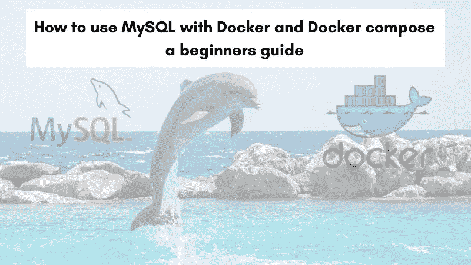
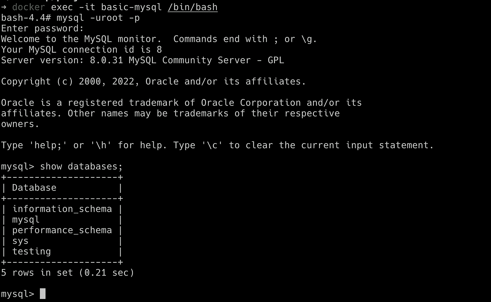
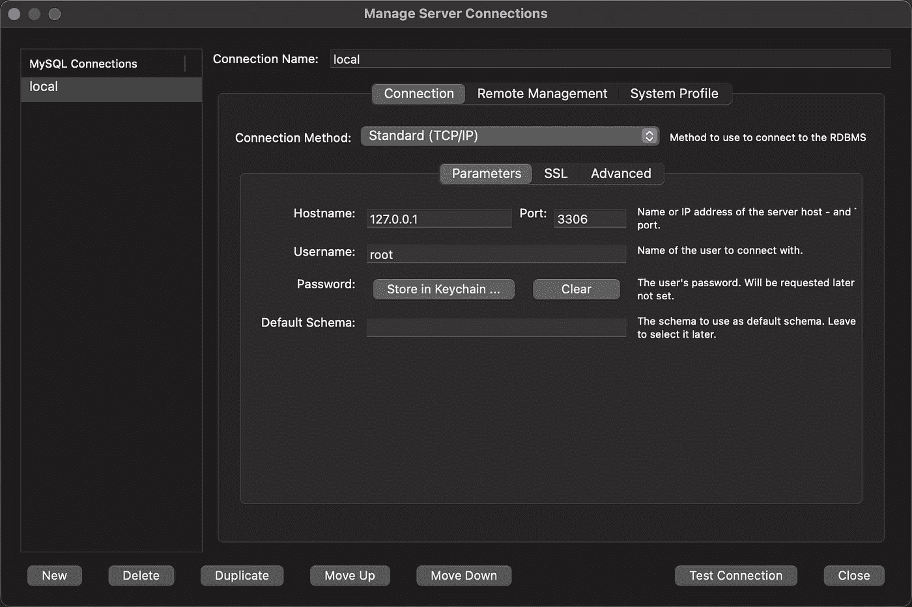
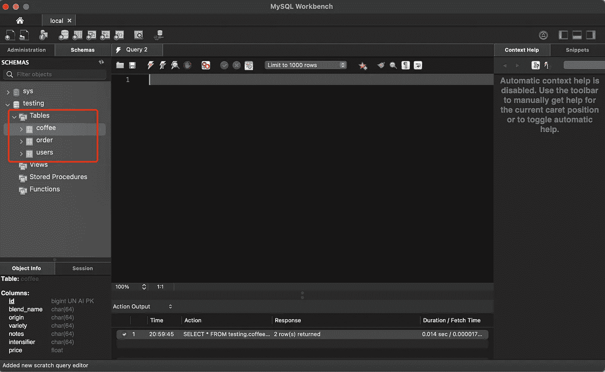

# MySQL+Docker Compose+Nodejs/Python—一步一步的指南

> 原文：<https://levelup.gitconnected.com/running-mysql-with-docker-and-docker-compose-with-seeded-data-a-step-by-step-guide-fd12fbef6896>

MySQL 是有史以来最受欢迎的关系数据库之一。将 MySQL 与 Docker 和 docker-compose 一起使用，可以非常容易和快速地测试任何使用 MySQL 作为数据库的应用程序中的任何更改。在本教程中，我们将详细介绍如何使用 MySQL 与 Docker 和 docker-compose 一步一步地保持事情容易理解。



**TLDR** 这里的[代码](https://github.com/caopengau/mysql-proj)。让我们开始吧！

# 为什么使用 MySQL 和 Docker 进行本地开发

在本地开发中使用包括 MySQL 和 Docker 在内的任何数据库都有很多理由，其中一些理由如下:

1.  根据项目或任何其他原因使用任何版本的 MySQL，如 5.6、5.7 或 8，都非常容易。
2.  通常使用 docker，如果它在您的机器上运行，它将在另一个软件工程师的机器上运行，在一个登台环境中，如果保持一些兼容性，也可以在生产环境中运行。
3.  一个新的团队成员可以在几个小时内高效工作，而不是几天，只要 docker 和其他工具设置得高效。

在下一节中，我们将列出一些在使用 Docker 运行 MySQL 之前需要做的事情。

# 先决条件

在我们开始使用一些代码和 CLI 命令之前，下面是一些必要的先决条件:

1.  docker 和相关命令的基本知识，如 Docker 构建、运行、执行等，对本指南很有用。
2.  任何关于 Docker-compose 的先验信息都将非常有用
3.  对关系数据库，尤其是 MySQL 的工作原理有一个大致的了解将是有利的。

现在，您已经了解了先决条件，我们可以更深入地了解 CLI 命令和任何相关代码。

# 用 Docker 运行 MySQL

对于本初学者指南，我们将使用来自 [DockerHub](https://hub.docker.com/_/mysql) 的官方 MySQL Docker 图片。官方的 MySQL Docker 镜像没有 Alpine Linux 版本，Debian 版本也是 147 MB，对于 Docker 镜像来说不算太大。

要使用官方映像运行 MySQL 8.0 容器，只需运行以下命令:

```
mkdir /tmp/mysql-data
docker run --name basic-mysql --rm -v /tmp/mysql-data:/var/lib/mysql -e MYSQL_ROOT_PASSWORD=ANSKk08aPEDbFjDO -e MYSQL_DATABASE=testing -p 3306:3306 -it mysql:8.0
```

让我们分析一下刚刚运行的命令，用 docker 运行 MySQL。首先，我们在`/tmp`中创建了一个名为`mysql-data`的目录来存储 MySQL 的数据。然后我们用`docker run`发出命令:

*   `--name`给集装箱命名`basic-mysql`
*   `--rm`停止时取出容器
*   添加`-v /tmp/mysql-data:/var/lib/mysql`是为了在容器重启时保留数据，当主机[重启](https://www.fosslinux.com/41739/linux-tmp-directory-everything-you-need-to-know.htm)时，它会消失，因为它在`/tmp`中
*   `-e MYSQL_ROOT_PASSWORD=ANSKk08aPEDbFjDO -e MYSQL_DATABASE=testing`用于设置 root 用户的密码并初始化名为`testing`的数据库
*   `-p 3306:3306`将主机端口 3306 映射到容器端口 3306，端口 3306 是 MySQL 的默认端口。
*   它将显示所有日志，我们使用的是官方的 MySQL 镜像 8.0 版本，它将运行 Debian 风格。

它将显示和输出如下所示:

```
2022-10-27 06:11:09+00:00 [Note] [Entrypoint]: Entrypoint script for MySQL Server 8.0.31-1.el8 started.
2022-10-27 06:11:10+00:00 [Note] [Entrypoint]: Switching to dedicated user 'mysql'
2022-10-27 06:11:10+00:00 [Note] [Entrypoint]: Entrypoint script for MySQL Server 8.0.31-1.el8 started.
2022-10-27 06:11:11+00:00 [Note] [Entrypoint]: Initializing database files
2022-10-27T06:11:11.957280Z 0 [Warning] [MY-011068] [Server] The syntax '--skip-host-cache' is deprecated and will be removed in a future release. Please use SET GLOBAL host_cache_size=0 instead.
2022-10-27T06:11:11.957392Z 0 [System] [MY-013169] [Server] /usr/sbin/mysqld (mysqld 8.0.31) initializing of server in progress as process 80
2022-10-27T06:11:11.987130Z 0 [Warning] [MY-010159] [Server] Setting lower_case_table_names=2 because file system for /var/lib/mysql/ is case insensitive
2022-10-27T06:11:12.013548Z 1 [System] [MY-013576] [InnoDB] InnoDB initialization has started.
2022-10-27T06:11:16.919522Z 1 [System] [MY-013577] [InnoDB] InnoDB initialization has ended.
2022-10-27T06:11:20.772591Z 6 [Warning] [MY-010453] [Server] root@localhost is created with an empty password ! Please consider switching off the --initialize-insecure option.
2022-10-27 06:11:27+00:00 [Note] [Entrypoint]: Database files initialized
2022-10-27 06:11:27+00:00 [Note] [Entrypoint]: Starting temporary server
mysqld will log errors to /var/lib/mysql/729f35877b11.err
mysqld is running as pid 133
2022-10-27 06:11:40+00:00 [Note] [Entrypoint]: Temporary server started.
'/var/lib/mysql/mysql.sock' -> '/var/run/mysqld/mysqld.sock'
Warning: Unable to load '/usr/share/zoneinfo/iso3166.tab' as time zone. Skipping it.
Warning: Unable to load '/usr/share/zoneinfo/leapseconds' as time zone. Skipping it.
Warning: Unable to load '/usr/share/zoneinfo/tzdata.zi' as time zone. Skipping it.
Warning: Unable to load '/usr/share/zoneinfo/zone.tab' as time zone. Skipping it.
Warning: Unable to load '/usr/share/zoneinfo/zone1970.tab' as time zone. Skipping it.
2022-10-27 06:11:44+00:00 [Note] [Entrypoint]: Creating database testing2022-10-27 06:11:44+00:00 [Note] [Entrypoint]: Stopping temporary server
2022-10-27 06:11:48+00:00 [Note] [Entrypoint]: Temporary server stopped2022-10-27 06:11:48+00:00 [Note] [Entrypoint]: MySQL init process done. Ready for start up.2022-10-27T06:11:48.661152Z 0 [Warning] [MY-011068] [Server] The syntax '--skip-host-cache' is deprecated and will be removed in a future release. Please use SET GLOBAL host_cache_size=0 instead.
2022-10-27T06:11:48.670274Z 0 [System] [MY-010116] [Server] /usr/sbin/mysqld (mysqld 8.0.31) starting as process 1
2022-10-27T06:11:48.683339Z 0 [Warning] [MY-010159] [Server] Setting lower_case_table_names=2 because file system for /var/lib/mysql/ is case insensitive
2022-10-27T06:11:48.700826Z 1 [System] [MY-013576] [InnoDB] InnoDB initialization has started.
2022-10-27T06:11:51.317151Z 1 [System] [MY-013577] [InnoDB] InnoDB initialization has ended.
2022-10-27T06:11:52.336910Z 0 [Warning] [MY-010068] [Server] CA certificate ca.pem is self signed.
2022-10-27T06:11:52.336965Z 0 [System] [MY-013602] [Server] Channel mysql_main configured to support TLS. Encrypted connections are now supported for this channel.
2022-10-27T06:11:52.352191Z 0 [Warning] [MY-011810] [Server] Insecure configuration for --pid-file: Location '/var/run/mysqld' in the path is accessible to all OS users. Consider choosing a different directory.
2022-10-27T06:11:52.548249Z 0 [System] [MY-011323] [Server] X Plugin ready for connections. Bind-address: '::' port: 33060, socket: /var/run/mysqld/mysqlx.sock
2022-10-27T06:11:52.548394Z 0 [System] [MY-010931] [Server] /usr/sbin/mysqld: ready for connections. Version: '8.0.31'  socket: '/var/run/mysqld/mysqld.sock'  port: 3306  MySQL Community Server - GPL.
```

由于 MySQL 服务器正在运行，我们可以在容器内执行 MySQL 命令:

```
docker exec -it basic-mysql /bin/bash
#once inside the container 
mysql -u root -p
#put/paste the password, ANSKk08aPEDbFjDO, and once inside MySQL CLI run
show databases;
```

它看起来会像下面这样:



我们可以用`docker stop basic-mysql`停止集装箱

尽管这并不太难，但我认为这并不容易，因为命令的参数并不容易记忆。另一个方面是我们孤立地运行 MySQL，在 Quotes API Node.js 应用程序和 MySQL 容器之间没有链接。这就是 docker-compose 的声明性非常有用的地方，我们将在下一节中看到。

# 用 docker-compose 运行 MySQL

添加初始注入脚本

```
mkdir basic-mysql && touch ./basic-mysql/init.sql
```

编辑下面的`init.sql`

```
GRANT ALL PRIVILEGES ON *.* TO 'root'@'%';USE testing;DROP TABLE IF EXISTS `order`;DROP TABLE IF EXISTS users;DROP TABLE IF EXISTS coffee;/*NEVER store passwords in clear text as it's done here!!!*/
CREATE TABLE users (
 id SERIAL PRIMARY KEY,
 name TEXT NOT NULL,
 email TEXT NOT NULL,
 password TEXT NOT NULL,
 role ENUM('admin', 'consumer')
);INSERT INTO
 users (name, email, password, role)
VALUES
 ('test', '[test@mail.ch](mailto:test@mail.ch)', 'test', 'consumer'),
 ('admin', '[admin@mail.ch](mailto:admin@mail.ch)', 'admin', 'admin');CREATE TABLE coffee (
 id SERIAL PRIMARY KEY,
 blend_name char(64),
 origin char(64),
 variety char(64),
 notes char(64),
 intensifier char(64),
 price float
);INSERT INTO
 coffee (
  blend_name,
  origin,
  variety,
  notes,
  intensifier,
  price
 )
VALUES
 (
  'Good-morning Symphony',
  'Dipilto, Nicaragua',
  'Kona',
  'crisp, coating, concord grape, fresh wood, maple syrup',
  'astringent',
  23.7
 ),
 (
  'KrebStar Mug',
  'Central Valley, Costa Rica',
  'Yellow Bourbon',
  'mild, tea-like, pineapple, barley, musty',
  'delicate',
  40.0
 );CREATE TABLE `order` (
 id SERIAL PRIMARY KEY,
 coffeeId BIGINT UNSIGNED NOT NULL,
 userId BIGINT UNSIGNED NOT NULL,
 quantity INT NOT NULL,
 createdAt TIMESTAMP DEFAULT CURRENT_TIMESTAMP,
 updatedAt TIMESTAMP DEFAULT CURRENT_TIMESTAMP ON UPDATE CURRENT_TIMESTAMP,
 CONSTRAINT fk_coffeeId FOREIGN KEY (coffeeId) REFERENCES coffee(id) ON DELETE CASCADE ON UPDATE CASCADE,
 CONSTRAINT fk_userId FOREIGN KEY (userId) REFERENCES users(id) ON DELETE CASCADE ON UPDATE CASCADE
);-- insert data into order table
INSERT INTO
 `order` (coffeeId, userId, quantity)
VALUES
 (1, 1, 2),
 (2, 2, 1);
```

为了使用 docker-compose 运行相同的 MySQL 8.0，我们将创建一个新的 docker-compose.yml 文件，其内容如下:

```
version: '3.8'
services:
  basic-mysql:
    container_name: basic-mysql
    image: mysql:8.0
    cap_add:
      - SYS_NICE
    restart: always
    environment:
      - MYSQL_DATABASE=testing
      - MYSQL_ROOT_PASSWORD=ANSKk08aPEDbFjDO
    ports:
      - '3306:3306'
      - '33060:33060'
    command: --init-file /docker-entrypoint-initdb.d/init.sql
    volumes:
      - basic-mysql:/var/lib/mysql
      - ./basic-mysql/init.sql:/docker-entrypoint-initdb.d/init.sql
volumes:
  basic-mysql:
    driver: local
```

上面的 docker-compose 文件需要理解以下内容:

1.  它使用 docker-compose 文件[版本 3.8](https://docs.docker.com/compose/compose-file/compose-file-v3/) ，最新版本之一。
2.  因此，我们将`db`定义为一个服务，每个[服务](https://docs.docker.com/compose/compose-file/compose-file-v3/#service-configuration-reference)将等同于一个新的 docker 运行命令
3.  随后，我们指向 docker-compose，将官方的 MySQL 8.0 映像用于这个 DB 服务。
4.  设置为`SYS_NICE` [的`cap_add`会抑制](https://stackoverflow.com/a/55706057)一些无用的错误信息。
5.  接下来，我们要求 docker-compose 在失败时总是重启这个容器。
6.  之后，我们为 MySQL 数据库和 root 用户的密码添加了两个环境变量。根据需要，我们可以添加另一个用户，赋予它对其他环境变量的较低权限。
7.  然后，我们将主机端口`3306`映射到容器端口`3306`，因为 MySQL 服务器运行在容器端口`3306`上。根据偏好，主机端口可能会发生变化。
8.  然后，我们运行播种脚本，将初始数据注入 mysql 数据库`testing`
9.  然后我们添加 2 个卷，第一个是映射到下面的卷`basic-mysql`的数据库卷。它基本上告诉 docker 和 docker-compose 为我们管理卷。接下来，我们添加一个`init.sql`脚本，它将[用给定的 SQL 文件初始化](https://github.com/docker-library/docs/tree/master/mysql#initializing-a-fresh-instance)我们的`testing`数据库。

这次我们可以用 docker-compose 启动 MySQL 容器，使用:

```
docker-compose up
```

它将显示如下输出:

```
[+] Running 1/1
 ⠿ Container basic-mysql  Created                                                          0.2s
Attaching to basic-mysql
basic-mysql  | 2022-10-27 09:38:51+00:00 [Note] [Entrypoint]: Entrypoint script for MySQL Server 8.0.31-1.el8 started.
basic-mysql  | 2022-10-27 09:38:51+00:00 [Note] [Entrypoint]: Switching to dedicated user 'mysql'
basic-mysql  | 2022-10-27 09:38:51+00:00 [Note] [Entrypoint]: Entrypoint script for MySQL Server 8.0.31-1.el8 started.
basic-mysql  | '/var/lib/mysql/mysql.sock' -> '/var/run/mysqld/mysqld.sock'
basic-mysql  | 2022-10-27T09:38:52.620935Z 0 [Warning] [MY-011068] [Server] The syntax '--skip-host-cache' is deprecated and will be removed in a future release. Please use SET GLOBAL host_cache_size=0 instead.
basic-mysql  | 2022-10-27T09:38:52.628931Z 0 [System] [MY-010116] [Server] /usr/sbin/mysqld (mysqld 8.0.31) starting as process 1
basic-mysql  | 2022-10-27T09:38:52.649308Z 1 [System] [MY-013576] [InnoDB] InnoDB initialization has started.
basic-mysql  | 2022-10-27T09:38:53.380032Z 1 [System] [MY-013577] [InnoDB] InnoDB initialization has ended.
basic-mysql  | 2022-10-27T09:38:53.698374Z 0 [Warning] [MY-010068] [Server] CA certificate ca.pem is self signed.
basic-mysql  | 2022-10-27T09:38:53.698422Z 0 [System] [MY-013602] [Server] Channel mysql_main configured to support TLS. Encrypted connections are now supported for this channel.
basic-mysql  | 2022-10-27T09:38:53.705214Z 0 [Warning] [MY-011810] [Server] Insecure configuration for --pid-file: Location '/var/run/mysqld' in the path is accessible to all OS users. Consider choosing a different directory.
basic-mysql  | 2022-10-27T09:38:53.904655Z 0 [System] [MY-010931] [Server] /usr/sbin/mysqld: ready for connections. Version: '8.0.31'  socket: '/var/run/mysqld/mysqld.sock'  port: 3306  MySQL Community Server - GPL.
basic-mysql  | 2022-10-27T09:38:53.904741Z 0 [System] [MY-011323] [Server] X Plugin ready for connections. Bind-address: '::' port: 33060, socket: /var/run/mysqld/mysqlx.sock
```

输出是相似的，但是这次是用 docker-compose 声明的，在 docker 容器中运行 MySQL 是一个简单得多的命令。

通过 UI 连接到数据库，例如[**MySQL work bench**](https://www.mysql.com/products/workbench/)**并检查我们的表是否被正确植入**

********

## **通过 python 脚本测试连接**

**请确保安装了依赖项。运行`pip install pymysql`或`pip3 install pymysql`**

```
# main.py
import pymysql.cursors# Connect to the database
connection = pymysql.connect(
    host='localhost',
    user='root',
    password='ANSKk08aPEDbFjDO',
    database='testing',
    cursorclass=pymysql.cursors.DictCursor
)with connection:
    with connection.cursor() as cursor:
        # Read a single record
        sql = "SELECT * FROM `users`"
        cursor.execute(sql)
        result = cursor.fetchall()
        print(result)
```

**`python main.py`**

## **通过节点脚本测试连接**

**请确保安装了依赖项。运行`npm i mysql`**

```
// main.js
const mysql = require('mysql');const con = mysql.createConnection({
  host: "localhost",
  user: "root",
  password: "ANSKk08aPEDbFjDO",
  database: "testing"
});con.connect(function(err) {
  if (err) throw err;
  console.log("Connected!"); con.query("SELECT * FROM `users`", function (err, result, fields){
    if (err) throw err;
    console.log(result);
  });
});
```

**`node main.js`**

## **延伸阅读:**

*   **[掌握 7 个 SQL 约束:完全指南](https://medium.com/design-bootcamp/mastering-7-sql-constraints-the-complete-guide-2223a94d5dff?source=your_stories_page-------------------------------------)**
*   **[30 秒内 10 次 SQL 攻击](https://medium.com/@caopengau/10-sql-hacks-in-30-seconds-bc2be9b6f4d9?source=your_stories_page-------------------------------------)**
*   **[SQL 4 类型的连接可视化保存在 Head 中](https://medium.com/@caopengau/sql-4-types-of-joins-visualised-to-keep-in-head-f49f7875ab51?source=your_stories_page-------------------------------------)**
*   **[MySQL+Docker Compose+Nodejs/Python——一步一步的指南](https://medium.com/gitconnected/running-mysql-with-docker-and-docker-compose-with-seeded-data-a-step-by-step-guide-fd12fbef6896?source=your_stories_page-------------------------------------)**

****呼吁行动****

**如果你觉得这个指南有帮助，请鼓掌并跟我来。通过[链接](https://medium.com/@caopengau/membership)加入 medium，获取我和所有其他优秀作家在 medium 上的优质文章。**

# **分级编码**

**感谢您成为我们社区的一员！在你离开之前:**

*   **👏为故事鼓掌，跟着作者走👉**
*   **📰更多内容请查看[升级编码刊物](https://levelup.gitconnected.com/?utm_source=pub&utm_medium=post)**
*   **🔔关注我们:[推特](https://twitter.com/gitconnected) | [LinkedIn](https://www.linkedin.com/company/gitconnected) | [时事通讯](https://newsletter.levelup.dev)**

**🚀👉 [**加入升级人才集体，找到一份神奇的工作**](https://jobs.levelup.dev/talent/welcome?referral=true)**