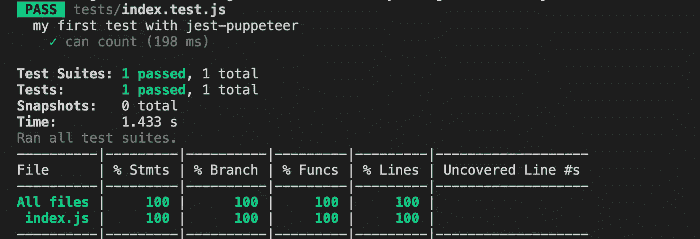
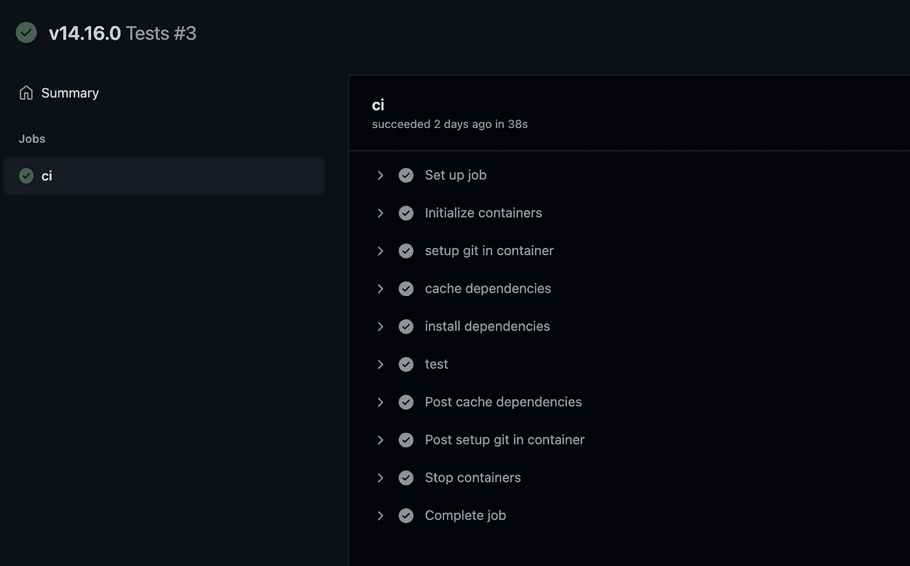
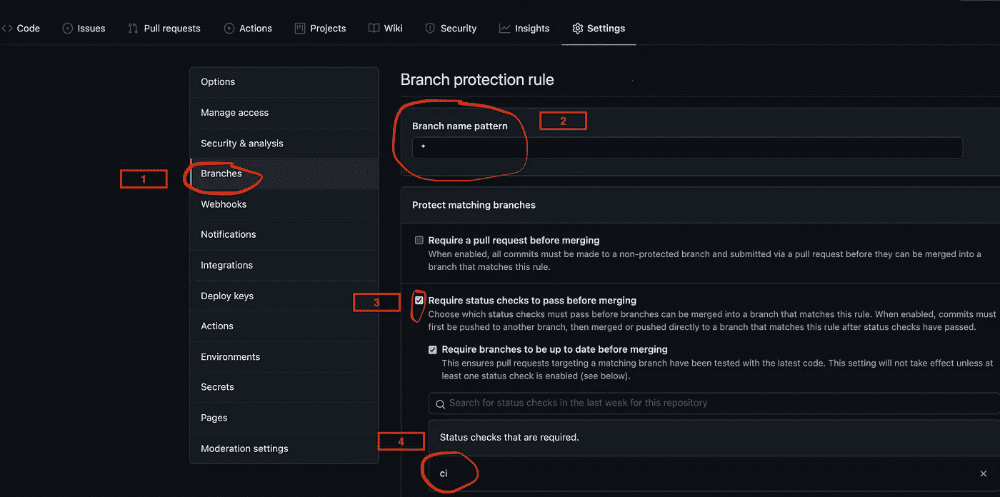
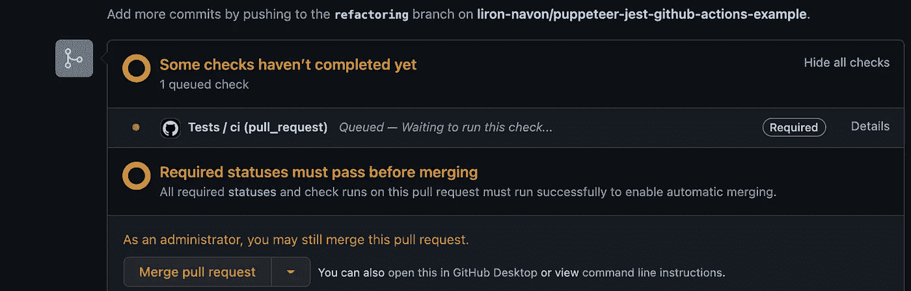
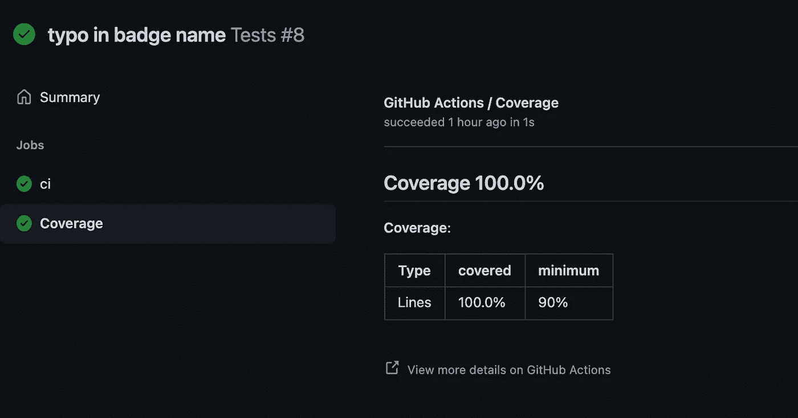

# 在 Github actions 上运行带有 Jest 的 Puppeteer 进行自动化测试。

> 原文：<https://levelup.gitconnected.com/running-puppeteer-with-jest-on-github-actions-for-automated-testing-with-coverage-6cd15bc843b0>

[puppeter](https://github.com/puppeteer/puppeteer)是一个为 chrome 和 chrome 公开 API 的库。我将带您了解创建 [Github actions](https://docs.github.com/en/actions) (Github 的 CI/CD 管道解决方案)的过程，它可以使用 jest 运行集成测试，在容器中运行它，并生成覆盖报告。


你可以在这里访问 Github 上的完整项目:[https://Github . com/liron-navon/puppet eer-jest-Github-actions-example](https://github.com/liron-navon/puppeteer-jest-github-actions-example)。在这篇文章中，我将回顾它并解释它是如何工作的。

## 用 jest 和木偶师编写一个简单的测试

一个测试需要一个测试用例，在这种情况下，我将使用一个简单的 HTML 文件，其中有一个按钮(id="btn ")和一个计数器(id="counter ")，还有一个 JS 文件，它只计算按钮被点击的次数并更新计数器。

```
<body>
  <p>button was clicked: <span id="counter">0</span> times</p>
  <button id="btn">click me</button>
  <script src="./index.js" type="text/javascript"></script>
</body>
```

和 index.js 文件:

```
const btn = document.querySelector('#btn');
const counter = document.querySelector('#counter');btn.addEventListener('click', () => {
  counter.innerHTML = +counter.textContent + 1;
});
```

为了测试这一点，我创建了一个小的测试文件，我们用 jest-puppeter 打开一个浏览器，在每次测试之前进入我们的页面，通过选择按钮、单击它并检查计数器来测试文件。

```
describe('my first test with jest-puppeteer', () => { beforeEach(async () => {
    await page.goto('http://localhost:9999');
  }); it('can count', async () => {
    // refer to the elements we need
    const counter = await page.$('#counter');
    const btn = await page.$('#btn'); // before any click we expect 0
    let counterText = await page.evaluate(
          el => el.textContent, counter
    )
    expect(+counterText).toEqual(0); // cick the button
    await btn.click(); // expect counter to increament
    counterText = await page.evaluate(el => el.textContent, counter)
    expect(+counterText).toEqual(1);
  });
})
```

## 配置 Jest 和木偶师在本地运行

现在我们需要运行 jest-puppeter，所以我们需要一些开发依赖项，完整的列表在 package.json 的存储库中，但是主要的是:
[**jest-puppeter**](https://github.com/smooth-code/jest-puppeteer)**——用于在 puppeter 环境中运行测试。
[**jest-puppet er-伊斯坦布尔**](https://github.com/ocavue/jest-puppeteer-istanbul) —这允许我们创建一个覆盖报告。
[**babel-plugin-伊斯坦布尔**](https://github.com/istanbuljs/babel-plugin-istanbul) —在伊斯坦布尔包装我们的代码，这样我们可以收集覆盖率。
[**package**](https://parceljs.org/)—将使用 babel 为我们构建项目，因此我们可以使用伊斯坦布尔，并且还将充当我们的开发服务器，它类似于 Webpack，但没有令人厌烦的配置。
[**jest**](https://jestjs.io/)——试跑者。**

**为了在浏览器中运行我们的 HTML 文件，我们可以使用 parcel:**

```
parcel src/index.html --port 9999
```

**为了运行我们的测试和服务器，我在 package.json 中创建了脚本“npm test”和“npm start”。**

**现在我们需要添加一个 jest.config.js 文件，在这里我们定义如何运行测试和产生覆盖率。这里的主要内容是使用 jest-puppeteer 作为预置来运行使用 puppeteer 的测试，以及我们从 jest-puppet eer-伊斯坦布尔获取的设置/报告器——我们还将生成不同的报告文件，稍后将在管道中使用。**

```
const config = {
  "preset": "jest-puppeteer",
  "collectCoverage": true,
  "collectCoverageFrom": [
    "src/**/*"
  ],
  "coverageReporters": [
    "text",
    "lcov",
    "cobertura"
  ],
  "setupFilesAfterEnv": [
  "jest-puppeteer-istanbul/lib/setup"
  ],
  "reporters": [
    "default",
    "jest-puppeteer-istanbul/lib/reporter"
  ],
  "coverageDirectory": "coverage"
}
module.exports = config;
```

**我们需要一个小的。babelrc 文件，在这里我们定义了在编译过程中伊斯坦布尔插件的使用。当然，我们不希望这个部分出现在产品中，因为它会产生很多额外的代码，所以我们寻找环境变量，并且只在测试/开发/ci 中应用伊斯坦布尔插件。**

```
const plugins = [];// when run in the CI enviroonment
const isCI = Boolean(process.env.CI || false);// when run locally directly (calling npm start)
const isDevelopment = process.env.NODE_ENV === "development";// when run in test environment by jest (npm test)
const isTest = process.env.NODE_ENV === "test";if (isTest || isDevelopment || isCI) {
  plugins.push("istanbul");
}module.exports = {
  plugins: plugins
}
```

**这就是我们所需要的，您可以在一个终端中运行 start，在另一个终端中进行测试，但是在 CI 环境中这样做并不方便。幸运的是 jest-puppeteer 允许我们在项目的根目录下设置一个名为 jest-puppeteer.config.js 的配置文件，它将被库自动获取。**

**因此，我们可以定义如何运行我们的服务器，以及 jest-puppet er 应该寻找哪个端口。如果服务器已经在运行，它就不会运行 start 命令，这对开发来说非常方便。**

**ciPipelineOptions 将在 CI 环境中使用，因为我们需要禁用一些 chrome 优化以使其在 Linux 的 docker 环境中运行，并且因为我们的环境有一个稳定的 chrome 版本，我们可以使用它来代替 chrome，当然，我们将以无头模式运行它，因为 CI 没有屏幕。**

```
const ci = Boolean(process.env.CI || false);
const baseOptions = {
  server: {
  command: 'npm run start',
  port: 9999
  }
}
const ciPipelineOptions = {
  launch: {
    executablePath: '/usr/bin/google-chrome-stable',
    headless: true,
    args: [
      '--ignore-certificate-errors',
      '--no-sandbox',
      '--disable-setuid-sandbox',
      '--disable-accelerated-2d-canvas',
      '--disable-gpu'
    ]
  },
server: baseOptions.server
}module.exports = ci ? ciPipelineOptions : baseOptions;
```

**现在，我们可以运行“npm test”来运行我们的服务器并在本地进行测试，我们将会看到类似这样的消息。这意味着我们所有的文件都被测试和覆盖，如果我们错过了任何测试，jest 会让我们知道哪些行没有被覆盖，所以我们可以增加我们的覆盖率。**

****

## **准备运行操作**

**现在我们已经准备好了，一切都测试过了，让我们谈谈 CI 管道，GitHub 操作要求我们在目录中有管道文件。github/workflows”所以我在工作流中创建了一个 tests.yml 文件，我们将在其中定义管道，完整的文件在 git 存储库中，所以我将一部分一部分地讨论它。**

**我们定义了一个名为 Tests 的工作流，当我们推送到 master 时，以及当我们从任何分支到 master 创建一个 pull 请求时，它就会运行。**

```
name: Tests
on:
  push:
    branches: [ master ]
  pull_request:
    branches: [ master ]
```

**然后我们定义作业，我们需要一个名为 CI 的作业，我们将在 Linux (Ubuntu-20.04)虚拟机(VM)上运行它，但在 VM 上，我们将运行一个容器，其中包含运行 puppeteer 所需的所有系统依赖项和一个稳定的 chrome 浏览器。然后我们将定义 CI 环境变量，它一直存在于 GitHub actions 中，但不在容器内部。**

```
jobs:
  ci:
    runs-on: ubuntu-20.04
    container: lironavon/docker-puppeteer-container:14.16.0
    env:
      CI: true
    steps:
```

**前两个步骤不是必需的，但我总是将它们包含在我的构建中，第一个步骤将在容器中设置 git——这将允许我们在容器中使用 git 操作，第二个步骤是缓存步骤，它将缓存我们所有的节点模块以实现更快的管道。**

```
# add git to the container and set it up with the token
- name: setup git in container
  uses: actions/checkout@v2
    with:
    token: ${{ secrets.GITHUB_TOKEN }}# cache the dependencies from any node_modules directory
- name: cache dependencies
  uses: actions/cache@v2
  with:
    path: '**/node_modules'
    key: node_modules-${{ hashFiles('**/package-lock.json')}}
```

**接下来的两步非常简单，我们将在 CI 模式下安装依赖项，并忽略脚本，还记得我们在 jest-puppet er 的配置文件中定义的“executablePath”吗？如果我们没有定义它，我们将需要让 puppeteer 运行一个脚本来下载它自己的 chromium 浏览器，所以这里我们阻止它这样做，下一步只是运行我们的测试。**

```
# install the dependencies
- name: install dependencies
  run: npm ci --ignore-scripts# run the tests
- name: test
  run: npm test
```

**在此之前，我们可以简单地推 GitHub，GitHub 操作应该运行并导致通过管道，如果任何测试失败，管道将失败。**

****

**我们甚至可以为我们的项目制作一个徽章，通过添加到 README 文件中来表明测试已经通过**

**！[工作流标记](https://github . com/USER _ NAME/REPOSITORY _ NAME/actions/workflows/FILE _ NAME . yml/badge . SVG)**

****

## **分支保护**

**当然，测试的主要原因是为了确保没有人在推送可能损害我们项目的代码，在 Github 中，我们可以通过进入设置>分支(1)，设置分支名称模式(2)设置状态检查(3)并选择我们的管道作业(4)来实施分支保护——还记得我们在 tests.yml 文件中设置了“jobs:ci…”吗？原来如此。**

****

**现在，当我们创建“拉”请求时，我们将看到一条消息，告诉我们在合并分支之前，CI 状态必须通过。**

****

**这将保护我们的分支，所以所有的测试必须在合并前通过，但我们也想测试覆盖率。**

**工作流程中的下一步将为我们验证覆盖结果，我们使用[覆盖率-检查-操作](https://github.com/devmasx/coverage-check-action)来完成。通过我们从伊斯坦布尔得到的 lcov 文件，并说在 90%的覆盖率下，我们将失败的管道。**

```
# check coverage
- name: validate coverage
  uses: devmasx/coverage-check-action@v1.2.0
  with:
    type: lcov
    result_path: coverage/lcov.info
    min_coverage: 90
    token: ${{ github.token }}
```

**它还会生成一个覆盖率消息，以便我们检查覆盖率。**

****

## **添加覆盖徽章**

**最后一步纯粹是添加另一个徽章，这对开源项目来说非常好:**

****

**为此，我们可以使用 [coverage-comment-action](https://github.com/ewjoachim/coverage-comment-action) ，这需要我们启用 [GitHub wiki](https://docs.github.com/en/communities/documenting-your-project-with-wikis/about-wikis) 特性，它将存储我们的徽章信息。然后，我们可以根据覆盖率来决定给它什么颜色，因此，在 90%以下它将是红色，在 90%和 100%之间它将是橙色，它必须是 100%绿色，当然，您可以根据您的个人使用情形来更改它。**

```
# create a badge and make a report of the coverage
- name: display coverage
  uses: ewjoachim/coverage-comment-action@v1
  with:
    GITHUB_TOKEN: ${{ github.token }}
    COVERAGE_FILE: cobertura-coverage.xml
    BADGE_ENABLED: true
    BADGE_FILENAME: coverage-comment-badge.json
    MINIMUM_GREEN: 100
    MINIMUM_ORANGE: 90
```

## **结论**

**Jest 是一个很棒的测试运行程序，当我们需要自动化浏览器交互时，puppeteer 非常棒。一旦你理解了如何使用 GitHub 动作，它们就非常简单，如果可能的话，你应该在运行测试时检查覆盖率。**

**请鼓掌并关注，因为我将每隔几周发布一次内容，我真心感谢每一位关注者、拍板者和评论者🙂。**