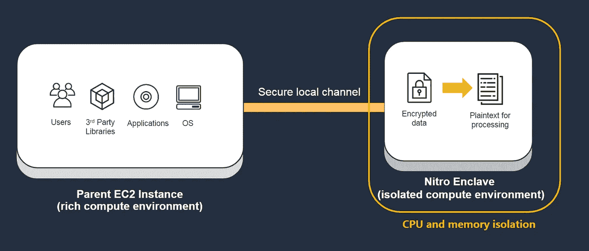
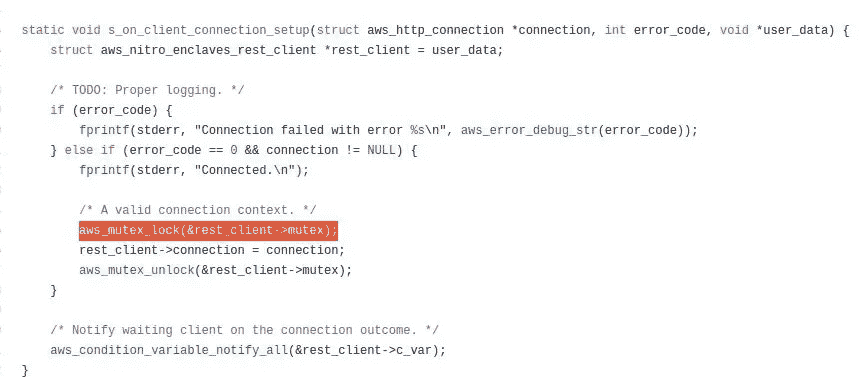
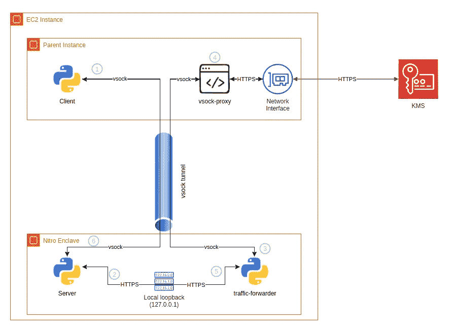
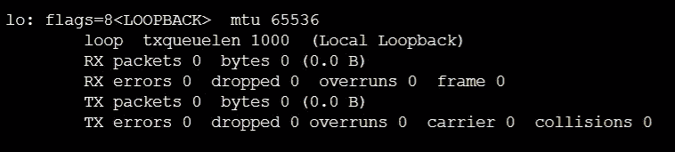
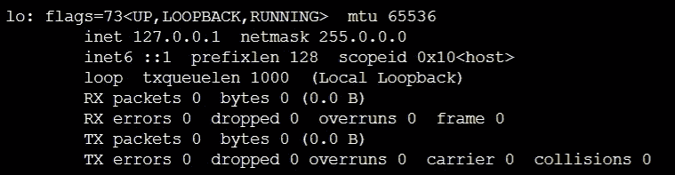

# 在 AWS Nitro Enclaves 上运行 Python 应用程序

> 原文：<https://levelup.gitconnected.com/running-python-app-on-aws-nitro-enclaves-56024667b684>

# 什么是 AWS 硝基飞地

AWS Nitro Enclaves 是一个运行在 EC2 实例旁边的独立计算环境。它使用来自 EC2 实例的 CPU 和内存资源，但是它在管理程序级别上与实例隔离，因此您的实例即使在操作系统级别上也不能访问 enclave。与 enclave 通信的唯一方式是通过 vsock 通道。

 [## AWS Nitro Enclaves -处理机密数据的隔离 EC2 环境| Amazon Web Services

### 当我第一次告诉你关于 AWS 硝基系统，我说:硝基系统是一个丰富的积木的集合…

aws.amazon.com](https://aws.amazon.com/blogs/aws/aws-nitro-enclaves-isolated-ec2-environments-to-process-confidential-data/) 

AWS Nitro Enclaves 的高级概述(来自 AWS 文档)

## 那是什么意思？

为了更好地理解这个概念，我们可以把 enclave 看作一个 docker 容器。我们可以将我们的定制应用烘焙到一个映像中，并在 enclave 中运行它，就像我们在容器中运行 docker 映像一样。

不同的是，您不能访问这个特殊的*容器的*控制台、文件、指标等。它没有网络接口，也没有持久存储。

你唯一能做的就是:

1.  运行应用程序
2.  通过专用的套接字隧道与外界通信。

# 为什么我们需要 AWS 硝基飞地

为了保护机密数据，我们总是加密我们的数据。但是当我们使用数据时，我们需要在某个地方解密它。

通常情况下，我们会在尽可能接近我们使用数据的地方解密数据，从而最大限度地减少泄露纯文本数据的可能性。

然而，为了职责分离，我们也不希望秘密处理过程离系统的其他部分太近。

想象一下，如果我们将支付处理系统放在电子商店的 web 服务器中。web 服务器管理员总是可以使用“上帝模式”(或者我们所说的 *sudo* )来访问日志文件。

AWS Nitro Enclaves 在核心应用程序附近(在同一个实例中)提供了一个安全的环境(没有人能够访问它)。解决将秘密处理过程放在远离或靠近主系统的困境。

# 为什么我要写这个 Python 演示？

 [## Richard fan 1126/nitro-enclave-python-demo

### 这个项目展示了我们如何使用 Python 套接字包在 EC2 实例和 Nitro Enclave 之间建立通信…

github.com](https://github.com/richardfan1126/nitro-enclave-python-demo/tree/master/http-proxy) 

在 AWS 硝基飞地成为 GA 后，我立即试用了它。然而，当我研究 GitHub 库时，我感到非常沮丧，因为代码不是用 C 就是用 Rust 编写的。KMS API 调用部分甚至重新实现了 HTTP 处理。

1.  【https://github.com/aws/aws-nitro-enclaves-sdk-c 
2.  [https://github.com/aws/aws-nitro-enclaves-samples](https://github.com/aws/aws-nitro-enclaves-samples)

SDK 示例使用 C 来重新实现整个 HTTP 处理

我觉得我需要一个月的时间来编写像调用 HTTP API 一样简单的 hello world 程序，尤其是当我使用 Python 时。

因此，我改变了主意，不再遵循示例，而是提出了自己的想法:编写一个代理来模拟通过 Nitro Enclave 的唯一网关——vsock 隧道的 HTTP 连接。

# 演示是如何工作的

使用代理来模拟通过 vsock 隧道的 HTTP 连接

对于详细的描述，你可以在[代码库中找到](https://github.com/richardfan1126/nitro-enclave-python-demo/blob/master/README.md)的描述。我想在这篇文章中分享的是我在构建这个演示项目时发现的一些有趣的事情。

## 1.选择正确的 Docker 图像

对于 Python 应用程序开发，使用 [Python 基础映像](https://hub.docker.com/_/python)将是一个明显的步骤。但是由于某种原因，python 映像在 Nitro Enclave 中无法正常运行。

无论我使用标准映像、`-slim`映像还是`-alpine`映像，即使我的 **Dockerfile** 只是运行一个简单的`echo`命令，也会出现错误`Could not open /env file: No such file or directory`。

我最终使用了 amazonlinux 基础映像并安装了构建过程中需要的包。虽然我仍然不知道背后的原因，它只是工作正常。

如果你也遇到一些奇怪的问题，尝试使用其他基础图像。在 EC2 实例中起作用的可能在 Enclave 中不起作用。

## 2.正在建立 HTTP 连接

大多数 HTTP 代理使用`127.0.0.1`链接同一台机器上的不同应用程序。在实现 HTTP-to-vsock 代理时，我做了同样的事情。

然而，我不知道这是否是 Nitro Enclave 上硬化过程的一部分。如果您运行`ifconfig`没有显示网络接口，这意味着您根本无法进行任何 IP 连接(甚至无法连接到本地主机)。

幸运的是，当我运行`ifconfig -a`时，我发现本地回环`lo`仍然存在。只是没有给它分配 IP 地址。

所以我在引导脚本中添加了一个命令`ifconfig lo 127.0.0.1`来为它分配一个 IP 地址。之后，我们可以使用`127.0.0.1`来做应用程序之间的 HTTP 连接。

如果您的应用程序依赖于 HTTP 连接(例如 REST API)，您会发现这种方法非常有用，因为您可以编写自己的代理来通过 vsock 通道转发流量。

# 下一步是什么—证明

## 什么是证明

AWS Nitro Enclaves 的一大特色是认证。除了数据隔离，我们可能还需要身份隔离。

因为 Nitro Enclave 没有对外部世界的网络访问，所以一切都将通过父实例。服务提供商(例如 AWS KMS)应该有办法识别 API 调用是来自父实例还是 enclave。

证明是我们用来实现这一点的方法。我们可以使用 NitroSecureModule (NSM)来获得一个签名的证明文档，并使用它来证明请求是从 enclave 发出的。还有一个挑战机制来避免外来者复制请求。

## 我现在面临的挑战是什么

然而，AWS 提供的文档对我来说仍然很难，我可能需要更多的时间来理解并希望实现 Python 证明过程。

1.  [https://github . com/AWS/AWS-nitro-enclaves-SDK-c/blob/main/docs/km stool . MD](https://github.com/aws/aws-nitro-enclaves-sdk-c/blob/main/docs/kmstool.md)
2.  [https://github . com/AWS/AWS-nitro-enclaves-nsm-API/blob/main/docs/metallation _ process . MD](https://github.com/aws/aws-nitro-enclaves-nsm-api/blob/main/docs/attestation_process.md)

# 特征图像

照片由[罗尼·库尔兹](https://unsplash.com/@ronnikurtz?utm_source=medium&utm_medium=referral)在 [Unsplash](https://unsplash.com?utm_source=medium&utm_medium=referral) 上拍摄