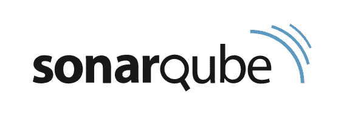
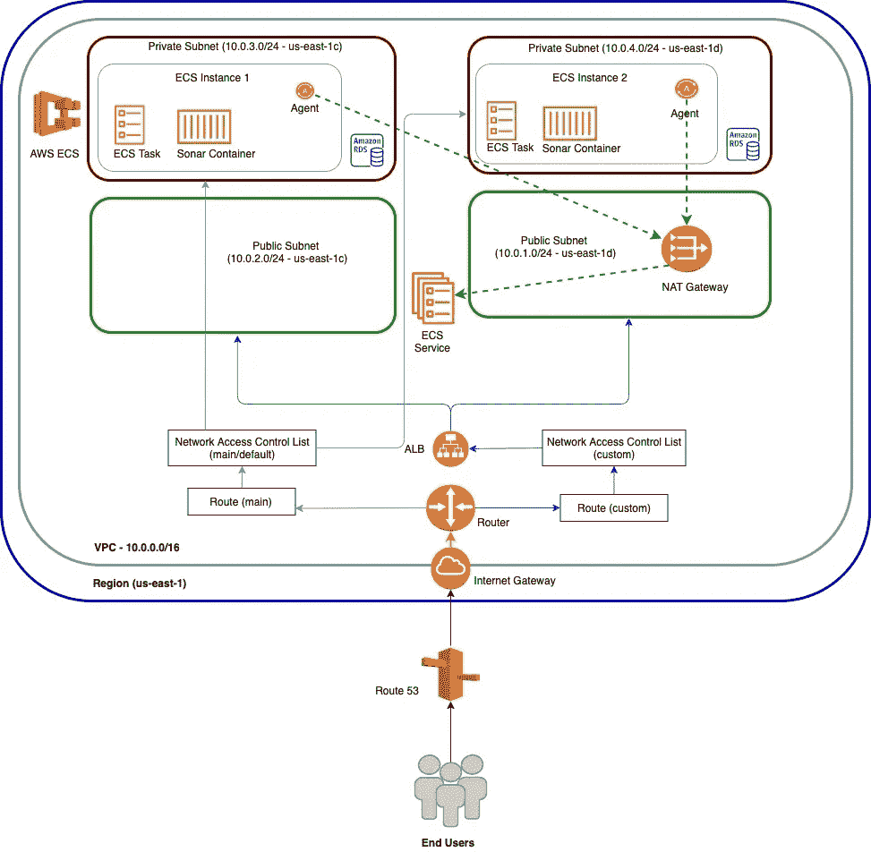
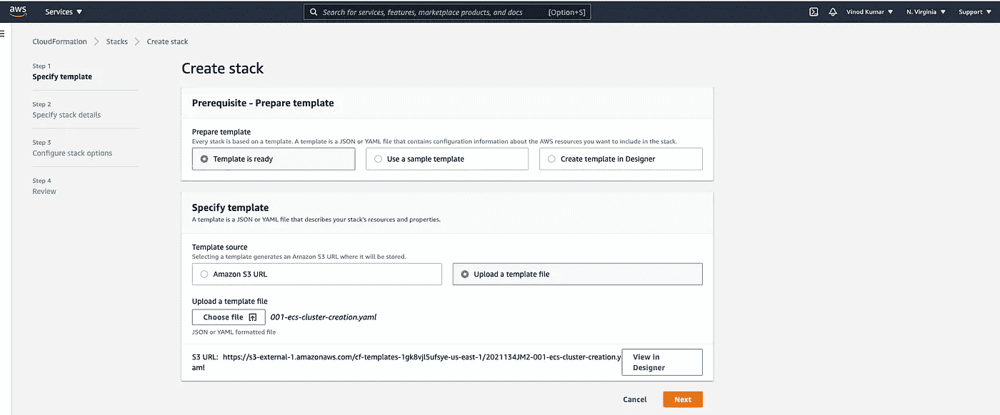
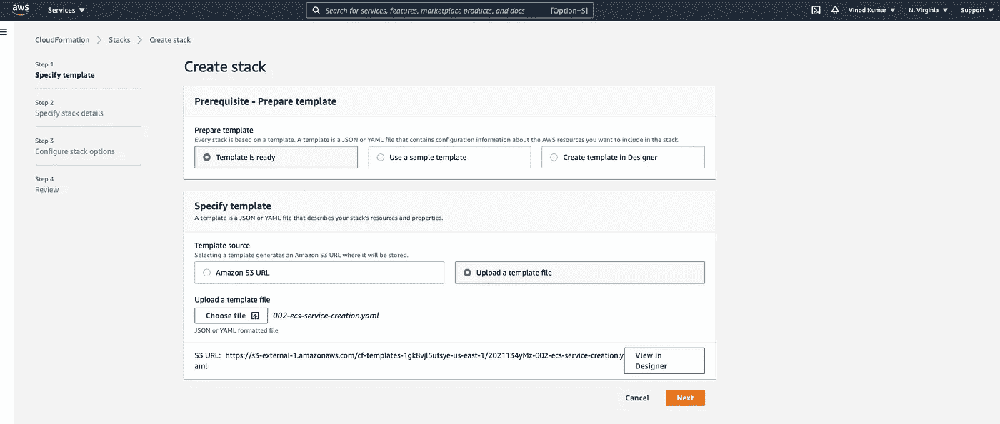
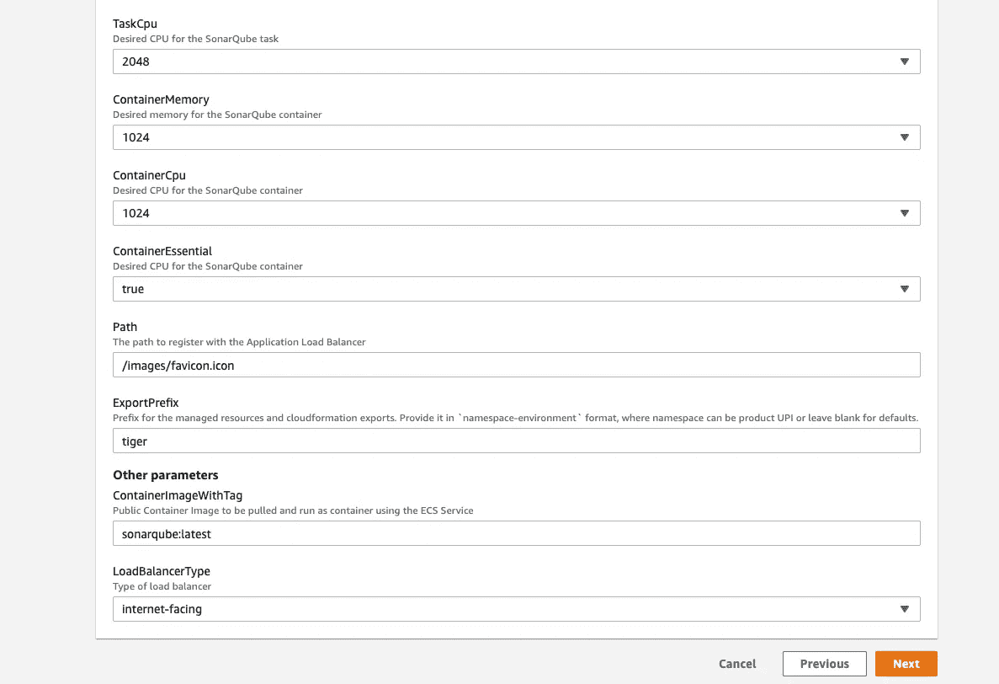
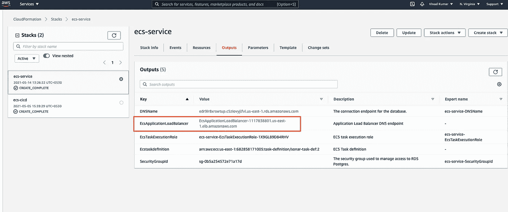
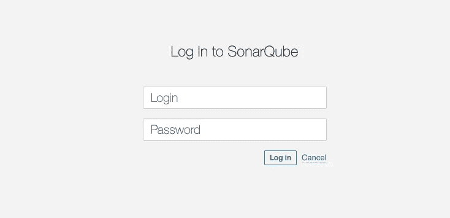
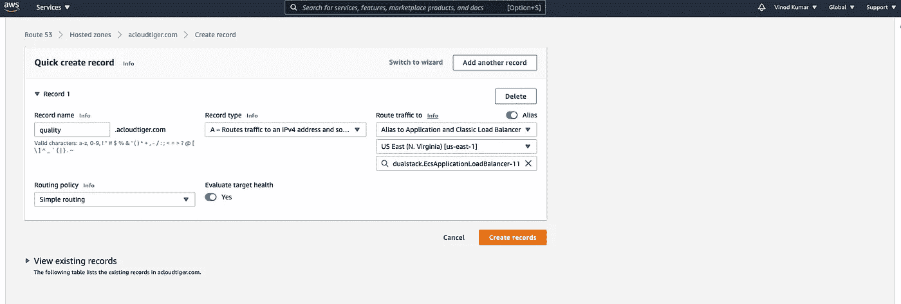
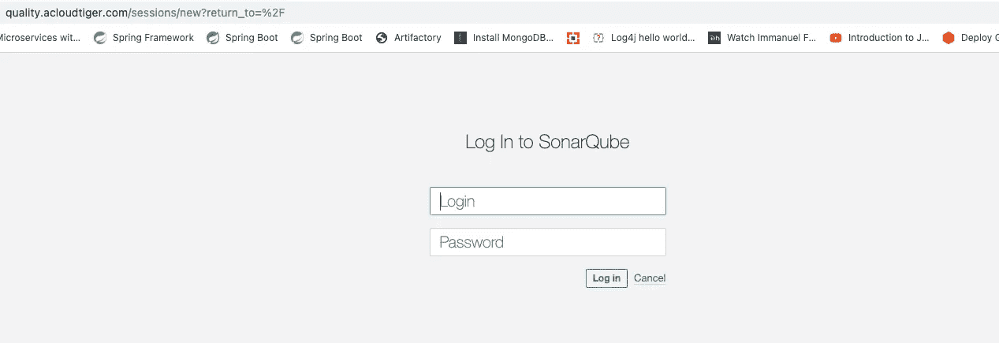
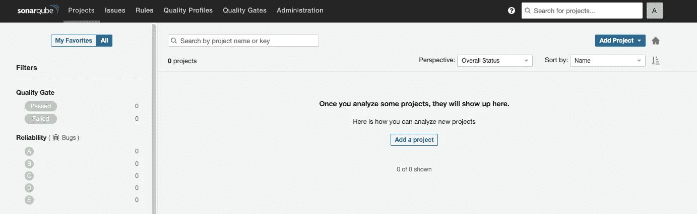

# 通过 AWS Cloud Formation (IaC)在 AWS ECS 中运行 SonarQube 作为 Docker 容器

> 原文：<https://levelup.gitconnected.com/running-sonarqube-in-aws-ecs-as-docker-container-by-aws-cloud-formation-iac-8c0ff640f714>

onarQube 是一个静态代码分析工具，可以帮助你扫描源代码的质量、代码覆盖率和漏洞问题。



索纳库贝

在本文中，我将向您展示如何使用 AWS(Amazon Web Services)ECS(Elastic Container Services)服务将高度可用和可伸缩的 SonarQube 服务器作为 Docker 容器进行配置和运行。

(*请注意，这不是一个 Fargate 解决方案，而是一个基于节点组的解决方案，因为 SonarQube 尚不支持无服务器技术，因为它在写入底层卷时受到限制*)

整个设置是使用 **AWS 云形成**模板作为基础设施代码(IaC)完成的。

在我们继续之前，先了解一下 SonarQube。SonarQube 有多种版本可供我们选择:

1.  **社区版—** 免费版，适用于开源项目，但只扫描主分支。
2.  **开发者版**支持 22 种语言，但不支持传统语言，如 COBOL、RPG、PL/1、VB 以及 Apex。此外，开发者版提供了所有功能，但**不支持**最重要的功能**项目组合管理**和**报告生成**。[https://www.sonarsource.com/plans-and-pricing/developer/](https://www.sonarsource.com/plans-and-pricing/developer/)
3.  **企业版**支持所有 27 种语言和所有特性，包括项目组合管理、报告生成、分支分析、泄漏期、质量关口、质量概况、代码气味、重复、复杂性、代码覆盖、技术债务、潜在缺陷、安全报告、热点、漏洞、分支分析、拉请求等。投资组合管理将有助于创建/定制仪表板、各种报告，包括执行报告、自动邮件、导入/导出、指标整合等。此外，企业版客户在获得主生产许可证的同时还获得了 2 个附加许可证(试运行/测试)。[https://www.sonarsource.com/plans-and-pricing/enterprise/](https://www.sonarsource.com/plans-and-pricing/enterprise/)
4.  **数据中心版**将具有与企业版相同的功能，但除此之外，它还具有“高可用性和高可扩展性”。[https://www.sonarsource.com/plans-and-pricing/data-center/](https://www.sonarsource.com/plans-and-pricing/data-center/)

# **运行 SonarQube 的 AWS 网络图**



在这里，我将运行**sonar cube Community Edition**，但是您可以根据自己的选择自由选择任何其他 docker 容器，如 Developer edition 等。

```
sonarqube:latest
sonarqube:lts-developer
sonarqube:lts-enterprise
```

有关 SonarQube 支持的更多 Docker 图像标签，请参考此处:

 [## sonarqube 标签- Docker Hub

### SonarQube 是一个用于持续检查代码质量的开源平台。

hub.docker.com](https://hub.docker.com/_/sonarqube?tab=tags&page=1&ordering=last_updated) 

本文展示的完整源代码包括 AWS CloudFormation 可以在这里获得。

[](https://github.com/vinod827/k8s-nest/tree/main/iac/aws/ecs) [## vinod827/k8s-nest

### 所有 k8s 都住在这里。通过在 GitHub 上创建帐户，为 vinod827/k8s-nest 开发做出贡献。

github.com](https://github.com/vinod827/k8s-nest/tree/main/iac/aws/ecs) 

一旦你从提供的 GitHub 库中克隆了源代码，你将会看到两个 YAML 文件，它们只不过是 AWS CloudFormation 模板:

1.  [**001-ECS-Cluster-creation . YAML**](https://github.com/vinod827/k8s-nest/blob/main/iac/aws/ecs/001-ecs-cluster-creation.yaml)**—负责创建 AWS ECS 集群**
2.  **[**002-ecs-Service-creation . YAML**](https://github.com/vinod827/k8s-nest/blob/main/iac/aws/ecs/002-ecs-service-creation.yaml)**—负责为 SonarQube 创建 ECS 服务。在这里，您还可以选择是否希望应用程序负载平衡器(ALB)类型为**内部**或**面向互联网******

****现在登录到 AWS 控制台，进入 AWS CloudFormaton，然后上传第一个文件([**001-ecs-Cluster-creation . YAML**](https://github.com/vinod827/k8s-nest/blob/main/iac/aws/ecs/001-ecs-cluster-creation.yaml))来创建 ECS 集群。****

********

****AWS 云形成—创建 ECS 集群****

****下一步是上传第二个文件([**002-ECS-service-creation . YAML**](https://github.com/vinod827/k8s-nest/blob/main/iac/aws/ecs/002-ecs-service-creation.yaml))，其中会要求您提供一些参数，如 RDS (Postgres)详细信息(因为 SonarQube 需要数据库支持生产级环境)、应用程序负载平衡器、Docker 容器映像及其标签等。****

****(请稍候，因为 RDS 服务需要很长时间来创建新的 Postgres 数据库及其备份操作，然后才开始创建 ECS 服务)****

********

****AWS CloudFormation — ECS 服务(针对 SonarQube)****

********

****AWS 云形成-可选参数****

****AWS CloudFormation 服务需要一段时间来提供所有需要的服务，因为在幕后发生了许多事情，如创建 RDS 服务(Postgres 数据库)、创建 IAM 角色/权限、ECS 任务和 ECS 服务创建、提取 SonarQube docker 映像，以及最终提供您选择的负载平衡器(内部或面向互联网)。****

****准备就绪后，您可以查看 CloudFormation 的**输出**部分(第二个模板，即[**002-ECS-service-creation . YAML**](https://github.com/vinod827/k8s-nest/blob/main/iac/aws/ecs/002-ecs-service-creation.yaml))以找到应用负载平衡器 URL，或者前往 EC2 负载平衡器部分以查看在那里创建的新负载平衡器。****

********

****自动气象站云形成-输出****

****复制负载平衡器 URL，并在您的浏览器和 boom 中键入！您可以在 AWS 上设置和运行一个完全成熟的 SonarQube。****

********

****索纳库贝****

****您可以在 AWS Route 53 服务中使用新的托管区域进一步配置您的负载平衡器 URL，以拥有类似于[https://quality.example.com](https://quality.example.com)的友好 DNS，并配置 TLS 证书以使其安全。****

********

****53 号公路— HostedZone****

****我的在[https://quality.acloudtiger.com](https://quality.acloudtiger.com)(可能，为了节省我的云账单的成本，会被关闭和删除:)****

********

****键入**admin**(sonar cube 的默认凭证)作为登录和密码，以访问 sonar cube 服务器。****

********

****SonarQube 服务器****

****希望你喜欢这篇文章:)****

****您可以将它与 Jenkins、Atlassian Bamboo 等持续集成服务器集成，以自动化生产就绪 SonarQube 服务器的整个流程。****

****请分享您的反馈:)****

****您也可以将您的 IaC 贡献给这个项目:****

****[](https://github.com/vinod827/k8s-nest) [## vinod827/k8s-nest

### 所有 k8s 都住在这里。通过在 GitHub 上创建帐户，为 vinod827/k8s-nest 开发做出贡献。

github.com](https://github.com/vinod827/k8s-nest) 

干杯:)****