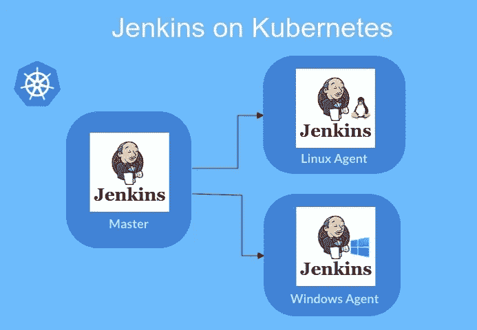

# 使用 Jenkins pipeline 和 Kubernetes 在 windows 上运行工作流

> 原文：<https://levelup.gitconnected.com/running-workflows-on-windows-with-jenkins-pipeline-and-kubernetes-52752a89a0e7>



作为 Cloudify.co 的 DevOps 工程师，我正在基于 Kubernetes 和 Jenkins 构建一个新的 CI/CD 管道。最近，我在一个工作流中工作，我需要在 windows 上构建工件(可执行文件)，您可以在 windows worker 节点上运行基于 windows 映像的容器。我将在这篇文章中分享我的经验，关于如何将 windows worker 节点添加到您的 EKS 集群，然后在其上运行 windows 工作流。

我们开始吧。

# 詹金斯是什么？

> Jenkins 是一款独立的开源自动化服务器，可用于自动化与构建、测试、交付或部署软件相关的各种任务。[](https://jenkins.io/doc/)

# *詹金斯管道是什么？*

*Jenkins Pipeline(或简称为“Pipeline”，大写字母为“P”)是一套插件，支持将*连续交付管道*集成到 Jenkins 中。*

*[https://www.jenkins.io/doc/book/pipeline/](https://www.jenkins.io/doc/book/pipeline/)*

# *Jenkins 的 Kubernetes 插件是什么？*

> **在 Kubernetes 集群中运行动态代理的 Jenkins 插件。**
> 
> **插件为每个启动的代理创建一个 Kubernetes Pod，由 Docker 映像定义运行，并在每次构建后停止它。**
> 
> *[*https://plugins.jenkins.io/kubernetes/*](https://plugins.jenkins.io/kubernetes/)*

# *什么是亚马逊 EKS？*

> *亚马逊弹性 Kubernetes 服务(亚马逊 EKS)是一项托管服务，使您可以轻松地在 AWS 上运行 Kubernetes，而无需建立或维护自己的 Kubernetes 控制面板。Kubernetes 是一个开源系统，用于自动化容器化应用程序的部署、扩展和管理。*
> 
> *[https://docs . AWS . Amazon . com/eks/latest/user guide/what-is-eks . html](https://docs.aws.amazon.com/eks/latest/userguide/what-is-eks.html)*

# *将 windows 工作节点添加到仅包含 linux 节点的现有 EKS 集群中*

## *直接使用 eksctl 实用程序创建一个包含 windows 节点的新节点组(AWS 自动缩放组),而不使用 config*

```
*$ eksctl create nodegroup \
--cluster your_cluster_name \
--region us-west-2 \
--version 1.15 \
--name ng-windows \
--node-type t3.medium \
--nodes 3 \
--nodes-min 1 \
--nodes-max 4 \
--node-ami-family WindowsServer2019FullContainer*
```

*这里最重要的参数是 node-ami-family:windows server 2019 full container*

## *使用配置文件中的 windows 节点并使用 eksctl 实用程序创建一个节点组*

```
*# eks_cluster_config.yaml- name: ng-windows
  amiFamily: WindowsServer2019FullContainer
  desiredCapacity: 3
  minSize: 1
  maxSize: 4
  instanceType: t3.medium
  privateNetworking: true
  availabilityZones: ["eu-west-1a", "eu-west-1b", "eu-west-1c"]
  labels:
    instance-type: windows$ eksctl create nodegroup --config-file=eks_cluster_config.yaml --include=ng-windows*
```

## *您可能还有更高级的配置，例如在 spot 实例上运行 windows 节点*

```
*- name: ng-spot-windows
  amiFamily: WindowsServer2019FullContainer
  desiredCapacity: 0
  minSize: 0
  maxSize: 10
  privateNetworking: true
  instancesDistribution:
    instanceTypes: ["t2.large", "t3.large", "m3.large"]
    onDemandBaseCapacity: 0
    onDemandPercentageAboveBaseCapacity: 0
    spotInstancePools: 3
  tags:
    k8s.io/cluster-autoscaler/node-template/label/instance-type: spot-windows
  availabilityZones: ["eu-west-1a", "eu-west-1b", "eu-west-1c"]
  labels:
    instance-type: spot-windows
  iam:
    withAddonPolicies:
      autoScaler: true*
```

*在本例中，我使用集群集群自动缩放器来自动调整 Kubernetes 集群的大小*

*[https://github . com/kubernetes/auto scaler/tree/master/cluster-auto scaler](https://github.com/kubernetes/autoscaler/tree/master/cluster-autoscaler)*

> *此外，请阅读 C [注意事项](https://docs.aws.amazon.com/eks/latest/userguide/windows-support.html)，其中包含重要信息，如*
> 
> *Windows 工作负载不支持 Amazon EC2 实例类型 C3、C4、D2、I2、M4(不包括 m 4.16 x 大型)和 R3 实例。*

## *将 VPC 资源控制器和 VPC 准入 Webhook 安装到集群中*

*这些组件在 Linux 节点上运行，负责为 Windows 节点上的传入 pod 启用网络。要使用该工具，我们运行以下命令。*

```
*$ eksctl utils install-vpc-controllers --name your_cluster_name --approve*
```

## *部署 Windows 示例应用程序*

*[https://docs . AWS . Amazon . com/eks/latest/user guide/windows-support . html # windows-sample-application](https://docs.aws.amazon.com/eks/latest/userguide/windows-support.html#windows-sample-application)*

*我建议您部署一个 windows 示例应用程序来验证您的集群配置是否正确。*

## *在应用程序中正确设置节点选择器*

*因此，群集已配置好并能够运行 windows 工作流，现在您必须在您的应用程序上指定节点选择器，以便 pod 位于具有适当操作系统的节点上。*

```
*# Targeting Windows
  nodeSelector:
    beta.kubernetes.io/os: windows
    beta.kubernetes.io/arch: amd64# Targeting Linux
  nodeSelector:
    beta.kubernetes.io/os: linux
    beta.kubernetes.io/arch: amd64*
```

> *根据我的经验，这是**最重要的部分**，因为如果您使用您创建的标签来选择所需的节点，而不是像推荐的那样将“beta.kubernetes.io/os: windows”选择器附加到您的应用程序，您可能会遇到麻烦，并且您的 pod 可能会停留在挂起状态，并出现类似于下面的错误:`Failed create pod sandbox: rpc error: code = Unknown desc = [failed to set up sandbox container "…" network for pod "…": NetworkPlugin cni failed to set up pod "…" network: failed to parse Kubernetes args: pod does not have label vpc.amazonaws.com/PrivateIPv4Address...`*
> 
> *在这种情况下，检查你设置的节点选择器是否正确，如果有问题，你可以阅读[这个](https://github.com/aws/containers-roadmap/issues/542)*

# *使用 Jenkins pipeline 在 windows 上运行工作流*

*在本例中，我使用“windows server core”映像和 PowerShell 来创建一个示例文件，并将其上传到 s3 bucket，您需要对其进行定义。*

*我还在“Vault”中存储 AWS 的凭证，我在上一篇文章中描述了如何在 Jenkins 管道中读取 Vault 的秘密:[https://medium . com/@ warolv/read-vaults-secrets-from-jenkin-s-declarative-pipeline-50a 690659 D6](https://medium.com/@warolv/read-vaults-secrets-from-jenkin-s-declarative-pipeline-50a690659d6)*

```
*def secrets = [
  [path: 'secret/jenkins/aws', engineVersion: 2, secretValues: [
    [envVar: 'AWS_ACCESS_KEY_ID', vaultKey: 'aws_access_key_id'],
    [envVar: 'AWS_SECRET_ACCESS_KEY', vaultKey: 'aws_secret_access_key']]],
]def configuration = [vaultUrl: "${env.VAULT_URL}",  vaultCredentialId: 'vault-approle', engineVersion: 2]pipeline {
  agent {
    kubernetes {
      label 'workflow-example'
      defaultContainer 'jnlp'
      yaml """
kind: Pod
spec:
  containers:
  - name: jnlp
    image: jenkins/inbound-agent:windowsservercore-1809
  - name: shell
    image: mcr.microsoft.com/powershell:preview-windowsservercore-1809
    command:
    - powershell
    args:
    - Start-Sleep
    - 999999
  nodeSelector:
    beta.kubernetes.io/os: windows
    beta.kubernetes.io/arch: amd64
"""
    }
  }

  environment {
    branch = 'master' 
    workspace = '/home/jenkins/agent/workspace/workflow-example'
    s3_path = "s3://path_to_your_s3_bucket"
  }

  stages {
    stage('prepare') {
      steps {
        container('shell'){
          dir("${workspace}") {
            withVault([configuration: configuration, vaultSecrets: secrets]) {  
              powershell """

              echo "### Install chocolatey package manager ###"
              Set-ExecutionPolicy Bypass -Scope Process -Force;   [System.Net.ServicePointManager]::SecurityProtocol = [System.Net.ServicePointManager]::SecurityProtocol -bor 3072; iex ((New-Object System.Net.WebClient).DownloadString('[https://chocolatey.org/install.ps1'](https://chocolatey.org/install.ps1')))

              echo "### Install AWS cli ###"
              choco install awscli -y echo "### Create sample data for upload ###"
              echo 'Data sample' > data-sample.txt

              echo "### Upload to S3 ###"
              aws s3 cp .\\ ${s3_path} --acl public-read --recursive
              """
            }
          }
        }
      }
    }
  }

  options {
    buildDiscarder(logRotator(numToKeepStr:'30'))
    timeout(time: 60, unit: 'MINUTES')
    timestamps()
  }
}*
```

# *结论*

*在这篇文章中，我向您展示了如何将一个 windows worker 节点连接到现有的带有 Linux 节点的 EKS 集群，以及如何使用 Jenkins pipeline 在 windows 上运行工作流。当然，当我们使用 Linux 和 Windows 节点以及许多很酷的东西并行运行多个阶段时，我们也可以创建更高级的工作流。感谢您的阅读，希望对您有用。*

*你也可以在我的博客中读到:[https://igorzhivilo.com/](https://igorzhivilo.com/)*

# *参考*

*[亚马逊 EKS Windows 容器支持现已全面上市](https://aws.amazon.com/blogs/aws/amazon-eks-windows-container-support-now-generally-available/)*

*[Windows 工作者节点](https://eksctl.io/usage/windows-worker-nodes/)*

*[启动亚马逊 EKS 视窗工人节点](https://docs.aws.amazon.com/eks/latest/userguide/launch-windows-workers.html)*

*[Windows 支持](https://docs.aws.amazon.com/eks/latest/userguide/windows-support.html#windows-sample-application)*

*[kubernetes-windows 插件示例](https://github.com/jenkinsci/kubernetes-plugin/blob/master/src/main/resources/org/csanchez/jenkins/plugins/kubernetes/pipeline/samples/windows.groovy)*