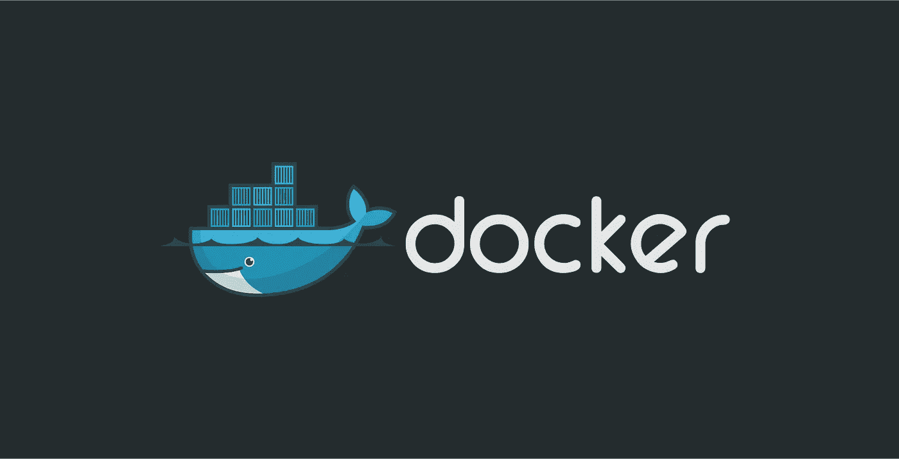
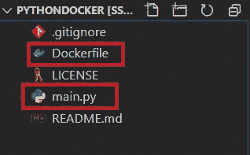

# 在 WSL 2 中运行您的第一个 Docker 容器

> 原文：<https://levelup.gitconnected.com/running-your-first-docker-container-in-wsl-2-22c71b24038>



这是第 2 部分，我将指导您如何在 WSL 2 中创建和构建您的第一个 Docker 容器。如果你还没有安装 Docker 和 WSL 2，请浏览我之前的博客[这里](/i-ran-a-docker-container-inside-windows-subsystem-for-linux-fce0b6e28c08)。

前面我们学习了如何安装 WSL 2 和 docker，但是掌握如何在 docker 中构建应用程序的基础知识是很重要的

现在，创建 Docker 容器有两种方法:

1.  我们创建我们的项目，然后通过添加 Dockerfile 来“Dockerize”应用程序。
2.  在第二种方法中，我们首先使用一个标准的 Docker 容器，然后在容器内部创建应用程序。

在今天的教程中，我将向您介绍在容器中直接创建应用程序的步骤。现在，假设我想创建一个 Python 应用程序，我需要一个已经安装了 Python 的容器。

如果你在理解下面的步骤时遇到任何问题，你可以去这个博客的知识库[这里](https://github.com/madhuresh97/pythonDocker)。

我们今天将运行一个简单的应用程序，以便您熟悉 Docker 的工作方式，然后您可以继续运行任何大型应用程序。

本教程的目的是创建一个在控制台中显示句子的 Python 程序。这个程序必须通过 docker 文件启动。

你会发现，一旦你理解了这个过程，它并不复杂。

首先，我们必须创建一个项目文件夹，其中主要包含两个文件:

1.  main.py
2.  Dockerfile 文件



创建的两个文件的屏幕截图

> 注意:“Dockerfile”没有任何扩展名，重要的是，该文件的名称必须与 Docker engine 所提到的名称完全相同，以获取要构建的映像的依赖关系。

我在 main.py 中写了一个最简单的语句

```
print("Hello world from Docker!")
```

我们将在控制台上打印，但不使用安装在操作系统中的 python，而是使用安装在 Docker 容器中的 python。

我们的目标是发布 Python 代码。

为此，我们的 Docker 必须包含启动 Python 所需的所有依赖项。

创建 Docker 文件的第一步是访问 DockerHub 网站。这个网站包含了许多预先设计好的图像来节省你的时间(例如:所有用于 linux 或代码语言的图像)。

现在我们需要设置 Docker 容器，在 Docker 文件中为其编写指令。

因此，我们从 docker hub(托管所有官方 Docker 图像的在线市场)获取最新的 python docker 图像。为了从 Docker hub 获取最新的图像，我们需要在 Docker 文件中声明以下内容。

```
FROM python:latest COPY main.py / CMD [ "python", "./main.py" ]
```

所以让我解释一下 docker 文件中的 3 行代码

这里，我们使用一个基本映像启动 Dockerfile 文件。关键字是“FROM ”,然后是您想要从 Docker Hub 中提取的图像名称。在我们的例子中，我们想要导入 python 图像。所以我们写‘python’作为图像名，而‘latest’是版本的标签。

现在我们需要将我们的 python 文件复制到我们刚刚提取的图像中。我们使用关键字“COPY”来完成这项工作，后跟我们想要复制的文件的名称。第二个参数“/”是将文件放在图像上的路径。这个“/”表示我们将把文件复制到映像的根目录(Docker 容器)。

最后，我们定义了运行映像时要启动的命令。我们使用的关键字是“CMD”。该命令将执行“python。/main.py "。

总之，我们定义了 Docker 容器要遵循的步骤。

# 最后步骤:

一旦您的代码准备好了，docker 文件也写好了，您所要做的就是创建您的映像来包含您的应用程序。

```
docker build -t python-test .
```

'-t '选项允许您定义图像的名称。在我们的例子中，我们选择了“python-test ”,但是您可以放置您想要的内容。

现在，映像已经创建好了，代码可以开始运行了。我们将使用 docker run 命令。

```
 docker run python-test
```

您需要在“docker run”命令后输入图像的名称。

就这样，就这样！您通常会看到“Docker 的 Hello world！”显示在您的终端上。😁

至此，我们结束了 2 部分系列教程，您可以开始使用 WSL 2 中的 Docker 容器。希望你现在对我们如何使用 Docker 容器有一个基本的概念。