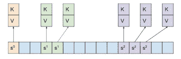
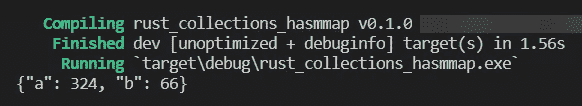
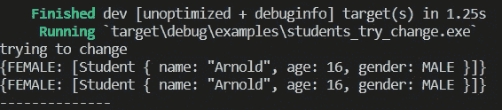
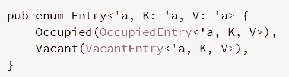
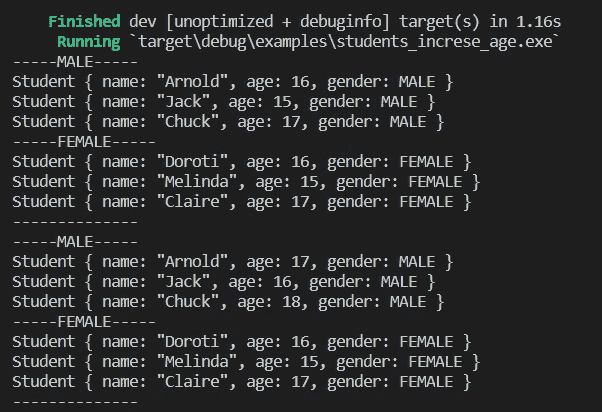
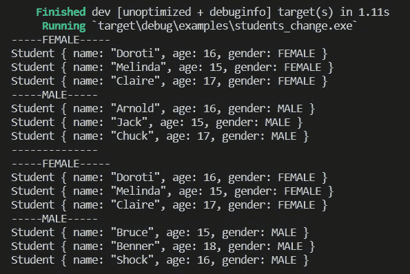

# Rust Adventures:集合介绍—哈希映射

> 原文：<https://levelup.gitconnected.com/rust-adventures-introduction-to-collections-hash-maps-53ccc5e5a214>

这次我们继续我们的冒险者通过[铁锈](https://www.rust-lang.org/)土地和[散列地图](https://en.wikipedia.org/wiki/Hash_table)！

这种集合真的很有用，可以让你的程序更快，我们去看看怎么样。所有的代码你都可以在这里找到。

# 什么是哈希映射？

哈希映射是所有编程语言中非常常见的结构。有人称之为字典、哈希表等。基本思想是有一个指向一个值的键。这个键由一个映射我们数据的[散列函数](https://en.wikipedia.org/wiki/Hash_function)处理。返回结果被称为哈希，这是算法跟踪数据的方式。

[https://abseil.io/blog/20180927-swisstables](https://abseil.io/blog/20180927-swisstables)

有了这把钥匙，你可以非常快速地检索数据。在[大 O 记法](https://en.wikipedia.org/wiki/Big_O_notation)中，复杂度平均为 *O(1)* ，最坏情况下为 *O(n)。*

# 创建哈希映射

它非常类似于一个矢量。我们可以使用`new`函数，仅此而已。

像向量一样，因为我们在编译时不知道它的大小，所以值存储在堆中。与 Vectors 不同，你需要用`use std::colelctions::HashMap`从 standard 导入库。这些键也必须是同类的，换句话说，它们必须是同一类型。

# 哈希映射的基本操作

像向量一样，我们可以从哈希表中读取、插入、更新和删除值。Rust 只是给了我们一个 API，让我们检查一下。

## 读取和插入元素

要将值放入哈希表中，我们不仅需要决定要处理的值，还需要决定哪种元素可以被定义为标识一个或多个值的键。

例如，让我们创建一个学生列表。我们会知道他们每个人的名字、性别和年龄。有人想把他们按性别分组，然后在以后的报告中查看男女学生的名单。

这将是我们的基本结构。现在我们做一些逻辑来读一个向量，把学生按性别分组。

逻辑非常简单:

*   首先，我们创建一个新的哈希映射
*   性别的每一种可能性都将是我们的键，而值将是一个空向量。为了插入它们，我们使用`insert(key, value)`功能。
*   迭代学生
*   `get_mut`将尝试在我们的哈希表中找到这个学生的性别，如果他找到了，返回`Some(Vec<Student>)`否则返回`None`。它返回的向量是可变的，所以我们可以改变它的值
*   `map`将获得现值，而`push`将该学生纳入该组。如果没有，它什么也不做，这在这个程序中是不可能的。`map`要求使用 clojure，所以我们使用了 lambda 表达式。

要使用散列映射，您可以使用一些不同的`get`方法，将一个键作为参数传递。结果就是您可能想要使用的值。

**更新哈希映射中的值**

如果我们想改变价值观呢？这很简单，也完全可能。

尽管键的数量和它们携带的值是可增长的，但是每个键只能有一个值。所以你有一些选择:

*   用新值更改当前值
*   忽略新值并保留当前值
*   根据新值更改该值

在第一个例子中，我们使用方法`initialize_gender`将一个新的向量放入一个不存在的键中。测试`try_to_modify`方法是否:

*   初始化母密钥
*   在里面放一个值
*   打印结果
*   他们再次尝试初始化母密钥
*   再次打印结果

如你所见，结果是一样的。发生这种情况是因为`entry`。当我们称它为枚举[条目](https://doc.rust-lang.org/beta/std/collections/hash_map/enum.Entry.html)时:

[https://doc . rust-lang . org/beta/STD/collections/hash _ map/enum。Entry.html](https://doc.rust-lang.org/beta/std/collections/hash_map/enum.Entry.html)

它有两个选项，`Occupied`当我们有密钥时，和`Vacant`当密钥不存在时。`or_insert`方法的行为取决于输入的结果。如果它被占用，它什么也不做，否则它将插入传递的参数。

我们可以使用 ti 安全地插入值，例如:

现在考虑这个问题:我想把所有男同学的年龄加一。我们怎么能这样做呢？

该算法使用可变引用`entry`返回，对于每个学生，我们将年龄增加 1。结果如下所示:

现在，我们可以讨论的最后一件事是值的替换。我们可以假设到了年底，班级会发生变化，我们需要改变学生名单，所以让我们开始吧。

`insert`方法使它变得简单。它会将值放入传递键中，如果它有内容，同样会被新的级别所替换。

# 结论

哈希映射是一个很好的工具。你可以做缓存，组织你的向量，对一些问题有很好的表现。有了 O(1)复杂度，你可以非常快速地处理非常大的数据集。

就这样，我们继续探索铁锈。在我们的下一篇文章中，我们将讨论字符串，并结束这个系列。

我希望你和我一起享受它！

 [## victorinno 的 CodersRank 简介

### 这是什么？这代表了你目前的经历。它通过分析您连接的存储库进行计算。由…

profile.codersrank.io](https://profile.codersrank.io/user/victorinno)