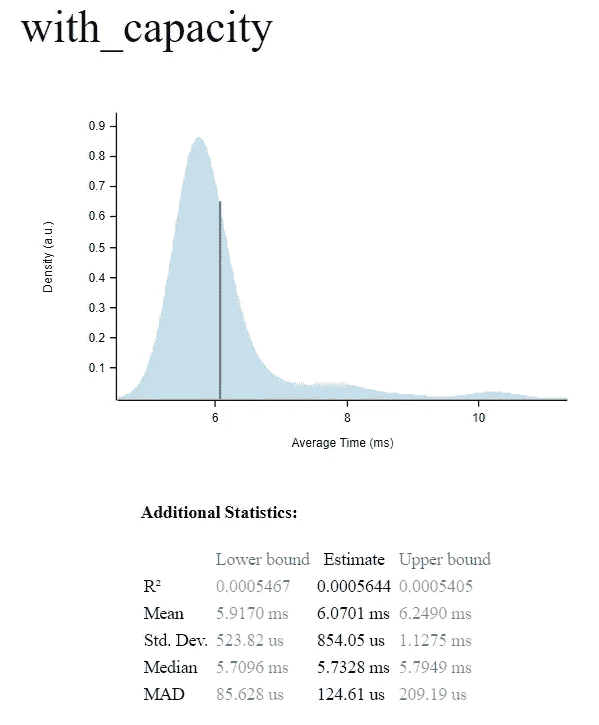
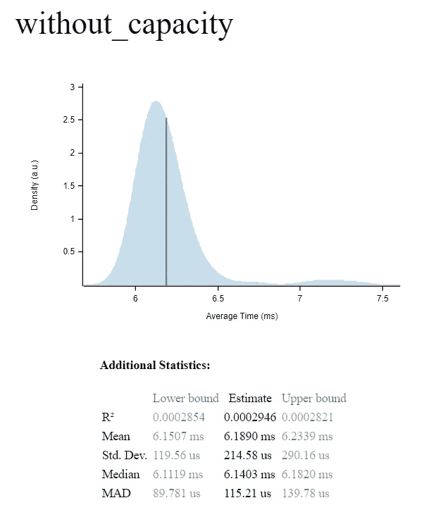

# Rust Adventures:收藏简介—矢量

> 原文：<https://levelup.gitconnected.com/rust-adventures-introduction-to-collections-vector-ce916dc21820>

嗨，伙计们！让我们继续我们在生锈的 T2 土地上的旅程。

今天我们将介绍[系列](https://en.wikipedia.org/wiki/Collection_%28abstract_data_type%29)。这是每一种编程语言的核心。

# 但是什么是收藏呢？

在之前的一篇文章中，我们讨论了 Rust 所有权和变量值。变量是存储我们的值的内存位置。如果你想做一个简单的程序来计算一个学生笔记的平均值。

假设我们有三个学生，让我们编写一点代码:

这看起来不错，但是一个新学生在年中来到班上怎么办呢？我们总是可以增加一个变量，但是学生的数量会增加很多，这是不合理的。如果有人要求我们对值进行排序？随着我们对新功能需求的增加，问题也随之而来，那么现在该怎么办呢？

## 拯救收藏

集合通过在内存中保留一个空间来放置值组来解决这个问题。我们可以创建一组学生，而不是为每个学生创建一个固定变量。

Rust 的基本结构是[向量](https://doc.rust-lang.org/std/vec/struct.Vec.html)。所以我们的程序会改变来创建这个结构。

如果你想用初始值创建它，使用`vec!` [宏](https://doc.rust-lang.org/1.7.0/book/macros.html):

或者我们可以用初始值 0 来做，然后再加上这些值。我们需要声明它是可变的。

现在，为了计算平均值，我们可以使用[迭代器](https://doc.rust-lang.org/std/iter/trait.Iterator.html)特征。它包含处理集合中的值的各种方法。

现在，我们可以随心所欲地玩弄这些价值观，而无需付出太多努力。

# 集合主要特征

为了有效地使用集合，你应该能够插入、更新、删除和读取其中的值。Vector 有一个简单的 API 来解决这些问题。

## 从向量中读取值

要读取一个值，可以使用 Java array [x]这样的语法，其中 x 是索引。

这种方法容易出错，因为 Vector 在编译时没有已知大小。你可以传递一个错误的索引，代码就会死机。

更安全的方法是使用返回选项的`get(x)`函数。在 Rust 中没有空值。您的代码中不会有任何 [NullPointerException](https://docs.oracle.com/javase/7/docs/api/java/lang/NullPointerException.html) 或[ArrayIndexOutOfBoundsException](https://docs.oracle.com/javase/7/docs/api/java/lang/ArrayIndexOutOfBoundsException.html)。

期权告诉我们，在我们刚刚传递的索引中没有值。当它发生时，将返回 [None](https://doc.rust-lang.org/std/option/enum.Option.html#variant.None) ，否则将返回 [Some](https://doc.rust-lang.org/std/option/enum.Option.html#variant.Some) 。这使得我们的代码更安全、更健壮。

## 将值插入向量

要包含项目，您可以使用`push`方法。这将把传递的值放在向量的末尾。

如果想要的效果是将一个值放在一个特定的索引中，你应该使用`insert(x,y).`，这将在想要的索引中插入一个值，并将所有的下一个值向右移动。

要添加一个以上的值你可以使用`extend_from_slice.`片被在线读取包含一组值的变量。要创建一个，你可以使用语法`&[]`或者在向量前面使用`&`信号。

## **从向量中删除值**

每个集合都需要删除不再需要的值。Rust 在 Vector 中实现了一系列功能来实现这个目标。最基本的是`remove`和`remove_item.`第一个使用值索引，第二个尝试定位值的第一个出现并删除它。`remove_item`是一个只在[夜间开放的实验 API](https://github.com/rust-lang/rust/issues/40062) 。

在一些计算问题中，你可能想要统一`get`和`remove`函数。当您检索该值时，它将从集合中移除。这个函数叫做`pop`，rust 也有这个函数。`pop`收集最后一件物品并移除。用于 [LIFO](https://pt.wikipedia.org/wiki/LIFO) 题。

# 收藏的容量

铁锈的收藏有长度和容量。长度是添加到集合中的值，而容量就像是集合为容纳这些值而创建的房间。让我们更多地了解他们。

## 关于容量和长度

每个向量都是指针、容量和长度的三元组。当你用`new`方法创建一个向量时，你的容量为 0，长度为 0。当我们使用`vec!`宏时，容量和长度将等于项目数。

## 让我们考虑一下性能

当你给向量增加更多的值，并且达到它的容量时，算法将增加它。这是有代价的，会让你的程序变慢。

因此，考虑性能何时对您的系统很重要是很重要的。让我们使用[标准](https://github.com/bheisler/criterion.rs)来看看它如何影响我们代码的性能。

我在 criterion 中运行了上面的代码，发现了以下结果:

这需要更多的时间，但对于大多数系统来说，这似乎不会影响性能。如果您使用的是关键性能系统，那么这几毫秒的时间会产生很大的影响。

你可以在这里找到项目[。](https://github.com/victorinno/rust_collection_example1)

# 结论

我们已经介绍了向量的基础，在下一篇文章中，我们将会看到更多关于 [HashMaps](https://doc.rust-lang.org/std/collections/struct.HashMap.html) 的内容。

集合对于计算问题很重要。在程序员的日常工作中，你会和他们打交道，rust 给人留下了深刻的印象。

我希望你们都喜欢它，下次再见！

如果你喜欢我的作品，请支持！♥

要了解 claps 如何工作，请单击此处的。

要联系我:

 [## victorinno 的 CodersRank 简介

### 这是什么？这代表了你目前的经历。它通过分析您连接的存储库进行计算。由…

profile.codersrank.io](https://profile.codersrank.io/user/victorinno)