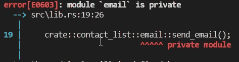

# Rust Adventures: Rust 项目管理，了解包装、板条箱和模块

> 原文：<https://levelup.gitconnected.com/rust-adventures-rust-projects-management-understanding-packages-crates-and-modules-b3bcde2eb1c>

> “设计糟糕的代码通常需要更多的代码来做同样的事情，这通常是因为代码在几个地方做了同样的事情。”
> ― **马丁·福勒**

嗨，伙计们！我把学习 [Rust](https://www.rust-lang.org/) 作为 2020 年的目标。

今天我们将讨论 Rust 项目的结构以及如何组织你的代码。虽然货物工作空间也在这个等式中，但为了简单起见，我们不讨论它。

# 介绍

当我们写小程序时，很容易在我们的大脑中跟踪整个功能。要做简单的演算或练习一些算法，你可以只用一个源代码文件做任何事情，问题是当你需要添加更多的功能时。

在普通的软件项目中，你需要写更多的东西。源代码的数量将会急剧增加，你不可能记住你头脑中的所有东西。因此，你需要以一种有意义的方式组织一切。

这个组织必须封装实现，以向编译器和程序员显示一切在哪里，以及它是如何组织的。

# Rust 代码管理

Rust 解决这个问题的方法是在一个[模块化系统](https://en.wikipedia.org/wiki/Modular_programming)中创建 4 个层次结构:

1.  **包装**:一个货物功能，可以让你建造、测试和共享板条箱。可以考虑这个项目。
2.  **Crates** :它是一个模块树，可以生成可执行文件或库
3.  **模块和用途**:它负责你的源代码的范围，让你组织你的功能的隐私
4.  **路径**:这是一个命名系统，你用它来命名结构、函数或模块。

让我们看看他们每一个人。

**套餐**

一个包是一组板条箱，甚至只有一个，提供一些功能，它必须包含一个“Cargo.toml”文件来描述如何构建和编译这些板条箱。

该包可能包含 0 个或 1 个库板条箱，但可能包含许多二进制板条箱。作为最后一个细节，它必须至少有一个板条箱。

**板条箱**

一个板条箱可以有两种类型:二进制或库。这个包将有一个根目录，它是 Rust 编译器启动的源文件，并使它成为根模块。

让我们用 Cargo 创建两个简单的程序，以便使用命令`cargo new binary-example`更好地理解它的工作原理。

Cargo 需要一个“src”文件夹，所以默认情况下它会创建这个文件夹，里面会包含所有的源代码,“main.rs”文件是一个板条箱，在这里是一个二进制和根板条箱。按照惯例，Cargo 希望使用这个名称的文件是一个二进制板条箱。

现在我们稍微改变一下，使用命令`cargo new library-example --lib`。

和以前一样，我们有相同的“src”文件夹，但是现在源文件变成了 lib.rs。在`cargo new`命令中的“lib”参数表示我们想要一个库作为我们的根箱，默认情况下,“lib.rs”是预期的。库的名称与包的名称相同，这就是为什么每个包中必须有零个或一个库的原因。

尽管没有直接执行此操作的命令，但我们可以创建一个包含二进制文件和库文件的包:

他们两个都会有包的名字。即使我们只限于这一个库箱，也可以有更多的二进制，但它必须在“src/bin”中。

正如你所看到的,“src/bin”中的每个 rust 文件都创建了一个可执行文件以及“main.rs ”,但是 lib.rs 创建了一个“rlib”文件，表示一个 Rust 库。

板条箱帮助我们封装防止冲突的功能。让我们找一个板条箱[日志](https://crates.io/crates/log)库，它有一个特性叫做[日志](https://docs.rs/log/0.4.8/log/trait.Log.html)，我们可以在我们的板条箱内使用这个特性，甚至创建一个同名的新板条箱，因为它们都在不同的板条箱中，所以不会有任何冲突。发生这种情况是因为机箱的功能在它自己的范围内被命名。

# 模块

模块可以将你的机箱组织成具有可读性和可重用性的功能组，它还可以控制可见性的范围，决定什么是公共的或私有的，因为每个模块都有一个范围。

让我们模拟一个联系人列表:

我们可以用`mod`关键字定义一个模块。一个模块内部可以有其他的模块来创建某种层次结构，比如一棵树，因为我们可以说“email”是“contact_list”的子模块,“contact _ list”是“email”的父模块,“手机”也是如此。

但现在，我们可以更好地组织我们的代码，如果这是一个向联系人发送电子邮件的功能，我们知道我们必须将它放在“电子邮件”模块中，因此我们的代码在组织和可重用性方面有所提高。

# 小路

Path 是在模块中查找项并将其带到当前范围的方法。它有两种形式:

*   **绝对**:从根机箱开始，如果是外部的我们就用它的名字，如果不是可以用`crate`关键字来表示实际的机箱。
*   **相对**:从当前模块`self`、`super`或当前模块内的任意标识符开始

路径的标识符由`::`分隔。让我们在例子中演示如何使用这个语法调用`send_email`函数。

如你所见，这是一个问题，我们使用了绝对和相对路径，但是电子邮件部分警告我们一个编译错误。

Rust 抱怨电子邮件模块是私有的。记得我们说过，模块定义了可见性的范围，默认情况下一切都是私有的。因此，要改变这一点，我们不仅需要使模块，而且需要使我们想要使用的函数对公众可见，如果我们只改变模块，它不会工作，因为函数仍然是私有的，只能在`email`模块中使用。

所以让我们改变它的可见性:

现在我们的编译器没有抱怨。

还有其他使用路径的方法，例如，如果我们想从一个联系人那里获得默认签名，这个联系人是`contact_list`模块中的一个项目，我们应该使用`super`关键字来访问它。

# 将模块纳入范围

我们刚刚展示了如何在作用域之外使用模块，但是如果你必须写下调用函数所需的所有内容，这将是令人厌烦的，并且会使你的代码可读性更差。

所以为了解决这个问题，有了`use`关键字，用它你可以把你想要的模块带入你正在工作的范围。语法类似于我们已经做的，你只需要把用法放在模块体内部的路径前面。

现在我们可以在“email”模块中的任何地方使用`get_default_signature()`方法。我们甚至可以在这里使用`super`。

如果你想导入一个模块，它是另一个模块的子模块，你必须表达路径直到它。

我们甚至可以用`as`命令给`use`命名，当你有来自不同模块的多个项目，但是有相同的名称时，这很有用。

# 重新导出模块

当我们使用 path 将一个模块引入作用域时，我们为它创建一个私有名称，我们可以用`pub use`关键字为其他模块导出这个名称。

这将允许我们以一种更简洁的方式来表达目标模块的一种不太常见的用法，这样其他程序员就能理解您所期望的具体变化。

# 在不同的文件中组织模块

到目前为止，我们只创建了一个有多个模块的源代码，但这不是一个项目应该如何创建。在现实世界的软件中，你有不同的源代码组织在文件夹中，这些文件夹以一种更有组织的方式封装了你的功能。

Rust 有办法将模块放在一个单独的文件中。为此，让我们稍微修改一下代码，将模块分开。

我们从“lib.rs”中删除了这些模块，并将它们放在一个单独的文件中。

现在让我们尝试在“lib.rs”中调用它们，首先让我们用`mod`关键字将它们纳入范围。

现在`test`方法将调用它们所有的方法。

这里似乎有些不对劲…正如你所看到的，要调用这个方法，我们必须重复两次模块名。发生这种情况是因为 Rust 自动使用文件名作为模块名，所以每个文件本身就是一个模块，所以这些文件中的`mod`声明不再需要。

现在更好了，但可能会更好。所有东西都在同一个文件夹中，文件很少，这不是一个大问题，但是当你的项目增长到数百个文件时，如果没有一个适当的组织，就很难找到任何东西。因此，现在我们将把所有内容放在一个名为“联系人”的文件夹中

您应该注意到“mod.rs”文件，它的目的是声明我们将要导出的模块。

为了调用它们中的每一个，我们必须将模块`contact`引入范围并利用我们想要的路径。

现在我们的代码以和以前一样的方式工作，甚至更有组织性。我们可以使用 Glob 操作符“*”来导入 contact 中的所有模块。

在这个例子中没有区别，但是在其他项目中，您可能会将一些不需要的东西纳入范围，所以要小心使用。

# 外部板条箱

最后，我们将讨论外部板条箱。你还记得我们用木箱做例子吗？为了在我们的代码中引入它，我们必须修改我们的“Cargo.toml”文件，从 [crate.io](https://crates.io/) 下载并编译它。姑且把它当做一种依赖吧。

当我们编译项目时，它会带来日志库和它声明的所有依赖项。

现在我们将能够在我们的代码中使用它，但是我们不能从板条箱开始创建路径，因为我们正在访问一个外部板条箱，所以我们只需要调用我们声明的目标板条箱的名称，在这个例子中是`log`。

# 结论

组织你的代码，使其清晰易读是每一个成功软件的关键概念。Rust 为我们提供了一个非常高效和富有表现力的模块系统来管理我们的项目，并创造了一些易于维护和开发的东西。

所以还是做各种项目，练锈吧！和你们一起旅行很有趣！

下次见！

如果你喜欢我的作品，请支持！♥

要了解 claps 是如何工作的，点击[这里](https://help.medium.com/hc/en-us/articles/115011350967-Claps)。

要联系我:

 [## victorinno 的 CodersRank 简介

### 这是什么？这代表了你目前的经历。它通过分析您连接的存储库进行计算。由…

profile.codersrank.io](https://profile.codersrank.io/user/victorinno)