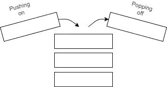
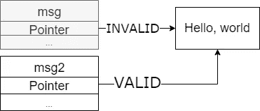
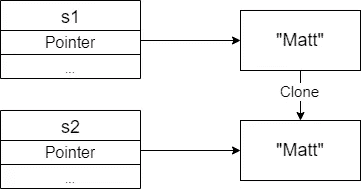

# 生锈和所有权

> 原文：<https://levelup.gitconnected.com/rust-and-its-ownership-model-effc41e3951>


在过去的几年里，Rust 有了很大的发展，以至于在 2020 年被选为 [Stack overflow 最受欢迎的语言](https://insights.stackoverflow.com/survey/2020#technology-most-loved-dreaded-and-wanted-languages-loved)。比亚军打字稿多近 20%。


Stackoverflows 2020 年最受喜爱编程语言调查结果截图。

这个由两部分组成的系列将对 Rust 的主要卖点之一进行高度概述；它缺少垃圾收集器和所有权机制。我们将在第一部分讨论堆、栈和变量所有权。第二部分将着眼于借鉴和参考。

# 背景和先决条件

在进入 Typescript 世界之前，我有静态类型语言(主要是 Java)的背景。我对 Rust 的世界相当陌生，只是在 2020 年末才开始接触它。

在我们开始之前，我希望你对至少一种语言有很好的理解，并且理解一些概念，比如垃圾收集和内存利用。

# 堆栈和堆

在大多数高级语言中，你被抽象成不知道堆和栈。堆栈和堆是任务的临时存储。它们都有一些关键的区别，这些区别决定了何时应该使用它们。优点和缺点。

**栈**以一种类似栈的数据类型存储数据，它遵循后进先出(LIFO)的规则。将数据添加到堆栈中称为压入堆栈，移除数据称为弹出堆栈。存储在堆栈上的数据必须具有固定的大小，并且不会发生任何变化。



堆栈的可视化示例

未知大小或可修改的数据存储在**堆**中，而不是堆栈中。数据是动态存储在堆中的，rust 进程会请求一些空间，内存分配器会在堆中为数据分配一个位置。然后，内存分配器将返回一个地址，这是数据的位置。


铁锈堆的形象化

推入堆栈比处理内存分配器快得多，因为推入堆栈不需要为数据寻找空间，然后执行必要的簿记任务来准备任何后续分配。

弹出堆栈也比处理堆快得多。相反，当您想要访问堆时，您必须跟随一个指针到达您所请求的数据所在的位置。

为什么这在铁锈的世界里很重要？取决于数据是存储在堆中还是堆栈中，rust 如何处理内存分配、释放和所有权。现在，我们应该记住动态数据存储在堆中，而硬编码数据存储在堆栈中。

# 所有权和范围

Rust 中的每个值只能有一个所有者，当值的所有者超出范围时，该值将从内存中删除。范围通常由花括号定义，在 Rust 中，这与大多数其他语言没有什么不同。

```
fn sayHello() {   
    let msg = "hello";
    // do stuff with msg
 }

 // msg now out of scope.
```

通常，会发生两种情况中的一种。如果语言有一个垃圾收集器，那么这将释放内存。如果这种语言没有像 C 语言那样的垃圾收集器，你就必须告诉你的程序去释放内存，这是为了防止内存错误在你的程序中发生，比如内存泄漏。

然而，锈从不同的角度接近它。Rust 通过识别超出范围的变量，在编译时计算出何时释放内存。Rust 还会发现内存错误，如泄漏或访问编译时超出范围的内存，并向您发出警告。

这个概念很简单，当变量超出范围时，rust 会释放内存。Rust 编译器为您在代码中添加了解除分配功能。

```
fn sayHello() {   
    let msg = "hello";
    // do stuff with msg
 }

 // msg now out of scope AND the memory has been freed in the heap
```

这个概念看起来简单明了，事实也的确如此。然而，在某些情况下，在更复杂的情况下，代码的行为可能是意想不到的。

```
fn sayHello() {   
    let msg = String::from("hello");
    let msg2 = msg;
    // do stuff with msg2
 }
// free msg memory
// free msg2 memory??
```

注意:我们使用“String::from ”,它强制我们的代码将值存储在堆中。

这里我们将 msg 分配给 msg2，然后我们可能会想，当它们超出作用域时，它们也应该从内存中释放？不完全是。两个变量都指向同一个数据位，因此当其中一个超出范围时，您可能希望数据被释放，而当第二个超出范围时，您可能希望出现错误。Rust 很聪明，它通过在初始化第二个变量指针时使第一个变量指针“msg”无效来克服这个问题。

让我们看另一个例子:

```
let msg = String::from("Hello, world");
let msg2 = msg;println!("{}", msg);
```

在这里，当我们试图打印消息时，我们得到一个错误，说“值已经移动”。这是因为 Rust 使 msg 失效，当它超出范围时，通过两次释放相同的数据来阻止您犯运行时内存错误。事实是这样的:

```
fn sayHello() {   
    let msg = "hello";
    let msg2 = msg; // msg is now marked as invalid.
    // do stuff with msg2
 }
// msg is invalid
// free msg2 memory
```



生锈使指针失效的直观例子

如您所见，msg 和 msg2 从不同时指向相同的数据。相反，Rust 会使旧的指针失效，只留下最新的，这解决了 msg2 抛出内存错误的问题。

但是如果你想复制/克隆一些数据呢？好吧，Rust 有一个克隆特性就是用来做这个的。[特质](https://doc.rust-lang.org/rust-by-example/trait.html)不在本帖*击鼓*范围内。就把它们想象成可以为任何类型定义的方法。

```
let s1 = String::from("Matt");     
let s2 = s1.clone();
```

s2 将指向与 s1 不同的数据值。



克隆功能的可视化示例

# 所有权和职能

将变量传递给函数的功能类似于为值赋值的规则。例如:

```
fn main() {
   let name = String::from("Matt"); // name comes into scope.
   doSomething(name); // name moves into the functions scope. // if we try to use name it would throw an error.
}fn doSomething(myName: String) {
    println("My name is {}", myName); 
    // myName comes into scope and is used.
} // myName is now dropped, including the data.
```

这里，“name”被传递给函数 doSomething，它现在是该值的主要作用域。当 doSomething 完成时，初始数据将从内存中释放，如果您来自 Javascript 世界，这可能是一个意外的行为。为了能够重用变量，您可能希望返回值，以便能够将变量的所有权转移回父作用域。所以你可以这样修改上面的代码。

```
fn main() {
   let name = String::from("Matt");
   let name2 = doSomething(name);}fn doSomething(myName: String) -> String {
    println("My name is {}", myName); 
    myName // myName is returned.
}
```

但这有点反直觉，也有点乱。相反，Rust 有一个叫做 References 的特性。

第二部分将讨论 Rusts 引用和借用！