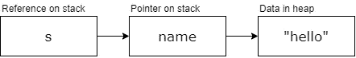

# 生锈和参考

> 原文：<https://levelup.gitconnected.com/rust-and-its-referencing-and-borrowing-b2e8aefc12d8>

这是 Rust 及其所有权、引用和借用模型介绍的第二部分。在这里阅读第一部分。第一部分向我们展示了当一个变量超出范围时，它将从内存中释放。然后我们看看在代码中传递变量时谁拥有它们。

# 引用

随着我们对所有权的了解以及将所有权传递给子例程，我们遇到了一种新的问题。当我们希望父函数保留变量的所有权时怎么办？一个简单的解决方案是我们返回初始变量，但这会变得混乱不堪。例如，下面的代码示例是反直觉的。

```
fn main() {   
   let s1 = String::from("hello");
   let (s2, len) = calculate_length(s1);
   println!("The length of '{}' is {}.", s2, len);
}fn calculate_length(s: String) -> (String, usize) {
   let length = s.len();
   // return both the string and length
   (s, length)
}
```

我们返回的是字符串和长度，但结果是，我们需要在 main 函数中声明一个新变量。代码仅仅工作是不够的，还需要可读。

Rust 允许您传递对变量的引用。这允许父函数保留原始变量的范围，同时允许子函数使用它。

```
fn main() {
   let name = String::from("Matt");
   let len = calculate_length(&name);
   println!("The length of '{}' is {}.", name, len);
}fn calculate_length(s: &String) -> usize {
   s.len()
}
```

代码中明显的区别是在将变量传递给函数时和在函数定义中使用了“&”。和号被称为引用，它们允许我们引用一个值而不转移它的所有权。



“&name”语法创建了对值名称的引用，但它并不拥有该值，这意味着当在 calculate_length 中删除范围时，Rust 不会释放内存。在 calculate_length 函数中，您还会注意到&String 类型定义，这表示该值是一个引用。

# 可变引用

将引用作为函数参数被称为**借用**，你可以把它想象成函数在借用值并将它归还。然而，如果您试图改变引用呢？

```
fn main() {
   let name = String::from("Matt");
   change_name(&name);
}fn change_name(s: &String) {
   s.push_str(" Bidewell");
}
```

这将导致编译器抛出一个错误，因为默认情况下，所有变量都是不可变的，它们的引用也是不可变的。相反，您需要明确声明引用是可变的。因此，根据我们对可变性的了解，我们可以对上面的代码做一点小小的修改，以获得想要的结果。

```
fn main() {
   let mut name = String::from("Matt");
   change_name(&mut name);
}fn change_name(s: &mut String) {
   s.push_str(" Bidewell");
}
```

我们必须将变量改为可变的，将引用改为可变的，并将函数定义改为接受可变的引用。然而，可变引用有一个限制，每个变量在作用域内只能有一个可变引用。这种限制是有目的的，因为它允许更好地控制使用，并有助于防止在编译时发生数据竞争。

数据竞争类似于竞争条件。当两个或多个指针同时访问相同的数据时，至少有一个指针用于写入数据，并且没有用于同步数据访问的机制，就会发生这种情况。

值得注意的是，您可以在不同的范围内进行多个引用，但是，它们不能同时存在。以下面的代码为例。

```
let mut name = String::from("Matt");
{
   let newName = &mut name;
   // do something with it.
   // end of scope newName drops dead
}let newName2 = &mut name;
```

在我看来，这看起来很糟糕，在更大的代码库中很难遵循，通过管理变量，你应该不会遇到这个问题。

要记住的最后一条规则是，在作用域中不能同时有一个可变引用和一个不可变引用。不可变的引用不会期望它的数据值改变，但是它们都在范围内，这是可能的。幸运的是，编译器会捕捉到这一点，并显示适当的错误消息。

# 摘要

引用是一种将变量传递给另一个函数而不必改变变量范围的方法。编译器还非常擅长捕捉与内存相关的错误，最终帮助您停止编写错误。我们还需要记住，在作用域中的任何给定时间，你可以有一个变量的可变引用或者无限多个不可变引用。


编码快乐！