# Rust:二叉树

> 原文：<https://levelup.gitconnected.com/rust-binary-tree-30efdd355b60>

## 构建和折叠表达式树

照片由[亚历克斯·佩里](https://unsplash.com/@alexperri?utm_source=medium&utm_medium=referral)在 [Unsplash](https://unsplash.com?utm_source=medium&utm_medium=referral) 拍摄

由于 Rust 变得如此受欢迎，并且积累了如此忠实的追随者，我决定放下我心爱的 JS，最近学习 Rust。我必须说，这不是一个心脏衰弱的旅程。幸运的是(尽管在一些罕见的情况下会产生误导),编译器是你最好的朋友——它几乎总是会告诉你哪里做错了，甚至会提供有用的解决方案。在你花了一段时间使用它并且克服了陡峭的初始学习曲线之后，你会开始喜欢 Rust——我喜欢！

今天我想实现我最喜欢的数据结构:二叉树。二叉树是一种典型的树——它由保存其(潜在深度)嵌套值的节点组成。二叉树的特殊之处在于它的节点只有两个子值:左边的*和右边的*和*。通常，二叉树用于表示数学表达式之类的东西，但也可以用于处理轻量级语法的解析。对于我们的实现，让我们的节点知道它们代表什么类型的操作也很方便。我们将努力使它通用，从而使底层结构类型不可知。下面是二叉树的一个简单表示:*

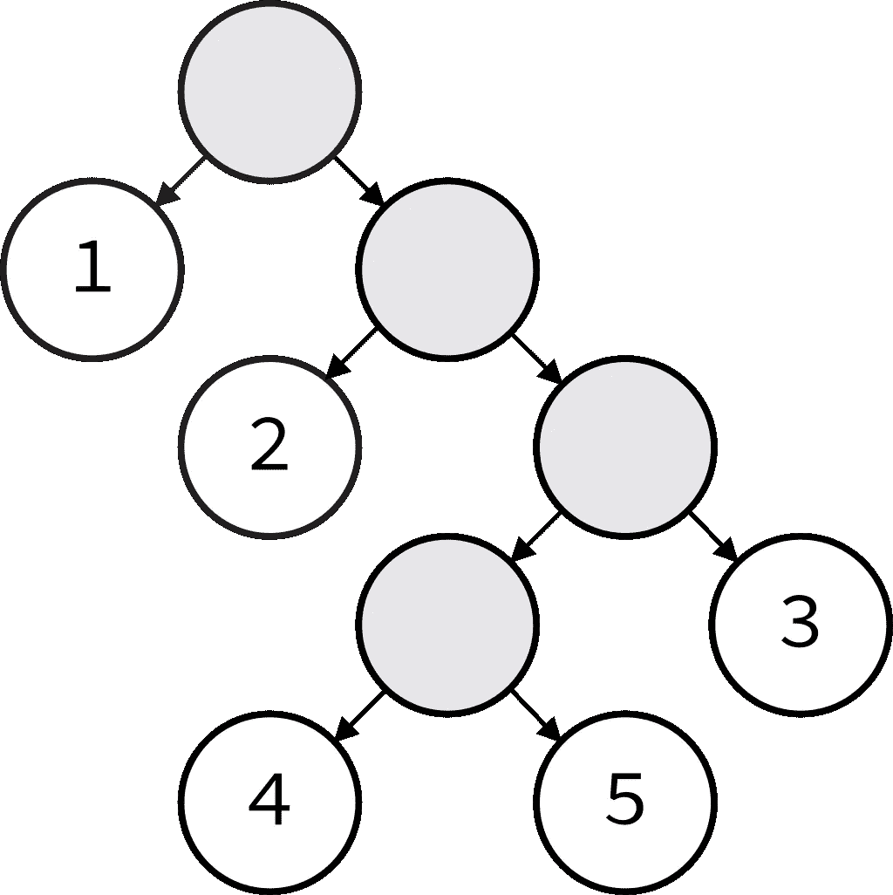

一棵异常标记的二叉树…

在此图中，终端节点带有数字。值得注意的是，二叉树是左偏的，深度优先。这意味着当您折叠一个二叉树时，在移动到右边的节点之前，评估将尽可能深入到第一个左边的节点，并且这些节点的左边的节点在其右边的节点之前，等等。，递归。我会边走边解释。

让我们想象一个表示节点数据的最小结构:

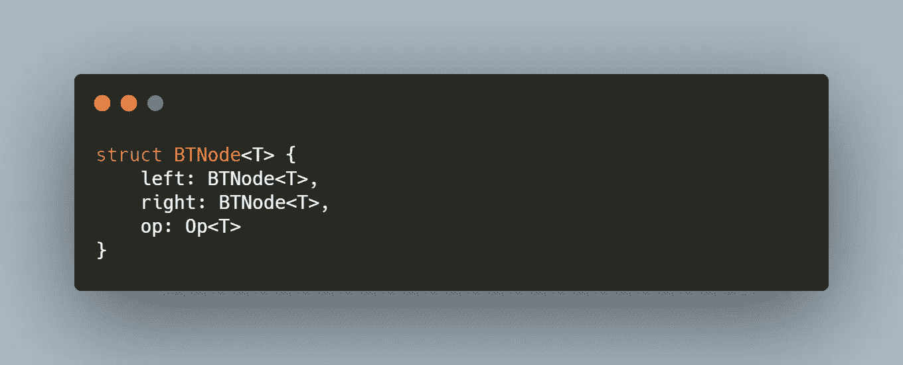

递归类型会让编译器生气。

…编译器马上就对我们发火了。结构不能直接包含对自身的引用(它变成了递归类型，这在 Rust 中是非法的)。但是方便的是，我们可以将递归节点放在一个`Box`中。“盒子”只是一种奇特的说法，“这是一个引用堆上对象的指针”。让我们看看这是否能解决我们的问题:

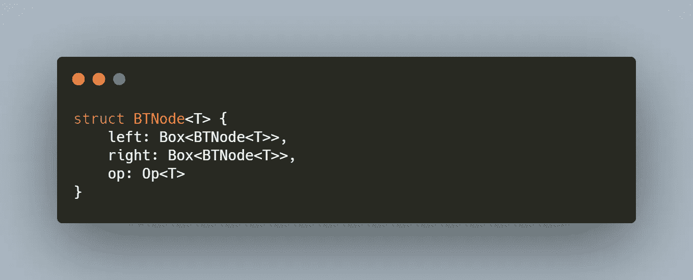

盒子给了我们一层间接性。

这就行了。我们的盒子增加了一个间接层，只存储一个指向我们的`BTNode`的*指针*，允许我们避开递归类型。那么 Op 呢？Op 将是一个`enum`，表示可以在我们的节点上执行的可能操作。对于这个例子，我们将坚持使用简单的算法:

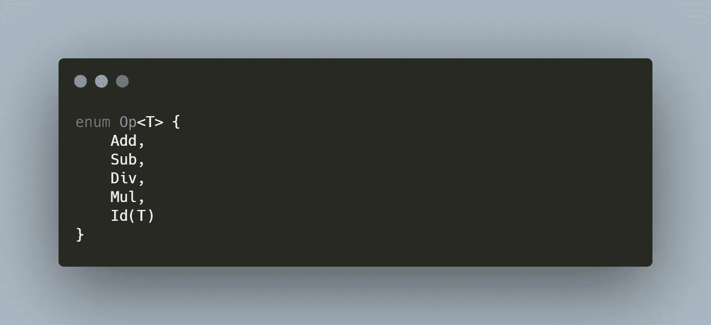

表示一些简单算术运算的枚举。

很简单。我们已经有了一些基本算术运算的变体。通知`Id(T)`？那个很特别。因为我们需要二叉树中的值是`BTNode`结构的实例，所以没有办法直接把`i32`放入我们的树中。这是一个问题，因为原始数据是我们期望的最终值。想象一下表情`(3 + 4) * (5 * 2)`。我们可以认为这是一棵有三个节点的二叉树。头节点是一个具有左右节点值的`Mul`节点。头部的左边节点是一个`Add`节点，左右值分别为 3 和 4。右边是 5 和 2 的一个`Mul`节点。这些原始数字就是我们所说的*终值*。

它被称为终值，因为它在末端。其中常规节点类似于*分支*，终端节点是*叶子。*当您到达一个时，在您的代码所经过的路径上没有更多嵌套层次可以下降，并且其中的值可以被解释为原始值而不是节点。为了从我们的节点获得终端值，我们必须利用我们的`Op::Id(T)`变量来存储数据。当我们这样做的时候，我们可能应该考虑我们的左右框中的节点在一个终端节点中可能是未赋值的。我们应该将它们分别包装在选项中，以说明这一点:

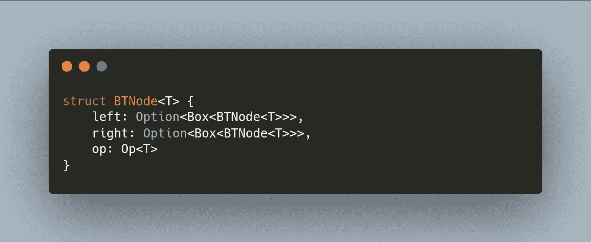

T 节点框选项…

我们现在已经定义了我们的节点，使得它们的子节点可以是一些装箱的值，或者没有。虽然看起来确实有点滑稽。不过，我们可以通过使用类型别名使它看起来更好一些:

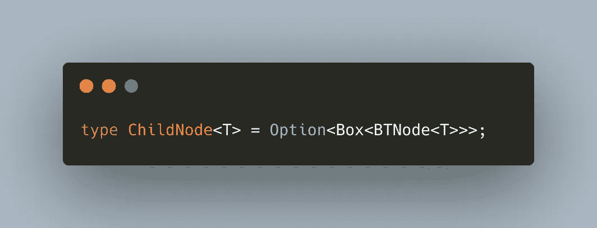

为我们的子节点声明类型别名。

我们可以将它放在代码的顶部，并在我们的`BTNode`中替换长版本。既然我们已经彻底考虑了如何定义一个节点，让我们定义一个树:

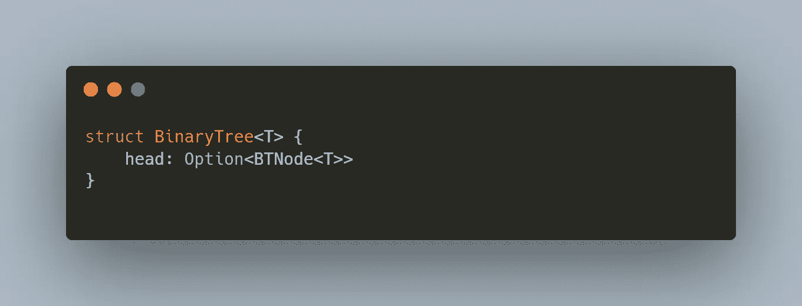

一个非常简单的结构。

由于我们已经花时间很好地定义了节点，所以这一部分很简单。我们的树要么是空的要么头是一些节点值。因为嵌套的节点是指向子节点的指针值，所以这就是我们描述树所需要的。现在我们已经处理了树的数据部分，让我们开始一些实现。我们从节点开始。

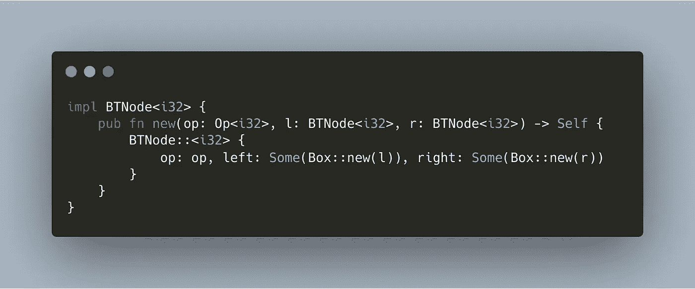

节点的构造函数。

很简单。我把它纵向展开，这样我们就有了一种方法来创建节点结构的实例。但是想象一下为每个节点声明“new”——这需要大量的输入！让我们抽象一下，创建一些专门的构造函数。

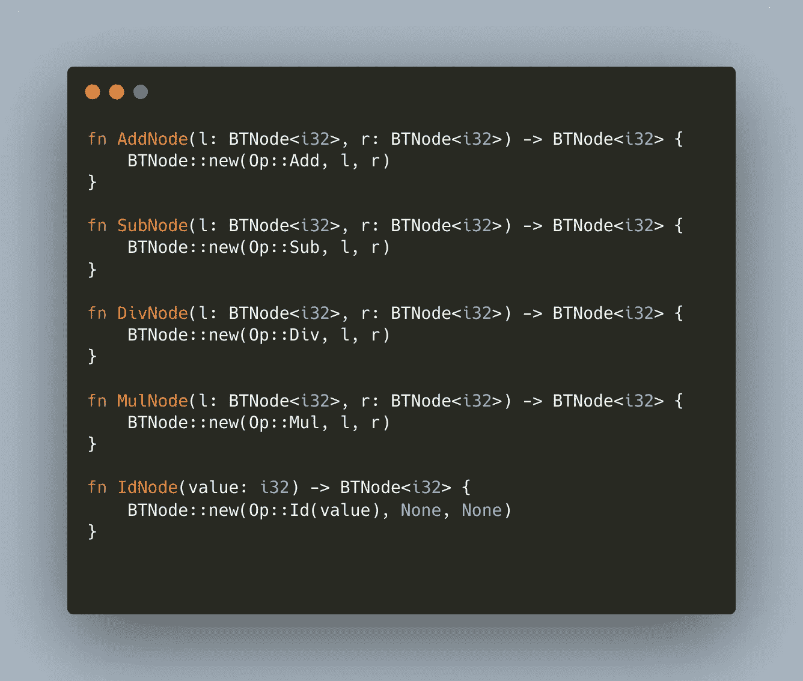

节点的专用构造函数。

这些函数中的每一个都构造了一个专门的`BTNode`版本，这将使得以后声明它们更加简单。它们都利用了原始的`BTNode::new`构造函数，除了`IdNode`——直接构造一个`BTNode`，因为它的左右节点值并不重要，它只关心它的`i32`值。

现在让我们考虑为二叉树实现一些功能。它需要有一个主要功能——将其节点折叠成一个值。现在让我们来写这个函数。

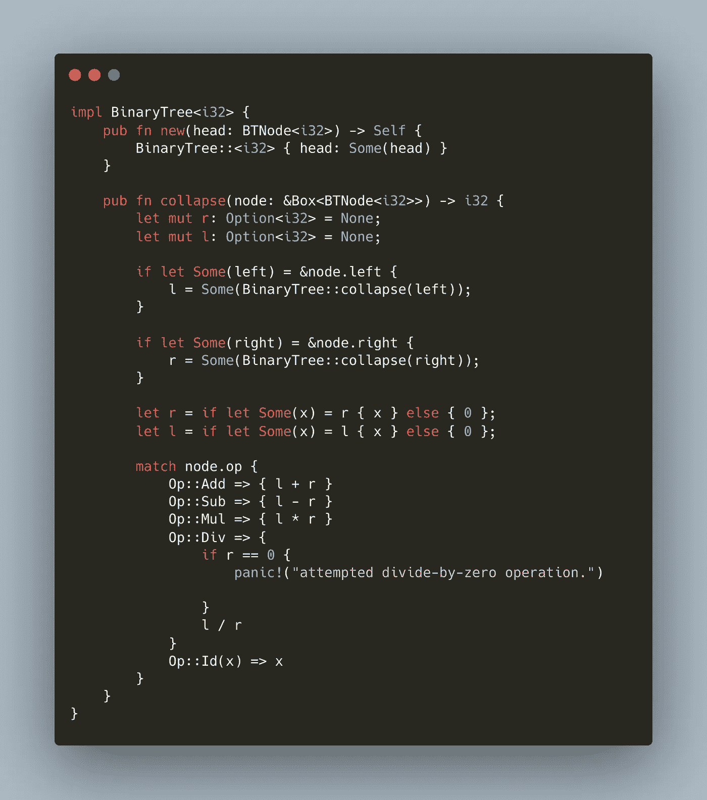

二叉树的崩溃。

我还包含了一个简单的构造函数。让我们浏览一下代码。查看我们的`i32`实现的签名，我们可以看到它采用一个指向节点的指针引用并返回一个`i32`。我们做的第一件事是声明一对可变的左和右`Option<i32>`值，并将其初始化为 None——我们可以在折叠子节点时重新分配这些值。我们在子节点上递归调用 collapse 来重新分配我们的左值或右值，当且仅当这些值中的任何一个都是非终端节点(不是`IdNodes`的节点)。然后我们使用`if let`和我们的左右值将值提取到`i32`中。在这个过程中，我们将变量`l`和`r`重新赋值为不可变的(当我们用`let`重新声明它们时)。最后，我们匹配节点的操作，组合并返回值(或者如果我们不小心被零除，则返回)。

让我们从这张图片创建一棵树:

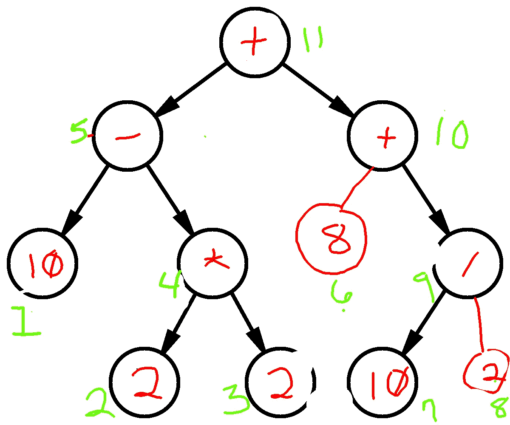

一个糟糕的符号(用我的手指写的)二叉树。

这代表了表达式`(10 - (2 * 2)) + (8 + (10 / 2))`。绿色数字表示我们的算法到达每个节点的顺序。红色符号是我们将要使用的节点值。

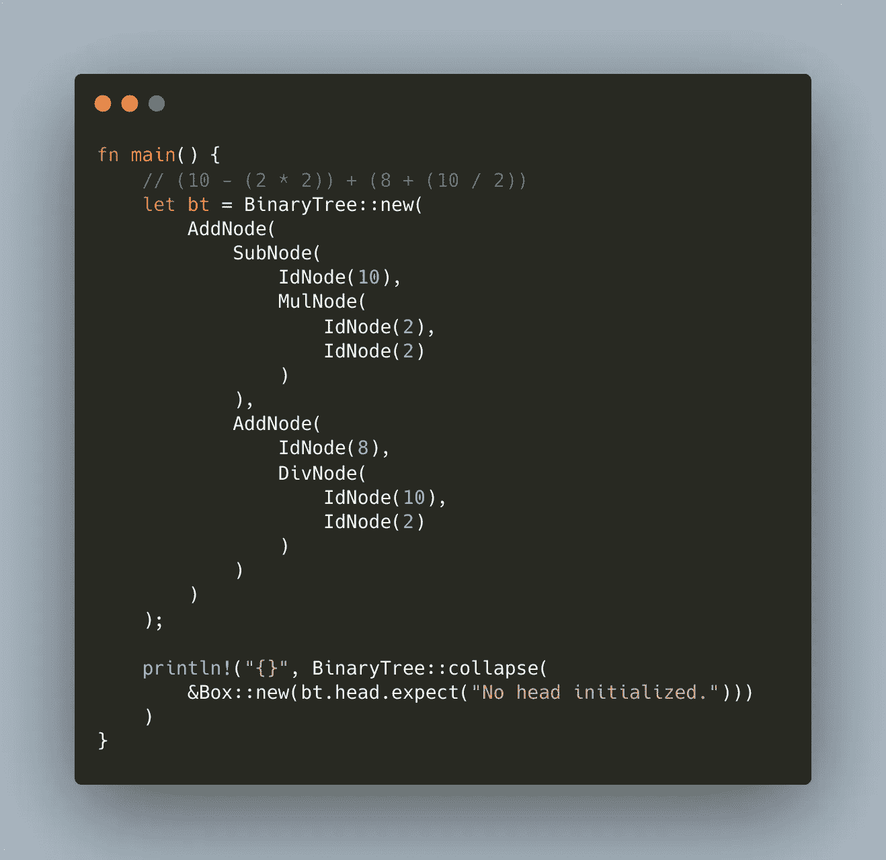

构建和折叠二叉树。

控制台应打印出`19`。正如我们所料，如果我们自己走过它。

**这里有一个** [**链接**](https://play.rust-lang.org/?version=stable&mode=debug&edition=2018&gist=1ed66ba070c1c4990525fe5fae9a5699) **到铁锈操场，你可以黑进去。**

这是一个简单的例子，但是想象一下我们的 Op `enum`代表了不同的东西。我们可以为除了`i32`之外的东西实现二叉树，并将它用于不同的目的。比如解析一个简单的脚本语法或者在视频游戏中积累特效。在计算机科学领域，它们是特别有用的数据结构。

希望你喜欢另一篇 Rust 文章。下次见，FP on，读者！