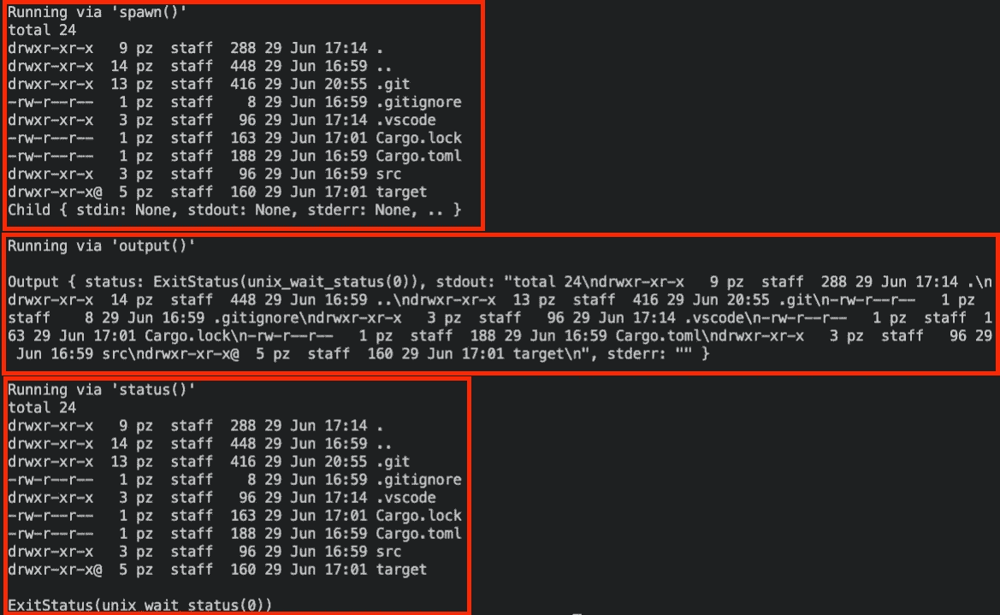
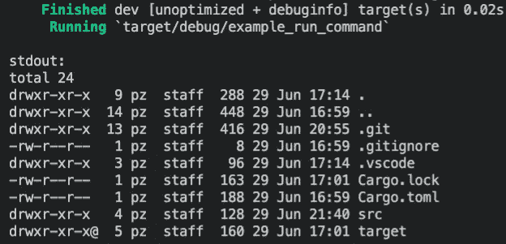

# Rust:调用系统命令

> 原文：<https://levelup.gitconnected.com/rust-invoking-of-system-commands-f8a8b0ef37ce>

这篇简明教程将向你展示从你的 Rust 代码中调用系统命令的三种不同方式。

# GitHub 知识库

要查看最终代码，请查看我为本文创建的 [GitHub 库](https://github.com/mr-pascal/medium-rust-invoke-command)。

 [## GitHub-Mr-Pascal/medium-rust-invoke-command

### 此时您不能执行该操作。您已使用另一个标签页或窗口登录。您已在另一个选项卡中注销，或者…

github.com](https://github.com/mr-pascal/medium-rust-invoke-command) 

# 代码

在 Rust 中，有三种不同的方式通过 Rust 代码调用系统命令。幸运的是，Rust 标准库已经为此提供了内置支持。

在下面的代码片段中，您可以看到如何在 Rust 中构建一个`Command`结构，然后可以用它来运行所提供的命令。在下面的例子中，我们想要创建系统命令`ls -l -a`来打印当前文件夹中的文件列表，包括隐藏的文件(`-a`)。

上面的例子还不能工作，因为我们仍然需要执行这个命令。

为了执行这个命令，Rust 内置了三种不同的方法供您选择，具体取决于您的需求。

这三种方法都将程序作为子进程运行。`output()`和`status()`方法会等到子进程完成后再继续，所以这是一个阻塞/同步操作。另一边的`spawn()`方法只会返回一个句柄，是等待还是保持异步由你决定。

尽管它们的返回类型不同，但它们都返回一个`Result`类型，因此应该正确处理。

*   `spawn()` →通过`Child`结构返回子进程的句柄。(`Result<Child>`)
*   `output()` →以`Output` struct 的形式返回退出状态和运行程序的`stdout`和`stderr`。(`Result<Output>`)
*   `status()` →仅返回运行程序的退出状态。(`Result<ExitStatus>`)

另一个很大的区别是，`spawn()`和`status()`命令将`stdout`从底层程序直接写到你终端的`stdout`。`output()`没有，只是把输出保存在它的返回结构中。这使得`output()`也不那么冗长。

现在让我们看看实际的代码。在下面的代码片段中，您可以看到三次相同的命令，它是通过三种不同的方法执行的。

下面您可以找到上面程序的`stdout`，这样您就可以将代码中的`println!(...)`语句与实际的终端输出进行比较。

`货物运输'

正如您在上面的图片中已经看到的，这个`Output`结构包含了被执行的底层程序的`stdout`。只有在`output()`的情况下，底层命令的实际输出才不会写入终端。

经常会发生这样的情况，你想要解析实际的`stdout`或者用它做其他事情。所以让我们快速将其转换为一个`str`并打印到终端。

货物运输

## 你想联系吗？

如果你想联系我，请在 LinkedIn 上给我打电话。

另外，请随意查看我的书籍推荐📚。

 [## 我的书籍推荐

### 在接下来的章节中，你可以找到我对所有日常生活话题的书籍推荐，它们对我帮助很大。

mr-pascal.medium.com](https://mr-pascal.medium.com/my-book-recommendations-4b9f73bf961b)  [## 通过我的推荐链接加入 Medium—Pascal Zwikirsch

### 作为一个媒体会员，你的会员费的一部分会给你阅读的作家，你可以完全接触到每一个故事…

mr-pascal.medium.com](https://mr-pascal.medium.com/membership)