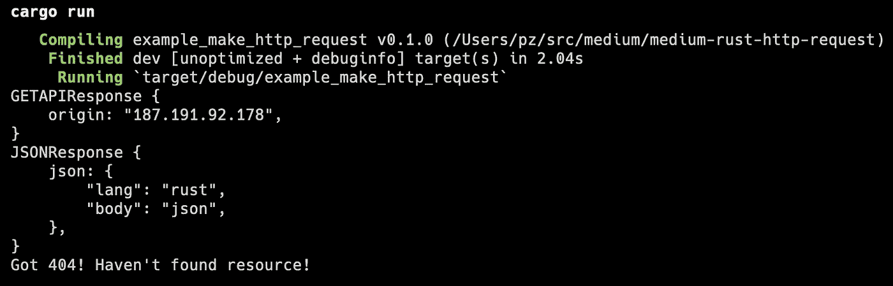

# Rust:使用 reqwest 发出 HTTP 请求并处理响应

> 原文：<https://levelup.gitconnected.com/rust-making-http-requests-and-handling-responses-by-using-reqwest-c8d557cdce46>

当使用正确的库时，在 Rust 中发出 HTTP 请求并解析结果是很容易的。让我们看看`reqwest`和`serde`如何成为首选解决方案。

Rust 编程语言

# GitHub 知识库

如果您对整个应用程序感兴趣，并且想要查看使用的代码，请查看我为本文创建的 [GitHub 资源库](https://github.com/mr-pascal/medium-rust-http-request)。

 [## GitHub-Mr-Pascal/medium-rust-http-request

### 此时您不能执行该操作。您已使用另一个标签页或窗口登录。您已在另一个选项卡中注销，或者…

github.com](https://github.com/mr-pascal/medium-rust-http-request) 

# 你将学到什么

*   发出 GET 请求
*   提出发布请求
*   将 HTTP 响应映射到预定义的结构
*   处理不同的 HTTP 状态代码

## 属国

我们必须在应用程序中添加任何库，然后才能使用它们。因此，让我们将`reqwest`、`tokio`、`serde`和`serde_json`添加到`Cargo.toml`文件中，以便在下一个构建中安装依赖项。

## 常规设置和导入

在进入业务逻辑发生的实际代码之前，让我们检查一下它周围的代码。

在下面的代码片段中，首先，您可以看到我们使用的导入。我们导入`HashMap`是因为我们想在`JSONResponse`中使用这个结构。从`serde`我们导入两个特征来将我们的 HTTP 响应转换成`*Response`结构。

我们从`reqwest`箱中导入了`CONTENT_TYPE`,因此我们可以稍后使用它来设置 content-type 请求头。

在`main`方法中，我们现在只初始化一个新的`reqwest`客户端，我们将在后续的请求中重用它，所以我们不必为每个请求创建一个新的客户端。

## 发出 GET 请求

在下面的代码片段中，您可以看到可以在创建的`client`上使用`.get(url)`方法来创建 GET 请求，然后我们可以通过`.send()`方法发送该请求。在这种情况下，内容类型也被设置为`application/json`，因为这个 GET 请求应该返回一个 JSON。

在请求完成(`.await?`)后，我们可以使用`.json::<GETAPIResponse>()`方法将来自请求的 JSON 响应反序列化到`GETAPIResponse`结构中。

重要的是要注意，返回的 JSON 不需要一对一地匹配`GETAPIResponse`结构。唯一重要的是`origin`字段可用，它由一个`String.`表示，其他字段无关紧要。

## 提出发布请求

创建 POST 请求与 GET 请求几乎是一样的。不过，有两个(明显的)区别。

1.  不使用`.get(url)`，而是使用`.post(url)`
2.  您可以传递一个可选的请求体有效负载

在下面的例子中，您会看到创建了一个可变的`HashMap`，并添加了两个键值对。通过使用`.json(&T)`方法，Rust 尝试序列化`HashMap`，如果成功，将序列化的数据添加到请求体中。

与前面的请求类似，响应被解析为自定义结构。在这种情况下，它是`JSONResponse`，它只包含一个包含`HashMap<String, String>`的`json`字段。因为端点`https://httpbin.org/anything`在响应体的`json`字段中返回请求体，所以它可以被完美地反序列化为`JSONResponse`结构。

## 处理不同的 HTTP 状态代码

最后但同样重要的是，让我们看看 Rust 如何处理不同的 HTTP 状态代码，因为不是所有的请求都会返回一个`200 OK`并且可以被反序列化到我们的结构中。

在下面的例子中，您会看到一个 GET 请求被发送到`[https://httpbin.org/status/404](https://httpbin.org/status/404.)` [。](https://httpbin.org/status/404.)由于 URL 的最后一部分(`status/404`)，我们告诉服务器它应该总是用`404`来响应，这样我们就可以测试我们的匹配器。

通过使用`match resp404.status()`，我们可以实现我们感兴趣的所有状态代码的逻辑，以及所有其他的东西，有一个默认的分支，通过下划线(`_`)表示。在我们的例子中，我们将匹配`reqwest::StatusCode::NOT_FOUND`分支。

## 把所有的放在一起

如果你想看所有的代码，看看我为你创建的 [GitHub 库](https://github.com/mr-pascal/medium-rust-http-request)。

检查完 GitHub 存储库后，就可以通过`cargo run`编译和运行应用程序了。即使路径和原点值应该不同，您也应该看到下面的输出。

运行“货物运行”

## 你想联系吗？

如果你想联系我，请在 LinkedIn 上打电话给我。

另外，请随意查看我的书籍推荐📚。

 [## 我的书籍推荐

### 在接下来的章节中，你可以找到我对所有日常生活话题的书籍推荐，它们对我帮助很大。

mr-pascal.medium.com](https://mr-pascal.medium.com/my-book-recommendations-4b9f73bf961b)  [## 通过我的推荐链接加入 Medium—Pascal Zwikirsch

### 作为一个媒体会员，你的会员费的一部分会给你阅读的作家，你可以完全接触到每一个故事…

mr-pascal.medium.com](https://mr-pascal.medium.com/membership)