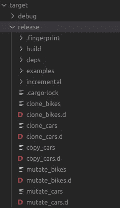
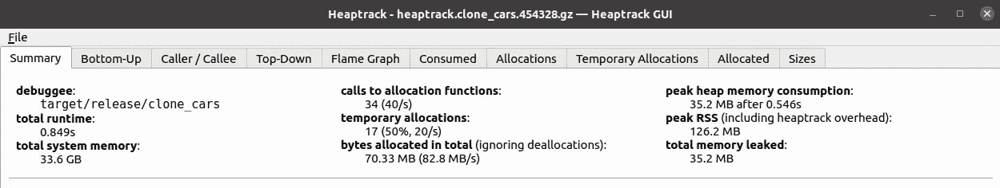
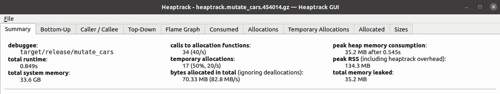
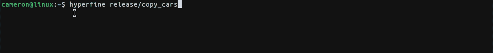
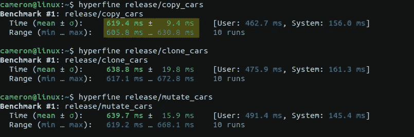

# Rust:重新分配(复制或克隆)vs 变异

> 原文：<https://levelup.gitconnected.com/rust-reassign-vs-mutate-66f76f468bc3>

Rust 中再分配和变异的实现、存储和性能比较


图片来源:[产品分析师](https://theproductanalyst.com/blog/)

在许多编程语言中，知道何时使用突变而不是重新分配是一个常见的决定，在 Rust 这样的内存安全语言中，它们是一个基本问题。由于 Rust 的主导因素是知道如何有效地借用**，我们可以通过重新分配与直接突变的镜头来看待 Rust 语言，从而轻松地了解它的规则。**

****注意:**在这之后，仔细阅读[所有权](https://doc.rust-lang.org/book/ch04-00-understanding-ownership.html)以及它与 Rust 变量的借用、切片和内存管理的关系。如果您正在使用 Rust，您可能已经知道了一些，但是通读这一部分并没有坏处。**

**在很多情况下，Rustaceans 指的是在 Rust 中使用类似于`[Clone](https://doc.rust-lang.org/std/clone/trait.Clone.html)`或`[Copy](https://doc.rust-lang.org/std/marker/trait.Copy.html)`特征的性能影响，这允许将`struct`复制到一个全新的变量绑定中。**

**下面，我们将看看使用可变对象引用、复制对象和克隆对象以及代码示例对内存的影响。**基准测试结束。****

# **简单的例子:自行车——克隆与变异**

****

**[奇异果抱](https://unsplash.com/@kiwihug?utm_source=medium&utm_medium=referral)在 [Unsplash](https://unsplash.com?utm_source=medium&utm_medium=referral) 上的照片**

**首先，我们有一个自行车模块，它是一个相当简单的[结构](https://doc.rust-lang.org/book/ch05-01-defining-structs.html)，带有几个[方法](https://doc.rust-lang.org/book/ch05-03-method-syntax.html):一个自行车实例的构造函数和变异函数:**

**在内部，`accelerate`方法在每次被调用时都会改变`speed`字段。**

**此外，请注意`#[derive(Copy, Clone)]`属性，它允许我们轻松地复制该结构。**

**使用这个模块，我们可以创建两个不同的例子来演示如何修改给定的自行车实例。**

## **克隆自行车**

**在第一个示例中，代码克隆了自行车:**

**让我们浏览一下上面的代码。**

**我们声明了一些常量，比如值为 100，000 的`NUM_BIKES`(喊出 Rust [是因为它很棒](https://medium.com/the-innovation/post-mozilla-rust-the-future-of-the-rust-language-61a5cfb1f615)并且为了可读性允许使用下划线)，以及另一个名为`TOTAL_EPOCHS`的常量来跟踪总迭代次数。**

**在`main function`中，我们创建了一个`Vector`来存储 100，000 辆自行车的列表，并用数据填充它:**

```
let mut bikes: Vec<Bicycle> = Vec::new();for i in 0..NUM_BIKES {
    bikes.push(Bicycle::new(i));
}
```

**底部是事情变得有趣的地方，因为我们操作一个嵌套循环来运行每辆自行车五次并加速它们。**

```
for _i in 0..**TOTAL_EPOCHS** {
  for j in 0..**bikes.len()** {
    let mut bike = bikes[j].clone();
    bike.accelerate();
    bikes[j] = bike;
  }
}
```

****这段代码是使用** `**clone**` **方法复制对象，然后** `**accelerates**` **将它和** `**Vector**` **中的引用更新到新的自行车**。**

```
let mut bike = bikes[j]**.clone()**;
bike.accelerate();
bikes[j] = bike;
```

## **变异自行车**

**在第二个例子中，我们稍微修改了一下程序，让**在每个循环中直接改变**自行车对象。**

**这个版本的主要区别是嵌套 for 循环的内部:**

**`&mut bikes[j].accelerate();`**

**这一次我们将引用声明为**可变**，这允许`accelerate`在`Vector`内的对象*上运行。***

**就简洁多了！**

# **复杂的例子:Car——克隆 vs 复制 vs 变异**

**当然，自行车的例子过于简化了。如果我们有一个更复杂的带有子引用的对象，并且总的内存占用更大，会怎么样？**

**如果我们用一个带字段的结构来描述更复杂的东西，比如一辆汽车会怎么样？**

****

**罗伯特·诺达尔在 [Unsplash](https://unsplash.com?utm_source=medium&utm_medium=referral) 上拍摄的照片**

**下面是 Car 模块，其结构包括对引擎模块的引用(见下文):**

**car 也是一个简单的[结构](https://doc.rust-lang.org/book/ch05-01-defining-structs.html)，这次有三个[方法](https://doc.rust-lang.org/book/ch05-03-method-syntax.html):一个构造函数、一个赋值函数和一个记录对象内容及其引擎的新方法。和以前一样，`accelerate`方法在每次被调用时都会改变`speed`字段，我们再次使用`#[derive(Copy, Clone)]`属性来允许复制。**

**汽车模块使用引擎模块，看起来像:**

**引擎模块和其中的结构非常简单。我加了`engine_array`来填充一些多余的空间。**

## **克隆汽车**

**再一次，使用我们为自行车所做的相同代码，我们可以在循环中克隆汽车:**

**除了一些不同的变量名，实现是相同的。**

## **复制汽车**

**这是复制一辆汽车而不是克隆的样子:**

****这段代码使用了一个隐式的** `**copy**` **方法来复制对象，然后** `**accelerates**` **将它和** `**Vector**` **中的引用更新到新的自行车**。**

```
let mut car = cars[j];
car.accelerate();
car[j] = car;
```

## **变异汽车**

**下面是代码的变种版本，使用 cars 模块代替自行车:**

**这一切都很好，但是使用克隆和突变的性能权衡是什么？**

**我们来看看吧！**

# **基准**

## **构建版本**

**使用 Cargo，我们可以轻松地将我们的代码编译成发布优化的自包含 bin 文件，使用:**

```
cargo build --release
```

**这将为我们在 Cargo.toml 中定义的每个 bin 生成一个唯一的程序(摘录):**

```
...[[bin]]
name = "clone_bikes"
path = "src/clone_bikes.rs"[[bin]]
name = "mutate_bikes"
path = "src/mutate_bikes.rs"[[bin]]
name = "clone_cars"
path = "src/clone_cars.rs"[[bin]]
name = "copy_cars"
path = "src/copy_cars.rs"[[bin]]
name = "mutate_cars"
path = "src/mutate_cars.rs"
```

**结果文件夹`target`有一个可执行程序用于每个 bin，如下所示:**

****

**在这里，我们可以看到每个发布文件都已准备就绪。**

**现在，让我们看看使用我们的 release ready Rust 程序的一些基准测试。**

## **Heaptrack**

**[堆轨](https://github.com/KDE/heaptrack)到底是什么*？***

**作为 KDE 的一部分维护的 Heaptrack 跟踪所有的内存分配，并用堆栈跟踪注释这些事件。它附带了一个漂亮的 GUI，提供了分析工具来解释堆内存配置文件，以便深入了解代码的内存分配和内存占用情况。**

**以下是三项汽车试验的结果:**

****

**复制汽车的 heapstack 输出**

****

**克隆汽车的 heapstack 输出**

****

**变异汽车的堆栈输出**

**可以看到，它们几乎完全相同，三者之间唯一的区别是**峰值 RSS (** [**常驻集大小**](https://en.wikipedia.org/wiki/Resident_set_size) **)** ，其中 mutate cars 的量最高，为 134.3 MB。**

## **使用 Linux 时间**

**使用 L [inux time 命令](https://man7.org/linux/man-pages/man1/time.1.html)，我们可以针对应用程序的速度和整体性能运行一个简单的基准[测试。](https://stackoverflow.com/a/4444766)**

**当运行汽车示例的三个释放箱时，我们看到`copy_cars`箱是最快的:**

****

## **使用超精细**

**在命令行上对程序进行基准测试的另一个选项是名为 hyperfine 的[实用程序。](https://github.com/sharkdp/hyperfine)**

****

**对复制汽车流程进行基准测试**

**通过将示例的三个版本放入 hyperfine 基准测试工具中，我们可以看到`copy_cars`似乎又是最快的:**

****

**最终基准使用超精细基准工具**

# **结论**

**总的来说，这里的一般结论是*可能是*您可以使用任何适合您的目的的方法，但是如果您认为您可能需要性能提升，尝试一个`copy`可能是有用的。**

**个人认为在突变中语法简洁，但在克隆版本中更明显。**

**你最喜欢的选项是什么？**