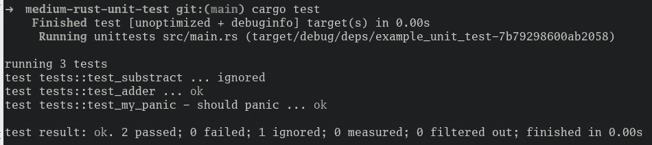
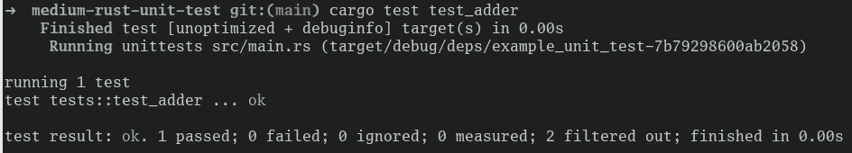
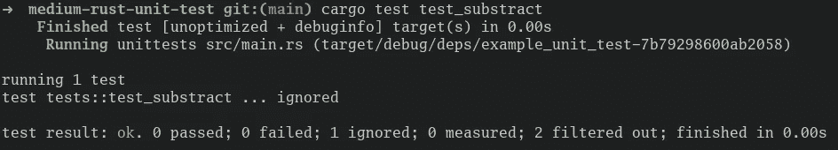
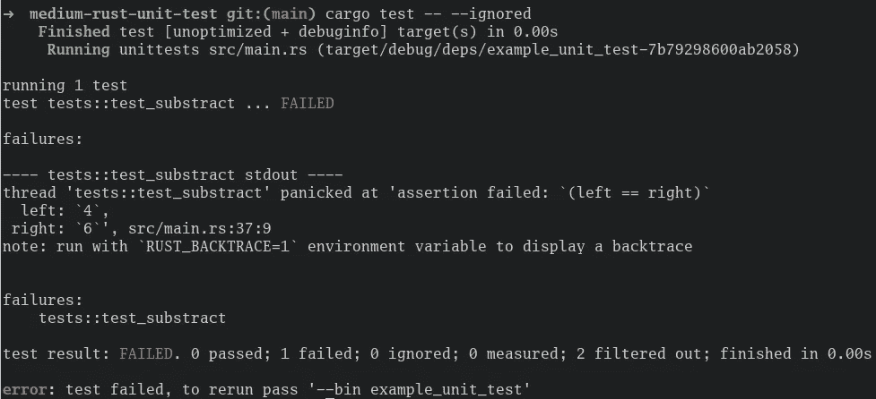
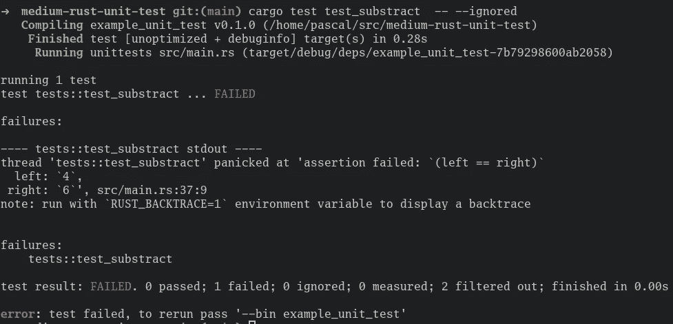

# Rust:简单地说就是单元测试

> 原文：<https://levelup.gitconnected.com/rust-unit-testing-in-a-nutshell-aaa053ed425a>

这篇简明教程将向你展示如何使用 Rust 进行基本的单元测试。


# GitHub 知识库

要查看最终代码，请查看我为本文创建的 [GitHub 库](https://github.com/mr-pascal/medium-rust-unit-test)。

[](https://github.com/mr-pascal/medium-rust-unit-test) [## GitHub-Mr-Pascal/中锈单元测试

### 此时您不能执行该操作。您已使用另一个标签页或窗口登录。您已在另一个选项卡中注销，或者…

github.com](https://github.com/mr-pascal/medium-rust-unit-test) 

# Rust 中的单元测试

与其他编程语言相比，Rust 中的单元测试方法略有不同。因此，Rust 单元测试不是让你的专用测试文件(例如 TypeScript 中的`.spec.ts`或`.test.ts`文件)驻留在与被测代码相同的文件中，这是由于它的模块方法。

尽管 Rust 也支持测试专用文件，但这仅意味着库的集成测试，而不是单元测试。在另一篇文章中有更多关于这方面的内容。

为了封装来自实际业务代码的单元测试，它们被放入一个用`#[cfg(test)]`属性修饰的专用`tests`模块中。测试运行者应该运行的实际测试是用`#[test]`属性来修饰的。虽然这听起来令人困惑，但在下面的例子中变得简单明了。

# 代码

与许多其他编程语言不同，Rust 已经内置了所有测试，您不需要添加任何外部库。

因此，您可以使用`cargo new my_project`创建一个新的 Rust 项目，并开始编写您的测试。

创建项目后，让我们在`main.rs`文件中添加三个我们想要测试的不同函数。

```
// src/main.rs
// -------------

fn adder(a: i64, b: i64) -> i64 {
    return a + b;
}

fn my_panic() {
    panic!("oops...");
}

fn substract() -> i64 {
    // TODO: logic not yet implemented
    return 4;
}
```

正如您已经看到的，我们有一个触发`panic`的方法，但幸运的是，Rust 有一个内置的方法来测试预期的`panic`是否被调用。

另外，我们有一个方法(`substract()`)还没有实现。我们想暂时忽略这个方法的测试，因为我们还没有准备好测试它。

您可以在同一个文件中的以下代码片段中找到测试上述功能的代码。

```
// src/main.rs
// -------------

// ......

#[cfg(test)]
mod tests {
    use super::*;

    #[test]
    fn test_adder() {
        assert_eq!(adder(2, 2), 4);
    }

    #[test]
    #[should_panic(expected = "oops...")]
    fn test_my_panic() {
        my_panic()
    }

    #[test]
    #[ignore]
    fn test_substract() {
        // This test is ignored for now
        assert_eq!(substract(), 6);
    }
}
```

如前所述，所有的测试都封装在一个名为`tests`的专用模块中，只有在配置为`test`时才会编译。这确保了在您构建实际的应用程序二进制文件时，测试不会被编译。

使用`use super::*;`所有来自外部作用域的函数被导入，以便在测试中调用。另一种方法是在这里非常明确地使用`use crate::{adder, my_panic, substract};`。

首先，在`test_adder`测试中调用了`adder`函数。测试用`#[test]`属性来修饰，以向测试运行人员表明这个函数应该作为测试套件的一部分来运行。`assert_eq!(a,b)`宏用于确保一个值等于另一个值。如果值不相等，测试将失败。为了测试不平等性，您可以使用`assert_ne!(a,b)`。当您想要验证一个更复杂的表达式时，您可以使用`assert!(expression)`，如果表达式评估为`false`，那么测试将会失败。

对于函数`test_my_panic`,添加了`#[should_panic(expected = "oops...")]`属性来告诉测试运行程序，预期会出现带有消息`"oops..."`的`panic`。如果没有触发`panic`或`panic`消息与预期的不同，测试将失败。`should_panic`的`expected`部分是可选的，通过不添加它，每个被调用的`panic`将通过测试。

对于第三个测试函数`test_substract`，测试将会失败，因为`substract()`总是返回一个`4`，因为实际的业务逻辑还没有实现，并且测试期望一个`6`。为了防止这个测试失败，添加了`#[ignore]`属性，以便在测试运行中跳过这个测试。

## 运行测试

在解释了单个测试在做什么并展示了不同的有用属性之后，让我们运行测试以确保它们按预期工作。

这可以通过使用`cargo test`运行项目中发现的所有测试来完成。



货物测试

不出所料，两个测试通过了，而一个被忽略了。

**运行单项测试**

如果您目前只进行一个特定的测试，为了减少测试时间，您也可以通过`cargo test <test_name>`指定测试名称，例如`cargo test test_adder`，只运行一个特定的测试。



货物测试 test _ 加法器

如果您试图以这种方式运行被忽略的测试，它仍然会被忽略。



货物测试 test _ substract

**运行忽略的测试**

如果您想运行所有被忽略的测试，还有一种方法可以做到。

使用命令`cargo test -- --ignored`运行所有被忽略的测试，而没有被忽略的测试则不运行。



`cargo test test_substract -- --ignored`

`--ignored`标志也可以与测试名的显式定义相结合。

以下也可以工作，并且将只运行被忽略的`test_substract`测试:

`cargo test test_substract -- --ignored`



`cargo test test_substract -- --ignored`

## 你想联系吗？

如果你想联系我，请在 LinkedIn 上联系我。

另外，请随意查看我的书籍推荐📚。

[](https://mr-pascal.medium.com/my-book-recommendations-4b9f73bf961b) [## 我的书籍推荐

### 在接下来的章节中，你可以找到我对所有日常生活话题的书籍推荐，它们对我帮助很大。

mr-pascal.medium.com](https://mr-pascal.medium.com/my-book-recommendations-4b9f73bf961b) [](https://mr-pascal.medium.com/membership) [## 通过我的推荐链接加入 Medium—Pascal Zwikirsch

### 作为一个媒体会员，你的会员费的一部分会给你阅读的作家，你可以完全接触到每一个故事…

mr-pascal.medium.com](https://mr-pascal.medium.com/membership)