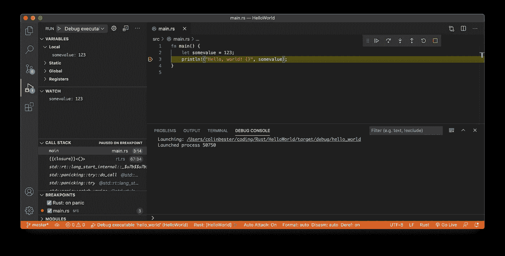

# 使用 Visual Studio 代码 Rust

> 原文：<https://levelup.gitconnected.com/rust-with-visual-studio-code-46404befed8>

## 简单的操作方法

R ust 越来越受欢迎，在开发人员中被大量采用。这篇文章将帮助任何想在 2020 年使用 Visual Studio 代码(VS 代码)开发 Rust 应用程序的人。

我不是 VIM 和 basic 编辑器的忠实粉丝。多年来，我开始接触基本的文本编辑器，并很快适应了各种 ide，因为它们有助于加快工作流程。今天我的偏好是 IntelliJ 和 VS 代码。

这篇文章是关于配置 VS 代码来编写、构建和调试 Rust 应用程序的。外面有很多信息，我不认为这是最好的或者唯一的方法，但是它是大量依赖于官方文档的各种文章的融合，对我来说很有用。

我使用两种不同的环境进行开发，一种是 Macbook Pro，我用它来做最初的脚手架、便笺簿和概念验证，因为我喜欢在工作时在家里四处走动——在室内和室外工作，试图捕捉大自然的一些治愈能力😄。对于较大的后端项目，通常是后端服务器或交叉开发项目，我更喜欢在我的 Linux 机器上开发。

> 本文是关于在 MacOS 环境下设置 Visual Studio 代码的。

# 防锈装置

我推荐安装 *rustup* ，因为它允许在不同版本的 rust 之间切换——对我来说很重要，因为我想为 ARM 处理器进行交叉编译。

官方笔记可以在这里找到:[https://www.rust-lang.org/tools/install](https://www.rust-lang.org/tools/install)

## 使用 brew 安装 rust。

*如果你的 Mac 上没有安装家酿软件，那么我建议你犒劳一下自己，去安装它——查看* [*家酿软件*](https://brew.sh)

在终端的命令行提示符下:

```
❯ brew install rustup
```

***注意:*** *如果 rust 已经安装，可以使用* ***rustup 更新*** *进行更新。*

## 安装编译器和包管理器。

在终端的命令行提示符下:

```
❯ rustup-init
```

*您可以使用 rustup self uninstall 随时卸载，这些更改将被恢复。*

运行完`rustup-init`后，你会看到不同的选项——继续使用默认选项——选项 1

```
1) Proceed with installation (default)
```

## 验证安装

在终端的命令行提示符下:

```
❯ rustc — version
rustc 1.46.0 (04488afe3 2020-08-24)
```

它应该返回带有版本号的`rustc`。

***注意:*** *您可能需要退出并重新加载终端以使路径更新生效。*

# 第一个你好世界项目

## 安装 VS 代码

如果还没有安装，那么前往[https://code.visualstudio.com](https://code.visualstudio.com)安装 VS 代码。

> 如果您想通过执行**代码**从命令行启动 VS 代码，安装 VS 代码后，在 Mac 上使用 *Shift+Command+p* 或在 Linux 上使用 *Shift+Control+p* 打开命令面板，并搜索 *Shell 命令:在路径选项中安装‘Code’*命令。

## 设置与代码

Rust 对 VS 代码官方网站的支持可以在这里找到:[https://marketplace.visualstudio.com/items?itemName=rust-lang.rust](https://marketplace.visualstudio.com/items?itemName=rust-lang.rust)

为了在 VS 代码中启用 rust 支持，我们将使用 rust 语言服务器(RLS)。

*   使用 *Shift+Command+p* as(或者 Linux/Windows 上的 *Control+p* 打开命令面板，输入`ext install rust-lang.rust`，按*进入*。

如果你按照上述步骤安装 rust，那么你应该可以访问 cargo，Rust 的软件包管理器。为了检查安装，你可以在命令提示符下执行*货物版本*。

```
❯ cargo --version
cargo 1.46.0 (149022b1d 2020-07-17)
```

## 使用 Cargo 创建一个新项目。

使用 cargo，Rust 的包管理器，我们将创建一个简单的 HelloWorld 项目。

```
❯ mkdir -p ~/coding/rust
❯ cd ~/coding/rust
❯ cargo new HelloWorld
Created binary (application) `HelloWorld` package
```

*   转到目录 HelloWorld `cd HelloWorld`
*   通过执行`code .`从命令行启动 VS 代码

在项目文件夹中，您应该会看到 *src* 和 *Cargo.toml* 条目

打开 src 文件夹下的 rust 文件 *main.rs* ，系统会提示您安装 rust extension——点击 **Yes** 继续。

完成后，VS 代码现在应该显示消息
'**Rust components successfully installed '**

如果安装正确，RLS 应自动分析源代码并显示以下警告消息:

```
crate `HelloWorld` should have a snake case name
note: `#[warn(non_snake_case)]` on by default
help: convert the identifier to snake case: `hello_world`
```

要纠正这个问题，打开 *Cargo.toml* 并将*名称*条目改为 snake case

```
[package]
name = “hello_world”
....
```

警告现在应该会自动消失。

编辑 main.rs 文件，添加要在输出字符串中显示的变量。

```
fn main() {
  let somevalue = 123;
  println!("Hello, world! {}", somevalue);
}
```

# 构建和执行项目。

根据您的喜好，您可以通过命令行或使用 VS 代码的任务特性来构建或执行。

## 通过命令行

通过菜单项“终端”或使用快捷键 *Cntrl+~* 打开终端

**构建项目并创建二进制文件**

在命令行中，执行:

```
❯ cargo build
 **Finished** dev [unoptimized + debuginfo] target(s) in 0.02s
```

**执行二进制**

```
**❯** cargo run
**Finished** dev [unoptimized + debuginfo] target(s) in 0.00s
**Running** `target/debug/hello_world`Hello, world! 123
```

## 使用任务

要运行 VS 代码任务的特性，使用*命令+Shift+B* 。

参照 https://code.visualstudio.com/docs/editor/tasks#vscode[的](https://code.visualstudio.com/docs/editor/tasks#vscode)来设置任务创建*。vscode/tasks.json* 文件，并用下面提供构建和运行任务的文本填充。

```
{
    "version": "2.0.0",
    "tasks": [{
     "label": "cargo build",
     "type": "shell",
     "command": "cargo build",
     "args": [],
     "group": {
       "kind": "build",
       "isDefault": true
     }
    },
    {
        "label": "cargo run",
        "type": "shell",
        "command": "cargo",
        "args": [
          "run"
          // "--release",
          // "--",
          // "arg1"
        ],
        "group": {
          "kind": "build",
          "isDefault": true
        }
       }]
  }
```

# **调试项目**

## **安装加长件**

*   如果 CodeLLDB(VS 代码的一个[本机调试器扩展](https://github.com/vadimcn/vscode-lldb))尚未安装，则使用上述 *Command+p* as(或 *Control+p* )通过打开的命令面板安装该扩展，并输入
    `ext install vadimcn.vscode-lldb`和*输入*。
*   在 MAC 上按下功能 F5 或通过菜单使用*运行- >开始调试*并选择 **LLDB** 选项。VS 代码将显示一条消息，说明**无法开始调试，因为没有提供启动配置。**选择默认选项以生成启动文件。
*   打开 *src/main.rs* 并将断点置于第 3 行`println!(“Hello, world!”)`的左侧，按 *F5* 或*Run->Start Debugging*启动调试器。



图片由 BesterDesigns LLC 提供

就这样——享受吧！