# Android 开发中的 RxJava 基础知识

> 原文：<https://levelup.gitconnected.com/rxjava-basics-in-android-development-a1befbd8008c>

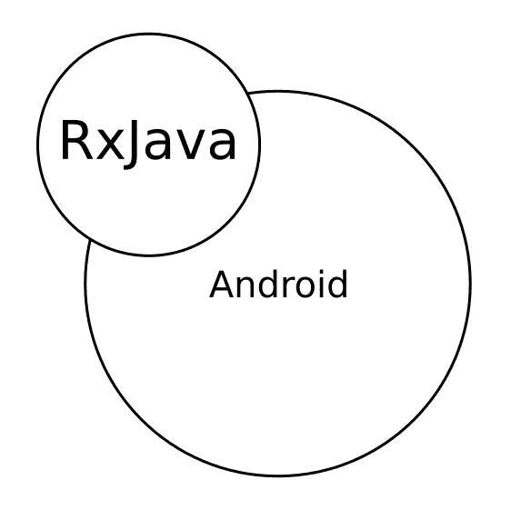

RxJava 是 Java 和 Android 开发领域中一个流行的开源库。对于初学者来说，很难理解它是什么，为什么它很重要，或者如何使用它。这篇文章中的讨论很容易理解，它不仅限于 Android 开发人员，也适用于 Java 或其他 JVM 相关语言的开发人员。为了更好地理解这个库，它涵盖了一些基本概念，随后是 RxJava 本身以及一个解释的例子。我们骑吧！

# 观察者模式和反应式编程

RxJava 是一个反应式编程库。因此，在深入 RxJava 之前，理解什么是反应式编程是很重要的。

反应式编程是一种编程风格(或范式)，它扩展了**观察者设计模式**。设计模式是一种代码结构，它使解决给定的编程问题变得更加简单。比方说， **ExpensiveObject** 是一类在你的程序中需要几毫秒才能创建的对象。每次需要一个实例时创建一个新的 **ExpensiveObject** 并不是一个好主意，因为这可能会降低你的应用程序的速度。为了解决这个问题，您可以通过使用私有构造函数和静态方法来使用 **Singleton** 模式，以确保只创建一个 **ExpensiveObject** ，如下所示:

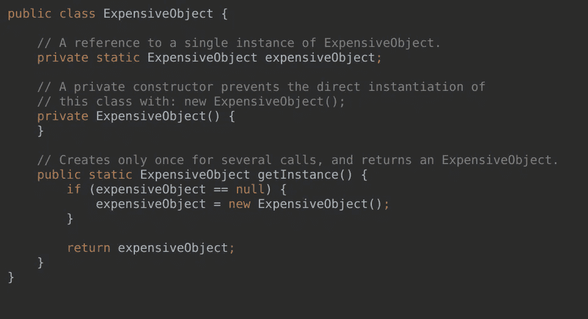

**插图 1** 。单例设计模式实现。

还有很多设计模式，并不是说你应该知道所有的。**观察者模式**寻求有效地解决从应用程序的一个部分向一个或多个其他部分发送通知(或更新)的问题。这个模式中的关键对象是通知的**源**和通知的消费者(**观察者**)。他们的互动是这样的:

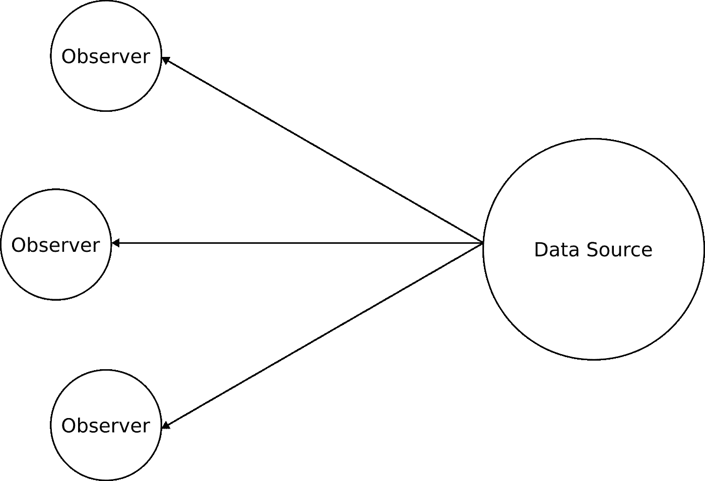

**插图 2。**观察者设计模式。

数据源(也称为主题)包含对其所有观察者的引用，并在新数据生成时向每个观察者发送通知。新数据可能是来自后端 API、数据库或任何东西的异步网络响应。观察者的角色是接收新数据并对其进行处理。这种安排比每个观察者定期检查是否有来自数据源的新数据，然后再对其进行操作要好。举一个简单的例子，假设一个观察者订阅了图 3 中接口指定的随机整数。它包含一个 **handleInteger()** 方法，该方法将数据源中的一个随机整数作为参数，并对其进行操作。

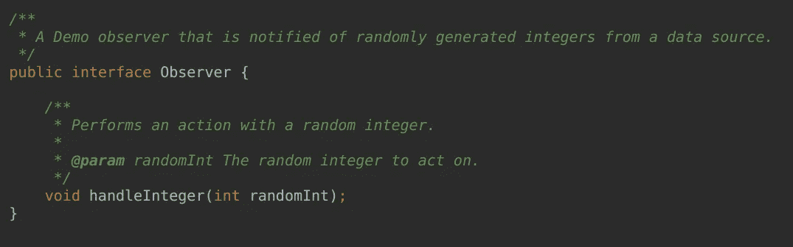

**插图 3。**用随机生成的整数通知观察者的接口。

对于这样一个观察者，图 4 是其数据源的一个虚拟实现。它在实例化时开始生成随机整数，并定义了一个 **subscribe()** 方法，用于向随机整数更新的订阅者列表中添加一个观察者。每次在 **pushUpdates()** 中生成一个随机整数，所有的观察者都会被通知一个对它们的 **handleInteger()** 方法的调用。

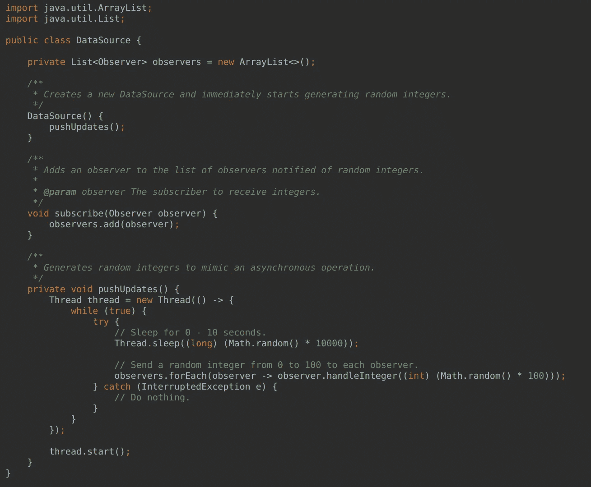

**插图 4。**一个随机整数数据源。

为了使用随机整数，每个观察者都必须订阅数据源👇

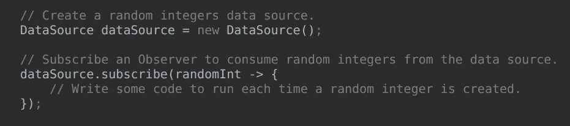

**插图 5。**订阅一个观察器从数据源接收随机整数。

这个简单的例子有几个问题。例如，当图 4 中的 **pushUpdates()** 中的线程由于某种原因被中断时，观察者没有得到通知。在现实世界中，这种异常可能是网络中断，通知观察者这一点很重要。其次，当不再需要数据源时，线程会发生什么？这些是使用 RxJava 时可以解决的一些问题。

反应式编程类似于所解释的观察者设计模式。它以**流**的概念为中心。顾名思义，流由从源到消费者的数据流(或对象、信号等)组成。在流中流动的对象主要有三种类型:数据对象、错误和完整信号。数据对象可以是任何类型。在 Java 中，它可以是预构建或用户定义的类的实例。它代表了消费者所期望的那种信息。例如，在显示由标题和描述组成的待办事项列表的应用程序中，数据流中的数据项可以是这样一个类的实例👇

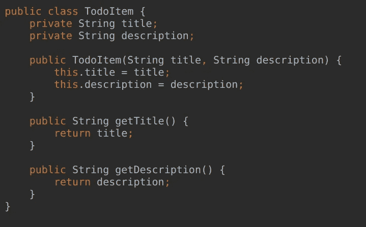

**插图 6。**一类可以在流中运行的对象的例子。

流中的错误意味着发生了错误。可能发生了网络错误，或者服务器遇到了内部错误。当这种情况发生时，消费者通常应该向应用程序用户显示一些描述性消息。完整的信号意味着没有更多的数据从信号源发出。作为示范，考虑图 7 中的待办事项应用程序的流，由于某种未知的原因😁，拉五个待办事项，痛苦地一个接一个，而不是作为一个列表从服务器上显示给用户。

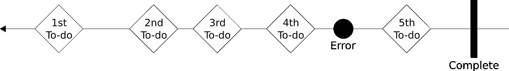

**插图 7。一连串的待办事项。**

最左边的箭头表示流的方向，项目按顺序发出，直到发出完整的信号，表示所有五个待办事项都已发出。请注意，流对象之间的间距是不均匀的，这表明发出的项的异步特性(它们到达的时间是不确定的)。第四个待办事项发出后，第五个待办事项发出前，最后是完整信号发出后，流中出现错误。

需要注意的是，流对象可以在从源到消费者的流中经历转换。使用**运算符完成转换。**例如，操作员可以过滤掉一些数据项，将每个数据项映射到一个全新的数据项，或者生成并行流并将其合并到一个数据流中，就像高度复杂的制造环境中的装配线一样(夸张)。可能性是无限的。通过链接运算符，程序员可以编写非常紧凑的代码。然而，这可能会使代码难以理解，这也是让反应式编程感到困难的原因之一。紧凑性和易于理解性之间的折衷类似于递归算法与迭代算法的情况。你应该知道什么时候用什么。

# RxJava

RxJava(**R**E**x**张力 **J** ava)是一个 Java 虚拟机(JVM)的开源反应式编程库。它是由[reaction vex 组织](https://github.com/ReactiveX)开发的反应式扩展的 Java 变体。还有其他变体，如 RxJs(用于 JavaScript)、RxScala 和 RxSwift。它并不局限于 Android 开发，它可以用于服务器实现等。这篇文章主要关注它在 Android 开发中的应用。

RxJava 的 API 为线程提供了一个抽象层。线程本质上是由操作系统调度的 CPU 内核独立执行的控制流。一个应用程序可以由多个线程组成，每个线程运行一个独立的操作序列。对用户与安卓应用交互的反应由一个特殊的用户界面线程管理。任何长时间运行的任务，如异步网络请求，都应该在后台线程中执行，而不是 UI 线程，以避免应用程序无响应。直接使用线程可能很困难，尤其是当多个并发线程需要同步时(这是一个完全不同的主题)。为了省去您担心线程的负担，RxJava 提供了**调度器**来为您处理线程的细节。通过调用 scheduler 类中的静态方法，可以很容易地获得许多 scheduler。三个例子是:

1.  **Schedulers.io():** 一个输入/输出调度器。使用它来执行需要数据传输的任务，例如，通过网络或使用磁盘。
2.  **schedulers . computation():**用于执行 CPU 密集型任务的调度程序，例如从原始数据分段渲染图像。
3.  **Schedulers.newThread():** 创建并处理新后台线程的调度程序。

要在 Android 中开始使用 RxJava，请将以下依赖项添加到您的模块级 Gradle build 配置文件( **app/build.gradle** )中:

```
implementation 'io.reactivex.rxjava2:rxjava:2.2.10'
```

请务必点击查看最新版本[。](https://github.com/ReactiveX/RxJava/blob/3.x/README.md)

如果您需要安排一些工作在 UI 线程上运行(您很可能会这样做)，比如显示从服务器检索的数据，那么添加下面的依赖项，它包括一个用于 UI 线程的特殊调度程序(**androidschedulers . main thread()**)。

```
implementation 'io.reactivex.rxjava2:rxandroid:2.1.1'
```

举个例子，考虑一个简单的应用程序，它由一个来源的 0 到 10000 范围内的随机整数流组成。这些整数的使用者将每个整数显示为偶数、奇数或质数，如下所示👇

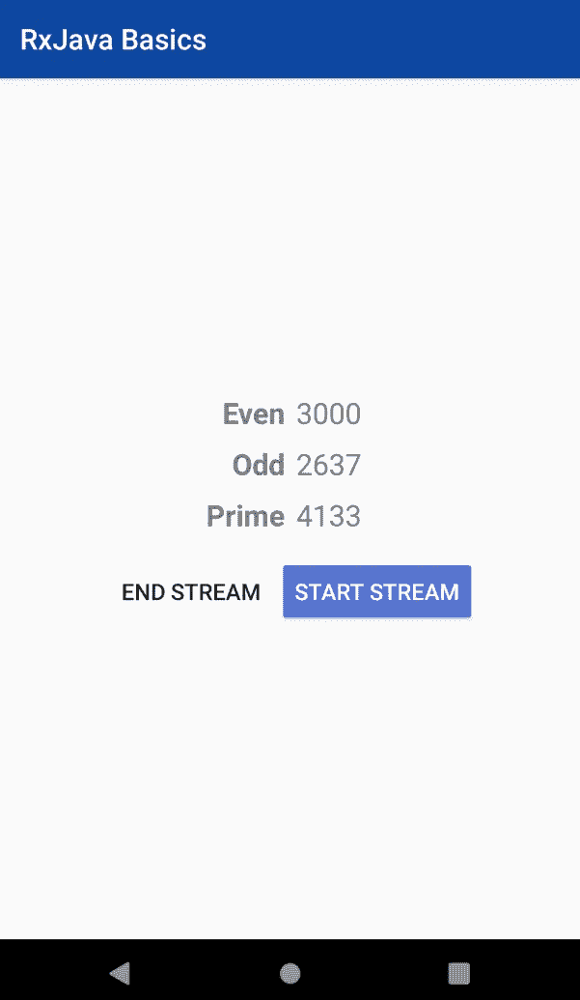

**插图 8。**一个应用程序屏幕，将流中的随机整数显示为偶数、奇数或质数。

在这个例子中，数据源是一个名为 **Flowable** 的参数化类类型。Flowable 是 RxJava 中许多数据源类型中的一种。其他一些类型有**可观察**、**单个**和**可完成**。从某种意义上来说，可流动流体是独一无二的，因为它能够指定一个**背压**策略。当数据源以使用者无法应付的速度发出数据时，就会出现背压。假设，如果消费者用 100 毫秒处理一次排放，那么就会出现背压，比如说如果数据源在 100 毫秒内排放 20 个项目。为了解决这个问题，可以使用缓冲区(临时存储)来保存多余的项目，或者可以丢弃多余的项目，以及其他技术。如果消费者需要，删除项目可能不是一个好主意。对于这个例子，可流动数据源删除多余的项目，因为整数不一定重要。创建的数据源如以下代码片段所示:

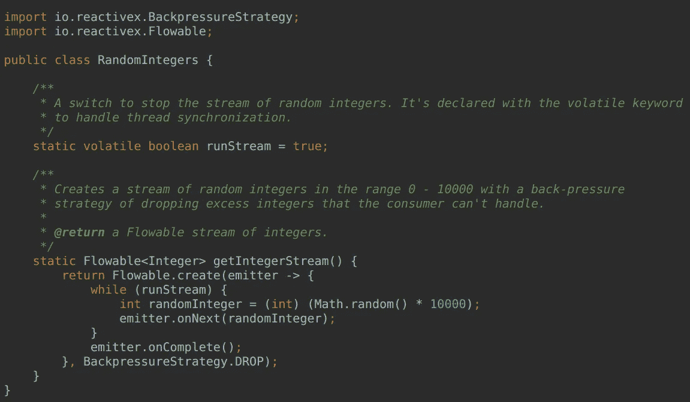

**插图 9。**随机整数的可流动来源。

可流动源是通过调用静态的**floable . create()**方法创建的，该方法将一个 **FlowableOnSubscribe** 对象作为其第一个参数，表示为 lambda，将一个 **BackpressureStrategy** 作为其第二个参数。它使用 while 循环来检查流是否仍在运行，这由静态布尔可变变量 **runStream 决定。**如果仍在运行，它会生成一个随机整数，并使用发射器的 **onNext()** 方法将其推送到流中。当通过将 **runStream** 更改为 false 来停止流时，将通过调用 **onComplete()向消费者发送一个完成信号。**消费者由 **handleInteger()** 方法定义👇

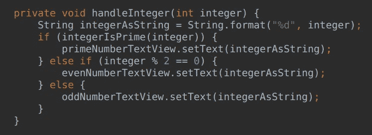

**插图 10。**用于处理随机生成的整数的消费者代码。

消费者向用户显示整数为质数、偶数或奇数。为了启动流，使用者必须订阅源。使用下面的方法链进行订阅👇

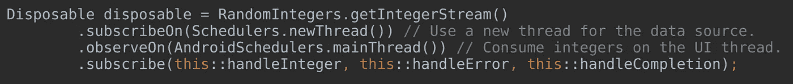

**插图 11。**方法调用链来触发随机整数流。

它从调用静态方法 **getIntegerStream()** 开始，该方法返回一个**floable。**随后是一个 **subscribeOn()** 调用，指定用于流的调度程序。记住，调度程序用线程为你处理工作。在这种情况下， **Schedulers.newThread()** 调度程序创建一个新的工作线程来执行整数生成代码。对 **observeOn()** 的第三次调用指定消费者的代码应该在 Android 特有的 UI 线程上运行。**androidschedulers . main thread()**调度程序由前面描述的 **rxandroid** Gradle 依赖关系提供。如果 Android 操作系统要求在 UI 线程上运行一些代码，比如更新视图，这一点很重要。对 **subscribe()** 的第三次调用使用 Java 8 的方法引用语法定义了三个参数。第一个参数运行图 10 中的代码，第二个参数处理来自源的错误，第三个参数处理完整的信号。该应用的完整源代码可以在 Github 上找到[。对 **subscribe()** 的调用返回一个**可处置的**,只要不再需要订阅，就应该将其处置掉，以避免由于线程导致的内存泄漏。当应用程序不再运行时，如果操作系统没有回收分配给应用程序的部分系统堆内存，就会发生内存泄漏。这会导致用户设备不必要的 RAM 消耗。](https://github.com/ongebo/rxjava-basics)

# 结论

本文中的讨论涵盖了 RxJava 的基础知识。RxJava 示例强调了使用库的关键组件，即创建数据源、创建消费者代码，以及将消费者连接到数据源以启动流/流。关于 RxJava，还有很多值得探索的地方。首先，**可流动的**可能并不总是首选的数据源。例如，在显示待办事项列表的待办事项应用程序中，使用单个**源更有意义，该源只发出一个完整的待办事项列表，或者在获取待办事项列表时出错时发出一个错误。我还暗示了可以在源和消费者之间转换流项目的操作符。存在很多运营商，你可以在这里了解更多关于他们的[。](https://github.com/ReactiveX/RxJava/wiki/Alphabetical-List-of-Observable-Operators)**

如果您使用过 LiveData(来自 Android Architecture Components ), rx Java 就可以派上用场，因为与向 LiveData 对象发送值所需的时间相比，处理和向用户显示一些信息需要很长时间。这是因为 RxJava 与 LiveData 不同，它支持背压。

这就是 RxJava 的基础，如果您需要了解更多，下面的资源可能值得您花费时间。黑客快乐！

# 进一步阅读

1.  [反动宣言](https://www.reactivemanifesto.org/)
2.  [如何使用 RxJava](https://github.com/ReactiveX/RxJava/wiki/How-To-Use-RxJava)