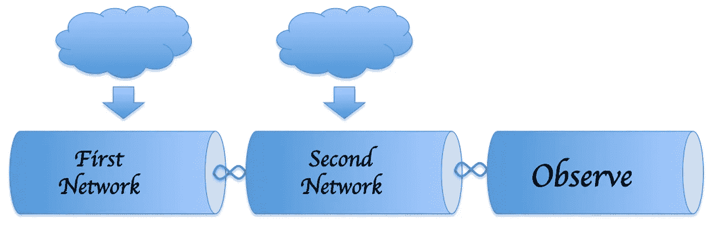
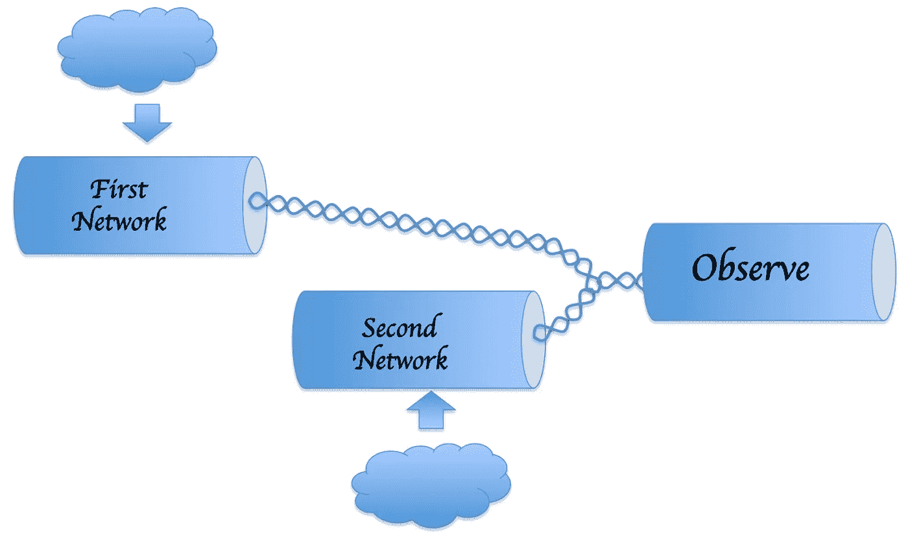

# RxJava:轻松连接网络呼叫

> 原文：<https://levelup.gitconnected.com/rxjava-connecting-network-calls-made-easy-d7b406c9bc66>


约翰·巴克利在 [Unsplash](https://unsplash.com/photos/l090uFWoPaI) 上拍摄的图片

正如我在[之前的博客](https://medium.com/@elye.project/rxjava-2-making-threading-easy-in-android-in-kotlin-603d8342d6c)中提到的，RxJava 让线程化变得简单。让我再分享一个 RxJava 的好处——连接网络也容易多了。

下面是 3 个场景。

# 1.依赖于另一个的网络调用:平面图



在各种情况下，您都需要如图所示的链接。例如，从 URL 获取站点，然后使用 URL 执行另一个获取，然后获取访问令牌，并将其提供给第二个网络获取，等等。

我们可以使用接线员呼叫`flatMap`

```
val disposable = firstNetworkCall()
    .**flatMap{** secondNetworkCall(**it**) **}** .subscribeOn(Schedulers.io())
    .observeOn(AndroidSchedulers.mainThread())
.subscribe **{** it -> *doSomethingWithResonse*($it) **}**
```

# 2.将网络呼叫连接到同一个观察者:合并


假设我们从两个互不依赖的网络中获取数据，但是希望将结果提供给同一个观察者。

我们可以使用接线员呼叫`mergeWith`

```
val disposable = firstNetworkCall()
    .**mergeWith**(secondNetworkCall())
    .subscribeOn(Schedulers.io())
    .observeOn(AndroidSchedulers.mainThread())
    .subscribe **{** it -> *doSomethingWithIndividualResponse*($it) **}**
```

这样，将会观察到来自`firstNetworkCall`的数据，然后是接下来要观察的`secondNetworkCall`数据。两者都由同一个观察者观察。

# 3.将网络调用结果组合在一起



有时，我们不想将单个结果发送给观察者，而是想在发送之前将它们组合起来。当我们不需要担心观察者端的等待和同步时，这将非常有用。

我们可以使用`zipWith`来实现这一点

```
val disposable = firstNetworkCall()
    .**zipWith**(secondNetworkCall(), 
        **BiFunction**{ 
          firstResonse: ResponseOneType, 
          secondResponse: ResponseTwoType -> 
          *combineResult*(firstResponse, secondResponse) })
    .subscribeOn(Schedulers.io())
    .observeOn(AndroidSchedulers.mainThread())
    .subscribe { it -> *doSomethingWithCombinedResponse*($it) }
```

与`mergeWith`非常相似，`zipWith`函数也采用链路第一可观测值和第二可观测值。在订阅时，它首先获得`firstResponse`，然后是`secondResponse`。之后，`BiFunction`用于收集两个结果，然后您可以在将结果传递给观察者之前合并结果(例如函数`combineResult`)。

# 不错，但还不理想…

有了`flatMap`、`mergeWith`和`zipWith`，我们现在可以在将网络调用发送给使用它的 observer 函数之前轻松地将它们链接起来。

这太棒了。但是有一个缺点——它们仍然是按顺序进行的。例如，如果`firstNetworkCall`花费了 5 秒，而`secondNetworkCall`花费了 5 秒，那么在到达观察者之前，总过程是 10 秒。

对于场景 1，这是有意义的，因为一个依赖于另一个。但是对于场景 2 和 3，两个网络调用应该能够被并行调用。

查看以下内容，了解如何让它们并行运行:

[](https://medium.com/@elye.project/rxjava-2-parallel-multiple-network-call-made-easy-1e1f14163eef) [## RxJava 2:简化并行多网络调用

### 在 RxJava 中做多个网络调用时，我们是否知道它们是并行运行的？我们如何让他们磨合…

medium.com](https://medium.com/@elye.project/rxjava-2-parallel-multiple-network-call-made-easy-1e1f14163eef) 

希望这篇帖子对你有帮助。你可以在这里查看我其他有趣的话题。

关注我关于[](https://medium.com/@elye.project)**[*Twitter*](https://twitter.com/elye_project)*[*脸书*](https://www.facebook.com/elyeproj/) 或 [*Reddit*](https://www.reddit.com/user/ElyeProj) 关于 Android、Kotlin 等相关话题的小技巧和学习。~Elye~***

**[](https://gitconnected.com/learn/java) [## 学习 Java -最佳 Java 教程(2019) | gitconnected

### 41 大 Java 教程-免费学习 Java。课程由开发者提交并投票，使您能够找到…

gitconnected.com](https://gitconnected.com/learn/java)**