# rx Java——用大理石图理解运算符

> 原文：<https://levelup.gitconnected.com/rxjava-understanding-operators-with-the-marble-diagram-fc96addb0beb>

## 通过可视化 RxJava 操作符来学习

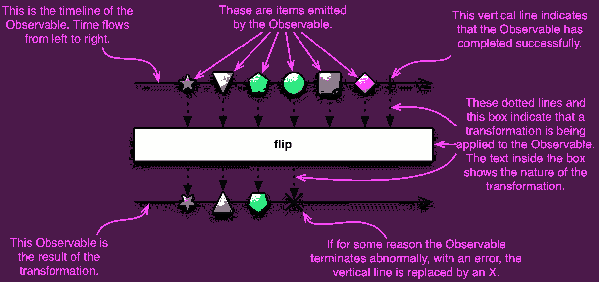

Rx 代表无功扩展。RxJava 是一个非常棒的反应式库，我们可以轻松地将它集成到我们的应用程序中，以方便多线程。

我们可以将 RxJava 理解为由一个组件发出的数据， **Observable** 和由 Rx 库提供的底层结构将变化传播到另一个组件， **Observer** 。这是一个用可观察流进行**异步**编程的 API。

[Rx Java——Android 中的多线程](https://medium.com/@pavan.careers5208/rxjava-multi-threading-in-android-302a7419edbf)有助于理解 Rx 的基础知识，关于[observable](https://medium.com/better-programming/rxjava-multi-threading-in-android-302a7419edbf)e、 [Observe](https://medium.com/better-programming/rxjava-multi-threading-in-android-302a7419edbf) r、 [Scheduler](https://medium.com/better-programming/rxjava-multi-threading-in-android-302a7419edbf) 等的一切。因此，希望您已经了解了 RxJava 的基础知识，让我们开始吧。

## **操作员**

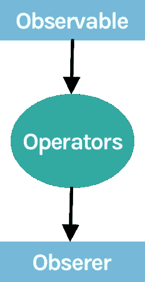

Rx 操作符允许我们在一个观察者观察到一个可观察对象之前对其发出的数据进行处理。我们可以在一个可观察对象上应用一系列操作符，其中一个操作符的每个输出都是下一个操作符的输入。使用这些算子我们可以**修改**、**合并**或**过滤**一个可观测发射的数据流。RxJava 有大量不同的操作符。我们稍后会检查它们，让我们转到**大理石图。**

什么是**大理石图**？
弹珠图是 Rx **操作员**如何工作的**视觉**表示。Rx 在每个用例中使用这个弹珠图，使它们**容易**理解。理解这些图是**跳跃学习 Rx 不同部件前的必要**。一旦我们理解了这些图，我们就可以很容易地通过查看图来理解组件的主题。

通用图像将由主要部分组成，如**时间轴、操作符、输入流项目、输出流项目和结果。**让我们单独了解它们中的每一个，然后将它们全部组合起来，以便于理解。

## **时间线**


时间线只不过是一条水平线，表示流程是从**左**到**右**。当看任何大理石图时，我们需要从左到右研究时间线。时间轴代表了一个可观测物体在**时间**内将会做什么。

## **物品**

我们可以用不同的形状来代表时间线上一个可观察物体发出的项目。在大多数情况下，我们看到圆形、三角形、星形和五边形。这些形状通常被称为大理石。将有一个项目的输入或输出流。让我们看看他们长什么样

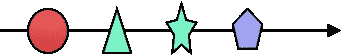

这些物品按照圆形、三角形、星形和五边形的顺序发射。

## 结果

正如我们已经看到的时间线和项目最后一种情况是结果有三种可能的结果**成功，失败，没有结果。**这些表示为休耕


流成功完成

右端的垂直线表示**成功。**


失败时中止流

右端的十字符号表示因**错误**而终止的流。


流从未终止

如果没有成功或失败，则该流不被终止

现在我们已经知道了各个项目，让我们通过分组并应用如下操作符来检查它们。

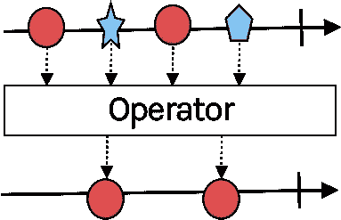

从上面我们可以观察到

1.  有**两条时间线**一条与一个可观测的时间线相关联。
2.  在第一条时间线上，有不同的**项**由 observable 发出
3.  中间部分是**操作符**，它执行一些操作，并将结果提供给第二个时间线
4.  随着**成功**终止，第二个**时间线**来自操作员的观察项目

让我们检查一下 RxJava 中的操作符是如何工作的，并检查一下我们如何在 marble 图的帮助下更好地理解它们。

# 过滤器()

**filter** 运算符仅从可观察对象中发出那些通过了**谓词**测试的项目

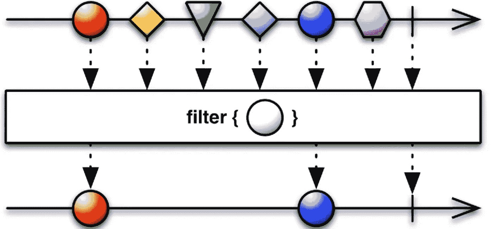

看着这些图表，我们可以理解在时间线一上的一个可观察物体发出不同的**形状**像圆形、三角形、五边形和菱形。在第二阶段，从第一时间线发出的所有这些不同的形状都通过**过滤器**操作器，该操作器正在寻找**圆形**形状。最后，我们可以在第二条时间线上看到，只有**个圆**被接收。

让我们通过编码来检查

有一个可观察对象正在发出 1 到 100 之间的一些整数，现在让我们对发出的值应用带有谓词条件的 **filter()** 操作符，以获取其值大于 10 的值。

```
Observable.just(2, 30, 22, 5, 60, 1)
    .**filter**(x -> x > 10)
    .subscribe(x -> println("item: " + x)));
```

输出为
项:**30**T3)项:**22**项: **60**

上述问题的大理石图如下

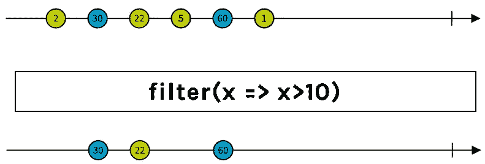

# 地图()

**映射**操作符通过对每个项目应用一个函数来变换一个可观察对象发出的项目。

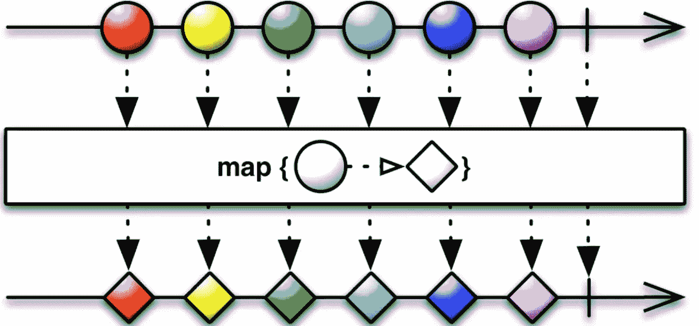

在上面的大理石图中，在第二阶段，源可观测物发出穿过地图操作符的**圆**形状。这个 map 操作符通过应用一些功能将它们转换成**菱形**形状。因此，菱形将是第二可观察时间线的输入。

让我们通过编码来检查

```
Observable.just(1, 2, 3)
 .**map**(x -> 1.25 * x)
 .subscribe(x -> println(“item: “ + x)));
```

输出为
项:**1.25**项:**2.50**项: **3.75**

上述问题的大理石图如下

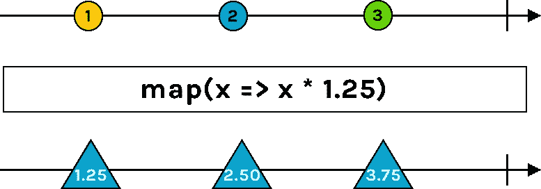

# 平面地图()

**flatMap** 算子将一个可观测发射的项目转化为可观测，然后将这些发射平坦化为一个单独的可观测

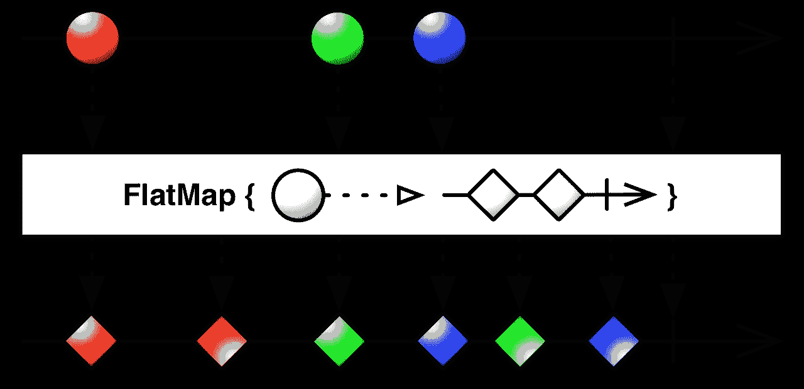

平面图将一个可观察对象分成许多单独的可观察对象。因此，FlatMap 不是逐个发送每个可观察值，而是在**中并行**执行所有操作，然后**按照完成的顺序合并**结果。

来自平面图**的新的可观察值**不能保证相同的顺序。这些值是混合的。

> 平面图发出可观察到的东西，而不是项目

## 地图()与平面地图()

Map 返回类型为 **T** 的**项**，而 FlatMap 返回类型为**可观察<T>的**可观察**。给定类型 T 的输入和类型 R 的输出，**

```
**map()**:
input: Observable<T>
transformation: **(T -> R)**
output: Observable<R>**flatMap()**:
input: Observable<T>
transformation: **(T -> Observable<R>)**
output: Observable<R>
```

> ***当我们需要在* ***并行*** *中执行多个网络请求时，flatMap*** *会很有用。它* ***并不能*** ***保证*** *项在结果流中的顺序。*

# concatMap()

**concatMap** 操作符类似于 flatMap，除了它**保证**观察值的顺序。它一次只转换一个**单个**项目，从而实现最终的流顺序。它依次执行**转换一个又一个项目，打破了平面图的**平行**规则，因此需要更多的时间来完成任务。flatMap 隐式地使用了一个 **merge** 操作符，而 concatMap 使用了 **concat** 操作符。**

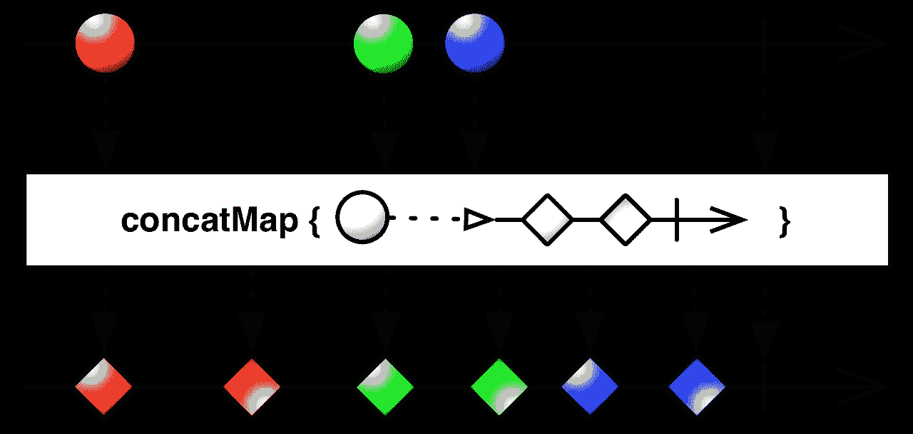

> *当你想保持**的执行顺序时，ConcatMap 更合适*

# *开关映射()*

*SwitchMap 不同于 flatMap 和 concatMap，它总是返回最新的可观察对象，并从中发出项目。*

*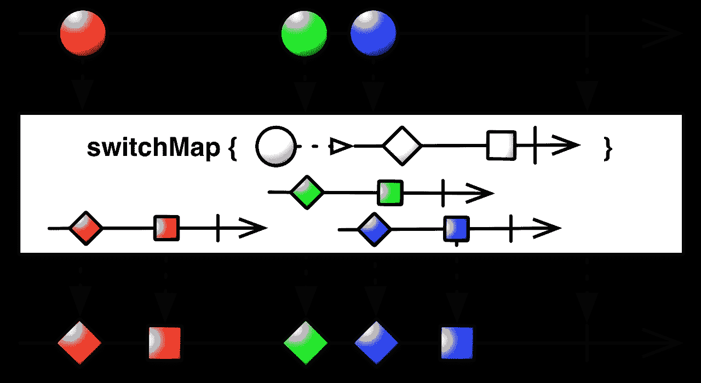*

*每次获得需要映射的新项目时，switchMap 将**取消订阅**以前的可观察对象，完全从一个项目切换到另一个项目。*

# *concat()*

***concat** 操作符从两个或更多个可观察对象**中发出项目，不需要** **交错**或**混合**它们*

*concat 运算符**将**多个**可观察对象的输出**连接起来，这样它们就像一个**单个**可观察对象一样，第一个可观察对象发出的所有项目都在第二个可观察对象发出的任何项目之前发出(如果有两个以上的项目，则以此类推)。*

```
*val observerVable1 = Observable.*just*(1, 1, 1);
val observerVable2 = Observable.*just*(2, 2);

Observable.**concat**(observerVable1, observerVable2)
    .subscribe(x -> println("item: " + x)));*
```

*输出为
项:**1**项:**1**项:**1**项:**2**项: **2***

*上面代码片段的大理石图是*

*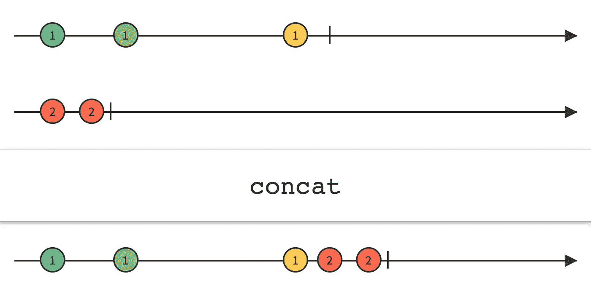*

*concat **等待**订阅您传递给它的每个额外的可观察对象，直到前一个可观察对象完成。请注意，正因为如此，如果您试图连接一个“热”可观察对象，即在订阅之前立即开始发送项目的可观察对象，Concat 将看不到，因此**也不会发送**任何可观察对象在所有之前的可观察对象完成之前发出的项目，并且 Concat 订阅“热”可观察对象。*

# *合并()*

***合并**算子通过合并它们的发射将多个可观测值合并成一个。Merge 可以**交错**或**混合**被合并的可观测量发出的项目，而 **concat** 不会**交错**这些项目。**合并****不保证发射顺序。上面的合并和连接只对**可见物**有效。***

```
***val observerVable1 = Observable.*just*(20,40,60,80,100);
val observerVable2 = Observable.*just*(1, 1);

Observable.**merge**(observerVable1, observerVable2)
    .subscribe(x -> println("item: " + x)));***
```

***输出为
项: **20** 项:**40**项:**60**项:**1**项:**80**项:**100**项: **1 【T79*****

***上面代码片段的大理石图是***

***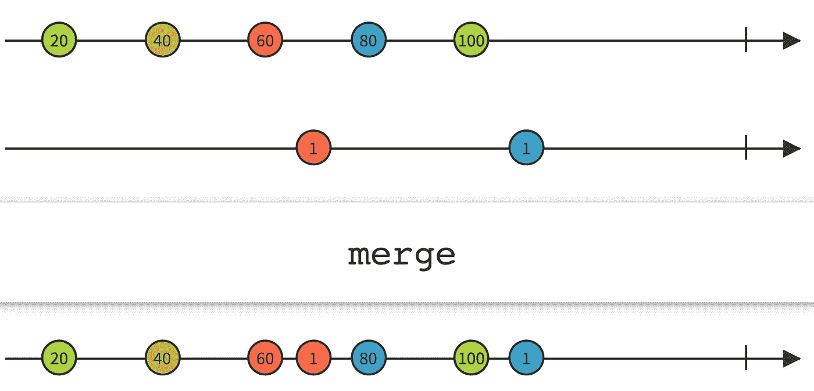***

# ***去抖()***

***如果特定的**时间跨度**已经过去而没有发出另一个项目，则去抖算子仅从可观察对象发出一个项目。这个操作符在编辑**搜索视图**中的文本或者保持**连续**点击按钮的延迟等情况下非常有用。***

***例如，在一个应用程序中有一个酒店搜索视图。当用户输入一些文本时，我们需要点击 API 并获取细节以显示给用户。当我们为每个字符获取文本改变事件时，考虑到打字速度，最好在为每个字符点击 API 之前保持一些**延迟**。通过这种方式，我们可以降低服务器的负载，同时提高应用程序的性能。***

```
***edtHotelSearch.*afterTextChangeEvents*().**debounce**(200, TimeUnit.MILLISECONDS)
        .observeOn(schedulers.ui())
        .subscribe(**{** charsequence **->** doSomething(charsequence)
        **}**, **{** Timber.v(**it**)
        **}**).*let* **{** compositeDisposable.add(**it**)
        **}*****
```

***去抖动算子过滤掉由源可观测物发射的项目，该源可观测物紧接着是另一个发射的项目。***

***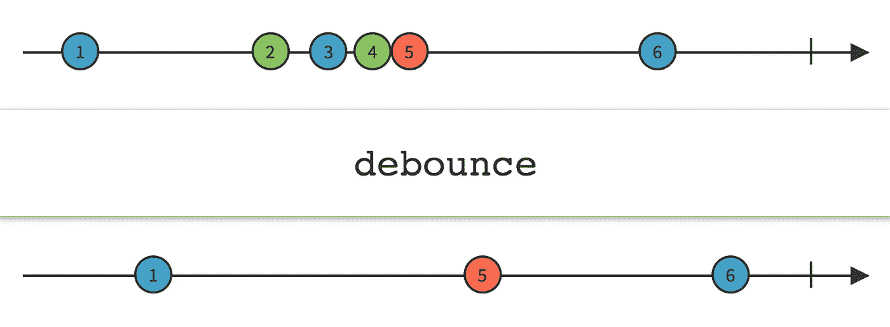***

# ***奖金***

***渴望了解更多关于 Rx 的信息，请继续阅读 RxJava 上的系列[完整指南。](https://medium.com/@pavan.careers5208/complete-guide-on-rxjava-d997235e4eec)***

# ***参考***

***[反应性算子](http://reactivex.io/documentation/operators.html)***

***[RxMarbles](https://rxmarbles.com/)***

***[反应流的大理石图](https://medium.com/@jshvarts/read-marble-diagrams-like-a-pro-3d72934d3ef5#ca31)***

***请让我知道你的建议和意见。***

***你可以在 [**中**](https://medium.com/@pavan.careers5208) 和 [**LinkedIn**](https://www.linkedin.com/in/satya-pavan-kumar-kantamani-61770a9b/) 上找到我…***

***感谢阅读…***