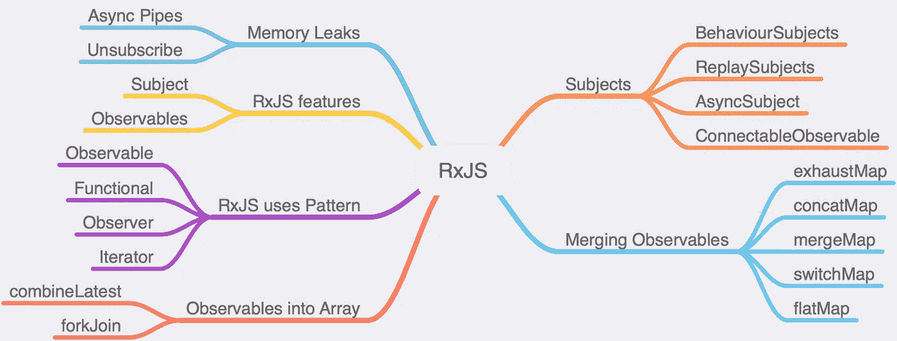

# RxJS 以 8°角深潜

> 原文：<https://levelup.gitconnected.com/rxjs-a-deep-dive-with-angular-8-7fe9fd675aaa>

我和一群开发人员在一个团队中工作。我们正在 Angular 8 中构建一个门户应用程序。我通常在我的应用程序中看到大量的嵌套代码。如果有多个调用，那么逐个订阅会导致嵌套代码。此外，在许多地方，请求和响应中需要一些数据消息，使用标准的 Angular 或 Typescript 方法并不容易。答案是开始用 RxJS。我将解释 RxJS 如何利用我们的角度应用。在这里，我将介绍我们使用 RxJS 运算符的真实角度项目示例。

【RxJS 是什么，为什么？

反应式编程最初是由微软工程师 Eric Meijer 在 LINQ 从事 C#工作时实现的。LINQ 在。NET framework 为开发人员提供了第一种反应式体验。2012 年晚些时候，它被开源，现在被所有大公司使用，包括 GitHub、网飞等。

RxJS 实现了 TypeScript 和 JavaScript 的反应式扩展。ReactiveX 是**观察者模式、迭代器模式和函数式编程**的组合。查看 reactive.io 了解更多详细信息。

下面附上图片查看 RxJS 世界！



*   **可观察模式:**定义对象间一对多的依赖关系，这样当一个对象改变状态时，它所有的依赖对象都会得到通知并自动更新。在 Angular 中，有很多场景，我们必须处理事件，事件流。
*   **迭代器模式:**提供了一种顺序访问聚合对象元素的方法，而无需暴露其底层表示。
*   **函数式编程:**函数式编程是一种编程范式，我们使用纯函数，避免共享状态和可变数据。JavaScript 中的 Currying 是函数式编程的一个很好的例子。

[](https://medium.com/@codingindepth/curry-recipe-in-javascript-af236028c8f7) [## JavaScript 中的咖喱食谱

### Curry 在 javascript 中是一个非常重要但又非常混乱的概念。它开启了 javascript 编程的大门…

medium.com](https://medium.com/@codingindepth/curry-recipe-in-javascript-af236028c8f7) 

RxJS 是一个基于事件的异步程序，使用可观察序列。观察值可以由一个方法订阅，由一组方法更改，并且可以返回一组异步流，这些流由一组方法进一步更改。

你可以在这里看到“订阅”这个词，等等，看起来你是在说类似承诺的东西？


**可观察与承诺:**

一般来说，承诺处理失败或成功的单一事件。虽然现在有许多图书馆可以让这个承诺更有力量。

可观察的是一个能处理许多事件的流的集合。可观察的东西比承诺更受欢迎，因为它们可以被中止，如果失败了可以重试，等等！

**示例:**

在下面的代码中，我们创建了一个实现 HttpClient 的服务 ObservableDemoService。此服务获取初始页面信息以加载数据。方法 getinfo$获取 DemoInterface[]的数组流，并在管道中处理错误。在组件构造函数中注入 ObservableDemoService 的依赖项。同时创建一个错误主题 errorMessageSubject 来保存或显示视图中的错误。现在使用管道调用 ObservableDemoService 的 getinfo$方法。Pipe 采用了许多其他方法。当我们对响应执行一些数据消息传递时，管道非常有用，这里我们初始化数据网格组件。

这里我们创建 promiseinAction，当分别提供 true 和 false 时，它返回 resolve 和 reject 承诺。我们正在实现 ngOnInit 方法来调用 getPromise(true || false)方法。我们在这里可以清楚地看到我们只有两种反应成功或失败。

**好消息！承诺可以转化为可观的东西:**

好的一面是承诺可以在需要的时候转化为实际行动！

接受可观测量的 RxJS 算子也可以接受承诺。你只需要把承诺变成可观察的。最好的部分是你不需要改变 Angular 应用程序中的所有代码！

```
import { from } from 'rxjs';
const observable = from(promise)
```

运筹学

```
import { defer, fromEvent, interval } from 'rxjs';
Observable.defer(p => Promise())
```

# **可观察与主体**

主体是一种特殊的可观察对象。Observable 是 RxJS 中的基类之一，Subject 是它的派生类型之一。主体实现观察者设计模式，该模式需要设置一些值，例如。Subject.next(消息)。Observable 总是需要订阅并实现 observable 模式。可观察性始终是单向的，这意味着它从源流向订户。主体是双向的，信息从来源流向订阅者，反之亦然。

**主题类型:**

1.  **behavior subject:**behavior subject 存储最新的值，并立即将其发送给所有订户。也就是说，我已经创建了一个消息服务，它可以由两个角度分量及其双向分量使用。

组件 1:

```
sendMessage(message: any): void {this.messageService.changeMessage(message);}
```

组件 2:

```
let getMessage;this.messageService.currentMessage.subscribe(message => (getMessage = message));
```

**2。replay subject:**replay subject 存储`n`个值，并立即将其发送给订阅者。即，在上述数据服务中，如果我们将 messageSource 更改为 ReplaySubject 并传递 3，那么它将缓存订阅的最后三个值。

```
private messageSource = new ReplaySubject<string>(3);
```

**3。AsyncSubject:** Async subject 一直等到完成，然后将最终值发送给订阅者。这里的关键字是最终值。如果我们在下面的示例中添加两个值“Hello 1”和“Hello Again”，那么当我们执行 asyncsub.complete()时，将只打印最后一个值。在我们的例子中，最后一个值是最终值。

```
import { AsyncSubject } from ‘rxjs’;const asyncsub = new AsyncSubject();asyncsub.subscribe(subs => console.log(subs));asyncsub.next("Hello 1");asyncsub.next("Hello Again");asyncsub.complete();//Logged only Hello Again NOT Hello 1
```

# **理流威力更大！！**


RxJS 操作符提供管理流，将流组合成单个流。它还有助于顺序和并行调用 API(一组可观察对象)。但主要问题是有这么多运营商。组合运算符总是一个挑战。RxJs 在其网站上提供了一组向导来组合这些操作符。如果组合了错误的操作符，将会导致竞态条件。此外，当组件超出范围时，所有的订阅都需要取消订阅，否则将导致内存泄漏。内存泄漏真的非常可怕，尤其是当应用程序在生产环境中运行时。

**将可观测量组合成一个流:**

*   **合并地图:**为任何给定的源创建新的可观测量。所有先前的流/可观察的保持活动。在返回的可观测量中没有顺序，而且顺序不被保留。mergeMap 的最佳用例是将点击事件与 API 调用结合起来。
*   **串联图:**类似于合并图，但是可观测量的顺序保留得很好。保存顺序并发出所有可观察值，同步工作。执行缓慢，因为它同步工作，等待第一个观察完成，然后才开始新的观察流。最好的用例是当你调用一个给你 id 的 API，而这个 id 被另一个 API 使用。
*   **switchMap:** 立即创建新的可观测量，并完成旧的可观测量。switchMap 的最佳用例是搜索自动完成。每当用户开始键入一个新的关键字进行搜索时，就会创建一个新的可观察对象，并完成旧的可观察对象。使用 mergeMap 和 switchMap 检查下面的 combineLatest 示例。
*   **平面图:**立即创建可观测量，之前的可观测量保持有效。fatmap 是 mergemap 的别名，mergeMap 接受一个可选参数 concurrency，该参数定义了可以同时订阅多少个 Observables。
*   **穷举映射:**创建可观察对象，并等待其完成。在等待可观察对象完成时，忽略所有其他可观察对象。最好的用例是使用 Angular 应用程序中的登录。一旦用户点击登录，然后等待，直到认证完成！exhaustMap 与 switchMap 正好相反。switchMap 会立即创建一个新的可观测值，并完成旧的可观测值，但 export map 会首先完成初始可观测值，并忽略新的可观测值。

**将可观测量加入数组:**

*   **forkJoin:** 调用所有可观察的并行。完成所有调用后，以数组形式返回所有可观察值。最好的用例是当您想要调用不相互依赖的 API 时。多次上传是我们可以使用 forkJoin 的场景之一。此外，我们可以根据条件在 forkJoin 中组合插入和更新 API。

```
ngOnInit() {const promiseList = [];promiseList.push(this.myService.getData1());promiseList.push(this.myService.getData2());if (promiseList.length) {forkJoin(promiseList).subscribe(resultList=>{//Initialize component data here
this.dataModel.data1= resultList[0]})}}
```

*   组合测试:当所有的可观测值至少触发一次时开始。之后，当任何事件发生变化时，它就会触发。

Angular 应用程序中最好的用例是将数据表和下拉事件动作结合起来。下拉列表显示了带有类别和类别 id 的产品，一旦选中，我们必须根据类别 id 显示产品详细信息。现在检查下面的代码:

```
products$ =combineLatest([this.productService.product$,this.action$]).pipe(map(([products,category])=>products.filter(x=>x.categoryId===category)));
```

一旦合并，结合最新的每当用户选择一个产品类别下拉数据表数据自动过滤。不需要在角度分量中写任何事件。这有时被称为反应式开发。

现在我们可以在过滤所选类别时使用 mergeMap。如果用户再次点击下拉菜单，而之前的请求没有完成，那么 switchMap 将取消之前的请求，并启动一个新的 Observables。

```
selectedCategoryCliks$ = this.selectedCategory$ .pipe( filter(selectedCategory => Boolean(selectedCategory)), switchMap(selectedCategory => from(selectedCategory.Id) .pipe( mergeMap(Id => this.http.get<Interface>(`${environment.getURL}`)), toArray(), tap(x => console.log(‘’) ) ));
```

# 权力越大，责任越大！内存泄漏是真的！

我知道你已经听过这个阶段了。但是在 RxJS 的世界里，总是取消订阅公开的观察和主题是非常重要的。在 Angular 中，实现 ngOnDestroy 和 unsubscribe。

```
ngOnDestroy(): void { this.subject.unsubscribe();}
```

然而，很多时候很难记住退订的拆机方法。

如果订阅是自动退订而不是手动退订呢？

如果我们使用异步管道，在 Angular 这样的框架中是可能的。一旦组件超出范围，异步管道会自动取消订阅打开的观察对象和主题。现在，我们已经在上面的例子中创建了 products$来保存来自获取服务的产品列表。使用 product$ | async pipe，我们可以显示产品详细信息。下面是视图代码片段。

```
<ng-container *ngIf=”products$ | async as productList”> <tr *ngFor=”let prod of productList; let i = index” class=”tr-clickable” (click)=”clickonRow(prod)”> <td *ngIf=”prod.Name”><span style=”display: none;”>{{ prod.Name }}</span> </td> </tr></ng-container>
```

**结论:** RxJS 提供了更方便的代码，一旦你在你的 Angular 应用中启动它。这看起来很难理解，但慢慢地，随着时间的推移，你会觉得非常容易和方便。在大多数地方复制粘贴类似的代码是非常容易的。此外，可读性随着时间的推移增加流形。在初始阶段，它看起来像是正在进行的代码块，但是慢慢地你会发现写反应式编程比基于方法的编程更容易。因此，现在就开始在您的角度应用中使用 RxJs 吧。