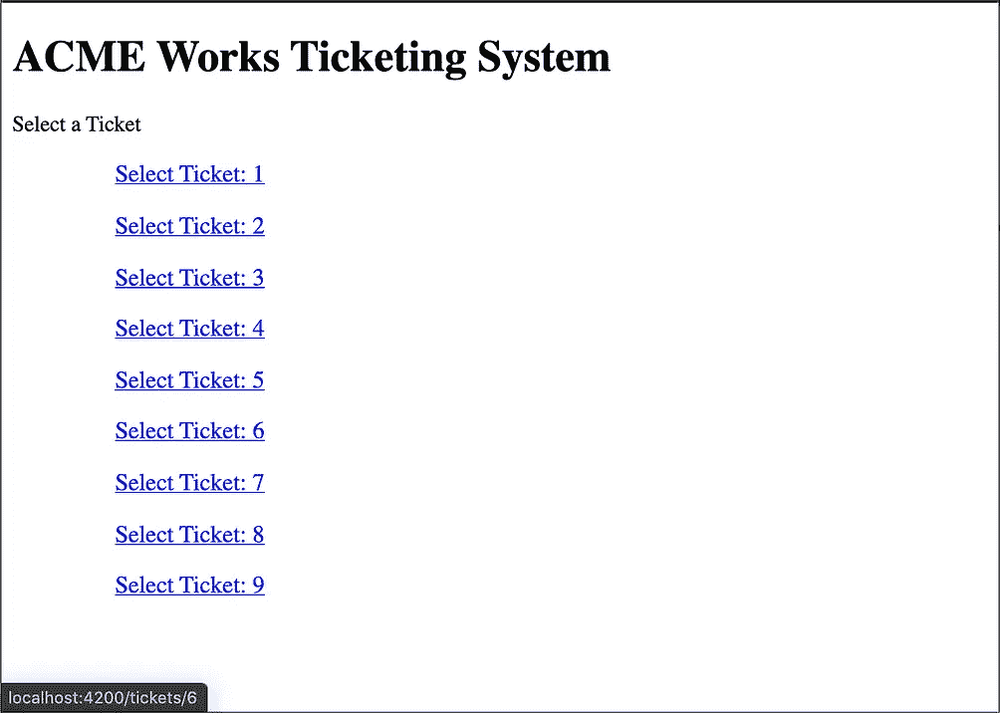
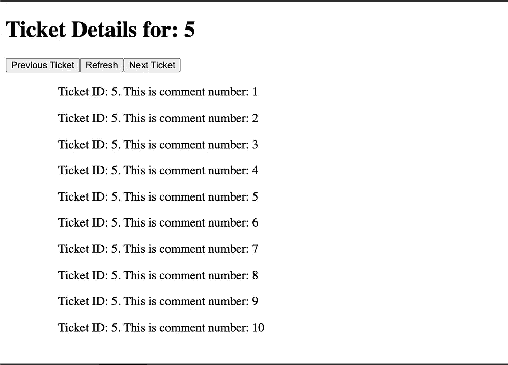
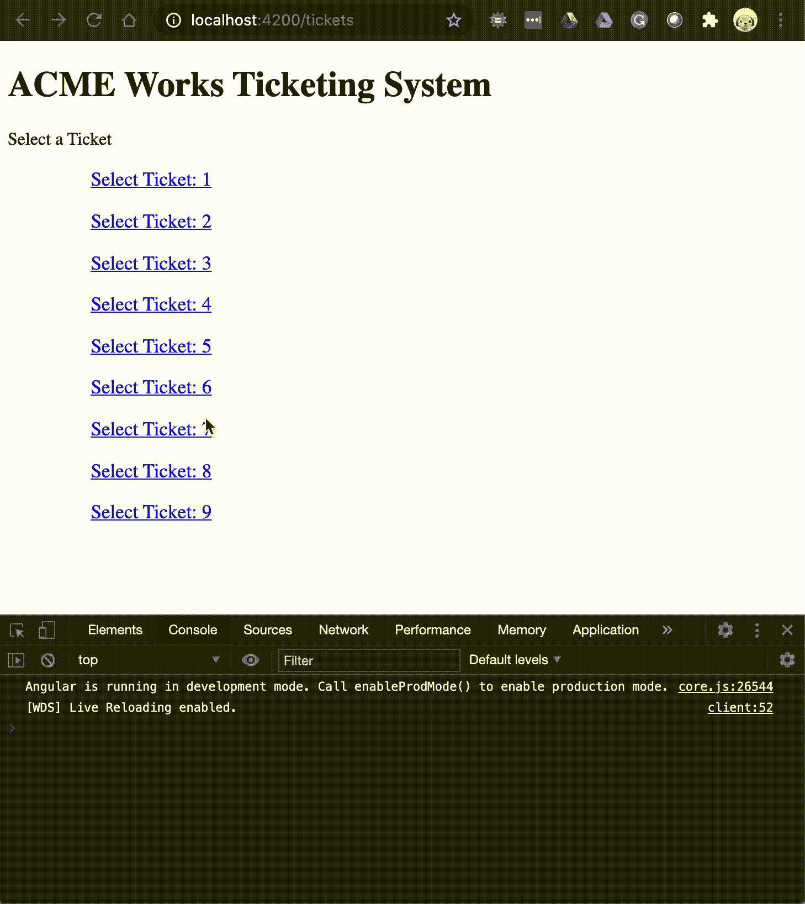

# RxJS 操作员提示—开始于

> 原文：<https://levelup.gitconnected.com/rxjs-operator-tips-startwith-d67109c8883e>

由 [Pablo Heimplatz](https://unsplash.com/@pabloheimplatz?utm_source=medium&utm_medium=referral) 在 [Unsplash](https://unsplash.com?utm_source=medium&utm_medium=referral) 上拍摄的照片—发布大量事件

结合`startWith`和`EventEmitter`创造牛逼

在 RxJS 里是相当容易迷路的。有很多操作符可供选择，在我的开发之旅中，我发现很容易忽略一个可能会让您头疼的操作符。

继我上一篇讨论[平面图与切换图](https://medium.com/swlh/cant-tell-your-flatmaps-from-your-switchmaps-a1f0f497b61a)的文章之后，在这篇文章中，我将讨论`startWith`。

来自 [RxJS 文档](https://rxjs.dev/api/operators/startWith)的官方定义是:

> 返回一个可观察对象，它在开始发出由源可观察对象发出的项之前，发出您指定为参数的项。

# 问题是

像往常一样，对于编程来说，太容易被“是什么”而不是“为什么”所消耗，所以我们将从问题定义开始。

> 假设我有一个查询子值列表的种子值，那么即使种子值不变，我如何订阅刷新事件来更新列表呢？

这可能会令人困惑，所以，分解成另一种方式:

*   我的支持系统显示了开放门票列表`path/to/tickets`
*   操作员选择一张票`/path/to/tickets/:id`
*   将显示该票据中的所有评论
*   当刷新事件被触发时，如何刷新页面？

是的，用户可以刷新页面，但是如果我们在 PWA 中运行，由于浏览器 chrome 是不可见的，所以不容易知道如何做。

使用刷新事件很有用，因为它可能不仅仅是一个刷新内容的按钮。如果你已经将你的页面连接到某种网络套接字系统，你可能需要在一些外部信号下自动刷新列表。

我将向您展示`startWith()`如何扭转局面，创造出真正优雅的解决方案。

# TLDR

将`startWith`添加到您的`EventEmitter`订阅管道中，它们会发出一个初始值，无需等待！

如果你想了解更多细节，请继续阅读

# 设置

让我们从一个包含两条路线的绿地角度项目开始，门票列表和门票视图。

## 门票清单

对于这个演示，票列表非常简单，它只包含一个非常简单的票 id(1–9)数组和一系列将用户导航到`/tickets/:id`的`<a>`标签。

样板代码

它的用户界面看起来有点像:

## 票证视图

票证视图是将要解决“问题”的地方。我将讨论类型脚本代码的 3 种解决方案，然而，HTML 将保持不变。

该布局仅包含:

*   票证标题标题
*   上一张票按钮
*   刷新注释按钮
*   下一张票按钮
*   所有评论的列表

因为票视图是一个角度组件，所以可以使用`ActivatedRoute`类提取 ID。票证视图的初始存根实现如下所示:

2 个 UI 屏幕——忽略完全缺乏设计

# 示例—获取注释

在每个示例中，我将使用相同的方法来获取实际的票据评论。显然，这只是一个示例，因为它实际上不做任何获取。然而，通过返回结果作为一个`Observable<string[]>`，这将模拟一个实际的网络调用，因为角度`HttpClient`将表现得像一个可观测的。

# 丑陋的

回头看看问题陈述“我如何刷新列表”，最简单的解决方案是只刷新页面。

## 赞成的意见

*   列表将刷新，任务完成

## **缺点**

*   整个页面将重新加载，包括其中的所有内容
*   额外服务器负载
*   没有能力的页面内进度条或 UX

这意味着整个网站的所有 javascript、HTML 和 CSS 都需要重新计算。而且，如果您的用户正在做其他事情，那么他们的工作可能会丢失。对于这样一个简单的问题来说，这是大材小用，违背了单页面应用程序(SPA)的全部目的。这就是用大锤敲碎坚果的定义。

此外，通过使用`activatedRoute`的`snapshot`机制，我们也无法使用 Angular 提供的可重用组件。

# 坏事

接下来，我们转向稍微好一点，但不是很好的实现。在这个例子中，我们将使用一个`BehaviorSubject`来存储票 ID 的值。

因此，这要好得多，但是“刷新”逻辑围绕着将`currentTicketId`行为的值重置为相同的值。这将使管道认为值已经更改，并将强制加载注释。

## 赞成的意见

*   页面无法重新加载
*   当导航到不同的票证时，组件被重用

## 骗局

*   使用`currentTicketId`的所有元素将在注释更改时重新计算
*   需要在页面加载时过滤掉初始空值
*   无法区分页面加载和刷新事件

就我个人而言，我在很多项目中使用行为主体。它们是将价值转化为可观察值并轻松改变它们的好方法。

但是，我认为我们可以做得更好。

# 好的(或者，可能是伟大的)

我花了很长时间才到达这里，但我们最终将使用`startWith`。

角度`EventEmitter`是一个非常简单的可观测值。当`emit`方法被调用时(带有一个可选值)，该事件的所有订阅者都可以执行一个动作。

因此，我的理想目标是以某种方式将传入的票证 ID 可观察事件和刷新请求事件结合起来。如果触发了票证 Id 或刷新事件，则结果将是**,注释列表将被更新。**

我将结合另外两个 RxJS 概念，以正确的方式解决这个问题:

1.  使用`combineLatest`操作员监听 ID 和事件
2.  将`startWith`添加到事件中，这样它就有了初始值

## 赞成的意见

*   页面无法重新加载
*   当导航到不同的票证时，组件被重用
*   **可以将刷新事件从票证 Id 更改中分离出来**

## 骗局

*   ?

使用`combineLatest`的好处是可以使用相同的管道来检索评论，无论这是如何触发的。这是一个非常有用的函数，因为它将接受许多可观察对象，并将输出作为单个数组返回，**，但只有当每个可观察对象都发出某种东西时**。

这就是`startWith`的用武之地。它确保事件总是发出一些东西，这样评论至少会加载一次。

输出——我不是 UI 设计师

# 利益

我认为这样做的主要好处是，它使得使用事件作为管道的一部分变得非常容易。

在很多情况下，您都希望加载数据并进行刷新。如果没有这个`startWith`功能，你将需要写一些额外的/古怪的变通方法，这只会让你的代码变得难看。

# 结论

`startWith`操作符在许多场景中都很有用。对于任何没有初始值的可观测值(几乎所有在`of() & from() & BehaviorSubject`之外的可观测值)来说，有一个初始值是很有意义的。

像大多数事情一样，这是主观的。我非常喜欢“寻找正确的解决方案”，但是，这并不一定是你的解决方案。无论哪种方式，RxJS 操作符的列表都很大，功能丰富，对许多场景都非常有帮助。

你会用`startWith`做什么？