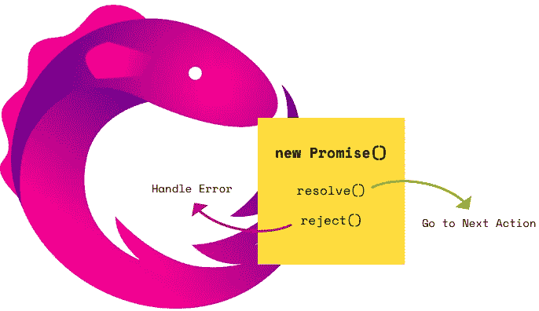

# RxJS 操作员' toPromise '等待您的观察完成！

> 原文：<https://levelup.gitconnected.com/rxjs-operator-topromise-waits-for-your-observable-to-complete-e7a002f5dccb>

他们像马车一样走在一起…

你知道吗？我没有！

原来，可观测算子`toPromise`等待可观测到的**完成**(或误差)后，才真正自行求解。

这对我来说是一个惊喜，主要是因为我还没怎么用过`toPromise`操作符。我有点期待第一个发出的值被用来解决承诺。或者拒绝它。

这些是事实:

如果你不相信我，你也不应该去下面的 Stackblitz

当可观察到的错误时，承诺就会拒绝。

仔细想想还是有点道理的，对吧。将可观察到的东西转化为承诺，也就是将现金流转化为价值——你需要等到最后一个。但是你说，它可能永远不会完成。你确实是对的。那么你的承诺将永远不会得到解决，只是悬而未决。

对于可观察到的事物，这种情况一次又一次地发生在我身上:就在我认为我知道发生了什么的时候，一些新的怪癖出现了。后来证明这不是一个怪癖，而是按照设计好的那样工作。我想这是因为我看到了一些熟悉的概念，比如“地图过滤承诺”，我想:

> “这就像一个阵列。这里没什么可想的，也没什么可读的。它就像一个数组。”

事实并非如此。似乎简单的可观测量观欺骗了我们所有人…

希望这个能帮到人。“发现”对我来说当然很有趣。