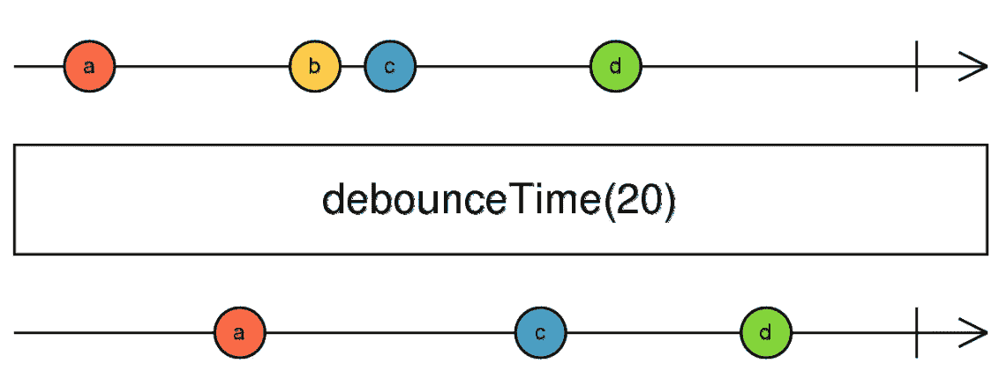
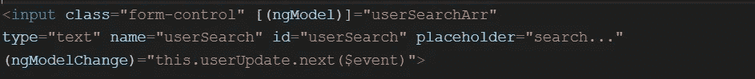
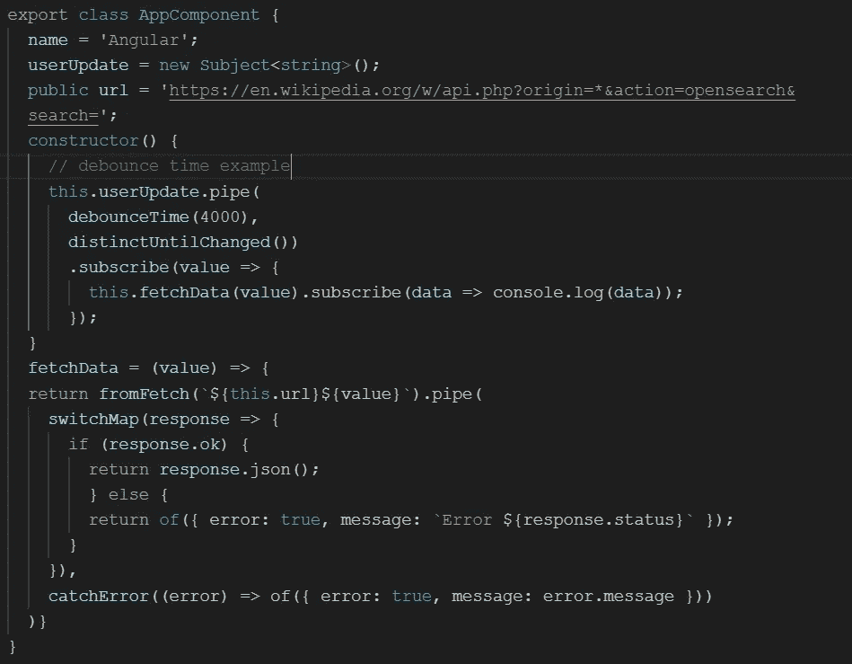
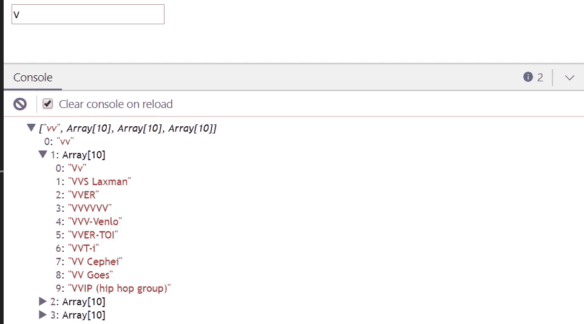
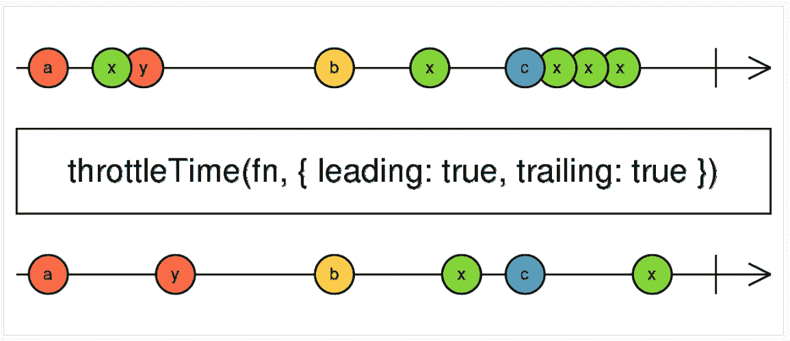
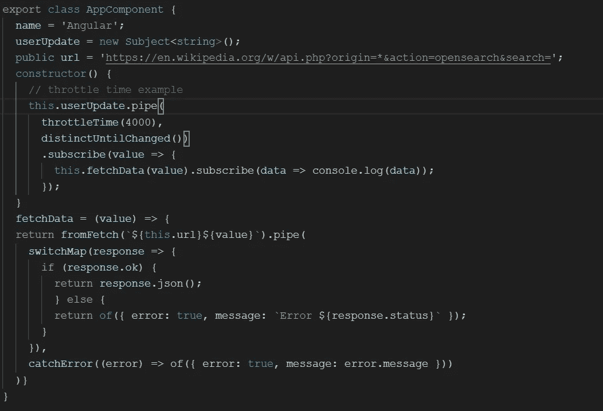
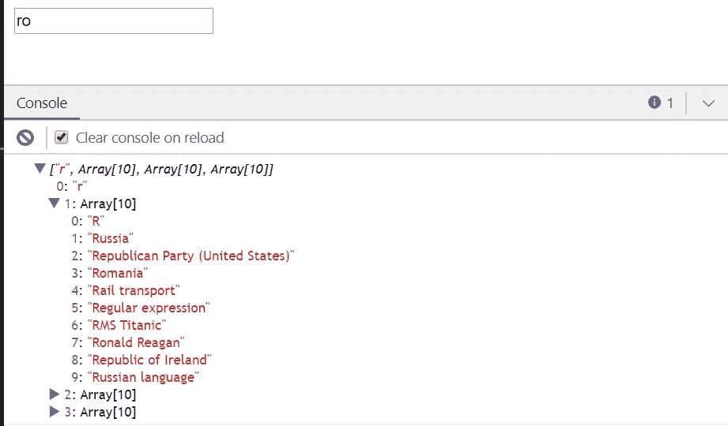
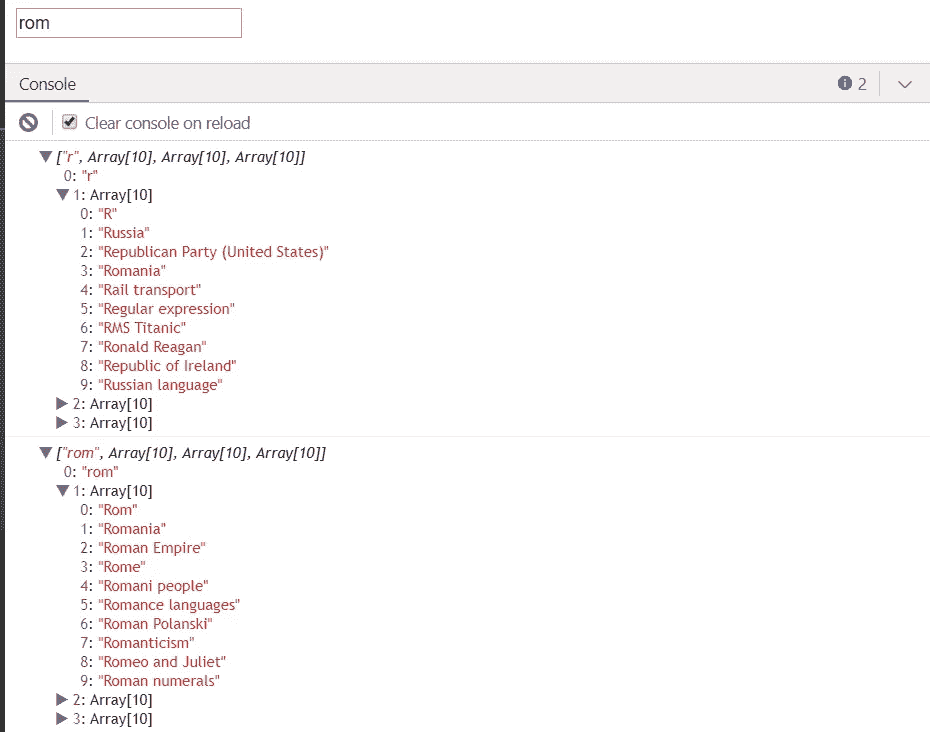

# RxJS 运算符:throttleTime 和 debounceTime

> 原文：<https://levelup.gitconnected.com/rxjs-operators-throttletime-and-debouncetime-b2ec49cbf1e7>

根据官方文档——RxJS 是一个库，用于通过使用可观察序列来编写异步和基于事件的程序。

执行搜索输入时最常用的操作符之一是去抖时间和节流时间，这两个操作符的用法有所不同。

让我们深入研究一下这些操作符。

根据官方定义:

**反跳时间:仅在特定时间间隔过去后，在没有其他源发射的情况下，从源可观测值发射一个值。**

去抖动时间的一个经典例子是**提前键入/自动完成**。

去抖时间的大理石图如下所示:

来自 RxJs 文档

如果我们观察大理石图，去抖时间等待是 20 毫秒。如果用户在 20 毫秒内执行任何值搜索，只有在去抖时间过去后，才会捕获搜索值。如果我们观察，值“b”没有被搜索值捕获。

让我们看一个去抖时间的实际例子。

我们已经使用 ngmodel 创建了一个 html 输入标签，因为上面的代码是不言自明的。

让我们关注它的实现，如下所示:

根据上面的信息，我们使用了 wikipedia 搜索 API，并且在构造函数方法上，我们调用了 fetchdata 方法，将输入值搜索的参数传递给它。

不用担心图像中的其他操作符，如 switchMap、distinctUntilChanged。我们主要关注去抖时间。

如果我们尝试运行上面的例子，我们会发现在 4000 毫秒过去后，将作为搜索参数传递的最新值。

仅供参考，搜索值将如下所示:

请随意摆弄代码，以便更好地使用去抖时间操作符。

接下来，让我们看看同一个例子中的第二个操作符 throttleTime。我们只需将去抖时间更新为 throttleTime 来观察行为。

根据官方文件。

**throttleTime:从源可观测值发出一个值，然后忽略后续源值** `**duration**` **毫秒，然后重复这个过程。**

如果我们试图揭开上述定义的神秘面纱，我们将看到发出的值将被捕获，然后它会延迟已提供的时间量。一旦时间过去，它将再次开始捕获后续值，并且该过程继续。

首先，让我们根据 RxJS 文档观察 throttleTime 的大理石图。

来自 RxJS 文档

尝试观察弹球图，首先发出的值是“a”，然后是 throttleTime(假设 20)，值“x”被忽略，一旦时间过去，下一个被捕获的值是“y”，类似地，该过程继续。

最可行的使用 throttleTime 的方法是**按钮点击率或者双击，如果用户多次点击按钮的话。**

总的来说，当我们试图限制顺序发生的事件数量时，throttleTime 更有意义。

我们来看看它的实现。

正如已经解释过的 throttleTime，我们将在执行上面这段代码后观察到，我们将看到 1 个事件已经通过，`throttleTime`将允许事件在 4000ms 后再次通过。但仅适用于 4000 毫秒后创建的事件。这意味着当用户在 4000 毫秒内输入`ro`时，建议将只代表返回值`r`。当用户键入`m`时，它将搜索值`rom`。

如果我们观察上面的图表，用户已经输入了搜索值“ro ”,但是传递的值只有“r ”,这意味着发生的第一个事件的值为“r ”,下一个事件将在 4000 毫秒后执行。因此，有 4000 毫秒的延迟，下一个事件中的值将被搜索为“rom”。请参见下图:

这些操作符最常用的区域如下:

**去抖时间:**

1.  **自动完成**
2.  **提前打字**

**节流时间:**

1.  **限制点击率**
2.  **双击**

我希望这篇文章对 RxJS 操作符有所了解。

快乐编码。不断学习。继续探索。😊