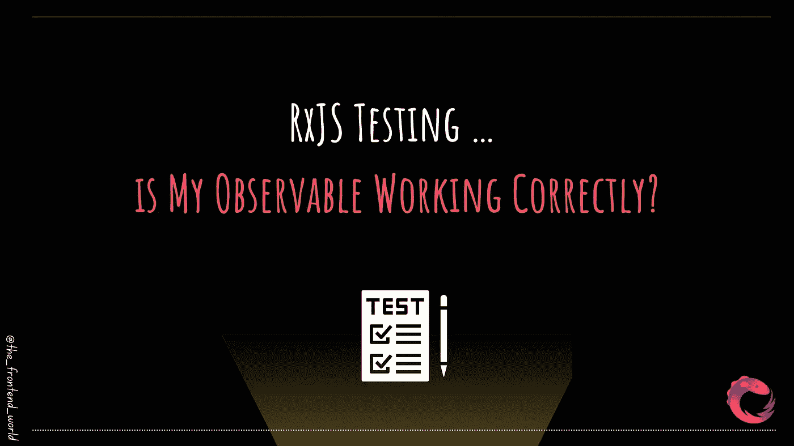

# RxJS 测试…我的可观察对象工作正常吗？

> 原文：<https://levelup.gitconnected.com/rxjs-testing-is-my-observable-working-correctly-9842bbe0a571>

## RxJS 中的单元测试，所有你需要知道的！

作者:FAM

今天的故事是关于测试的😈

在任何软件开发过程中，测试都是必须知道的。它保证了整个系统仍在工作，并且在开发新功能或修复 bug 时没有发生退化。

当然，如果我们对每个新实现的特性进行测试。否则，防止回归和系统错误的整个逻辑就行不通了。

可观测量是反应式编程中必须知道和使用的。使用新的框架和库，如 Angular、React 和 VueJS。这是在你的应用中处理数据的最干净、最恰当的方式。因此，知道如何测试可观察性也是需要的，这篇文章就是关于这个的！

> 如今编写单元测试是至关重要的

我们用一个物体来测试可观测性。如果你读过关于[可观察调度器](/rexjs-schedulers-the-observable-execution-orchestrators-60479ece23da?source=your_stories_page-------------------------------------)，你可能会记得它是`TestScheduler`。用一句直白的话来说，这个物体就是:

> 我们同步测试异步代码的方式

如您所见，我们在链的末端进行测试，因此完全了解 RxJS 可观测量是至关重要的。因此，在阅读以下内容之前，一些必要的知识是必要的:

*   你需要知道的关于 RxJS 的全部知识和概念

 [## RxJS 像没见过一样！

### 关于 RxJS 你可能想了解或知道的一切！

levelup.gitconnected.com](/rxjs-like-youve-never-seen-it-b99467557a54) 

*   单元测试(仅当`describe(...)`、`beforEach(..)`、`it(...)`不和你说话时)

 [## 如何编写单元测试用例？在 Angular 中开始单元测试之前你必须知道的事情！

### 角度单位测试

levelup.gitconnected.com](/how-do-you-write-a-unit-test-case-what-you-must-know-before-starting-a-unit-test-in-angular-f1174f437cb6) 

*   大理石图

 [## 大理石图测试

### 什么是大理石图，它是如何工作的？

famzil.medium.com](https://famzil.medium.com/marble-diagram-testing-5009c74324db) 

# 这家伙怎么能这么做？

*   **通过虚拟化时间:**

如果您的可观察对象需要一个`T`时间来完成，那么`TestScheduler`将有效地使用它自己的内部定时器来测试异步代码。`TestCheduler`会提前时间。你不用等了。

*   **一期 it**

不幸的是，使用这个家伙有一个限制。它只支持与`AsynchSechduler`一起工作的代码。(我在这篇[文章](/rexjs-schedulers-the-observable-execution-orchestrators-60479ece23da?source=your_stories_page-------------------------------------)里讲过这个调度器。如果这还不能说明问题，我建议您学习一下调度程序)。

*   **优势**

这个家伙被 ***实例化，向它的构造函数传递一个函数*** ，你想用它来进行等式测试。这个信息的最大优点是它的*。它不会强迫你使用一个特定的测试框架。无论你想用什么(笑话，因果报应，笑话…)，对于`TestScheduler`来说无所谓。*

*   ***代码示例***

*实例化*

*通过使用带有`helpers`对象的`run()`方法编写您的测试。*

*被称为`helpers`(你可以随便叫它什么。这个对象的作用是帮助你测试。*

*`helpers`的另一种使用方式:*

*—如果您期望观察到`cold`或`hot`，那么您可以使用:*

*—其他助手也是如此……*

# *使用 Chai 的完整代码示例*

*仅供参考:你不需要使用柴。正如我之前告诉你的，你可以自由选择你的测试框架。*

*   *对于测试套件，我们需要一个`***TestScheduler***`的实例*
*   *在每次测试之前，我们实例化这个家伙*
*   *每个测试将执行`*TestShcheduler*`对象的`***beforeEach(…)***`和`***run()***`方法。*
*   *每个测试根据测试期望使用`***helpers***` (对于冷可观察的，我们使用`***helper.cold***($theColdObservable)***.toBe***(theExpectedProducedValues)`*
*   *每个测试可以使用尽可能多的助手内置方法来测试预期值。*
*   *测试使用了一个 ***弹球图，一个*** 字符串，包含表示虚拟时间内发生的事件的特殊语法。*

*就这样😛*

> *我今天的故事到此结束，希望你喜欢 it❤*

*如果你喜欢看我的文章… ♥️*

* [## 如果你喜欢看我的文章… ♥️

### 如果你喜欢读我的文章… ♥️，当我的文章发表时，欢迎你第一个得到通知…

famzil.medium.com](https://famzil.medium.com/subscribe) 

> 谢谢你，❤

如果你有兴趣成为付费会员，你可以使用我的推荐链接。下次见

亲爱的读者，感谢你在我生命中的存在。

**让我们在** [**上取得联系**](https://medium.com/@famzil/)**[**Linkedin**](https://www.linkedin.com/in/fatima-amzil-9031ba95/)**[**脸书**](https://www.facebook.com/The-Front-End-World)**[**insta gram**](https://www.instagram.com/the_frontend_world/)**[**YouTube**](https://www.youtube.com/channel/UCaxr-f9r6P1u7Y7SKFHi12g)**或**********

******参见我的关于网络要素和一般文化的电子书。*******