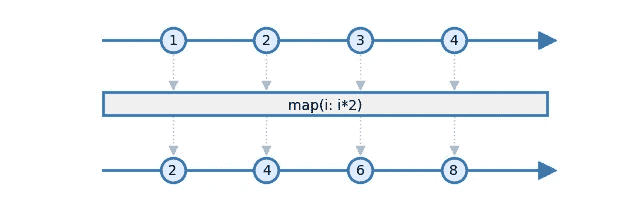
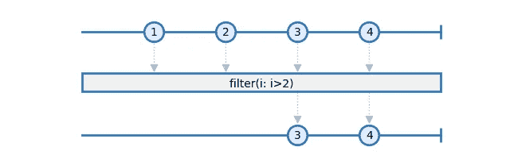
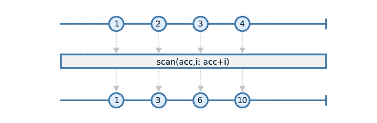
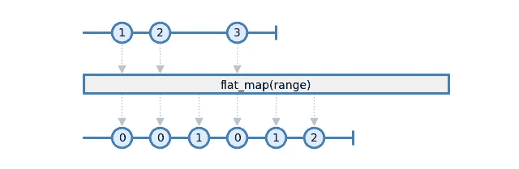

# RxPy 解释道:映射、过滤和扫描

> 原文：<https://levelup.gitconnected.com/rxpy-explained-map-filter-and-scan-4119d9cdece4>

如何掌握 ReactiveX 的三剑客


锡德·巴拉钱德朗在 [Unsplash](https://unsplash.com/?utm_source=unsplash&utm_medium=referral&utm_content=creditCopyText) 上拍摄的照片

每项技术、范式或框架都依赖于一些基础。ReactiveX 也不例外。无论你是初学者还是精通者，你都将依赖于三个基本操作:贴图、过滤和扫描。这是 ReactiveX 的三个火枪手。独立地说，它们是创建完整应用程序的基本块。结合在一起，它们可以让您实现您可能需要的几乎任何转换。

如果您是 ReactiveX 的新手，我建议您先阅读我的[介绍文章](https://medium.com/swlh/an-introduction-to-reactive-programming-in-python-a9985e4c43b9)，然后再继续。

# 地图

先说最基本的操作，也是可能用的最多的一个:*贴图*。map 操作符对每个源项应用一个转换函数，并发出这个转换的结果。下面是地图操作符的大理石图:



作者图片

在这个例子中，源可观测发射四个项目:1、2、3 和 4。转换包括将每一项乘以 2。因此，操作员也发出四个项目:2、4、6 和 8。

让我们考虑这样一种情况，输入项是字符串，我们希望将它们大写。RxPy 中的实现如下:

```
import rx
import rx.operators as ops

source = [
    "each night",
    "the seed grows up",
    "in the store galaxy",
]

rx.from_(source).pipe(
    ops.map(lambda i: i.capitalize())
).subscribe(
    on_next=print,
    on_error=print,
    on_completed=lambda: print("Done!")
)
```

通过运行此示例，我们得到了以下结果:

```
Each night
The seed grows up
In the store galaxy
Done!
```

这三个字符串的第一个单词是大写的。我们还可以将几个地图操作链接起来。这通常比使用一张做很多事情的地图要好:这可以提高程序的可读性。例如，我们可以用减号替换空格作为另一个步骤:

```
rx.from_(source).pipe(
    ops.map(lambda i: i.capitalize()),
    ops.map(lambda i: i.replace(" ", "-")),
)
```

# 过滤器

第二个基本操作符是*过滤器*。该运算符允许从可观察对象中删除项目:



作者图片

在这个大理石图中，只有值大于 2 的项目才会被转发。其他人都放弃了。

让我们将这个操作符应用于字符串数据。我们可以这样删除包含“galaxy”一词的行:

```
import rx
import rx.operators as ops

source = [
    "each night",
    "the seed grows up",
    "in the store galaxy",
]

rx.from_(source).pipe(
    ops.filter(lambda i: "galaxy" not in i.lower())
).subscribe(
    on_next=print,
    on_error=print,
    on_completed=lambda: print("Done!")
)
```

这将产生以下结果:

```
each night
the seed grows up
Done!
```

# 扫描

我们使用的前两个操作符是无状态的。这意味着他们的产出只取决于他们的投入。在函数式编程中，它们被命名为*纯函数*。但是有时我们需要的操作也依赖于先前收到的值。这通常是计算总和或平均值的情况。这些是*有状态*操作。*扫描*操作符可用于实现此类转换:



作者图片

这个大理石图代表了一个总和的实现。

*   扫描运算符将函数作为参数。
*   这个函数有两个输入参数:一个累加器和要处理的项。
*   这个函数的结果是一个更新的累加器。
*   当处理几个项目时，作为输入参数提供的累加器是它在前面的调用中返回的值。

因此，在这个例子中，考虑到累加器初始化为 0，发生以下步骤:

*   发出 1:acc = 0，i=1，返回的 ACC 为 0+1=1
*   发出 2:acc = 1，i=2，返回的 ACC 是 1+2=3
*   发出 3:acc = 3，i=3，返回的 ACC 是 3+3=6
*   发出 4:acc = 6，i=4，返回的 ACC 是 6+4=10

现在让我们考虑我们的源数据是分段接收的，用换行符分隔:

```
source = [
    "each ni",
    "ght\n",
    "the seed grow",
    "s up\n",
    "in the store galaxy\n",
]​
```

我们希望重建每个字符串并删除换行符。这可以通过*扫描*操作器来实现。考虑以下函数:

```
def unframe(acc, i):
    lines = i.split('\n')
    lines[0] = acc[1] + lines[0]
    return (
        lines[0:-1],
        lines[-1] or '',
    )
```

它使用一个由两个元素组成的元组。第一个是完整字符串的列表，第二个是剩余的不完整字符串。我们可以通过扫描运算符使用此函数来处理数据:

```
rx.from_(source).pipe(
    ops.scan(unframe, seed=([],'')),
)
```

但是我们不能直接使用它，因为它发出完整的累加器而不是字符串。如果没有完整的字符串，它还会发出所有中间累加器值:

```
([], 'each ni')
(['each night'], '')
([], 'the seed grow')
(['the seed grows up'], '')
(['in the store galaxy'], '')
Done!
```

这是否意味着扫描操作符只对琐碎的用例有用？肯定不是！现在，我们必须将几个运算符组合在一起。

考虑上面的结果。为了只发出完整的字符串，我们必须:

*   取累加器元组的第一个元素
*   删除列表中为空的值
*   取列表的第一个条目

你可能已经猜到这些是*贴图*、*滤镜*和*贴图*变换。最终，对源数据的完整处理是这样的:

```
rx.from_(source).pipe(
    ops.scan(unframe, seed=([],'')),
    ops.map(lambda i: i[0]),           # take string list
    ops.filter(lambda i: len(i) > 0),   # drop empty lists
    ops.map(lambda i: i[0]),           # take first string
)
```

这个程序的完整代码是:

```
source = [
    "each ni",
    "ght\n",
    "the seed grow",
    "s up\n",
    "in the store galaxy\n",
]​

def unframe(acc, i):
    lines = i.split('\n')
    lines[0] = acc[1] + lines[0]
    return (
        lines[0:-1],
        lines[-1] or '',
    )

rx.from_(source).pipe(
    ops.scan(unframe, seed=([],'')),
    ops.map(lambda i: i[0]),
    ops.filter(lambda i: len(i) > 0),
    ops.map(lambda i: i[0]),
).subscribe(
    on_next=print,
    on_error=print,
    on_completed=lambda: print("Done!"),
)
```

它为每个完整的字符串发出一个项目:

```
each night
the seed grows up
in the store galaxy
Done!
```

我们使用了四个操作符来实现这个特性。如果我们需要做更多的转换，我们的管道将会变得很长，难以阅读，并且没有任何部分可以在其他应用程序中重用。为了解决所有这些问题，我们可以简单地实现一个新的 *unframe* 操作符:

```
def unframe():
    def _unframe(acc, i):
        """unframes a string buffer

        acc is a tuple of two elements:
        - first element is an array of complete lines
        - second element is the current content of incomplete line
        """
        lines = i.split('\n')
        lines[0] = acc[1] + lines[0]
        return (
            lines[0:-1],
            lines[-1] or '',
        )

    return rx.pipe(
        ops.scan(_unframe, seed=([],'')),
        ops.map(lambda i: i[0]),
        ops.filter(lambda i: len(i) > 0),
        ops.map(lambda i: i[0]),
    )
```

请注意子管道是如何构造和返回的。这个新的可观测值可用于应用程序的主管道:

```
rx.from_(source).pipe(
    unframe(),
)
```

这样可读性强多了。我们可以在另一个应用程序中重用 unframe 操作符。另外，我们可以对 unframe 操作符进行单元测试。

所以事情已经很好了。但是如果我们考虑以下输入数据:

```
source = [
    "each night\nthe seed grows up\nin the store galaxy\n",
]
```

unframe 操作符将只发出一个字符串，第一个。这是因为，在最后一步，我们只取列表的第一个条目。但实际上，我们在接收一个物品时，必须发射几个物品。

是时候让第四个火枪手来帮助我们了！

# 平面地图

最后但同样重要的是，*平面图*操作符也是经常使用的基本操作符之一。这是非常多才多艺的，并打开了*高阶*可观测量的大门。关于高阶可观测量的细节将在另一篇文章中讨论。现在让我们关注它的简单用法:为每个接收到的项目发出几个项目。考虑这个例子:



作者图片

对于接收到的每个输入项目，发出项目的*范围*。当 *filter* 操作符删除输入项时， *flat_map* 操作符添加新项。

*   flat_map 运算符将函数作为参数。
*   对于接收到的每个输入项，都会调用这个函数。
*   它返回一个可观察的
*   这个可观察的项目被序列化为 *flat_map* 操作符的输出项目。

所以 *unframe* 操作符的最终实现是这样的:

```
return rx.pipe(
        ops.scan(_unframe, seed=([],'')),
        ops.map(lambda i: i[0]),
        ops.filter(lambda i: len(i) > 0),
        ops.flat_map(lambda i: rx.from_(i)),
    )
```

结果是预期的:

```
each night
the seed grows up
in the store galaxy
Done!
```

# 结论

仅使用四个运算符，就可以对数据应用许多转换，并且可以实现新的运算符。显然，这些并不足以实现一个完整的应用程序，但它们是基础。事实上，许多 RxPy 操作符是由这些操作符组合而成的。

组成是 ReactiveX 的关键。这使得 ReactiveX 可以无限制地扩展。由于大多数应用程序需要特定的转换，这意味着框架永远不会限制实现！

*原载于 2021 年 2 月 10 日 https://blog.oakbits.com*[](https://blog.oakbits.com/rxpy-explained-map-filter-scan.html)**。**