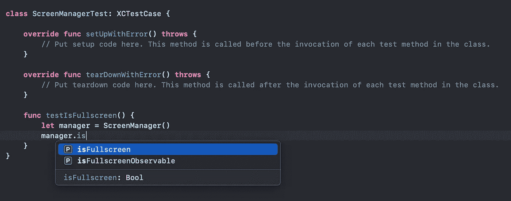
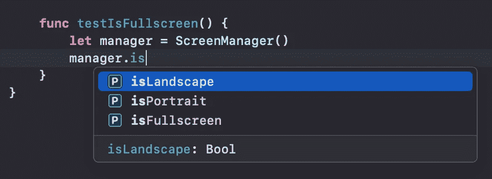
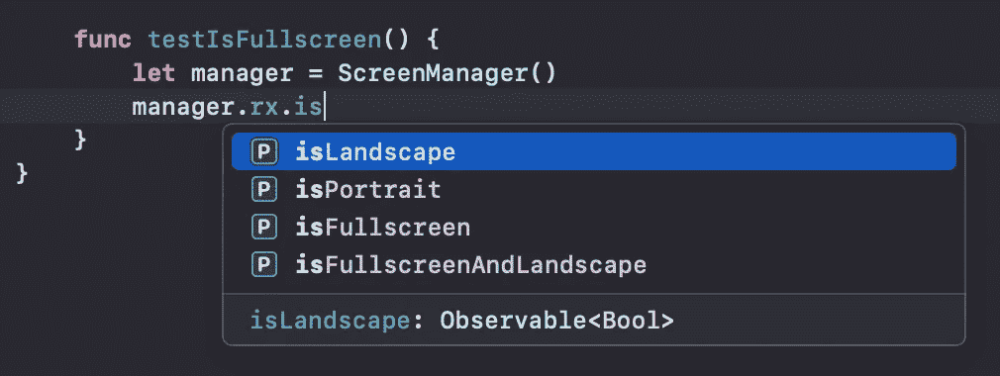

# RxSwift。通过良好的命名和包装提高可读性

> 原文：<https://levelup.gitconnected.com/rxswift-improve-readability-with-good-naming-and-packaging-80c391443478>

[https://www.youtube.com/watch?v=74FA1dyVVKs](https://www.youtube.com/watch?v=74FA1dyVVKs)

# 动机

一般来说，当使用 **RxSwfit** 实现**枚举**、**结构**和**类**时，通常会包含**可观察的**属性。在实现这些类型时，我经历过许多混乱的情况，因为**可观察的** **和其他数据类型**混合在一起。为了解决这些困难，我受 RxSwift 内部代码的启发，建立了自己的约定，在此分享一下。

# 通过示例探索

下面我们来看一些常见的例子。 **Struct ScreenManager** 包含一个属性 **isFullscreen** 返回一个值 **isFullscreenRelay** 和一个属性 **isFullscreenObservable** 返回一个 **Observable** 类型来隐藏 **isFullscreenRelay** 。

事实上，如果值类型和可观察类型只有一个或两个属性，可读性不会受到很大影响。还可以通过 IDE 的自动完成功能轻松访问它。

然而，在我们的编码世界中，有更多的实现比示例中简单而简洁的实现复杂得多，并且具有许多属性。

下面的代码也不是很复杂，但是我添加它是为了解释在实践中处理的代码的复杂性。随着**值类型和可观察类型**属性的增加，复杂性增加，可读性降低。

**如何获得更易读、更简洁的代码，即更易读的代码？**
可以从 RxSwift 的内部实现得到提示。您可以通过反应性扩展来打包可观察的和绑定的属性。

 [## rx swift/ui scroll view+rx . swift at main react vex/rx swift

### 此文件包含双向 Unicode 文本，其解释或编译可能与下面显示的不同…

github.com](https://github.com/ReactiveX/RxSwift/blob/main/RxCocoa/iOS/UIScrollView%2BRx.swift) 

和 **RxSwift** 的内部实现一样，我尝试通过反应式扩展来改进 **ScreenManager** 。
通过分离正常值和反应相关的类型属性，我们得到了可读性更好的代码。

使用 **ScreenManager** 的一方可以比以前更容易地访问对象中声明的属性。在用户方面，可以通过一种明显不同的方法快速找到一般值和无功相关属性。

您可以像以前一样访问对象的 general value 属性，并通过 rx 名称空间访问 Reactive 相关的属性。

访问值属性

访问与反应相关的属性

# 奖金！反应性延伸

**Struct Reactive** 在 RxSwift 中实现，为继承 **ReactiveCompatible** 协议的类型提供了各种附加函数。通过使用这个，提供了由基本 SDK 提供的基本类的扩展功能。

它使得像上面的示例代码一样简单地使用 UIKit 的反应式扩展成为可能。
甚至自定义类型也可以用反应式扩展提供多个扩展功能。

## 需要知道的事情

**首先**，RxSwift 对**n 对象**进行反应式扩展。要对其他类型使用反应式扩展，您必须继承**反应式兼容**协议。

**第二个**，对于类、枚举、结构的反应式扩展方法是不同的。请参考下面的例子

# 结论

这非常简单，但我认为在考虑整个项目时，这是一个值得使用的技巧。在 **RxSwift** 以及 **Combine** 中，可以使用这个**包扩展方法**来划分名称空间，根据角色划分属性。