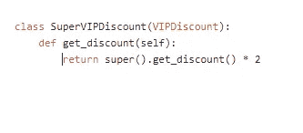

# 南用 Python 解释 O.L.I.D 原则，并举例说明。

> 原文：<https://levelup.gitconnected.com/s-o-l-i-d-principles-explained-in-python-with-examples-83b2b43bdcde>

SOLID 是面向对象语言中为软件开发创建的一组设计原则的助记缩写。 **SOLID** 中的原则旨在培养软件开发人员更简单、更健壮和可更新的代码。每一个实心字母对应一个发展原则:

如果实现得当，它会让你的代码更具**扩展性、逻辑性和可读性。**

为了理解**坚实的**原理，你必须清楚地知道接口的使用。

我将尝试用最简单的方式解释 Python 中的**坚实的**原理，以便初学者容易理解。将提供的例子应用于 Python 是非常容易的。

让我们一个接一个地检查每个原则:

# 1。单一责任原则

单一责任原则要求一个类只能有一项工作。因此，如果一个类有不止一个责任，它就成了耦合的。对一项责任的更改会导致对另一项责任的修改。

我们有一个用户类，负责用户属性和用户数据库管理。如果应用程序发生影响数据库管理功能的变化。使用用户属性的类必须被修改和重新编译以补偿新的变化。这就像多米诺骨牌效应，触摸一张牌会影响其他所有的牌。

所以我们简单地拆分了这个类，我们创建了另一个类来处理将用户存储到数据库的任务:

解决这一困境的常见方法是应用[外观模式](https://kennison.name/files/zopestore/uploads/python/DesignPatternsInPython_ver0.1.pdf)。关于立面图案的介绍，您可以[阅读更多](https://medium.com/@andreaspoyias/design-patterns-a-quick-guide-to-facade-pattern-16e3d2f1bfb6)。用户类将是用户数据库管理和用户属性管理的门面。

# 2。开闭原理

软件实体(类、模块、函数)应该对扩展开放，而不是修改。

让我们假设你有一个商店，你用这个类给你喜欢的顾客打八折:当你决定给 VIP 顾客打双倍的八折。您可以像这样修改该类:

不，这不符合 OCP 原则。OCP 教禁止这样做。如果我们想给不同类型的客户一个新的百分比折扣，你会看到一个新的逻辑将被添加。为了使它遵循 OCP 原则，我们将添加一个新的类来扩展折扣。在这个新类中，我们将实现它的新行为:

如果你决定给超级 VIP 客户打八折，应该是这样的:

> 没有修改的扩展。

# 3。利斯科夫替代原理

Liskov Subtitution 原则背后的主要思想是，对于任何类，客户端都应该能够不加区分地使用它的任何子类型，甚至不会注意到，因此不会损害运行时的预期行为。这意味着客户端是完全隔离的，不知道类层次结构的变化。

*更正式地:
设 q(x)是关于 t 类型的 x 的对象的一个可证明的性质，那么 q(y)对于 S 类型的对象 y 应该是可证明的，其中 S 是 t 的子类型*

简单来说，意味着一个对象或类的子类、子类或专门化必须适合其父类或超类。

LSP 的注释 LSP 是一个好的面向对象软件设计的基础，因为它强调了它的一个核心特征——多态性。它是关于创建正确的层次结构，以便从基类派生的类相对于它们接口上的方法沿着父类是多态的。有趣的是注意到这个原则与前一个原则的关系——如果我们试图用一个不兼容的新类来扩展一个类，它将失败，与客户端的契约将被破坏，结果这样的扩展将是不可能的(或者，为了使之成为可能，我们将不得不破坏原则的另一端，并修改客户端中应该关闭以进行修改的代码，这是完全不希望的和不可接受的)。

按照 LSP 建议的方式仔细考虑新类有助于我们正确地扩展层次结构。我们可以说 LSP 对 OCP 有贡献。

# 4。界面偏析原理

不应该强迫特定于客户端的细粒度接口依赖于它们不使用的接口。这个原则处理实现大接口的缺点。

为了完整地说明这一点，我们将举一个经典的例子，因为它非常重要而且容易理解。经典的例子

另一个好的技巧是，在我们的业务逻辑中，如果需要，一个类可以实现几个接口。所以我们可以为接口之间的所有公共方法提供一个单一的实现。分离的接口也将迫使我们更多地从客户的角度考虑我们的代码，这反过来将导致松散耦合和易于测试。因此，我们不仅让我们的代码对客户更好，也让我们自己更容易理解、测试和实现。

# 5。依赖反转原理

依赖应该是抽象的，而不是具体的。高级模块不应该依赖于低级模块。低级和高级类应该依赖于相同的抽象。抽象不应该依赖于细节。细节应该依赖于抽象。

在软件开发中，我们的应用程序将主要由模块组成。当这种情况发生时，我们必须通过使用依赖注入来解决问题。高级组件依赖于低级组件来运行。要创建特定的行为，可以使用继承或接口等技术。

您可以了解更多信息:

[实心蟒蛇](https://www.researchgate.net/publication/323935872_SOLID_Python_SOLID_principles_applied_to_a_dynamic_programming_language)

[清理 Python 中的代码](https://www.amazon.com/Clean-Code-Python-Refactor-legacy/dp/1788835832)